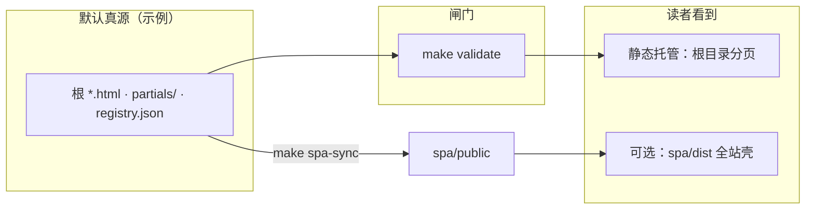

# 基础架构演变推演

**读者入口** → [总览 · 四条动线](index.html#index-intent-pick) · [读站指路](index.html#read-guide)　|　**贡献与闸门** → [CONTRIBUTING · 环境与命令](CONTRIBUTING.md#contributing-env-and-cmd) · [开 PR 前速览](CONTRIBUTING.md#contributing-five-minute) · [维护导读](maintainer-hub.html) · **`make validate`** · [validate 失败速查](CONTRIBUTING.md#contributing-validate-faq)

静态站点 + **可进化观测管道**（manifest / 候选 / 分析 / 沉淀）。**先判型**（读者 / 贡献 / 数据 / 部署 → 第一站）：[#产品视角四条动线](#pm-four-journeys) · [#从这里开始（产品与角色）](#readme-start-here) · [#双轨真源一览](#readme-dual-track-map)。**架构师梳理与持续改进**：[docs/ARCHITECTURE_ONE_PAGER · 五步表](docs/ARCHITECTURE_ONE_PAGER.md#architect-stewardship) · [五条架构红线](docs/ARCHITECTURE_ONE_PAGER.md#architect-invariants-index) · [开 PR 前速览](CONTRIBUTING.md#contributing-five-minute) · [PR 证据三联](CONTRIBUTING.md#contributing-pr-evidence-triad) · [动手→命令速查](CONTRIBUTING.md#contributing-change-to-command)。**整体内容框架**（叙事 / JSON / `docs` / 闸门 / MPA·SPA / 管理面真源分层）：[docs/README.md · 整体内容框架](docs/README.md#content-framework)。**前后台模块一页表**：[docs/README · 前后台模块总览](docs/README.md#front-back-modules)。**系统组件与功能一条表**：[docs/README · #system-components-fusion](docs/README.md#system-components-fusion)。**参与贡献**（环境、**`make validate`**（必）、**`make merge-ready`**（合并前推荐：validate + 只读 API + 管理端烟测）、CI 双轨、注册表/SPA 自检）：[CONTRIBUTING.md](CONTRIBUTING.md#contributing-env-and-cmd) · [开 PR 前速览](CONTRIBUTING.md#contributing-five-minute)。**文档整理主线**（维护者按序扫读）：[docs/README.md · 文档主线](docs/README.md#docs-spine)。**按改动类型秒选入口**：[docs/README · 常见改动最短链](docs/README.md#quick-paths)。**内容驱动**（数据/分析→模块与叙事→总线 vs 纯版式）：[docs/README · 内容驱动链](docs/README.md#content-driven-chain)。**AI 与自动进化**（契约内能力链）：[docs/README · #ai-assisted-evolution](docs/README.md#ai-assisted-evolution)。**自动化助手 / Cursor**：[AGENTS.md](AGENTS.md#agents-contract) · [架构师梳理](AGENTS.md#agents-architect-stewardship) · [框架判型](AGENTS.md#agents-content-framework) · [深读索引](AGENTS.md#agents-deep-read) · [Cursor 规则](AGENTS.md#agents-cursor-rules) · [.cursor/rules/repo-gates.mdc](.cursor/rules/repo-gates.mdc)（始终；文首「子规则对读」链式点名三份子规则）· [`spa/src`](spa/src) 编辑时 [.cursor/rules/spa-nav-registry.mdc](.cursor/rules/spa-nav-registry.mdc)。

- **仓库**：https://github.com/smartseanchain/ai-base-arch-evolution  
- **GitHub Pages**（开启后）：https://smartseanchain.github.io/ai-base-arch-evolution/ — 在仓库 **Settings → Pages** 中选择 **Deploy from a branch**，分支 **main**，文件夹 **/ (root)**，保存后约 1～2 分钟可访问。  
- **本地读者站（推荐）**：仓库根执行 **`make serve-reader`**，浏览器打开 **http://127.0.0.1:8000/**（与 Docker 静态站 **8765** 端口错开）。若 **8000** 已被占用，可 **`make serve-reader READER_PORT=8001`**（或任意空闲端口）。也可用 **`docker compose up -d`** 访问 **http://localhost:8765/**（见 [docs/DOCKER.md](docs/DOCKER.md)）。  
- **勿仅用 `file://` 打开 `index.html`**：`evolution.js`、`site-data-bus` 等依赖 **`fetch` 读 JSON**，多数浏览器在 `file://` 下会拦截，表现为脚本不工作或整页像「坏了」；请始终走 **http(s)**（与 [#从这里开始](#readme-start-here) 中读者「完成标准」一致）。
- **站内轻量搜索（可选）**：总览与各页顶栏搜索依赖 **`assets/site-search-index.json`**；维护者本地可 **`make site-search-index`** 生成（**不入**默认 `make validate`）。与只读 API **`GET /site-search-index`** 及路由契约对读 **[DATA_CONTRACTS · §8.1](docs/DATA_CONTRACTS.md#readonly-api-routes)** · **[scripts/README · 命令表](scripts/README.md)**（检索 **`site-search-index`**）。
- **维护者 / 闸门导读**：[维护导读](maintainer-hub.html) · [关系视图](maintainer-hub.html#mh-spine-map) · [系统边界](maintainer-hub.html#mh-boundaries) · [衔接矩阵](maintainer-hub.html#mh-reader-admin-matrix)（枢纽页 ↔ 注册表 ↔ 文档锚点；**不**在浏览器内写 manifest）。与 [读站指路 · 维护者条](index.html#read-guide)、[PLATFORM_MASTER_MAP · 管理面](docs/PLATFORM_MASTER_MAP_AND_INVOCATION.md#reader-admin-surfaces) 对读。
- **全站顶栏与根 `404.html`**：改 **`partials/site-nav.inc.html`** / **`partials/skip-bar.inc.html`** 后 **`make sync-nav`**；**`maintainer-hub.html`** 在五链 skip 后再由 **`sync_site_nav.py` · `build_skip_bar`** 拼三页内锚，**勿**在 HTML 手改；**`404.html`** 顶栏/skip **不在** **`sync_site_nav`** 写回范围，须**手调** — [MERGE · §1](docs/MERGE_AND_RELEASE_CHECKLIST.md#pre-merge) · [MERGE · partials 手顺](docs/MERGE_AND_RELEASE_CHECKLIST.md#pre-merge-partials-sequence) · [下文 · 全站顶栏与 skip-bar](#全站顶栏与-skip-bar) · [scripts/README — `sync_site_nav` / 真源（#sync-site-nav-source）](scripts/README.md#sync-site-nav-source)。

<a id="readme-start-here"></a>

### 从这里开始（产品与角色）

| 你是谁 | 第一站 | 约 15 分钟内的「完成标准」 |
|--------|--------|---------------------------|
| **读者** | [四条动线](index.html#index-intent-pick) · [读站指路](index.html#read-guide) · [分区速跳](index.html#hub-catalog) | 在 **http(s)** 下打开站点（**`make serve-reader`** 或 GitHub Pages），任选一条分区读完一页即算「激活」 |
| **贡献 / 维护** | [CONTRIBUTING](CONTRIBUTING.md#contributing-env-and-cmd) · [开 PR 前速览](CONTRIBUTING.md#contributing-five-minute) · [常见改动最短链](docs/README.md#quick-paths) · [MERGE · pre-merge](docs/MERGE_AND_RELEASE_CHECKLIST.md#pre-merge) · [MERGE · partials 手顺](docs/MERGE_AND_RELEASE_CHECKLIST.md#pre-merge-partials-sequence) | 克隆后能 **`python3 -m pip install -r requirements.txt`** 且 **`make validate` 绿**；深度合并前推荐 **`make merge-ready`**（见 CONTRIBUTING） |

<a id="readme-sixty-second"></a>

**约一分钟路径（与上表「完成标准」互补）**：**读者** — 用 **http(s)** 打开站点（**`make serve-reader`** 或 Pages）→ [总览 · 四条动线卡](index.html#index-intent-pick) 定角色 → [分区速跳](index.html#hub-catalog)（或顶栏）任选一页读完即算「激活」。**贡献 / 维护** — 克隆后 **`python3 -m pip install -r requirements.txt`** → **`make validate`** 绿；合并前推荐 **`make merge-ready`**（见 [CONTRIBUTING · 开 PR 前速览](CONTRIBUTING.md#contributing-five-minute)）。更深链路仍看上表「第一站」列。

**双轨（给读者的一句话）**：日常阅读用根目录**多篇分页（MPA）**即可；想在**同一壳**里快速切换注册表内分页时，再用 **`spa/` 全站壳**；合并与校验仍以 MPA 为准 — [#双轨真源一览](#readme-dual-track-map) · [spa/README · 默认读站](spa/README.md#spa-default-read)。

<a id="readme-term-glossary"></a>

#### 常用词速查（维护者扫文档时）

| 词 | 一句话 |
|----|--------|
| **MPA** | 根目录多篇 `*.html`；**`make validate` / CI 默认真源** |
| **SPA** | `spa/` 全站壳 + iframe 承载分页；与 **registry** 对齐见 **`make gen-nav-links`** |
| **`make validate`** | 合并主闸门（与 pre-commit、CI 同款） |
| **`make merge-ready`** | validate + 只读 API 测 + 管理端烟测（推荐合并前） |
| **manifest** | 人审后的演进登记；**不**默认自动写 |
| **registry** | `scripts/evolution-registry.json`（允许出现的分页与 **`lab_factors`**） |
| **总线** | `site-data-bus.js` 等对快照等的读数呈现；**≠** 叙事正文 |
| **partials** | 顶栏与 skip 模板；改后 **`make sync-nav`**，`404` 须手调 |
| **五维 / 六域 / 七类** | 不同抽象粒度；勿混 — [勿混粒度](docs/PROJECT_ARCHITECTURE_OVERVIEW.md#architecture-grain) |
| **枢纽主问题** | 每枢纽页一句独占命题 — [HUB_MAIN_QUESTIONS](docs/HUB_MAIN_QUESTIONS.md#hub-main-questions) |

**`validate` 报错**：优先对照 [CONTRIBUTING · validate 常见失败速查](CONTRIBUTING.md#contributing-validate-faq)；仍卡壳可用 [流水线 / 校验失败排查](.github/ISSUE_TEMPLATE/pipeline-triage.md) 开 Issue（附日志）。

<a id="readme-dual-track-map"></a>

### 双轨真源一览（MPA 与 SPA）

**合并闸门与 CI 以根目录 MPA 为默认真源**（根 `*.html`、`partials/`、`scripts/evolution-registry.json` 等）。**`spa/public/`** 由 **`sync_spa_public`** 从根同步生成；全站壳构建产物在 **`spa/dist/`**。改根分页或 `docs/` 且维护 SPA 时须 **`make spa-sync`** 或 **`make spa-build`**。对读：[MERGE · pre-merge](docs/MERGE_AND_RELEASE_CHECKLIST.md#pre-merge) · [MERGE · partials 手顺](docs/MERGE_AND_RELEASE_CHECKLIST.md#pre-merge-partials-sequence) · [spa/README · 默认读站](spa/README.md#spa-default-read) · [关系视图](maintainer-hub.html#mh-spine-map) · [scripts/README · sync_site_nav / 真源](scripts/README.md#sync-site-nav-source)。



<a id="pm-four-journeys"></a>

### 产品视角：四条动线（角色 → 入口）

| 角色 | 你要完成的事 | 建议第一站 |
|------|----------------|------------|
| **读者** | 在定性框架里理解栈、制度与分叉，不自代预言 | [四条动线 · 从哪进](index.html#index-intent-pick) · [读站指路](index.html#read-guide) · [三问导读](index.html#three-questions) |
| **贡献者 / 维护** | 改 HTML/契约、开 PR、过闸门 | [维护导读](maintainer-hub.html) · [CONTRIBUTING](CONTRIBUTING.md#contributing-env-and-cmd) · [开 PR 前速览](CONTRIBUTING.md#contributing-five-minute) · **`make validate`** |
| **数据 / 管道** | 快照、ingest、registry、分析规则 | [docs · 常见改动最短链](docs/README.md#quick-paths) · [分析引擎](analysis-hub.html) |
| **部署 / 运维** | 可访问、可观测、排障 | 上文本地预览与 **`file://`** 提示 · [DOCKER](docs/DOCKER.md) · [只读 API](docs/INTEGRATION_AND_READONLY_API.md) |

与 [总览 · 四条动线卡](index.html#index-intent-pick) 同骨架；**「本页主问题」**与 **五簇 `hub-cluster-thread`** 写法见 [HUB_MAIN_QUESTIONS](docs/HUB_MAIN_QUESTIONS.md#hub-main-questions) · [INTELLIGENCE · §2.2](docs/INTELLIGENCE_SIX_DOMAINS.md#reader-layout-contract)。

#### 读者站打不开（404 / 白屏）时

- **线上地址 404**：多为 **GitHub Pages 未启用**或**源分支/目录不对**。请到 **Settings → Pages** 确认已发布且 **Build** 成功；**Fork** 后公网地址为 **`https://<你的用户名>.github.io/<仓库名>/`**，与上游组织名不同属正常。  
- **本地白屏或总线不更新**：确认使用 **`make serve-reader`** / Docker / 其他静态服务，而不是双击用 **`file://`**。  
- **只读 API / 管理端**：读者面 MPA 可不依赖它们；若你调试的是管理控制台，见 [admin-console/README.md](admin-console/README.md) 与 [docs/DOCKER.md](docs/DOCKER.md)；单页顶栏与 **`mod-*`**、**`#mod-api`→`#mod-analysis`** 见 [ADMIN_CONSOLE · §7](docs/ADMIN_CONSOLE_FRAMEWORK_OVERVIEW.md#admin-module-plan)。

### 全站 SPA（React + Vite，主形态可选）

- **读者默认只需 MPA**：根目录多页 + **`make serve-reader`** 即可，**不必**安装 Node。只有在你**维护全站壳**、改壳内顶栏/路由、或发布 **`spa/dist`** 时，才需要读 **[spa/README · 默认读站](spa/README.md#spa-default-read)** 并执行 **`make spa-sync`** / **`make spa-build`**（与 [PLATFORM · 部署一页检](docs/PLATFORM_CAPABILITY_MAP.md#reader-and-release) 对读）。
- **默认仍以根目录 MPA 为主读**；全站壳、子路径 **`VITE_BASE`** 与何时启用 SPA，见 **[spa/README · 默认读站](spa/README.md#spa-default-read)**（与 [PLATFORM · 部署一页检](docs/PLATFORM_CAPABILITY_MAP.md#reader-and-release) 对读）。
- 目录 **`spa/`**：**React 18** + **Vite 6** + **React Router** 客户端路由 + **iframe** 加载剥离顶栏后的各页 HTML（`scripts/sync_spa_public.py` 生成 `spa/public/`），保留原 `assets/`、`evolution.js`、`site-data-bus` 等相对路径行为。
- **开发**：需 **Node 18+**；`cd spa && npm install && npm run dev`（会先同步 `public`）。
- **顶栏**：**`spa/nav.config.json`** 为顺序/文案真源；**`make gen-nav-links`** 生成 **`spa/src/navLinks.ts`**（勿手改）。**`make spa-build`** 会先执行 **`gen-nav-links`**。
- **构建**：`make spa-build` → 产物在 **`spa/dist/`**（已含 **`404.html` = SPA 入口**，供 GitHub Pages 刷新深链）。**GitHub Pages 项目站**构建前设置：  
  `VITE_BASE=/ai-base-arch-evolution/ npm run build`（与仓库名一致；末尾斜杠保留）。部署时将 **`spa/dist/` 内全部文件** 作为站点根（或 Actions 发布该目录）。
- 原分页 HTML 仍保留在仓库根目录；**默认 CI/校验仍以根目录分页为准**。详情见 [spa/README.md](spa/README.md)。

### 如何阅读本站（读者）

- **总览入口**：[四条动线](index.html#index-intent-pick)（读者 / 贡献 / 数据管道 / 部署）· [读站指路](index.html#read-guide) · [三问导读](index.html#three-questions) · [本页主问题](index.html#index-main-question)（总览导读块内一句）。  
- **枢纽长页怎么写「主问题」· 总览角色卡与主问题分工**：[docs/HUB_MAIN_QUESTIONS.md](docs/HUB_MAIN_QUESTIONS.md#hub-main-questions)（与 [INTELLIGENCE · §2.2](docs/INTELLIGENCE_SIX_DOMAINS.md#reader-layout-contract) 对表；**`#index-intent-pick`** 与 **`#index-main-question`** 分工见该篇「总览」段）。  
- **与仓库能力对齐的阅读顺序**：[docs/PLATFORM_CAPABILITY_MAP.md](docs/PLATFORM_CAPABILITY_MAP.md) §5（含时间窗官方深链；深链进正文后仍建议扫该页「推演扩展 · 本轮提要」）；**枢纽记忆、站内 `docs/*.md` 在 Pages 上的行为**见同文档 [§7](docs/PLATFORM_CAPABILITY_MAP.md#reader-and-release)。  
- **文档索引中的读者路径**：[docs/README.md · #content-framework](docs/README.md#content-framework) 文首；维护者判型可先扫 **[三十秒我该从哪读](docs/README.md#docs-30s)** 再进 [#quick-paths](docs/README.md#quick-paths)。  
- **全站 SPA**：与 MPA 并行入口见 [spa/README.md](spa/README.md)；壳内快捷链与总览锚点（含读站指路）与根目录 `skip-bar` 同序。  
- **推演纪律与偏误自检**：[docs/DEDUCTION_STRATEGY.md](docs/DEDUCTION_STRATEGY.md)。

**站内概念总览**：[可进化架构](evolvable-architecture.html)。**架构、契约、推演方法、全站梳理与 CI 说明** 等 Markdown 文档的索引表、**[文档主线表](docs/README.md#docs-spine)** 与文首导读见 **[docs/README.md · #content-framework](docs/README.md#content-framework)**（含 **CI 双轨**、读者路径、与 [PLATFORM_CAPABILITY_MAP](docs/PLATFORM_CAPABILITY_MAP.md)、[ARCHITECTURE](docs/ARCHITECTURE.md)、[DATA_CONTRACTS](docs/DATA_CONTRACTS.md)、[MERGE_AND_RELEASE_CHECKLIST · §1](docs/MERGE_AND_RELEASE_CHECKLIST.md#pre-merge) · [MERGE · partials 手顺](docs/MERGE_AND_RELEASE_CHECKLIST.md#pre-merge-partials-sequence) 等条目链接）。**技术 / 内容 / 推演** 三条架构一页对照：[ARCHITECTURE_ONE_PAGER · 三架构对照](docs/ARCHITECTURE_ONE_PAGER.md#three-architectures)。**五维整体架构图谱**（数据 · 内容 · 演进 · 方法论 · 运行态）：[PROJECT_ARCHITECTURE_OVERVIEW.md](docs/PROJECT_ARCHITECTURE_OVERVIEW.md)（**[勿混粒度 · 五维/六域/七类](docs/PROJECT_ARCHITECTURE_OVERVIEW.md#architecture-grain)**；**[§1a 主链联动与验证](docs/PROJECT_ARCHITECTURE_OVERVIEW.md#module-linkage-validation)** · **[§1b 仓库物理分层](docs/PROJECT_ARCHITECTURE_OVERVIEW.md#physical-layout)**）。**按阶段升级执行指南**（阶段 0→1→2/3 · 2.5 数据层 · 验收）：[PHASED_UPGRADE_EXECUTION_GUIDE.md](docs/PHASED_UPGRADE_EXECUTION_GUIDE.md)。**可落地架构升级路线图**（决策全景 · 分域矩阵 · 阶段卡 · 验收）：[ARCHITECTURE_UPGRADE_ROADMAP.md](docs/ARCHITECTURE_UPGRADE_ROADMAP.md)。**模块全量梳理与升级矩阵**：[MODULE_INVENTORY_AND_ARCHITECTURE_UPGRADE_MATRIX.md](docs/MODULE_INVENTORY_AND_ARCHITECTURE_UPGRADE_MATRIX.md)。**增量构建与边调试边补**（提前接组件 · PR 切片）：[INCREMENTAL_BUILD_PLAYBOOK.md](docs/INCREMENTAL_BUILD_PLAYBOOK.md)。**技术架构整理与分阶段升级**：[TECH_ARCHITECTURE_AND_UPGRADE_BRIEF.md](docs/TECH_ARCHITECTURE_AND_UPGRADE_BRIEF.md)（简版 **§1—§4**；**[详版附录 · 能力地图等](docs/TECH_ARCHITECTURE_AND_UPGRADE_BRIEF.md#appendix-tech-capabilities)**；[旧链别名](docs/TECH_ARCHITECTURE_CAPABILITIES.md)）。**智能化 · 六域协同**（数据 / 管道 / 分析 / 前端 / 运维 / 治理）：[INTELLIGENCE_SIX_DOMAINS.md](docs/INTELLIGENCE_SIX_DOMAINS.md)。**读者面（前端）与管理面（后端）分拆**：[USER_ADMIN_SPLIT · 节 1a](docs/USER_ADMIN_SPLIT_AND_EVOLUTION_DESIGN.md#reader-frontend-admin-backend)；**与总表对读**：[PLATFORM_MASTER_MAP · 读者面/管理面](docs/PLATFORM_MASTER_MAP_AND_INVOCATION.md#reader-admin-surfaces)。**管理端 Web 化**（登录、用户与角色、审核等扩展梳理）：[ADMIN_WEB_CONSOLE_ROADMAP.md](docs/ADMIN_WEB_CONSOLE_ROADMAP.md)。**脚本按职责分类**（闸门 / 编排 / 抓取 / 站点 / 侧车等）见 **[scripts/README.md · 脚本分类](scripts/README.md#scripts-by-role)**。

## 本地校验与流水线

首次克隆或拉取含 `requirements.txt` 的更新后请安装校验依赖（**jsonschema**，用于 `analysis-snapshot` 与 `docs/schemas/` 对齐）：

**可选依赖**（不进入默认 CI）：`requirements-analytics.txt`（DuckDB / Polars）、`requirements-api.txt`（只读 FastAPI）。字段与文件索引见 [docs/DATA_CONTRACTS.md](docs/DATA_CONTRACTS.md)。

**合并前不知先跑哪条 `make`**（`sync-nav` / `spa-sync` / `gen-nav-links` / `spa-build`）：见 **[开 PR 前速览](CONTRIBUTING.md#contributing-five-minute)** · **[PR 证据三联](CONTRIBUTING.md#contributing-pr-evidence-triad)** · **[动手→命令速查](CONTRIBUTING.md#contributing-change-to-command)**（根目录 **`make help`** 文首三锚对表）。

```bash
python3 -m pip install -r requirements.txt
# 可选：pip install -e . 后可用 evolution-ingest / evolution-analyze / evolution-merge（见 pyproject.toml）
```

```bash
make validate      # 等同 bash scripts/run_validate.sh（compileall + JSON + registry Schema + 对账/navLinks/顶栏/单测/analysis + 快照与沉淀/趋势 Schema）
make validate-fast # 子集闸门（省时间）；CI/pre-commit 不跑；合并前仍须 make validate（见 CONTRIBUTING）
make clean-pipeline-metrics # 删本地 artifacts/pipeline-metrics-*.json（旧遥测；gitignore）
make clean-pipeline-metrics-dry-run # 仅列出将删的 pipeline-metrics 文件（不删除）
make merge-ready   # validate + test-readonly-api + test-admin-console（推荐合并前）
make help          # 常用目标；文首三锚对表（CONTRIBUTING #contributing-five-minute · #contributing-pr-evidence-triad · #contributing-change-to-command）；另含 maintainer-hub 收束与 MERGE 深链等
make spa-sync      # sync_spa_public：根 HTML/docs/assets → spa/public（维护 SPA；详下「双轨」段）
make ingest      # 抓取候选（需外网，依赖 scripts/ingest_config.json）
make ingest-full # 同上但单次 --full-pool（忽略 require_route_match）
make analyze     # 校验 + 分析引擎 --sediment + 长期趋势
make evolution-fast  # 仅刷新快照/沉淀/趋势（须先 make validate；双周内多轮调数时省时间）
make status      # 打印 site-meta、可选 overlay 侧车（ai-overlay-step / ai-analysis-overlay / dead-letter）、analysis-snapshot 计数与闭环缺口
make digest      # Markdown 进化摘要（快照+可选趋势/沉淀；无 LLM，便于贴 PR）
make spa-build   # 全站 SPA：gen-nav-links + spa-sync + npm ci + Vite 构建 → spa/dist
```

**双轨**：改根 **`*.html`** 或 **`docs/`** 后若仍维护 **SPA**（壳内 iframe / `spa/public/docs`），请 **`make spa-sync`** 或完整 **`make spa-build`**；示意图与真源见 [#双轨真源一览](#readme-dual-track-map)，并与 [MERGE · §1](docs/MERGE_AND_RELEASE_CHECKLIST.md#pre-merge) · [MERGE · partials 手顺](docs/MERGE_AND_RELEASE_CHECKLIST.md#pre-merge-partials-sequence) · [关系视图](maintainer-hub.html#mh-spine-map) · [系统边界](maintainer-hub.html#mh-boundaries) · [衔接矩阵](maintainer-hub.html#mh-reader-admin-matrix) 对表。

**分析引擎总线**（全部定性研究方法、演进策略与 JSON 字段如何对表）：站内 [analysis-hub.html#panorama](analysis-hub.html#panorama)；仓库文档 [docs/RESEARCH_METHODS_MAP.md](docs/RESEARCH_METHODS_MAP.md)、[docs/DEDUCTION_STRATEGY.md](docs/DEDUCTION_STRATEGY.md)。

脚本说明：[scripts/README.md](scripts/README.md)。抓取配置：复制 [scripts/ingest_config.example.json](scripts/ingest_config.example.json) 为 `ingest_config.json` 后填写 RSS / 法规索引页。外源抓取频率、UA 与 **`fetch_pacing`** 见 [INTEL 手册 · §2—2a](docs/INTEL_AND_POLICY_TRACKING_PLAYBOOK.md#intel-source-tiers)；微博/热搜/主媒 App 流与开放平台见 [§2b](docs/INTEL_AND_POLICY_TRACKING_PLAYBOOK.md#intel-social-platforms)。

## Git 钩子（可选）

```bash
bash scripts/install-git-hooks.sh
```

提交前会跑与 `make validate` 等价的检查（**不**含 **`spa-build` / `spa-sync`**；改根 **`*.html`** 或 **`docs/`** 且维护 SPA 时请见上文「双轨」与 [MERGE · §1](docs/MERGE_AND_RELEASE_CHECKLIST.md#pre-merge) · [MERGE · partials 手顺](docs/MERGE_AND_RELEASE_CHECKLIST.md#pre-merge-partials-sequence) · [关系视图](maintainer-hub.html#mh-spine-map) · [系统边界](maintainer-hub.html#mh-boundaries) · [衔接矩阵](maintainer-hub.html#mh-reader-admin-matrix)）。**`core.hooksPath=.githooks`** 时钩子脚本在仓库内，随拉取更新。

## 站点地图

需设置站点根 URL（无尾斜杠）。**部署前**用真实域名生成并提交 `sitemap.xml`：

```bash
# 示例：当前默认 GitHub Pages 基址（无尾斜杠）
SITE_BASE=https://smartseanchain.github.io/ai-base-arch-evolution make sitemap
```

未设置 `SITE_BASE` 时 `make sitemap` 会报错退出，避免误写占位域名。

## Docker

**默认**：`docker compose up -d` 或 **`make docker-up`** → 根目录 **MPA** 静态站（**http://localhost:8765/**），与 CI **`validate`** 默认真源一致；**`make docker-up-api`** 同时起 **只读 API**（**http://localhost:8099/**，Compose **`--profile api`**）；**`make docker-up-admin`** 起 **管理端脚手架**（**http://localhost:8100/**，Compose **`--profile admin`**，见 **[admin-console/README.md](admin-console/README.md)**、**[docs/DOCKER.md#profile-admin](docs/DOCKER.md#profile-admin)**、**[ADMIN_CONSOLE · §7](docs/ADMIN_CONSOLE_FRAMEWORK_OVERVIEW.md#admin-module-plan)**）。详见 **[docs/DOCKER.md](docs/DOCKER.md)**（开发挂载、SPA 镜像 `Dockerfile.spa`、可选 **[Kafka 本地 PoC · §4a](docs/DOCKER.md#kafka-dev-overlay)**、健康检查、反向代理建议）。若 **`docker compose up --build`** 报 **`x-docker-expose-session-sharedkey`** / 非 ASCII 头错误，见 **[DOCKER · §8 故障排除](docs/DOCKER.md#troubleshoot-bake-grpc)** 或执行 **`make docker-up-stack`**（默认 **`DOCKER_BUILDKIT=0`**，并对**空** **`READONLY_API_BASE_URL`** 先 **`unset`**；勿在子目录单独跑 compose 除非指定 **`-f`** 指向根 **`docker-compose.yml`**）。管理端 **`/api/readonly`** **503** 见 **[DOCKER · §9](docs/DOCKER.md#troubleshoot-admin-readonly)**。**`make docker-build`** / **`make docker-down`** 见 **`make help`**。

## 持续集成

CI **validate** 与 **spa-build** 分工、分支保护建议及路径过滤摘要：**[docs/README.md · #content-framework](docs/README.md#content-framework) 文首**；workflow 源码：**[.github/workflows/ci.yml](.github/workflows/ci.yml)**。

- `ci.yml`：**validate** job 始终执行 **`bash scripts/run_validate.sh`**（与 `make validate` 一致：compileall、manifest/候选/hint 决策 JSON、**evolution-registry Schema**、对账、**nav.config↔navLinks**、顶栏、单测、`analysis_engine --check`、已提交 **快照 + 沉淀/趋势** Schema），并安装 **`requirements.txt` + `requirements-api.txt`** 跑 **`test_readonly*.py`**；**不跑** **`run_validate_fast.sh`** / **`make validate-fast`**（子集仅本地）。本地对齐请 **`make merge-ready`** 或 **`make pre-merge`**（含 **`test-admin-console`**；见 [MERGE_AND_RELEASE_CHECKLIST · §1](docs/MERGE_AND_RELEASE_CHECKLIST.md#pre-merge) · [MERGE · partials 手顺](docs/MERGE_AND_RELEASE_CHECKLIST.md#pre-merge-partials-sequence)）。**spa-build** 仅在变更触及 **`spa/`**（含 **`nav.config.json`**）、**`scripts/evolution-registry.json`**、**`docs/schemas/evolution-registry.schema.json`**、**`scripts/validate_evolution_registry_schema.py`**、**`gen_nav_links_ts.py`**、`spa_nav.py`、`sync_spa_public.py`、`assets/`、`docs/`、根目录 `*.html`、根 `Makefile` 或 **本 workflow 文件** 时运行 **`make spa-build`**（`partials/` 仅改模板时须 **`make sync-nav`** 写回各 `*.html` 后才会触发；**`maintainer-hub.html`** 五链后页内 skip 由 **`build_skip_bar`** 生成，勿手改 HTML；**`404.html`** 顶栏/skip **不在** `sync_site_nav` 写回范围，改 **skip-bar** 须**手调** — [MERGE · §1](docs/MERGE_AND_RELEASE_CHECKLIST.md#pre-merge) · [MERGE · partials 手顺](docs/MERGE_AND_RELEASE_CHECKLIST.md#pre-merge-partials-sequence)；其余提交显示为 skipped；**分支保护建议只必选 validate**，或接受 spa-build 跳过）
- `update-pipeline.yml`：定时/手动分析 artifact；**定时失败**时新建 Issue（与 ingest 对称），便于发现分析脚本或校验回归
- `ingest-pipeline.yml`：**每周二 08:00 UTC**（同日 **16:00 北京时间**）定时或手动抓取候选 artifact；Job Summary 汇总各 RSS 源成功/失败；**定时失败**会新建 Issue 提醒
- `pr-candidates.yml`：**手动**跑 ingest 并直接向 `main` 开 PR 更新 `evolution-candidates.json`（需在仓库 **Settings → Actions → General** 将 workflow 权限设为可读写；合并仍人审）
- 在 GitHub 开 PR 时自动带出 **`.github/pull_request_template.md`**（合并 manifest/候选请勾选自检项）。新建 Issue 可选用 **[流水线 / 校验失败排查](.github/ISSUE_TEMPLATE/pipeline-triage.md)** 模板。**贡献与自检主线**：[CONTRIBUTING.md](CONTRIBUTING.md#contributing-env-and-cmd) · [开 PR 前速览](CONTRIBUTING.md#contributing-five-minute)。

### 定时流水线与仓库写入（预期）

- **默认**：上述定时/手动 workflow 产出 **artifact**，**不会**自动 push 到 `main`。线上站点里的 `analysis-snapshot.json`、`sediment.json` 等与 Git 一致，仍依赖你在本地 **`make analyze`**（或下载 artifact 人工合并后提交）。
- **合并 artifact 到主分支（建议）**：在 Actions 运行页下载 `analysis-outputs-*` → 解压后替换仓库内 `assets/analysis-snapshot.json`、`assets/sediment-trends.json`、`data/sediment.json` → 执行 **`make validate`**（推荐再 **`make merge-ready`**）→ `git commit` & push。（`data/sediment.json` 的每日条目现含规则闭环 backlog 字段，与 SQLite 双写一致。）
- **候选 PR**：可用 **`PR · refresh candidates`**（`pr-candidates.yml`）触发 bot 分支；**manifest 仍不自动 merge**，须本地/PR 内 `merge_candidates_to_manifest` 且 `review_state=queued_for_manifest`。

### 单一注册表

- **`scripts/evolution-registry.json`**：声明允许出现在 `maps_to.pages` 的根目录 HTML（不含 `404.html`）及全部 **`lab_factors`**；须与 **`assets/lab.js`** 中因子 `id` **集合完全一致**。
- **`check_manifest_drift.py`** 同时校验 `ingest_config.json`、`maps_to_hints.json` 内的页面/因子引用，以及 **`gen-sitemap.py` 的 `PRIORITY` 键** ⊆ 注册表页面。

本地：`make test` = **`validate_evolution_registry_schema.py`** + 单测 + **`check_nav_links_registry.py`** + **`validate_sediment_artifacts_schema.py`**；`make validate` 含上述全部及更多闸门。

### 全站顶栏与 skip-bar

- **`<div class="skip-bar">`** 与 **`<header class="site-nav">`** 由模板生成：**`partials/skip-bar.inc.html`**、**`partials/site-nav.inc.html`**。`make sync-nav` 写回二者，`make check-site-nav` 校验（已含于 `make validate` 与 CI）。**`maintainer-hub.html`** 在五链后再由 **`build_skip_bar`** 拼 **`#mh-spine-map` / `#mh-boundaries` / `#mh-reader-admin-matrix`**，勿在 HTML 手改。**`404.html`** 顶栏/skip **不在** `sync_site_nav` 写回范围；改 **`partials/`** 后须**手调** **404** 与 partial 一致（**`check_skip_bar_404.py`**）— [MERGE · §1](docs/MERGE_AND_RELEASE_CHECKLIST.md#pre-merge) · [MERGE · partials 手顺](docs/MERGE_AND_RELEASE_CHECKLIST.md#pre-merge-partials-sequence) · [scripts/README · `sync_site_nav` / 真源（#sync-site-nav-source）](scripts/README.md#sync-site-nav-source)。
- 增删导航链或无障碍快捷链时**只改对应 partial** 再跑 `make sync-nav`（**`maintainer-hub`** 上三锚仍由 **`build_skip_bar`** 维护）。`index.html` 上「三问导读 / 顶栏三问」为 `#three-questions`，其余页为 `index.html#three-questions`（脚本自动区分）。
- 顶栏内各 `href="*.html"` 须落在 **`scripts/evolution-registry.json`** 的 `pages` 内（`check_manifest_drift` 会查）。综合推演拆分子页后，顶栏在「综合推演」旁增加 **推演·扩展**、**推演·方法**（见 [docs/SYNTHESIS_SUBPAGES.md](docs/SYNTHESIS_SUBPAGES.md)）。

## 许可与合规

本仓库代码与文档默认遵循根目录 **[LICENSE](LICENSE)**（MIT）。站点引用的外部字体、第三方 API 等仍受其各自许可约束。

抓取须遵守各源站 robots.txt 与版权；候选线索须经人工审阅后再 `merge` 进 `evolution-manifest.json`。
