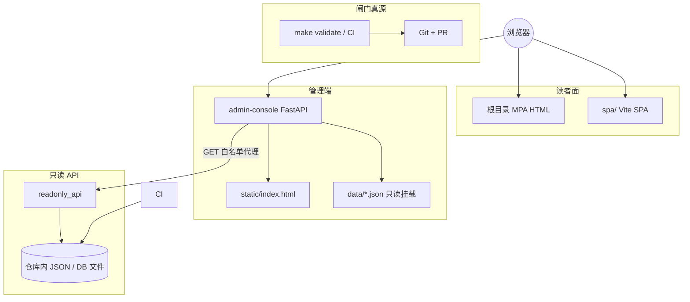

# 管理端控制台（admin-console）框架总览

**角色判型**（读者 / 贡献 / 数据 / 部署 → 第一站）：根 [README · 产品视角](../README.md#pm-four-journeys) · [README · 从这里开始](../README.md#readme-start-here) · [README · 双轨真源](../README.md#readme-dual-track-map)。**架构师梳理与持续改进**：[ARCHITECTURE_ONE_PAGER · 五步表](./ARCHITECTURE_ONE_PAGER.md#architect-stewardship) · [不变量索引](./ARCHITECTURE_ONE_PAGER.md#architect-invariants-index) · [PR 证据三联](../CONTRIBUTING.md#contributing-pr-evidence-triad)。

本文把 **`admin-console`** 在仓库中的**位置、边界、已实现能力与未实现项**一次性对表，便于评审「是否符合预期」。规范叙述仍以 **[AGENTS.md](../AGENTS.md#agents-admin-console)**、**[ADMIN_WEB_CONSOLE_ROADMAP](./ADMIN_WEB_CONSOLE_ROADMAP.md)**、**[ADMIN_PIPELINE_UI_AND_DATA_SOURCE_MIGRATION](./ADMIN_PIPELINE_UI_AND_DATA_SOURCE_MIGRATION.md)**、**[INTEGRATION_AND_READONLY_API](./INTEGRATION_AND_READONLY_API.md)** 为准。**`admin-console/` 在物理分层中的位置 · 主链验收入口**：**[勿混粒度 · 五维/六域/七类](./PROJECT_ARCHITECTURE_OVERVIEW.md#architecture-grain)** · [PROJECT_ARCHITECTURE_OVERVIEW · §1b](./PROJECT_ARCHITECTURE_OVERVIEW.md#physical-layout) · **[§1a](./PROJECT_ARCHITECTURE_OVERVIEW.md#module-linkage-validation)**。**整体内容框架**：**[docs/README · #content-framework](./README.md#content-framework)** · **前后台模块一页表**：[**#front-back-modules**](./README.md#front-back-modules) · **组件×功能一条表**：[**#system-components-fusion**](./README.md#system-components-fusion)。**按改动判型**（**0c**）：**[docs/README · #quick-paths](./README.md#quick-paths)**（表内「**情报 ingest · 管理控制台 · SPA 壳**」行与 **`admin-console`** / **ingest** / **`spa/`** 同轮改动常一起打开）。**读者 MPA 维护枢纽 · 关系视图**（与命令真源 **[scripts/README](../scripts/README.md)** 对读）：[maintainer-hub.html#mh-spine-map](../maintainer-hub.html#mh-spine-map)。**与读者站顶栏同迭代**：改 **`partials/site-nav.inc.html`** / **`partials/skip-bar.inc.html`** → **`make sync-nav`**；**`404.html`** 顶栏/skip **不在** **`sync_site_nav`** 写回范围，须**手调** — **[MERGE · §1](./MERGE_AND_RELEASE_CHECKLIST.md#pre-merge)** · **[MERGE · partials 手顺](./MERGE_AND_RELEASE_CHECKLIST.md#pre-merge-partials-sequence)** · **[scripts/README · `sync_site_nav`](../scripts/README.md)**。

---

## 1. 定位一句话

**`admin-console`** 是**管理向**的轻量 **FastAPI** 服务（默认 **8100**）：提供**无构建链**的 Web 仪表盘、**`GET /api/bootstrap`** 引导数据、**同源受控代理**到 **`readonly_api`** 的只读 GET；**不**实现 `evolution-manifest` 自动写入、**不**在进程内替代 **`make validate`** / **`analysis_engine`** 闸门语义。

**读者向**站点仍为根目录 **MPA**（及可选 **SPA**），与 **`admin-console`** 分轨部署。

## 1a. 前后台一眼看懂

| **前台（浏览器里）** | **后台（本服务 / 数据）** |
| --- | --- |
| `static/index.html` 里的模块与按钮 | 静态页面 + 浏览器里的 JavaScript |
| 顶栏「刷新」拉到的摘要、文档链、数据源表、路线图 | `GET /api/bootstrap` 的 JSON；其中目录与路线图来自 `admin-console/data/*.json` |
| 快照、历史、探索器里的 JSON 正文 | `GET /api/readonly/…` 转发到 **`readonly_api`**，真源仍在仓库磁盘 / CI |
| `/health`、`/api/me` | FastAPI 路由；环境变量见 `admin-console/README` |

**一句话**：页面负责**看、对账、复制草稿**；**改文件、合并、过闸门**仍在本地终端与 Git/PR。

页内 **meta description**、各模块导语与 **「键盘快捷方式」** 表为面向操作者的短文案，与 `GET /` 同源；细节实现仍以本仓库 `admin-console/static/index.html` 为准。

## 1b. 与读者面的双目标对表

与 **[USER_ADMIN_SPLIT · §1c](./USER_ADMIN_SPLIT_AND_EVOLUTION_DESIGN.md#front-three-sources)** 同序对读。

| 目标 | 要点 | **`admin-console` 当前** | 边界与后续 |
|------|------|---------------------------|------------|
| **读者面：配置 + 数据 + 分析演进 → 呈现** | 读者站消费已部署 JSON；见 **USER_ADMIN · 三源表** | 不替代读者 MPA/SPA；**`bootstrap`** 仅链到契约文档与真源路径 | 前台增维度先改 **Schema + 引擎**，再改 **hub / bus** |
| **管理 Web：可管理** | 动线可查、可执行意图不丢步骤 | 管道文档链、CLI 提示、**`control_plane_roadmap`** | 阶段 2：队列/PR 链；**不**默认一键写 manifest |
| **管理 Web：可配置** | 配置进 Git JSON，可 diff | 数据源目录、ingest 对账、**RSS 草案**剪贴板 | 阶段 2：**表单 → PR**；真源仍为 Git |
| **管理 Web：可观测** | 健康、快照、历史、白名单 JSON | **`/health`**、只读代理、快照/历史区、探索器 | **`readonly_api`** 保持只读；新观测另立路由/Schema |
| **管理 Web：可演进** | 分阶段、单契约、少双实现 | **`pipeline_links`**、路线图 JSON、与 **ADMIN_WEB_CONSOLE_ROADMAP** 对表 | **IdP / 触发作业** 见路线图 §6—7 |

---

## 2. 组件关系（预期拓扑）

要点：**观测与控制面叙事**在 **`admin-console`**；**结构化真源与校验**仍在 **Git + `scripts` / `evolution_pkg` + CI**；**磁盘只读 HTTP** 在 **`readonly_api`**。与「读者 / 闸门 / 编排」并列的**组件—功能一条表**见 **[docs/README · #system-components-fusion](./README.md#system-components-fusion)**。

---

## 3. 不变量对表（是否符合仓库预期）

| 预期 | 当前实现 |
|------|----------|
| **不**自动写 **`evolution-manifest.json`**、**不**绕过 **`review_state`** / **`merge_candidates_to_manifest`** | 无写 JSON 路由；文档与 UI 均声明 PR + 人审 |
| **`analysis_engine`** 只产出结构化 JSON、**不写** HTML | 控制台仅拉取/展示快照等，不内嵌分析写盘 |
| **合并闸门**以 **`run_validate.sh` / `make validate`** 为语义真源 | UI 提供命令链与文档链，**不**宣称替代 validate |
| **`readonly_api`** 保持**只读**语义 | 代理仅 **GET**、路径 **白名单**（与 `READONLY_PROXY_SEGMENTS` / 单测对账） |
| **外网数据源**不以管理端为爬虫出口 | **数据源目录**外链由用户浏览器打开；**`data_source_catalog`** 不由服务端请求外站 |
| **双轨** MPA 默认真源；SPA 增页走 registry + nav | 控制台不修改 SPA；仅链到文档 |
| **DB 与真源** | 侧车 SQLite 列级清点、不宜主库的 **8 类**域、后续 OLTP 建议域见 **[DATA_CONTRACTS · §5](./DATA_CONTRACTS.md#sqlite-sidecar-column-inventory)** |

---

## 4. HTTP 面（已实现）

**路径、端口与变量**以 **`admin-console/README.md`** 的「能力一览」「环境变量」为日常真源；下表仅作与代码审阅对账的速览。

| 方法·路径 | 作用 |
|-----------|------|
| **`GET /`** | **`static/index.html`** 仪表盘 |
| **`GET /health`** | 存活与配置摘要（含 **`readonly_api_base_url`**、**`repo_web_base`** 等） |
| **`GET /api/bootstrap`** | 前端引导 JSON（见 §5） |
| **`GET /api/me`** | 身份占位；**`ADMIN_DEV_BYPASS`** 仅本地演示 |
| **`GET /api/readonly/{segment}`** | 白名单 **GET** 代理至 **`READONLY_API_BASE_URL/{segment}`**；**`snapshot-history`** 列表转发 **`limit`/`offset`** |
| **`GET /api/readonly/snapshot-history/{run_id}`** | 单条历史；**`run_id`** 字符白名单 |
| **`GET /docs`** · **`/openapi.json`** | OpenAPI |
| **`GET/POST/PATCH/DELETE /api/admin/accounts`** | 本地账户（JSON + **bcrypt**）；须 **`ADMIN_ACCOUNTS_API_SECRET`**；头 **`X-Admin-Accounts-Secret`** 或 **`Authorization: Bearer …`**；未配密钥 **503**；审计 logger **`admin_console.admin_accounts`**（单行 JSON，**不含**密码与密钥） |

---

## 5. `GET /api/bootstrap` 字段（与 UI / 真源关系）

| 字段 | 含义 | 真源 / 备注 |
|------|------|-------------|
| **`service`** | 固定标识 | — |
| **`server_time_beijing`** | 管理端进程当前时间（**北京时间** ISO8601，`Asia/Shanghai`，`+08:00`） | 观测卡片与 skew 提示；**非**权威授时源 |
| **`readonly_api_base_url`** | 代理目标根 | 环境变量 **`READONLY_API_BASE_URL`** |
| **`readonly_proxy_segments`** | 可代理片段列表 | **`app.settings.READONLY_PROXY_SEGMENTS`**（须与 **`readonly_api`** 路由对账） |
| **`docs_roadmap`** | 管理路线图路径串 | 固定相对路径文案 |
| **`cors_origins_configured`** | 是否配置了 CORS | **`ADMIN_CORS_ORIGINS`** |
| **`repo_web_base`** | Git blob 前缀 | **`ADMIN_REPO_WEB_BASE`**（未设置时默认上游 main，显式空则无 blob 外链） |
| **`pipeline_links`** | 文档与 JSON 真源链 | 代码内 `_PIPELINE_LINK_ITEMS`（含 **ADMIN_WEB_CONSOLE_ROADMAP**、**USER_ADMIN_SPLIT**、管道/契约/集成等）+ `repo_web_base` 拼 **href** |
| **`pipeline_cli_hints`** | 本地命令占位 | 代码内常量；**不**执行 |
| **`github_actions_href`** | GitHub Actions 总入口 | 由 **`repo_web_base`** 推导 |
| **`pipeline_workflows`** | 工作流 YAML + 链接 | 与 **EVOLUTION_RUNBOOK** 对表 |
| **`data_source_catalog`** | 市面数据源参考 | **`admin-console/data/data_source_catalog.json`** |
| **`control_plane_roadmap`** | 市面后台能力映射 + 阶段 0—3 | **`admin-console/data/control_plane_roadmap.json`** |
| **`admin_accounts_enabled`** | 是否已配置管理员账户 API 密钥（布尔） | **`ADMIN_ACCOUNTS_API_SECRET`** 非空则为 **true**；**不**下发密钥本身 |

**`GET /health`** 亦返回 **`admin_accounts_enabled`**（运维探活与控制台一致）。

---

## 6. 仓库内静态数据文件

| 文件 | 用途 |
|------|------|
| **`admin-console/data/data_source_catalog.json`** | 数据源分类与参考入口；**disclaimer** 强调合规访问 |
| **`admin-console/data/control_plane_roadmap.json`** | 数据源 / 策略 / 审批 / 发布 四维与 **ADMIN** 阶段对表 |
| **`admin-console/data/admin_accounts.example.json`** | 管理员账户文件**形状示例**（空 **`users`**）；运行时数据默认 **`data/admin_accounts.json`**（**`.gitignore`**，勿提交） |

**Docker**：**`admin-console/Dockerfile`** **`COPY data ./data`**，镜像内包含上述 **示例与目录内已提交的** JSON；**`admin_accounts.json`** 若由运行时生成须通过 **卷挂载** 持久化。

---

## 7. `static/index.html` 功能区（与顶栏 **模块导航** 对表）

顶栏 **`<nav id="admin-primary-nav">`** 按 **[§7b · 界面归类](./ADMIN_CONSOLE_FRAMEWORK_OVERVIEW.md#admin-ui-ia)** 分组；主内容 **`#admin-main`** 内 **`mod-*`** 区块顺序为：**概览** → **身份与账户** → **观测** → **管道与闸门** → **数据源参考** → **规划对照** → **文档与真源**（与导航从左到右一致，便于滚动联动与锚点分享）。**`@media print`** 下 **`p.module-lead` / `p.module-boundary`** 使用深色文字，便于纸质输出与读屏外打印预览。

| 导航 / 模块 `id` | 区块与行为 |
|------------------|------------|
| **`#mod-overview` · 概览** | **一键拉取配置**；**观测摘要**；**运行时**（**`/health`** + **`bootstrap`**；只读 API 基址、**`repo_web_base`**、代理段数量） |
| **`#mod-identity` · 身份与账户** | **当前身份**（**`/api/me`**）；**管理员账户**（**`bootstrap.admin_accounts_enabled`** 时显示：列出 / 新建 / PATCH / 删除；**`/docs`**；审计日志） |
| **`#mod-analysis` · 观测** | **当前分析快照**、**快照历史**（**`/api/readonly/…`**）；**常用 JSON（只读）** 快捷条 → **只读 API 探索器**（白名单片段 + 正文） |
| **`#mod-pipeline` · 管道与闸门** | **管道与数据源**（**`pipeline_links`**、CLI 占位、Actions、工作流表） |
| **`#mod-data` · 数据源参考** | **数据源参考目录**（**`data_source_catalog`**、ingest 对账、RSS / **json_feeds** 草案）；**`ingest_config.json`** 仍须 **PR** |
| **`#mod-platform` · 规划对照** | **`control_plane_roadmap`**；市面后台对照 + **ADMIN 阶段**列表 |
| **`#mod-links` · 文档与真源** | 外链清单（路线图、读者站、OpenAPI 等） |

旧书签 **`#mod-api`** 在脚本中会**滚动到** **`#mod-analysis`**（探索器并入观测模块）。

### 7a. 管理端逻辑模块规划（目标：配置最简单 · 行为最稳）

将 **`admin-console`** 视为**薄控制面**：观测与动线集中在此，**结构化真源、校验语义、人审合并**仍在 **Git + `scripts` / `evolution_pkg` + `make validate`**（与上文 **§3** 不变量一致）。下面按**逻辑模块**收束职责，便于后续迭代时「一个模块一个配置面、少交叉依赖」。

| 逻辑模块 | 职责（尽量单一） | 配置 / 真源 | 性能与稳定要点 |
|----------|------------------|-------------|----------------|
| **入口与引导** | **`/api/bootstrap`** 拼装只读 API 基址、代理白名单、文档链、GitHub 外链等 | 环境变量 **`READONLY_API_BASE_URL`**、**`ADMIN_REPO_WEB_BASE`**、**`ADMIN_CORS_ORIGINS`** 等（见 **`admin-console/README.md`**） | **不在此进程内**代抓外网或代跑管道；响应体保持小、可缓存字段由上游 **ETag** 承担（见 **INTEGRATION**） |
| **健康与就绪** | **`/health`** 摘要依赖（只读 API、账户 API 是否启用等） | 同上 + **`ADMIN_ACCOUNTS_API_SECRET`** 是否配置 | 探活应轻量；失败时明确 **503/连不通** 与 UI **offline** 态，避免静默重试风暴 |
| **身份占位** | **`/api/me`**、本地 **`ADMIN_DEV_BYPASS`** | 仅开发演示；生产须走 **[ADMIN_WEB_CONSOLE_ROADMAP](./ADMIN_WEB_CONSOLE_ROADMAP.md)** IdP/BFF | **生产关闭 bypass**；与读者站 **分域/分 Cookie** |
| **本地管理员账户**（可选） | **`/api/admin/accounts`** CRUD + 审计日志 | **`ADMIN_ACCOUNTS_API_SECRET`** + **`data/admin_accounts.json`**（默认 **`.gitignore`**） | 低频写盘；**密钥不落 bootstrap**；与 **RBAC/IdP** 阶段目标区分（见 **ADMIN_WEB · §2**） |
| **只读代理** | **`GET /api/readonly/{segment}`** 白名单转发 | **`READONLY_PROXY_SEGMENTS`** 与 **`readonly_api`** 路由对账（单测 **`test_readonly_proxy`**） | **仅 GET**；敏感段（**candidates**、**ingest-config** 等）须在网关侧控暴露；代理层**不**改写闸门语义 |
| **管道与文档链** | **`pipeline_links`**、**`pipeline_cli_hints`**、工作流表 | 代码内常量 + **`repo_web_base`** 拼 href；**不**执行命令 | 纯配置与外链，无长事务 |
| **数据源参考目录** | 展示 **`data_source_catalog.json`** | **`admin-console/data/data_source_catalog.json`** | **浏览器**打开外链；服务端**不**轮询外站 URL |
| **控制面路线图** | 展示 **`control_plane_roadmap.json`** | **`admin-console/data/control_plane_roadmap.json`** | 只读对照 **[ADMIN_WEB_CONSOLE_ROADMAP](./ADMIN_WEB_CONSOLE_ROADMAP.md)**，不当作运行时策略引擎 |
| **前端仪表盘** | **`static/index.html`** 单页聚合 | 无服务端模板；主题等 **localStorage** | 长页按区块懒加载/折叠（演进项）；避免把大 JSON 重复拉取未控频 |

**再规划原则**：新增能力时先问——**(1)** 真源是否仍落在 Git/Schema？**(2)** 是否增加管理进程的外呼或长事务？**(3)** 是否与 **`readonly_api` 只读**名实冲突？任一为「否/是/是」则优先退回 **文档链 + PR + CI**，而非塞进 **`admin-console`**。

### 7b. 管理台界面归类（简洁 · 易懂 · 易用）

当前 **`static/index.html`** 为**单页纵向堆叠**；建议在交互结构上按**模块域**归类（侧栏或顶部分段 **Tab** 均可，实现阶段再定），使「**看一眼导航就知道该点哪组**」：

| 导航组（建议名） | 对应 §7 区块 | 用户心智（一句话） |
|------------------|-------------|----------------------|
| **概览** | 运行时 | 服务是否健康、只读 API 指向哪、代理段是否齐 |
| **身份与账户** | 当前身份、管理员账户 | 谁在操作；账户 API 是否启用及密钥提示 |
| **观测** | 当前分析快照、快照历史、常用 JSON、只读资源探索器 | **只读**看数、对账、复制路径；与 **DATA_CONTRACTS** 字段语义对齐 |
| **管道与闸门** | 管道与数据源（含 CLI 提示、Actions、工作流） | **命令只展示、不代执行**；默认作业面仍是 **本地/CI + PR** |
| **数据源参考** | 数据源参考目录 | 合规外链与 **ingest** 对账草案；**JSON 真源合并仍走 PR** |
| **规划对照** | 控制面能力路线图 | 与市面后台能力映射及 **ADMIN** 阶段对读，**非功能开关** |

**文案与交互习惯**：每组顶部一行 **muted 导语**（本组做/不做）；危险操作（若未来有）与 **break-glass** 分域；避免把「读者站功能」塞进管理台同一导航层级，减少角色混淆。**已实现**：各 `mod-*` 模块标题下除 `module-lead` 外另有 **`p.module-boundary`（本组不做）** 一行，与上表心智对齐；对应 **`h2.module-title`** 使用 **`aria-describedby`** 依次指向该模块的 **`module-lead`** 与 **`module-boundary`**，读屏进入区块时可听到职责与禁区。顶栏导航在 **`max-width: 60rem`** 时起**横向滚动**（`flex-wrap: nowrap` + `overflow-x: auto`、淡边 `mask-image`），避免七枚 Tab 折行碎裂；键盘帮助表「模块顶栏」行与之一致。

### 7c. 管理后台引入 AI 模型是否符合仓库预期？

与 **[PLATFORM_EXTENSIBILITY · 不变量](./PLATFORM_EXTENSIBILITY_AND_EVOLUTION.md#invariants)**、**[PLATFORM · 智能化边界 §1.1](./PLATFORM_EXTENSIBILITY_AND_EVOLUTION.md#automation-and-evolution)**、**[AI_ASSISTED_ANALYSIS_LAYER](./AI_ASSISTED_ANALYSIS_LAYER.md)** 对齐，结论按**形态**区分（**不是**「管理台一律不能碰模型」）：

| 形态 | 是否符合既定预期 | 说明 |
|------|------------------|------|
| 管理 UI **仅链到文档** / **只读展示**已通过闸门写入的 **`ai-analysis-overlay.json`**（经 **`readonly_api`** 或同源代理 **GET**） | **符合** | 与「读者域可选叠加层」同契约；**不**把 LLM 输出并入 **`analysis-snapshot`** 必填域 |
| **编排型**：管理台触发**独立作业**（如 Actions / 批处理）生成 overlay 或草案，**产出仍经 PR + `make validate`** | **可符合（阶段 2+ 设计）** | 须 **[ADMIN_PIPELINE](./ADMIN_PIPELINE_UI_AND_DATA_SOURCE_MIGRATION.md)** 式分层：作业执行者 ≠ 管理进程内「偷偷写盘」 |
| 管理进程内 **默认**对每次页面请求调用 LLM，或 **自动**改写 **`ingest_config` / 规则 / manifest** | **不符合** | 易引入不可审计漂移、密钥面扩大、与 **「人审 manifest」「分析不写 HTML」** 冲突 |
| **Copilot 式**仅生成 **PR 描述 / 配置草案 / 评论文本**，经人审后合并 | **可讨论** | 须密钥与数据分级、审计字段；**仍不**替代 **`merge_candidates_to_manifest`** 的语义与 **Git 可 diff** 主轴 |

**一句话**：仓库预期是 **AI 可接在「可选产物 + Schema + PR」链上**；**不是**把管理台变成「默认可改真源的黑盒模型入口」。详细接入与检查单以 **AI_ASSISTED_ANALYSIS_LAYER** 为准。

---

## 8. 与 [ADMIN_WEB_CONSOLE_ROADMAP](./ADMIN_WEB_CONSOLE_ROADMAP.md) 阶段

| 阶段 | 本控制台对应程度 |
|------|------------------|
| **0** | **已对齐**：CLI/PR 仍为默认作业面；本服务为只读观测 + 文档链 |
| **1** | **部分**：无 OIDC；有 **`/api/me`** 占位与 dev bypass；有 **共享密钥** 下的 **本地账户文件 CRUD**（**非**企业 IdP/RBAC，见 **`ADMIN_WEB_CONSOLE_ROADMAP`**） |
| **2** | **未实现**：表单 → PR、触发 Workflow 等需在独立设计后落地 |
| **3** | **未实现**：break-glass 直连写 |

---

## 9. 闸门与 CI（维护者预期）

- 合并前：**`make validate`**（根目录与 CI 一致）。  
- 推荐：**`make merge-ready`**（含 **`test-readonly-api`**、**`test-admin-console`**）。  
- 变更 **`admin-console/app`**：**`make validate`** 内 **`compileall`** 语法闸门。  

**`admin-console`** 变更在 CI 中可按路径触发 **`admin-console-tests`**（与根 [README.md](../README.md) · [AGENTS.md · 管理端壳](../AGENTS.md#agents-admin-console) 描述一致）。

---

## 10. 明确未实现（避免预期漂移）

以下属于路线图或产品讨论范围，**当前仓库未作为契约实现**：

- Web 内直接编辑 **`ingest_config.json`** / **`maps_to_hints.json`** 并落盘  
- Web 内「一键合并 manifest」「一键触发 ingest/analyze」且无 **PR + validate** 等价物  
- 管理端对外部数据源 URL 的**服务端**轮询 / 抓取  
- 完整 RBAC、**集中审计库**、与 Git **双向**工作流引擎（当前仅有进程 **日志级** 账户审计 JSON 行）  

---

## 11. 相关文档入口

| 文档 | 说明 |
|------|------|
| [ADMIN_WEB_CONSOLE_ROADMAP.md](./ADMIN_WEB_CONSOLE_ROADMAP.md) | 登录、RBAC、审核、Git 审计、分阶段 |
| [ADMIN_PIPELINE_UI_AND_DATA_SOURCE_MIGRATION.md](./ADMIN_PIPELINE_UI_AND_DATA_SOURCE_MIGRATION.md) | 管道 UI、数据源、市面后台对照（§8） |
| [AI_ASSISTED_ANALYSIS_LAYER.md](./AI_ASSISTED_ANALYSIS_LAYER.md) | 方法论快照 + 可选 AI 解读层、服务接入与产物边界 |
| [USER_ADMIN_SPLIT_AND_EVOLUTION_DESIGN.md](./USER_ADMIN_SPLIT_AND_EVOLUTION_DESIGN.md) | 读者/管理分拆、审核分层 L1—L5 |
| [INTEGRATION_AND_READONLY_API.md](./INTEGRATION_AND_READONLY_API.md) | 只读 API、网关、扩展路由 |
| [admin-console/README.md](../admin-console/README.md) | 运行、环境变量、单测命令 |
| [INTEL_AND_POLICY_TRACKING_PLAYBOOK.md](./INTEL_AND_POLICY_TRACKING_PLAYBOOK.md) | 舆情/制度/国情跟踪与 ingest 反哺流程（非技术契约）；**[§2—2a](./INTEL_AND_POLICY_TRACKING_PLAYBOOK.md#intel-source-tiers)** 拉取约束 · **[§2b](./INTEL_AND_POLICY_TRACKING_PLAYBOOK.md#intel-social-platforms)** 微博/站内流 |
| [REFERENCE_DESIGN_OPINION_MONITORING.md](./REFERENCE_DESIGN_OPINION_MONITORING.md) | 舆情类开源产品对标、网关与可复制边界（与 INTEL 分工：对标读本文，日常流程读 INTEL） |

### 11a. 交叉引用索引（§7 / §7b）

**单页功能区真源**（顶栏 **`mod-*`**、**`#mod-api`→`#mod-analysis`**）：**[§7](#admin-module-plan)**。**界面归类（IA）**：**[§7b](#admin-ui-ia)**。

其他文档若新增对 **`static/index.html`** 分区的链，建议统一指向 **`ADMIN_CONSOLE_FRAMEWORK_OVERVIEW.md#admin-module-plan`** 或 **`#admin-ui-ia`**；可在下表**补一行**以免散落难找。全仓库盘点可搜索 **`ADMIN_CONSOLE_FRAMEWORK_OVERVIEW.md#admin-module-plan`**（非穷尽）。

| 用途 | 文档 |
|------|------|
| 判型与最短链 | [docs/README · #quick-paths](./README.md#quick-paths) |
| 跨 PR 架构收束（五步表） | [ARCHITECTURE_ONE_PAGER · #architect-stewardship](./ARCHITECTURE_ONE_PAGER.md#architect-stewardship) |
| 合并闸门与发布 | [MERGE 清单 §1](./MERGE_AND_RELEASE_CHECKLIST.md#pre-merge) · [MERGE · partials 手顺](./MERGE_AND_RELEASE_CHECKLIST.md#pre-merge-partials-sequence) |
| 读者站顶栏与失页（`partials` / `make sync-nav` / **`404.html` 手调**） | [MERGE 清单 §1](./MERGE_AND_RELEASE_CHECKLIST.md#pre-merge) · [MERGE · partials 手顺](./MERGE_AND_RELEASE_CHECKLIST.md#pre-merge-partials-sequence) · [scripts/README · `sync_site_nav`](../scripts/README.md) · 控制台单页 **「文档与真源」**（`link-docs-merge-pre-merge-nav`、`link-docs-merge-pre-merge-partials-nav`、`link-docs-scripts-readme-sync-nav`） |
| PR 与常见变更 | [CONTRIBUTING.md](../CONTRIBUTING.md#contributing-env-and-cmd)（「常见变更自检」表） · [GitHub PR 模板](../.github/pull_request_template.md) |
| 内容·架构·组件总表 / 读者·管理面 | [PLATFORM_MASTER_MAP §1 / §1a](./PLATFORM_MASTER_MAP_AND_INVOCATION.md#three-layers-map) |
| 五维物理分层 | [PROJECT_ARCHITECTURE_OVERVIEW §1b](./PROJECT_ARCHITECTURE_OVERVIEW.md#physical-layout) |
| 七类 + 管理端脚手架 | [ARCHITECTURE · 模块梳理](./ARCHITECTURE.md#module-inventory-upgrade) |
| 分端用语与四可 | [USER_ADMIN_SPLIT · §1b / §1c](./USER_ADMIN_SPLIT_AND_EVOLUTION_DESIGN.md#reader-frontend-admin-backend) |
| 六域协同 | [INTELLIGENCE · 六域](./INTELLIGENCE_SIX_DOMAINS.md#six-domains) |
| 只读 API 与代理白名单对账 | [INTEGRATION（契约与单测）](./INTEGRATION_AND_READONLY_API.md) |
| 运行与单测 | [admin-console/README](../admin-console/README.md) |
| 命令表 / Compose / 阶段执行表（含动 **admin-console**） | [scripts/README](../scripts/README.md) · [DOCKER · §3a](./DOCKER.md#profile-admin) · [PHASED · 落地执行](./PHASED_UPGRADE_EXECUTION_GUIDE.md#execution-now) |
| 升级矩阵与拆 PR 习惯 | [MODULE · §4—5](./MODULE_INVENTORY_AND_ARCHITECTURE_UPGRADE_MATRIX.md#upgrade-matrix) · [ARCHITECTURE_UPGRADE_ROADMAP](./ARCHITECTURE_UPGRADE_ROADMAP.md) · [INCREMENTAL_BUILD_PLAYBOOK](./INCREMENTAL_BUILD_PLAYBOOK.md) |
| 闸门一页 / 增能与发布清单 | [ARCHITECTURE_ONE_PAGER](./ARCHITECTURE_ONE_PAGER.md) · [PLATFORM_CAPABILITY_MAP](./PLATFORM_CAPABILITY_MAP.md) |
| 校验与 CI（技术简版 / 详版栈） | [TECH_ARCHITECTURE · §1](./TECH_ARCHITECTURE_AND_UPGRADE_BRIEF.md#layers-summary) · **[附录](./TECH_ARCHITECTURE_AND_UPGRADE_BRIEF.md#appendix-tech-capabilities)**（[别名](./TECH_ARCHITECTURE_CAPABILITIES.md)） |
| 管道 UI 专篇（与 §7 §6 对读） | [ADMIN_PIPELINE](./ADMIN_PIPELINE_UI_AND_DATA_SOURCE_MIGRATION.md) |
| 舆情/制度跟踪与反哺 | [INTEL_AND_POLICY_TRACKING_PLAYBOOK](./INTEL_AND_POLICY_TRACKING_PLAYBOOK.md)（**[§2—2a](./INTEL_AND_POLICY_TRACKING_PLAYBOOK.md#intel-source-tiers)** · **[§2b](./INTEL_AND_POLICY_TRACKING_PLAYBOOK.md#intel-social-platforms)**） |
| 舆情类产品对标与暴露面 | [REFERENCE_DESIGN_OPINION_MONITORING](./REFERENCE_DESIGN_OPINION_MONITORING.md) |
| 自动化助手 | [AGENTS.md](../AGENTS.md#agents-admin-console) |

---

*随 `admin-console` 与路线图迭代；增删 bootstrap 字段或静态 JSON 时，请同步 **本文**、**`admin-console/README.md`** 与 **烟测**（含 **`static/index.html`**「文档与真源」外链 id 与 **`test_smoke.py`** 断言）。*
