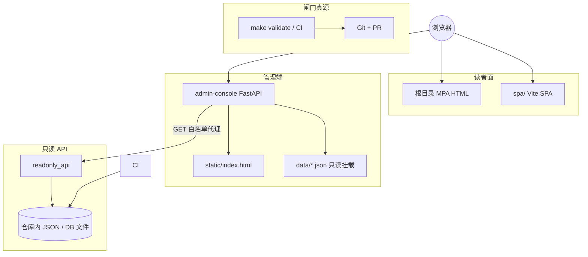

# 管理端控制台（admin-console）框架总览

本文把 **`admin-console`** 在仓库中的**位置、边界、已实现能力与未实现项**一次性对表，便于评审「是否符合预期」。规范叙述仍以 **[AGENTS.md](../AGENTS.md)**、**[ADMIN_WEB_CONSOLE_ROADMAP](./ADMIN_WEB_CONSOLE_ROADMAP.md)**、**[ADMIN_PIPELINE_UI_AND_DATA_SOURCE_MIGRATION](./ADMIN_PIPELINE_UI_AND_DATA_SOURCE_MIGRATION.md)**、**[INTEGRATION_AND_READONLY_API](./INTEGRATION_AND_READONLY_API.md)** 为准。

---

## 1. 定位一句话

**`admin-console`** 是**管理向**的轻量 **FastAPI** 服务（默认 **8100**）：提供**无构建链**的 Web 仪表盘、**`GET /api/bootstrap`** 引导数据、**同源受控代理**到 **`readonly_api`** 的只读 GET；**不**实现 `evolution-manifest` 自动写入、**不**在进程内替代 **`make validate`** / **`analysis_engine`** 闸门语义。

**读者向**站点仍为根目录 **MPA**（及可选 **SPA**），与 **`admin-console`** 分轨部署。

## 1b. 与读者面的双目标对表

与 **[USER_ADMIN_SPLIT · §1c](./USER_ADMIN_SPLIT_AND_EVOLUTION_DESIGN.md#front-three-sources)** 同序对读。

| 目标 | 要点 | **`admin-console` 当前** | 边界与后续 |
|------|------|---------------------------|------------|
| **读者面：配置 + 数据 + 分析演进 → 呈现** | 读者站消费已部署 JSON；见 **USER_ADMIN · 三源表** | 不替代读者 MPA/SPA；**`bootstrap`** 仅链到契约文档与真源路径 | 前台增维度先改 **Schema + 引擎**，再改 **hub / bus** |
| **管理 Web：可管理** | 动线可查、可执行意图不丢步骤 | 管道文档链、CLI 提示、**`control_plane_roadmap`** | 阶段 2：队列/PR 链；**不**默认一键写 manifest |
| **管理 Web：可配置** | 配置进 Git JSON，可 diff | 数据源目录、ingest 对账、**RSS 草案**剪贴板 | 阶段 2：**表单 → PR**；真源仍为 Git |
| **管理 Web：可观测** | 健康、快照、历史、白名单 JSON | **`/health`**、只读代理、快照/历史区、探索器 | **`readonly_api`** 保持只读；新观测另立路由/Schema |
| **管理 Web：可演进** | 分阶段、单契约、少双实现 | **`pipeline_links`**、路线图 JSON、与 **ADMIN_WEB_CONSOLE_ROADMAP** 对表 | **IdP / 触发作业** 见路线图 §6—7 |

---

## 2. 组件关系（预期拓扑）

要点：**观测与控制面叙事**在 **`admin-console`**；**结构化真源与校验**仍在 **Git + `scripts` / `evolution_pkg` + CI**；**磁盘只读 HTTP** 在 **`readonly_api`**。

---

## 3. 不变量对表（是否符合仓库预期）

| 预期 | 当前实现 |
|------|----------|
| **不**自动写 **`evolution-manifest.json`**、**不**绕过 **`review_state`** / **`merge_candidates_to_manifest`** | 无写 JSON 路由；文档与 UI 均声明 PR + 人审 |
| **`analysis_engine`** 只产出结构化 JSON、**不写** HTML | 控制台仅拉取/展示快照等，不内嵌分析写盘 |
| **合并闸门**以 **`run_validate.sh` / `make validate`** 为语义真源 | UI 提供命令链与文档链，**不**宣称替代 validate |
| **`readonly_api`** 保持**只读**语义 | 代理仅 **GET**、路径 **白名单**（与 `READONLY_PROXY_SEGMENTS` / 单测对账） |
| **外网数据源**不以管理端为爬虫出口 | **数据源目录**外链由用户浏览器打开；**`data_source_catalog`** 不由服务端请求外站 |
| **双轨** MPA 默认真源；SPA 增页走 registry + nav | 控制台不修改 SPA；仅链到文档 |
| **DB 与真源** | 侧车 SQLite 列级清点、不宜主库的 **8 类**域、后续 OLTP 建议域见 **[DATA_CONTRACTS · §5](./DATA_CONTRACTS.md#sqlite-sidecar-column-inventory)** |

---

## 4. HTTP 面（已实现）

| 方法·路径 | 作用 |
|-----------|------|
| **`GET /`** | **`static/index.html`** 仪表盘 |
| **`GET /health`** | 存活 + **`readonly_api_base_url`**、**`repo_web_base`** 等摘要 |
| **`GET /api/bootstrap`** | 前端引导 JSON（见下节） |
| **`GET /api/me`** | 身份占位；**`ADMIN_DEV_BYPASS`** 仅本地演示 |
| **`GET /api/readonly/{segment}`** | 代理至 **`READONLY_API_BASE_URL/{segment}`**；**`snapshot-history`** 转发 **`limit`/`offset`** |
| **`GET /api/readonly/snapshot-history/{run_id}`** | 单条历史快照；**`run_id`** 白名单 |
| **`GET /docs`** · **`/openapi.json`** | OpenAPI |
| **`GET/POST/PATCH/DELETE /api/admin/accounts`** | **本地管理员账户**（JSON 文件 + **bcrypt**）；须 **`ADMIN_ACCOUNTS_API_SECRET`**；请求头 **`X-Admin-Accounts-Secret`** 或 **`Authorization: Bearer …`**。未配置密钥时 **503**。变更写盘时打 **结构化审计日志**（logger **`admin_console.admin_accounts`**，单行 JSON：**不含**密码与密钥） |

---

## 5. `GET /api/bootstrap` 字段（与 UI / 真源关系）

| 字段 | 含义 | 真源 / 备注 |
|------|------|-------------|
| **`service`** | 固定标识 | — |
| **`readonly_api_base_url`** | 代理目标根 | 环境变量 **`READONLY_API_BASE_URL`** |
| **`readonly_proxy_segments`** | 可代理片段列表 | **`app.settings.READONLY_PROXY_SEGMENTS`**（须与 **`readonly_api`** 路由对账） |
| **`docs_roadmap`** | 管理路线图路径串 | 固定相对路径文案 |
| **`cors_origins_configured`** | 是否配置了 CORS | **`ADMIN_CORS_ORIGINS`** |
| **`repo_web_base`** | Git blob 前缀 | **`ADMIN_REPO_WEB_BASE`**（未设置时默认上游 main，显式空则无 blob 外链） |
| **`pipeline_links`** | 文档与 JSON 真源链 | 代码内 `_PIPELINE_LINK_ITEMS`（含 **ADMIN_WEB_CONSOLE_ROADMAP**、**USER_ADMIN_SPLIT**、管道/契约/集成等）+ `repo_web_base` 拼 **href** |
| **`pipeline_cli_hints`** | 本地命令占位 | 代码内常量；**不**执行 |
| **`github_actions_href`** | GitHub Actions 总入口 | 由 **`repo_web_base`** 推导 |
| **`pipeline_workflows`** | 工作流 YAML + 链接 | 与 **EVOLUTION_RUNBOOK** 对表 |
| **`data_source_catalog`** | 市面数据源参考 | **`admin-console/data/data_source_catalog.json`** |
| **`control_plane_roadmap`** | 市面后台能力映射 + 阶段 0—3 | **`admin-console/data/control_plane_roadmap.json`** |
| **`admin_accounts_enabled`** | 是否已配置管理员账户 API 密钥（布尔） | **`ADMIN_ACCOUNTS_API_SECRET`** 非空则为 **true**；**不**下发密钥本身 |

**`GET /health`** 亦返回 **`admin_accounts_enabled`**（运维探活与控制台一致）。

---

## 6. 仓库内静态数据文件

| 文件 | 用途 |
|------|------|
| **`admin-console/data/data_source_catalog.json`** | 数据源分类与参考入口；**disclaimer** 强调合规访问 |
| **`admin-console/data/control_plane_roadmap.json`** | 数据源 / 策略 / 审批 / 发布 四维与 **ADMIN** 阶段对表 |
| **`admin-console/data/admin_accounts.example.json`** | 管理员账户文件**形状示例**（空 **`users`**）；运行时数据默认 **`data/admin_accounts.json`**（**`.gitignore`**，勿提交） |

**Docker**：**`admin-console/Dockerfile`** **`COPY data ./data`**，镜像内包含上述 **示例与目录内已提交的** JSON；**`admin_accounts.json`** 若由运行时生成须通过 **卷挂载** 持久化。

---

## 7. `static/index.html` 功能区（自上而下）

| 区块 | 数据与行为 |
|------|------------|
| **运行时** | **`/health`** + **`bootstrap`**；展示只读 API 基址、**`repo_web_base`**、代理段数量 |
| **当前身份** | **`/api/me`** |
| **管理员账户**（**`bootstrap.admin_accounts_enabled`** 时显示） | 输入密钥后：**列出**、**新建**、**启用/禁用（PATCH）**、**删除**；契约见 **`/docs`**；服务端写 **审计日志** |
| **管道与数据源** | **`pipeline_links`**、CLI 提示、Actions、工作流表（含复制路径） |
| **数据源参考目录** | **`data_source_catalog`**（勾选、ingest 对账、RSS 草案导出）；**`ingest_config.json`** 仍须 **PR** 合并 |
| **常用 JSON（只读）** | 按钮打开 **ingest-config**、**registry**、**snapshot** 等 → 底部探索器 |
| **控制面能力（路线图）** | **`control_plane_roadmap`**；市面后台对照 + **ADMIN 阶段**列表 |
| **当前分析快照** | **`/api/readonly/snapshot`** |
| **快照历史** | **`/api/readonly/snapshot-history`** |
| **只读资源探索器** | 白名单片段按钮 + **`/api/readonly/…`** |

---

## 8. 与 [ADMIN_WEB_CONSOLE_ROADMAP](./ADMIN_WEB_CONSOLE_ROADMAP.md) 阶段

| 阶段 | 本控制台对应程度 |
|------|------------------|
| **0** | **已对齐**：CLI/PR 仍为默认作业面；本服务为只读观测 + 文档链 |
| **1** | **部分**：无 OIDC；有 **`/api/me`** 占位与 dev bypass；有 **共享密钥** 下的 **本地账户文件 CRUD**（**非**企业 IdP/RBAC，见 **`ADMIN_WEB_CONSOLE_ROADMAP`**） |
| **2** | **未实现**：表单 → PR、触发 Workflow 等需在独立设计后落地 |
| **3** | **未实现**：break-glass 直连写 |

---

## 9. 闸门与 CI（维护者预期）

- 合并前：**`make validate`**（根目录与 CI 一致）。  
- 推荐：**`make merge-ready`**（含 **`test-readonly-api`**、**`test-admin-console`**）。  
- 变更 **`admin-console/app`**：**`make validate`** 内 **`compileall`** 语法闸门。  

**`admin-console`** 变更在 CI 中可按路径触发 **`admin-console-tests`**（与根 **README / AGENTS** 描述一致）。

---

## 10. 明确未实现（避免预期漂移）

以下属于路线图或产品讨论范围，**当前仓库未作为契约实现**：

- Web 内直接编辑 **`ingest_config.json`** / **`maps_to_hints.json`** 并落盘  
- Web 内「一键合并 manifest」「一键触发 ingest/analyze」且无 **PR + validate** 等价物  
- 管理端对外部数据源 URL 的**服务端**轮询 / 抓取  
- 完整 RBAC、**集中审计库**、与 Git **双向**工作流引擎（当前仅有进程 **日志级** 账户审计 JSON 行）  

---

## 11. 相关文档入口

| 文档 | 说明 |
|------|------|
| [ADMIN_WEB_CONSOLE_ROADMAP.md](./ADMIN_WEB_CONSOLE_ROADMAP.md) | 登录、RBAC、审核、Git 审计、分阶段 |
| [ADMIN_PIPELINE_UI_AND_DATA_SOURCE_MIGRATION.md](./ADMIN_PIPELINE_UI_AND_DATA_SOURCE_MIGRATION.md) | 管道 UI、数据源、市面后台对照（§8） |
| [AI_ASSISTED_ANALYSIS_LAYER.md](./AI_ASSISTED_ANALYSIS_LAYER.md) | 方法论快照 + 可选 AI 解读层、服务接入与产物边界 |
| [USER_ADMIN_SPLIT_AND_EVOLUTION_DESIGN.md](./USER_ADMIN_SPLIT_AND_EVOLUTION_DESIGN.md) | 读者/管理分拆、审核分层 L1—L5 |
| [INTEGRATION_AND_READONLY_API.md](./INTEGRATION_AND_READONLY_API.md) | 只读 API、网关、扩展路由 |
| [admin-console/README.md](../admin-console/README.md) | 运行、环境变量、单测命令 |

---

*随 `admin-console` 与路线图迭代；增删 bootstrap 字段或静态 JSON 时，请同步 **本文**、**`admin-console/README.md`** 与 **烟测**。*
