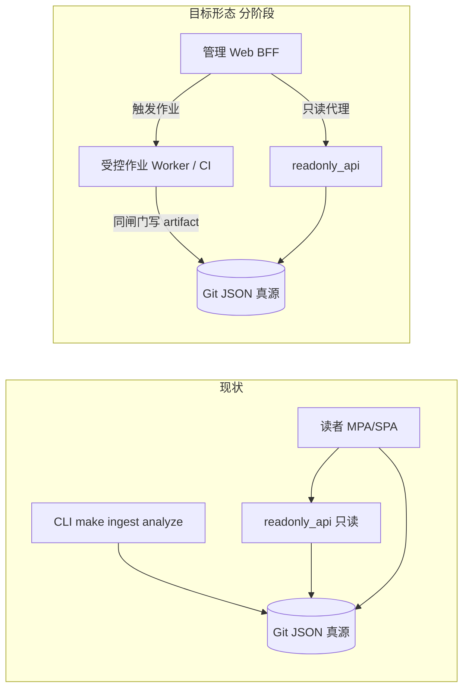

# 管理端管道 UI 与数据源迁移：整体梳理

**角色判型**（读者 / 贡献 / 数据 / 部署 → 第一站）：根 [README · 产品视角](../README.md#pm-four-journeys) · [README · 从这里开始](../README.md#readme-start-here) · [README · 双轨真源](../README.md#readme-dual-track-map)。**架构师梳理与持续改进**：[ARCHITECTURE_ONE_PAGER · 五步表](./ARCHITECTURE_ONE_PAGER.md#architect-stewardship) · [不变量索引](./ARCHITECTURE_ONE_PAGER.md#architect-invariants-index) · [PR 证据三联](../CONTRIBUTING.md#contributing-pr-evidence-triad)。

**实现与 HTTP/UI 对表**（是否符合仓库预期）：**[ADMIN_CONSOLE_FRAMEWORK_OVERVIEW.md](./ADMIN_CONSOLE_FRAMEWORK_OVERVIEW.md)**（**[§7](./ADMIN_CONSOLE_FRAMEWORK_OVERVIEW.md#admin-module-plan)** **`mod-*`** / **`#mod-api`→`#mod-analysis`** · **[§7b](./ADMIN_CONSOLE_FRAMEWORK_OVERVIEW.md#admin-ui-ia)**）。**整体内容框架**：**[docs/README · #content-framework](./README.md#content-framework)** · **前后台模块一页表**：[**#front-back-modules**](./README.md#front-back-modules) · **组件×功能一条表**：[**#system-components-fusion**](./README.md#system-components-fusion)。**按改动判型**（**0c**）：**[docs/README · #quick-paths](./README.md#quick-paths)**。**呈现双轨（`spa-sync` / `spa-build`）**：[MERGE · §1](./MERGE_AND_RELEASE_CHECKLIST.md#pre-merge) · [MERGE · partials 手顺](./MERGE_AND_RELEASE_CHECKLIST.md#pre-merge-partials-sequence) · [关系视图](../maintainer-hub.html#mh-spine-map)。**MPA 顶栏模板（`partials/`）**：**`make sync-nav`**；**`404.html`** 手调（`sync_site_nav` 不写回）— **[scripts/README · `sync_site_nav`](../scripts/README.md)**。

本文在 **[不变量](./PLATFORM_EXTENSIBILITY_AND_EVOLUTION.md#invariants)**、**[USER_ADMIN_SPLIT](./USER_ADMIN_SPLIT_AND_EVOLUTION_DESIGN.md)**、**[ADMIN_WEB_CONSOLE_ROADMAP](./ADMIN_WEB_CONSOLE_ROADMAP.md)** 之内，梳理：

1. **哪些能力**宜逐步**迁到管理端（Web）**呈现或编排；  
2. **哪些逻辑**仍应留在 **`evolution_pkg` / `scripts` / CI**，管理端**不复制**闸门；  
3. **「配置数据源 + 自动拉取 → 沉淀分析」**的推荐分层与分阶段落地，避免与 **manifest 人审**、**`readonly_api` 只读语义** 冲突。

**非当前实现契约**：落地任一写路径或定时任务前，须同步 **[DATA_CONTRACTS](./DATA_CONTRACTS.md)**、**[EVOLUTION_RUNBOOK](./EVOLUTION_RUNBOOK.md)**、**[ORCHESTRATION](./ORCHESTRATION_AND_EVENT_STREAMING.md)** 与 **OpenAPI / 安全设计**。**跨层拆 PR 前先对表**：**[勿混粒度 · 五维/六域/七类](./PROJECT_ARCHITECTURE_OVERVIEW.md#architecture-grain)** · [PROJECT_ARCHITECTURE_OVERVIEW · §1a](./PROJECT_ARCHITECTURE_OVERVIEW.md#module-linkage-validation) · **[§1b](./PROJECT_ARCHITECTURE_OVERVIEW.md#physical-layout)**。

**舆情 / 制度 / 国情**（信源分层、周历、人审与 ingest 反哺；**非**本文件的技术契约）：**[INTEL_AND_POLICY_TRACKING_PLAYBOOK.md](./INTEL_AND_POLICY_TRACKING_PLAYBOOK.md)**（**[§2—2a · 拉取约束](./INTEL_AND_POLICY_TRACKING_PLAYBOOK.md#intel-source-tiers)**：频率 · UA · **`fetch_pacing`**；**[§2b · 微博/站内流](./INTEL_AND_POLICY_TRACKING_PLAYBOOK.md#intel-social-platforms)**）。

---

## 1. 目标一句话

**管理端**演进为 **「观测 + 配置意图 + 触发已审计作业」** 的控制面；**数据真源与重计算**仍在 **Git + Python 管道 + 同一套 `make validate` 语义**（或经 **PR** 对齐后的等价 CI）。

---

## 2. 现状与目标形态（对照）

**要点**：管理端**不**替代 **`analysis_engine`** 的数学与契约；**不**在 **`readonly_api`** 进程内混装写接口（见 [ADMIN · §4.3](./ADMIN_WEB_CONSOLE_ROADMAP.md#layer-4-data-git-audit)）。

---

## 3. 硬边界（复述）

| 边界 | 说明 |
|------|------|
| **manifest** | **不**默认自动化写入 **`evolution-manifest.json`**；**不**绕过 **`review_state`** / **`merge_candidates_to_manifest`** 人审语义。 |
| **分析** | **`analysis_engine`** 只产出结构化 JSON；**不写 HTML**；沉淀/趋势仍走 **[DATA_CONTRACTS · §5](./DATA_CONTRACTS.md)** 与 Schema。 |
| **合并闸门** | 任何「分析前」与发布相关的**强闸门**仍以 **`run_validate.sh` / `make validate`** 为真源语义；管理端若触发分析，须**复用同一前置条件**或**显式声明**为子集并在文档中命名（与 [EVOLUTION_RUNBOOK · analyze](./EVOLUTION_RUNBOOK.md) 一致）。 |
| **密钥** | **RSS 列表**等可在 Git 的 **`ingest_config.json`**；**将来**若出现 API Key、Cookie、数据库口令，**仅**出现在 **Worker/CI 密钥管理**，**不**进静态管理页或 **`readonly_api`** 响应。 |

---

## 4. 「部分模块迁到管理端」——迁移矩阵

下表「**迁到管理端**」指 **UI / 编排 / 审计入口**；**核心算法与校验**仍留在 **`scripts` / `evolution_pkg`**，避免双实现。

| 模块 / 真源 | 今日载体 | 管理端阶段 1（只读 + 链） | 管理端阶段 2（编排） | 留在仓库/CI |
|-------------|----------|---------------------------|------------------------|-------------|
| **数据源配方** | **`scripts/ingest_config.json`**、**`maps_to_hints.json`** | 展示 + 链到 PR/编辑指南；可选 **只读 API** 已覆盖 **`/ingest-config`**、**`/maps-to-hints`** | 表单 → **生成 diff / 开 PR**（推荐）或 **artifact + PR** | **`check_manifest_drift`**、ingest 校验 |
| **抓取 ingest** | **`ingest_opinion_law`**、**`make ingest`** | 文档化「何时跑」；按钮仅 **跳转 CI / 本地命令** | **受鉴权**「触发 Workflow」或 **Worker 队列任务**（参数：`--full-pool` 等） | **外网、robots、版权** 约束不变 |
| **分析 + 沉淀 + 趋势** | **`make analyze`**、**`evolution_pkg.pipeline.runner`** | 展示 **`analysis-snapshot` / `sediment` / `sediment-trends`**（已有控制台雏形） | **同一 runner 前置闸门**的异步任务（日志 **`run_id`** 可链回 artifact） | **`analysis_engine --check`**、Schema 校验 |
| **快照历史** | SQLite、**`readonly_api`** | 已支持列表 + 按 **`run_id`** 拉全文 | 同上 | **`.gitignore`** 侧车策略不变 |
| **候选 / manifest / hint 决策** | **`assets/*.json`** + PR | 只读列表与 diff 视图（敏感路径走网关） | **提案 → PR**（[ADMIN · §3](./ADMIN_WEB_CONSOLE_ROADMAP.md#layer-3-review-workflow)） | **merge 脚本与人审** |
| **注册表 / SPA 导航** | **`evolution-registry.json`**、`nav.config` | 只读 + 链 **`make gen-nav-links`** | 变更仍 **PR** | **`check_nav_links_registry`** |

---

## 5. 「配置数据源 + 自动拉取」推荐模型

### 5.1 配置放哪

| 方案 | 优点 | 风险 |
|------|------|------|
| **A（推荐）** 仍以 **Git** 为 **`ingest_config` / `maps_to_hints`** 唯一真源 | 可 review、可回滚、与 **`make validate`** 对账一致 | 管理端「保存」= **开 PR**，非毫秒级反馈 |
| **B** 管理库（DB）存调度与覆盖配置 | UI 改调度快 | **第二真源**；须 **[显式命名 + 与 Git 对账](./PLATFORM_EXTENSIBILITY_AND_EVOLUTION.md#invariants)** |

**建议**：阶段内坚持 **A**；若引入 **B**，仅允许存 **Cron 表达式 + 启用开关 + 指向 Git commit SHA**，执行时 **Worker 仍 checkout 该 SHA** 再跑 ingest。

### 5.2 自动拉取谁执行

- **浏览器**不直接长跑 **`ingest`**（跨域、密钥、超时、合规）。  
- **执行者**三选一或组合：**GitHub Actions `workflow_dispatch`**、**K8s CronJob**、**独立 Worker 容器**（与 [ORCHESTRATION](./ORCHESTRATION_AND_EVENT_STREAMING.md) 阶段 2 对读）。  
- **管理端**只做：**展示下次计划 / 上次结果 / 触发一次 / 取消排队**（均需 **IdP + 审计** 后再做）。

### 5.3 与「沉淀分析」的链式关系

推荐**固定顺序**（与 [DATA_CONTRACTS · 沉淀](./DATA_CONTRACTS.md) 一致）：

1. **（可选）ingest** → 更新 **`evolution-candidates.json`**（仍经候选校验）。  
2. **validate 语义前置**（与 **`make analyze`** 一致的那一段，见 **`evolution_pkg.pipeline.runner`** 文档）。  
3. **`analysis_engine`** → **`analysis-snapshot.json`** + SQLite 历史。  
4. **沉淀** → **`data/sediment.json`**（及侧车表）。  
5. **趋势** → **`assets/sediment-trends.json`**。  

管理端若提供「一键流水线」，底层应是 **同一脚本/镜像入口** + **参数化**，**不**在 TS/Python 里复制 pipeline 逻辑。

---

## 6. 与 [ADMIN_WEB_CONSOLE_ROADMAP](./ADMIN_WEB_CONSOLE_ROADMAP.md) 阶段对表

| ADMIN 阶段 | 与本节关系 |
|------------|------------|
| **0** | 现状：CLI + 文档 + **`readonly_api`** |
| **1** | 只读控制台 + IdP（已在脚手架上演进 UI）；继续扩 **快照/沉淀/趋势** 只读视图 |
| **2** | **触发 ingest / analyze** = 提案或 **CI Job**；配置变更 = **PR** |
| **3** | 特权直连仅 break-glass；数据源自动拉取**仍**建议走 Worker，不走浏览器 |

---

## 7. 与当前脚手架的衔接

- **`admin-console/static/index.html`**（已实现）：**只读代理**、**快照摘要**、**历史表**、**管道文档链**（**`pipeline_links`** 含 **ADMIN_WEB_CONSOLE_ROADMAP**、**USER_ADMIN_SPLIT**、契约/集成/编排等；另含 **CLI 占位**、**GitHub Actions / 工作流**、**复制 workflow 路径**）、**数据源参考目录**（**localStorage** 勾选、与 **ingest-config** 对账「在 ingest」、**复制勾选 RSS 为 `rss_feeds` 草案 JSON**；若只读 **`/ingest-config`** 已拉取，与仓库 **`rss_feeds`** 重复的勾选项写入 **`omitted_already_in_ingest`** 并从草案 **`rss_feeds`** 省略）、**控制面路线图**（市面后台四维对表 + ADMIN 阶段）。**不**在未上 IdP 前提供匿名触发写或写 manifest。顶栏与主区 **`mod-*`** 对表、**`#mod-api`→`#mod-analysis`** 见 **[ADMIN_CONSOLE · §7](./ADMIN_CONSOLE_FRAMEWORK_OVERVIEW.md#admin-module-plan)**。详见 **[ADMIN_CONSOLE_FRAMEWORK_OVERVIEW](./ADMIN_CONSOLE_FRAMEWORK_OVERVIEW.md)**。  
- **`readonly_api`**：继续承担 **磁盘 JSON 只读**；**调度状态**若未来需要读投影，应 **新路由 + 新 Schema**，**不**混用现有 manifest 路径。  
- **`evolution_pkg.readonly_disk_routes`**：新增磁盘路由仍按 [INTEGRATION · 扩展只读](./INTEGRATION_AND_READONLY_API.md#extend-readonly-routes) 流程。

---

## 8. 与市面数据分析 / 治理后台的对照（能力映射）

市面「数据分析后台 / 数据平台管理端」常见能力与本仓库的对应关系如下，便于产品沟通时**对齐预期**；**不**表示当前 Web 已全部实现写路径。不变量仍以 **[AGENTS.md](../AGENTS.md#agents-invariants)**、**[ADMIN_WEB_CONSOLE_ROADMAP](./ADMIN_WEB_CONSOLE_ROADMAP.md)** 为准。

| 市面常见模块 | 本仓库真源 / 机制 | 管理端（控制台）当前与后续 |
|--------------|-------------------|---------------------------|
| **数据源配置、连接测试** | **`scripts/ingest_config.json`**、**`maps_to_hints.json`**；**`readonly_api`** **`/ingest-config`** | **参考目录** + 只读对账 + **RSS 草案剪贴板**（与当前只读配置 **id/url** 去重见 **`omitted_already_in_ingest`**）；后续 **表单 → JSON diff / PR**；抓取在 **Actions/Worker** |
| **策略 / 口径 / 语义与路由** | **`routes`**、**`require_route_match`**、**DATA_CONTRACTS** | 只读探索 + 文档链；后续可视化编辑仍须 **产出可校验 JSON + PR** |
| **审批、工单、角色** | **PR + 人审**；**`review_state`**、**`merge_candidates_to_manifest`**；**USER_ADMIN_SPLIT** L1—L5 | 展示与外链；**不**默认「一键写 manifest」 |
| **发布、版本、运维** | **`make validate`**、**CI**、**`run_id`** 血缘、**`site-meta`**、静态发布 | 工作流清单、RUNBOOK、合并检查单；闸门语义不变 |

管理端内嵌对照表数据文件：**`admin-console/data/control_plane_roadmap.json`**（经 **`GET /api/bootstrap`** · **`control_plane_roadmap`** 下发至 **`static/index.html`**；在 UI 上归入 **[§7](./ADMIN_CONSOLE_FRAMEWORK_OVERVIEW.md#admin-module-plan)** 之**规划对照**模块）。

---

## 9. 落地检查单（维护者）

- [ ] 任一「自动拉取」上线前：**执行身份**、**日志保留期**、**失败重试**、**与 Git SHA 对齐** 已写明。  
- [ ] **敏感路径**（**`candidates`**、**`hint-decisions`**、**`ingest-config`**）在网关仍按 [INTEGRATION](./INTEGRATION_AND_READONLY_API.md) 控制。  
- [ ] 新 UI **不**宣称已替代 **`make validate`** 合并闸门。  
- [ ] 编排器选型（Actions / Prefect / 自研）与 [ORCHESTRATION](./ORCHESTRATION_AND_EVENT_STREAMING.md) **对表后再立项**。
- [ ] 扩展「市面后台」对照文案时，同步 **`control_plane_roadmap.json`** 与上文 §8，避免与 **ADMIN_WEB_CONSOLE_ROADMAP** 阶段表冲突。

---

## 延伸阅读

- [SCRIPTS_APIS_AND_COMPONENTS_UPGRADE.md](./SCRIPTS_APIS_AND_COMPONENTS_UPGRADE.md) · CLI vs API 边界  
- [MODULE_INVENTORY_AND_ARCHITECTURE_UPGRADE_MATRIX.md](./MODULE_INVENTORY_AND_ARCHITECTURE_UPGRADE_MATRIX.md)  
- [PHASED_UPGRADE_EXECUTION_GUIDE.md](./PHASED_UPGRADE_EXECUTION_GUIDE.md)  

---

*随主分支迭代；实现触发式作业或第二配置真源时，须同步本节与 **ADMIN_WEB_CONSOLE_ROADMAP §8**、**DATA_CONTRACTS**、**EVOLUTION_RUNBOOK**。*
