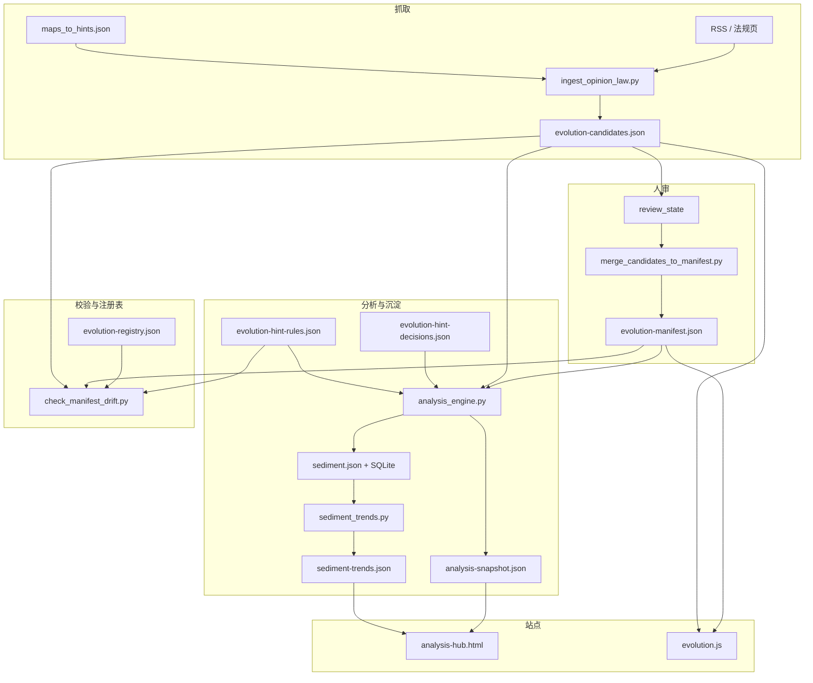
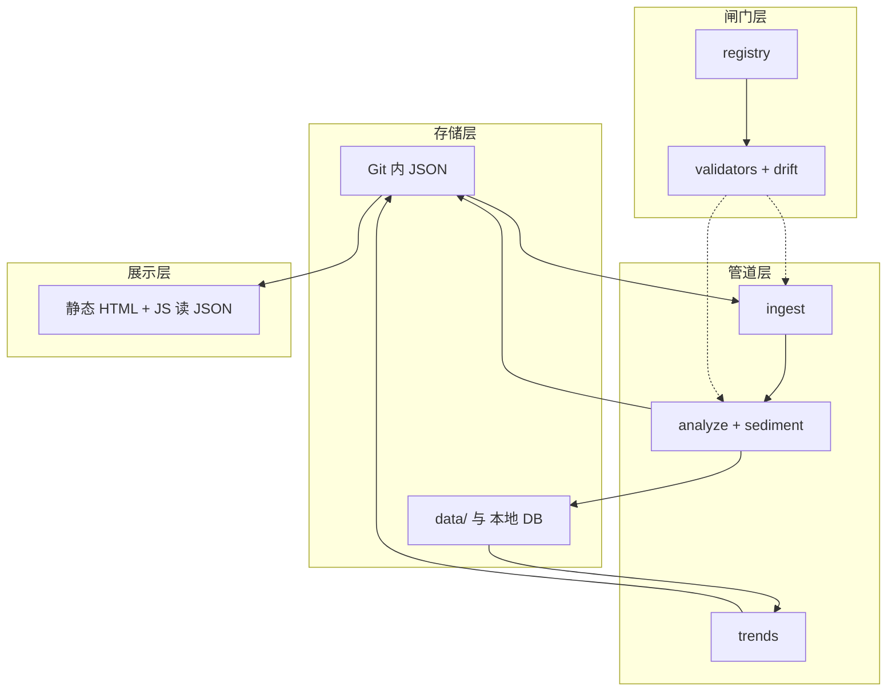

# 仓库架构一览

静态站点 + **可进化数据管道**：人审闸门贯穿 manifest 入库与规则闭环记录。

## 数据流（简图）

## 关键文件

| 路径 | 作用 |
|------|------|
| `scripts/evolution-registry.json` | 允许出现的根目录 HTML、`lab_factors`；与 `lab.js` 因子 id 对齐 |
| `assets/evolution-manifest.json` | 已入库信号 |
| `assets/evolution-candidates.json` | 待审候选 |
| `assets/evolution-hint-decisions.json` | 对规则提示的 done/rejected/deferred；`rule_id` 须 ∈ hint-rules |
| `scripts/evolution-hint-rules.json` | 条件提示 + `track_closure`；驱动 `hint_closure_gaps` |
| `assets/analysis-snapshot.json` | 热力、共现、`evolution_hints`、`hint_closure_gaps` |
| `data/sediment.json` | 按日摘要（含 `hint_closure_gaps_n`、`hint_decisions_total`） |

## 七类能力 → 仓库映射（模块视角）

下列与你关心的「存储 / 沉淀 / 分析 / 内容生成 / 进化 / 汇总 / 展示」一一对照，便于分工与排期。**优化重点**是：**划清边界**（尤其「内容生成」）、**双轨汇总**（当日快照 vs 跨日趋势）、**单一注册表**（registry）贯穿校验。

| 能力 | 含义（本站约定） | 主要载体 | 说明与边界 |
|------|------------------|----------|------------|
| **数据存储** | 可版本化、可校验的结构化事实 | `assets/*.json`、`data/sediment.json`、`data/evolution.db`（本地，gitignore） | 信号库、决策记录、规则配置以 **JSON 为源**；SQLite 为 **加速/查询侧车**，与 JSON 双写。 |
| **沉淀** | 按日追加的「运行痕迹」 | `analysis_engine.py --sediment` → `sediment.json` + `sqlite_store.py` | 与「分析」解耦入口：同一次跑可只写快照不写沉淀；沉淀字段扩展需同步 **import 脚本**与 **trends** 消费方。 |
| **分析** | 在 manifest/候选上算热力、共现、规则提示与闭环缺口 | `analysis_engine.py`、`evolution-hint-rules.json`、`evolution-hint-decisions.json` | **不做**正文生成；输出为 **只读快照** `analysis-snapshot.json`。 |
| **内容生成** | 面向读者的叙事与版式 | 各 `.html` + `assets/lab.js` 等；**结构化线索**来自 `ingest_opinion_law.py` | 本站 **不**把分析引擎当 LLM 用；「生成」= **人写页面** + **脚本写候选 JSON**。若将来接模型，应挂在 [智能进化](../intelligent-evolution.html) 所述插槽，而非混进 `analysis_engine`。 |
| **进化** | 观测如何升格为站内核 | `review_state`、`merge_candidates_to_manifest.py`、`track_closure` / `hint_closure_gaps`、registry | **人审闸门** + **可审计决策 JSON**；进化状态可拆成：候选池 → 正式 manifest → 规则闭环记录。 |
| **汇总** | 把多源合成可扫一眼的结论 | **当日**：`analysis-snapshot.json`；**跨日**：`sediment_trends.py` → `sediment-trends.json`；全站导航/地图：`gen-sitemap.py` | 两轨已分离；避免把「趋势」逻辑塞进快照生成器，反之亦然。 |
| **展示** | 读 JSON 渲染 | `evolution.js`、`analysis.js`、`closure-summary.js`、`lab.html` | 保持 **fetch + 纯展示**；复杂交互集中在少数页（分析枢纽、沙盘、闭环页）。 |

### 分层简图（与数据流正交）

### 可继续优化的方向（按成本）

1. **文档与命名（低成本）**：在 PR / issue 中固定使用上表术语，避免「分析」与「生成」混谈；README 已链到本文。  
2. **契约（中成本）**：为 `analysis-snapshot.json` / `sediment` 条目增加 **schema_version** 字段演进策略（大改时递增 + 校验脚本分支）；当前快照已有 `schema_version`。  
3. **代码分包（高成本，可选）**：将 `scripts/` 拆为 `ingest/`、`analysis/`、`sediment/`、`validate/` 包，**仅**在单测与 import 路径稳定后做；功能上已与上表模块对齐，拆包主要是可维护性。  
4. **内容生成插槽（按需）**：若引入自动生成草稿，单独目录（如 `scripts/draft/`）+ 明确 **不** 自动写 manifest，输出进 `assets/` 或 PR 附件。

## 自动化与仓库写入

- **CI**（`make validate` 同款）：校验 + 单测 + `analysis_engine --check`，**不写**快照。
- **定时 Actions**：ingest / analyze 产出 **artifact**，默认 **不 push**；合并步骤见根目录 [README.md](../README.md)。
- **可选**：`pr-candidates.yml` 手动刷新候选并开 PR。

## 延伸阅读

- 双周节奏：[EVOLUTION_RUNBOOK.md](./EVOLUTION_RUNBOOK.md)
- 脚本命令：[../scripts/README.md](../scripts/README.md)
- 全站**标题 · 三色图例 · TOC · 图形无障碍**三轮对照：[SITE_REVIEW_THREE_PASSES.md](./SITE_REVIEW_THREE_PASSES.md)

### 编辑提示：三色标签 `nexus-tag`

全站共用 CSS 类名 **`evidence` / `extend` / `imagine`**，但**各页 `nexus-legend` 内中文文案可以不同**（如「依据/扩展/想象」与「观测/编码/反哺」）。以**该页 legend 为准**，勿强行统一成同一套三字。
