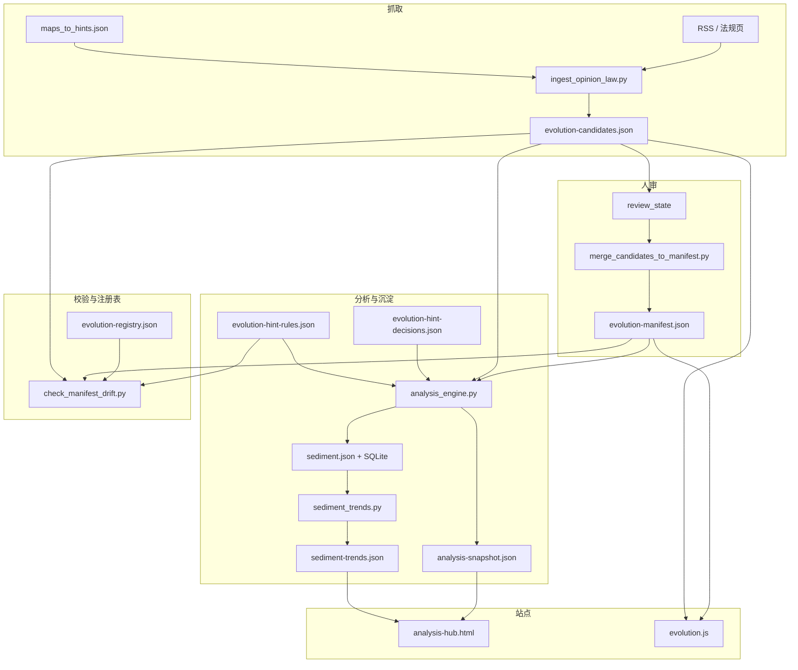

# 仓库架构一览

静态站点 + **可进化数据管道**：人审闸门贯穿 manifest 入库与规则闭环记录。

## 数据流（简图）

## 关键文件

| 路径 | 作用 |
|------|------|
| `scripts/evolution-registry.json` | 允许出现的根目录 HTML、`lab_factors`；与 `lab.js` 因子 id 对齐 |
| `assets/evolution-manifest.json` | 已入库信号 |
| `assets/evolution-candidates.json` | 待审候选 |
| `assets/evolution-hint-decisions.json` | 对规则提示的 done/rejected/deferred；`rule_id` 须 ∈ hint-rules |
| `scripts/evolution-hint-rules.json` | 条件提示 + `track_closure`；驱动 `hint_closure_gaps` |
| `assets/analysis-snapshot.json` | 热力、共现、`evolution_hints`、`hint_closure_gaps` |
| `data/sediment.json` | 按日摘要（含 `hint_closure_gaps_n`、`hint_decisions_total`） |

## 自动化与仓库写入

- **CI**（`make validate` 同款）：校验 + 单测 + `analysis_engine --check`，**不写**快照。
- **定时 Actions**：ingest / analyze 产出 **artifact**，默认 **不 push**；合并步骤见根目录 [README.md](../README.md)。
- **可选**：`pr-candidates.yml` 手动刷新候选并开 PR。

## 延伸阅读

- 双周节奏：[EVOLUTION_RUNBOOK.md](./EVOLUTION_RUNBOOK.md)
- 脚本命令：[../scripts/README.md](../scripts/README.md)
