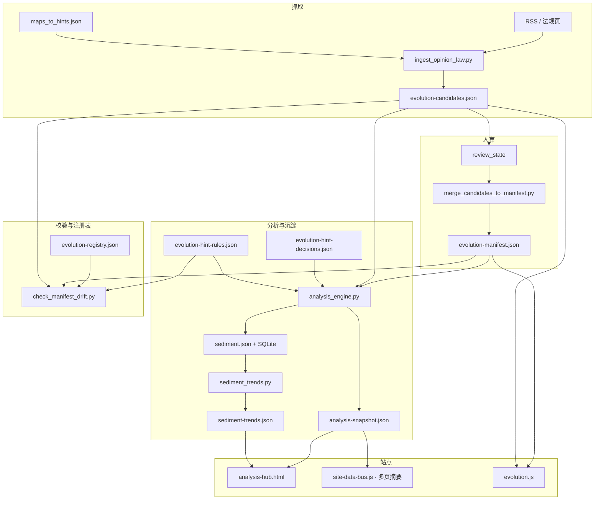
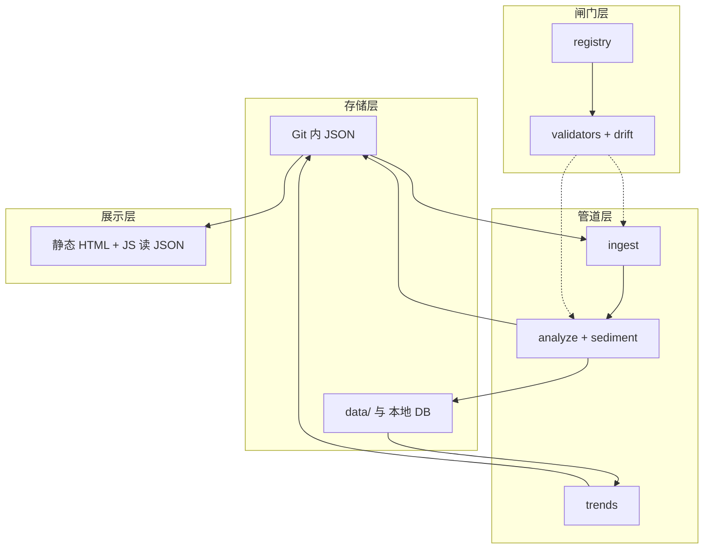

# 仓库架构一览

静态站点 + **可进化数据管道**：人审闸门贯穿 manifest 入库与规则闭环记录。

## 数据流（简图）

## 适应度函数（自动化守护什么）

与「演进式架构」中的 *fitness functions* 同构：下列检查失败即阻断合并或提示修复，避免站内核与展示 silently 漂移。

| 检查 | 守护目标 |
|------|----------|
| `validate-evolution-manifest.py` | 正式信号库结构合法、可消费 |
| `validate-evolution-candidates.py` | 候选池结构合法，避免 ingest 写坏 JSON |
| `validate_evolution_hint_decisions.py` | 决策记录与 `rule_id`、页面白名单一致，可追溯 |
| `check_manifest_drift.py` | **单一注册表**：`maps_to.pages`、`lab_factors`、ingest、sitemap、hint-rules 与真实页面/沙盘因子对齐 |
| `sync_site_nav.py --check` | 顶栏与 partial 一致，避免读者迷路 |
| `scripts/tests` | 分析规则、闭环、diff 提示等回归 |
| `analysis_engine.py --check` | 当日分析逻辑产出结构正确（含 `run` 血缘块） |
| `validate_analysis_snapshot_schema.py` | **已提交** `analysis-snapshot.json` 与 **`docs/schemas/analysis-snapshot.schema.json`** 一致（`jsonschema` Draft 2020-12），避免 hub 读到缺字段旧快照 |
| `scripts/evolution_io.py` | 共享 **`REPO_ROOT`** 与 **`load_json`**，减少各脚本重复定义路径 |

上述检查（外加 `python3 -m compileall -q scripts`）由 **`scripts/run_validate.sh`** 按固定顺序串行执行；**`make validate`**、**`.githooks/pre-commit`** 与 **CI** 的校验 job 均调用该脚本，避免 Makefile / 钩子 / Actions 步骤漂移。运行前需 **`pip install -r requirements.txt`**（见根目录 README）。

## 单次运行血缘（run）

每次执行 `analysis_engine.py` 写入快照时，根级增加 **`run`**：

- **`run_id`**：本次运行的唯一标识（UTC 日期前缀 + 随机十六进制），便于在沉淀与日志中对齐「哪次 analyze」。
- **`repo_revision`**：`git rev-parse --short HEAD`，非 git 环境为 `unknown`。

同一日多次 `analysis_engine.py --sediment` 时，当日 `data/sediment.json` 条目会更新，并带上**最后一次**运行的 `run_id` / `repo_revision`；SQLite `sediment_entry` 同步双写这两列（旧库启动时自动 `ALTER`）。

人读：`make status` 会打印 `run_id` 与 `repo_revision`。

**JSON Schema（文档契约）**：[`docs/schemas/analysis-snapshot.schema.json`](schemas/analysis-snapshot.schema.json)（与 `validate_analysis_snapshot_schema.py` 的必填项一致；大版本演进时同步改 `schema_version` 与校验脚本）。

## 决策与正文的双向追溯

- **机器侧**：`assets/evolution-hint-decisions.json` 每条可含 `rule_id`（对应 `evolution-hint-rules.json`）、`related_pages`、`action`（done / rejected / deferred）。
- **PR / 改文**：建议在描述或正文中引用 **`rule_id`** 或决策条目的 **`id`**，与「对应哪条进化提示 / 哪条信号」一并说明（与 [`.github/pull_request_template.md`](../.github/pull_request_template.md) 自检项一致）。

这样分析页上的 **`hint_closure_gaps`**、快照里的统计与人工改 HTML 能落到同一审计链。

## 关键文件

| 路径 | 作用 |
|------|------|
| `scripts/evolution-registry.json` | 允许出现的根目录 HTML、`lab_factors`；与 `lab.js` 因子 id 对齐 |
| `assets/evolution-manifest.json` | 已入库信号 |
| `assets/evolution-candidates.json` | 待审候选 |
| `assets/evolution-hint-decisions.json` | 对规则提示的 done/rejected/deferred；`rule_id` 须 ∈ hint-rules |
| `scripts/evolution-hint-rules.json` | 条件提示 + `track_closure`；驱动 `hint_closure_gaps` |
| `assets/analysis-snapshot.json` | 热力、共现、`evolution_hints`、`hint_closure_gaps` |
| `data/sediment.json` | 按日摘要（含 `hint_closure_gaps_n`、`hint_decisions_total`） |

## 七类能力 → 仓库映射（模块视角）

下列与你关心的「存储 / 沉淀 / 分析 / 内容生成 / 进化 / 汇总 / 展示」一一对照，便于分工与排期。**优化重点**是：**划清边界**（尤其「内容生成」）、**双轨汇总**（当日快照 vs 跨日趋势）、**单一注册表**（registry）贯穿校验。

| 能力 | 含义（本站约定） | 主要载体 | 说明与边界 |
|------|------------------|----------|------------|
| **数据存储** | 可版本化、可校验的结构化事实 | `assets/*.json`、`data/sediment.json`、`data/evolution.db`（本地，gitignore） | 信号库、决策记录、规则配置以 **JSON 为源**；SQLite 为 **加速/查询侧车**，与 JSON 双写。 |
| **沉淀** | 按日追加的「运行痕迹」 | `analysis_engine.py --sediment` → `sediment.json` + `sqlite_store.py` | 与「分析」解耦入口：同一次跑可只写快照不写沉淀；沉淀字段扩展需同步 **import 脚本**与 **trends** 消费方。 |
| **分析** | 在 manifest/候选上算热力、共现、规则提示与闭环缺口 | `analysis_engine.py`、`evolution-hint-rules.json`、`evolution-hint-decisions.json` | **不做**正文生成；输出为 **只读快照** `analysis-snapshot.json`；与全站方法/演进策略的总说明见站内 **[analysis-hub.html#panorama](../analysis-hub.html#panorama)**。 |
| **内容生成** | 面向读者的叙事与版式 | 各 `.html` + `assets/lab.js` 等；**结构化线索**来自 `ingest_opinion_law.py` | 本站 **不**把分析引擎当 LLM 用；「生成」= **人写页面** + **脚本写候选 JSON**。若将来接模型，应挂在 [智能进化](../intelligent-evolution.html) 所述插槽，而非混进 `analysis_engine`。 |
| **进化** | 观测如何升格为站内核 | `review_state`、`merge_candidates_to_manifest.py`、`track_closure` / `hint_closure_gaps`、registry | **人审闸门** + **可审计决策 JSON**；进化状态可拆成：候选池 → 正式 manifest → 规则闭环记录。 |
| **汇总** | 把多源合成可扫一眼的结论 | **当日**：`analysis-snapshot.json`；**跨日**：`sediment_trends.py` → `sediment-trends.json`；全站导航/地图：`gen-sitemap.py` | 两轨已分离；避免把「趋势」逻辑塞进快照生成器，反之亦然。 |
| **展示** | 读 JSON 渲染 | `evolution.js`、`analysis.js`、`closure-summary.js`、`site-data-bus.js`、`lab.html` | 保持 **fetch + 纯展示**；复杂交互集中在少数页（分析枢纽、沙盘、闭环页）；**总线**供多页挂载同一快照摘要，见 [SITE_DATA_UPDATE_FRAMEWORK.md](./SITE_DATA_UPDATE_FRAMEWORK.md)。 |

### 全站读数与 `site-data-bus`

- **`assets/site-data-bus.js`**：`loadSnapshot` / `loadTrends`（带内存缓存）、`mountLiveStrip`，并在 DOMContentLoaded 时自动挂载所有 **`[data-site-data-live]`** 占位。
- **与 `analysis.js` 分工**：仪表盘全量可视化仍在 **`analysis-hub.html`**；其余页用总线挂**一行读数**。枢纽页本身亦挂 **`snapshot-only`** 读数条，且 **`analysis.js` 与总线共用** `loadSnapshot` / `loadTrends` 缓存，避免重复 `fetch`。
- **「自动更新」含义**：JSON 随流水线提交后，读者刷新即可看到新数；**不**由引擎改写 HTML 正文。完整消费方登记表与扩展步骤见 **[SITE_DATA_UPDATE_FRAMEWORK.md](./SITE_DATA_UPDATE_FRAMEWORK.md)**。

### 分层简图（与数据流正交）

### 可继续优化的方向（按成本）

1. **文档与命名（低成本）**：在 PR / issue 中固定使用上表术语，避免「分析」与「生成」混谈；README 已链到本文。  
2. **契约（中成本）**：快照已有 `schema_version`；**已增加** `run` 血缘与 `docs/schemas/analysis-snapshot.schema.json` + `validate_analysis_snapshot_schema.py`。`sediment` 条目可选带 `run_id` / `repo_revision`（与 `--sediment` 同跑 analyze 时写入）。大改时递增 `schema_version` 并同步校验脚本。  
3. **代码分包（高成本，可选）**：将 `scripts/` 拆为 `ingest/`、`analysis/`、`sediment/`、`validate/` 包，**仅**在单测与 import 路径稳定后做；功能上已与上表模块对齐，拆包主要是可维护性。  
4. **内容生成插槽（按需）**：若引入自动生成草稿，单独目录（如 `scripts/draft/`）+ 明确 **不** 自动写 manifest，输出进 `assets/` 或 PR 附件。

## 自动化与仓库写入

- **CI**（`make validate` 同款）：校验 + 单测 + `analysis_engine --check`，**不写**快照。
- **定时 Actions**：ingest / analyze 产出 **artifact**，默认 **不 push**；合并步骤见根目录 [README.md](../README.md)。
- **可选**：`pr-candidates.yml` 手动刷新候选并开 PR。

## 延伸阅读

- **技术栈 + 可实现功能 + 进化能力（总览一篇）**：[TECH_ARCHITECTURE_CAPABILITIES.md](./TECH_ARCHITECTURE_CAPABILITIES.md)
- **数据与分析如何驱动全站模块与内容更新**：[DATA_ANALYSIS_SITE_CONTENT_SYNC.md](./DATA_ANALYSIS_SITE_CONTENT_SYNC.md)
- **全站梳理 + 重新推演 + 更新落点（一轮操作手册）**：[SITE_WIDE_RERUN_DEDUCTION_PLAYBOOK.md](./SITE_WIDE_RERUN_DEDUCTION_PLAYBOOK.md)
- 全站推演读数如何随数据/分析引擎更新：[SITE_DATA_UPDATE_FRAMEWORK.md](./SITE_DATA_UPDATE_FRAMEWORK.md)
- 适应度函数与血缘：[§ 适应度函数](#fitness-functions)、[§ 单次运行血缘](#lineage)、[§ 决策追溯](#decision-traceability)
- 推演策略与质量控制（与站内综合推演 / 三问互补）：[DEDUCTION_STRATEGY.md](./DEDUCTION_STRATEGY.md)
- 研究方法与工程资产对照：[RESEARCH_METHODS_MAP.md](./RESEARCH_METHODS_MAP.md)
- 双周节奏：[EVOLUTION_RUNBOOK.md](./EVOLUTION_RUNBOOK.md)
- 脚本命令：[../scripts/README.md](../scripts/README.md)
- 全站**标题 · 三色图例 · TOC · 图形无障碍**三轮对照：[SITE_REVIEW_THREE_PASSES.md](./SITE_REVIEW_THREE_PASSES.md)

### 编辑提示：三色标签 `nexus-tag`

全站共用 CSS 类名 **`evidence` / `extend` / `imagine`**，但**各页 `nexus-legend` 内中文文案可以不同**（如「依据/扩展/想象」与「观测/编码/反哺」）。以**该页 legend 为准**，勿强行统一成同一套三字。
