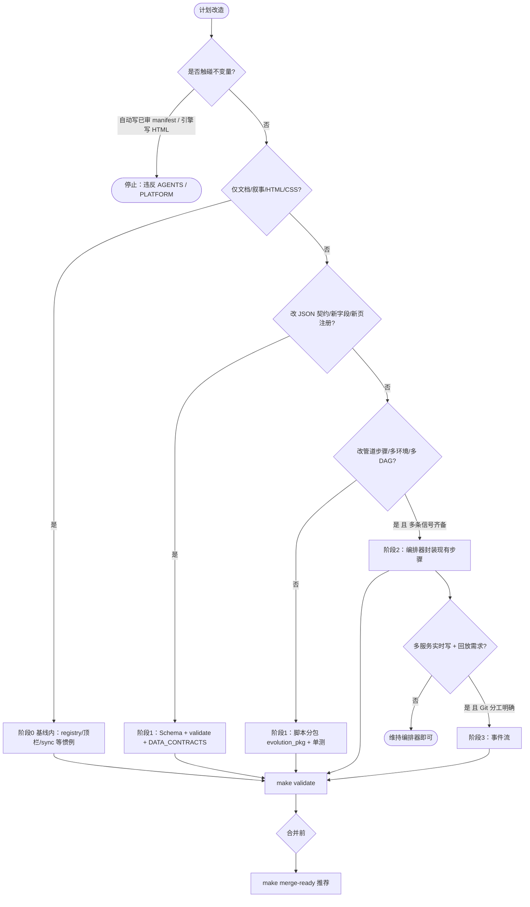

# 架构升级路线图：可落地改造全景与依据

**角色判型**（读者 / 贡献 / 数据 / 部署 → 第一站）：根 [README · 产品视角](../README.md#pm-four-journeys) · [README · 从这里开始](../README.md#readme-start-here) · [README · 双轨真源](../README.md#readme-dual-track-map)。**架构师梳理与持续改进**：[ARCHITECTURE_ONE_PAGER · 五步表](./ARCHITECTURE_ONE_PAGER.md#architect-stewardship) · [不变量索引](./ARCHITECTURE_ONE_PAGER.md#architect-invariants-index) · [PR 证据三联](../CONTRIBUTING.md#contributing-pr-evidence-triad)。

本文在仓库**已有原则与阶段定义**之上，给出**按域可执行**的改造清单、**决策全景图**与**验收门禁**，便于排期、拆 PR、对齐 **`make validate` / `make merge-ready`**。  
**不是**采购清单；**不**放宽「人审 manifest」「分析不写 HTML」等不变量。

**同一迭代内如何拆 PR、提前挂骨架、边调试边补**：**[INCREMENTAL_BUILD_PLAYBOOK.md](./INCREMENTAL_BUILD_PLAYBOOK.md)**。**整体内容框架**：**[docs/README · #content-framework](./README.md#content-framework)** · **前后台模块一页表**：[**#front-back-modules**](./README.md#front-back-modules) · **组件×功能一条表**：[**#system-components-fusion**](./README.md#system-components-fusion)。**按本轮改动判型**（主线 **0c**）：**[docs/README · #quick-paths](./README.md#quick-paths)**。**自动化助手（不变量 · 合并前）**：[AGENTS.md · 人审闸门](../AGENTS.md#agents-invariants) · [架构边界](../AGENTS.md#agents-arch-boundary) · [合并前](../AGENTS.md#agents-pre-merge)。**呈现双轨（`spa-sync` / `spa-build`）**：[MERGE · §1](./MERGE_AND_RELEASE_CHECKLIST.md#pre-merge) · [MERGE · partials 手顺](./MERGE_AND_RELEASE_CHECKLIST.md#pre-merge-partials-sequence) · [关系视图](../maintainer-hub.html#mh-spine-map)。**MPA 顶栏与失页**：**`partials/`** → **`make sync-nav`**；**`404.html`** 手调（`sync_site_nav` 不写回）— **[scripts/README · `sync_site_nav`](../scripts/README.md)**。

**依据真源**（论证与反模式仍以这些为准）：

- **模块级全量梳理与升级对表**（七类能力、`evolution_pkg`、脚本簇）：**[MODULE_INVENTORY_AND_ARCHITECTURE_UPGRADE_MATRIX.md](./MODULE_INVENTORY_AND_ARCHITECTURE_UPGRADE_MATRIX.md)**（**[七类→包/脚本速查 · §1a](./MODULE_INVENTORY_AND_ARCHITECTURE_UPGRADE_MATRIX.md#seven-class-pkg-quick)**）  
- 不变量与阶段 0—3：**[ARCHITECTURE_UPGRADE_AND_EXTENSIONS.md](./ARCHITECTURE_UPGRADE_AND_EXTENSIONS.md)**  
- 五维总索引：**[PROJECT_ARCHITECTURE_OVERVIEW.md](./PROJECT_ARCHITECTURE_OVERVIEW.md)**（**[勿混粒度 · 五维/六域/七类](./PROJECT_ARCHITECTURE_OVERVIEW.md#architecture-grain)**；**[§1a 主链联动与验证](./PROJECT_ARCHITECTURE_OVERVIEW.md#module-linkage-validation)** · **[§1b 仓库物理分层](./PROJECT_ARCHITECTURE_OVERVIEW.md#physical-layout)**）  
- 六域协同与 PR 打点：**[INTELLIGENCE_SIX_DOMAINS.md](./INTELLIGENCE_SIX_DOMAINS.md)**（含 **[§6 PR 自检](./INTELLIGENCE_SIX_DOMAINS.md#pr-checklist)**）  
- 插槽与新增能力检查单：**[PLATFORM_EXTENSIBILITY_AND_EVOLUTION.md](./PLATFORM_EXTENSIBILITY_AND_EVOLUTION.md)**  
- 编排器 / 消息队列何时上：**[ORCHESTRATION_AND_EVENT_STREAMING.md](./ORCHESTRATION_AND_EVENT_STREAMING.md)**  
- 命令与脚本入口：**[scripts/README.md](../scripts/README.md)** · **`run_validate.sh`**

**目录**：[1. 决策全景图](#upgrade-panorama) · [2. 分域矩阵](#domain-action-matrix) · [3. 分阶段执行卡](#phased-playbook) · [4. 推荐顺序](#recommended-sequence) · [5. 验收门禁](#acceptance-gates) · [6. 延伸阅读](#link-index)。**按阶段打勾**：[PHASED · 落地执行](./PHASED_UPGRADE_EXECUTION_GUIDE.md#execution-now) · **总表与调用**：[PLATFORM_MASTER_MAP](./PLATFORM_MASTER_MAP_AND_INVOCATION.md)。

---

## 1. 升级决策全景图（先判阶段，再选域）

**读图要点**：

- **默认**落在 **阶段 0—1**（GitHub Actions + `make validate` + 契约硬化）；**阶段 2/3** 仅在 **[UPGRADE · §2.3—2.4](./ARCHITECTURE_UPGRADE_AND_EXTENSIONS.md#upgrade-tiers)** 与 **ORCHESTRATION** 所述**信号**齐备时进入。  
- 任意改造结束，**最低验收**为 **`make validate`**；合并前推荐 **`make merge-ready`**。

---

## 2. 分域改造矩阵（意图 → 动作 → 验收）

| 域（六域） | 典型改造意图 | 建议落地动作 | 验收 / 文档 |
|------------|--------------|--------------|-------------|
| **数据** | 新 JSON、改字段、新注册页 | 先 **Schema** → 校验脚本 → **`run_validate.sh`** 串联；更新 **DATA_CONTRACTS** | **`make validate`**；**`make test`** 含 registry Schema |
| **数据** | 单一注册表扩展 | 改 **`evolution-registry.json`** + **Schema**；若 SPA：**`nav.config.json`** + **`make gen-nav-links`** | **`check_manifest_drift`**、**`check_nav_links_registry`**（均在 validate） |
| **管道** | 新抓取源、改 ingest 配方 | 候选校验 + drift；**不写 manifest**；遥测可选 **`evolution_pkg.pipeline`** | **`make validate`**；ingest 相关单测 |
| **分析** | 新规则、新统计块 | 改 **`analysis_engine`** / hint-rules；快照 **`schema_version`**；消费者同步 | **`analysis_engine --check`**（validate 内）；沉淀/趋势 Schema |
| **前端** | 新读数、新总线占位 | **[SITE_DATA_UPDATE_FRAMEWORK](./SITE_DATA_UPDATE_FRAMEWORK.md)** 登记；HTML 只 **fetch** 已提交 JSON | **`make validate`**；按需 **`make spa-build`**（触 CI 路径时） |
| **前端** | 全站顶栏、skip-bar、失页 | 只改 **`partials/site-nav.inc.html`** / **`partials/skip-bar.inc.html`** → **`make sync-nav`**；**`404.html`** 顶栏/skip **手调**（**不在** **`sync_site_nav`** 写回） | **[MERGE · §1](./MERGE_AND_RELEASE_CHECKLIST.md#pre-merge)** · **[MERGE · partials 手顺](./MERGE_AND_RELEASE_CHECKLIST.md#pre-merge-partials-sequence)** · **`make validate`**（**`sync_site_nav --check`**、**`check_skip_bar_404`**） |
| **前端** | 新 SPA 路由 | **nav.config ≡ registry.pages** | **`check_nav_links_registry`** + **`make spa-build`** |
| **运维** | 只读 API 新路由 | **`readonly_api.py`** + **INTEGRATION**；**ETag** 语义对齐 **`evolution_pkg.ops`** | **`make test-readonly-api`**；**`make merge-ready`** |
| **运维** | 管理端能力 | **`admin-console/`**；**不写 manifest**；Compose 见 **DOCKER**；单页 UI **[ADMIN_CONSOLE · §7](./ADMIN_CONSOLE_FRAMEWORK_OVERVIEW.md#admin-module-plan)** | **`make test-admin-console`**；**`make merge-ready`** |
| **治理** | 审核流、分端 | **USER_ADMIN_SPLIT**、**ADMIN_WEB_CONSOLE_ROADMAP**；PR 与脚本 merge，**无静默写库** | **CONTRIBUTING** + **MERGE 清单** |

与 **[INTELLIGENCE · §6 PR 自检](./INTELLIGENCE_SIX_DOMAINS.md#pr-checklist)** 合并使用：改 PR 描述里标明**触及哪些域**。

---

## 3. 分阶段执行卡（可拆成迭代 / PR）

**逐步升级时**可优先打开 **[PHASED_UPGRADE_EXECUTION_GUIDE.md](./PHASED_UPGRADE_EXECUTION_GUIDE.md)**（阶段关系图、各阶段准入/验收、单迭代模板）；本节为**检查清单原文**，两处保持同步。

### 3.1 阶段 0 — 维持默认栈（长期基线）

- [ ] 合并前 **`make validate`**；推荐 **`make merge-ready`**。  
- [ ] 事实与审计仍以 **Git + PR** 为主；artifact **人工合并**主分支。  
- [ ] 不引入编排器 / broker，除非已走完 **§1 全景图** 中阶段 2/3 门槛自检。

### 3.2 阶段 1 — 站内增强（**优先耗尽本阶段再考虑 2/3**）

- [ ] **契约**：新/大改结构化 JSON → **递增 `schema_version`**，同步 **`docs/schemas/*.schema.json`** 与校验脚本。  
- [ ] **分包**：新逻辑优先进 **`evolution_pkg.*`**；根 **`scripts/*.py`** 保持薄 CLI；**`evolution_pkg.domains`** 登记新子模块。  
- [ ] **双轨**：任何 **registry** 变更同步 **SPA nav**（**`make gen-nav-links`**）。**MPA 顶栏**：改 **`partials/`** → **`make sync-nav`**；**`404.html`** 手调 — [MERGE · §1](./MERGE_AND_RELEASE_CHECKLIST.md#pre-merge) · [MERGE · partials 手顺](./MERGE_AND_RELEASE_CHECKLIST.md#pre-merge-partials-sequence)。  
- [ ] **只读 API**：新 **GET** 端点只读磁盘 JSON；扩展说明 **INTEGRATION · 扩展只读路由**。  
- [ ] **可观测**：沿用 **`make status`**、**`artifacts/pipeline-metrics-*.json`**；需要再加告警。  
- [ ] **管理端**：按 **ADMIN_WEB_CONSOLE_ROADMAP** 渐进；**不**把写 manifest 放进只读栈。

### 3.3 阶段 2 — 编排器（**信号齐备**后）

- [ ] 已确认存在：**多条 DAG**、**分区回填**、**多环境参数矩阵**、**强运行历史 UI** 等**多条**业务信号（见 **ORCHESTRATION §2**、**UPGRADE §2.3**）。  
- [ ] 用 **Prefect / Dagster** **封装已有** Python 步骤；**编排器不写 manifest**。  
- [ ] 合并后仍 **`make validate`** 为契约真源；编排部署不替代 **registry/Schema** 闸门。

### 3.4 阶段 3 — 事件流（**高门槛**）

- [ ] **多服务实时写**、**多订阅**、**回放** 且与 **Git 主事实源**分工**书面**约定（见 **ORCHESTRATION §3—§5**）。  
- [ ] **禁止**用 broker **替代** Git PR 作**唯一**审计源（**UPGRADE §4 反模式**）。

---

## 4. 推荐改造顺序（同一季度内叠代时）

1. **统一语言**：维护者扫 **PROJECT_ARCHITECTURE_OVERVIEW** + 本文 §1 图 + **INTELLIGENCE §6**。  
2. **契约先行**：任何数据模型变更 **Schema 先于代码**。  
3. **闸门绿色**：本地 **`make validate`** 全绿后再扩功能面。  
4. **registry / nav**：动页面注册则 **drift + navLinks** 同一 PR。  
5. **只读面扩展**：API / admin-console 与 **INTEGRATION / DOCKER** 同步文档。  
6. **再评估 2/3**：无 **§3.3—3.4** 信号则**维持阶段 1**。

---

## 5. 验收门禁（改造完成定义）

| 门禁 | 命令或等价 |
|------|------------|
| 全仓库闸门 | **`make validate`** |
| 合并前推荐 | **`make merge-ready`** |
| 快速回归（不替代 validate） | **`make test`** |
| SPA 变更或 CI 将跑 spa-build | **`make spa-build`** |
| 增能自检 | **[PLATFORM_CAPABILITY_MAP §6](./PLATFORM_CAPABILITY_MAP.md#enhance-checklist)** · **[PLATFORM_EXTENSIBILITY 检查单](./PLATFORM_EXTENSIBILITY_AND_EVOLUTION.md#new-capability-checklist)** |

---

## 6. 延伸阅读（与本文并列阅读）

| 主题 | 文档 |
|------|------|
| **按阶段升级（执行指南）** | [PHASED_UPGRADE_EXECUTION_GUIDE.md](./PHASED_UPGRADE_EXECUTION_GUIDE.md) |
| **模块全量梳理 · 升级矩阵**（七类 × 脚本簇 × `evolution_pkg` × 阶段 0—3） | [MODULE_INVENTORY_AND_ARCHITECTURE_UPGRADE_MATRIX.md](./MODULE_INVENTORY_AND_ARCHITECTURE_UPGRADE_MATRIX.md) |
| 增量构建 · 组件顺序 · 调试闭环 · PR 模板 | [INCREMENTAL_BUILD_PLAYBOOK.md](./INCREMENTAL_BUILD_PLAYBOOK.md) · [templates/incremental-pr-slice.md](./templates/incremental-pr-slice.md) |
| 一页技术分层 + backlog（简版 **§1—§4**；详版分层表 / 能力地图） | [TECH_ARCHITECTURE_AND_UPGRADE_BRIEF.md](./TECH_ARCHITECTURE_AND_UPGRADE_BRIEF.md) · **[附录](./TECH_ARCHITECTURE_AND_UPGRADE_BRIEF.md#appendix-tech-capabilities)**（[别名](./TECH_ARCHITECTURE_CAPABILITIES.md)） |
| 三架构对照 | [ARCHITECTURE_ONE_PAGER.md](./ARCHITECTURE_ONE_PAGER.md#three-architectures) |
| 数据流细图 | [ARCHITECTURE.md](./ARCHITECTURE.md) |
| 字段与主键 | [DATA_CONTRACTS.md](./DATA_CONTRACTS.md) |
| 合并与发布动线 | [MERGE_AND_RELEASE_CHECKLIST.md](./MERGE_AND_RELEASE_CHECKLIST.md#pre-merge) · [MERGE · partials 手顺](./MERGE_AND_RELEASE_CHECKLIST.md#pre-merge-partials-sequence) |
| 文档主线表 | [docs/README.md · #docs-spine](./README.md#docs-spine) |

---

*随主分支演进；阶段定义变更时同步更新 **ARCHITECTURE_UPGRADE_AND_EXTENSIONS** 与本文 §3—§4，避免两套门槛。*
