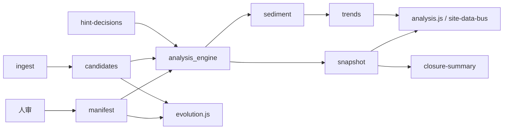

# 数据与分析 · 驱动全站内容与模块更新（总览）

**角色判型**（读者 / 贡献 / 数据 / 部署 → 第一站）：根 [README · 产品视角](../README.md#pm-four-journeys) · [README · 从这里开始](../README.md#readme-start-here) · [README · 双轨真源](../README.md#readme-dual-track-map)。**架构师梳理与持续改进**：[ARCHITECTURE_ONE_PAGER · 五步表](./ARCHITECTURE_ONE_PAGER.md#architect-stewardship) · [不变量索引](./ARCHITECTURE_ONE_PAGER.md#architect-invariants-index) · [开 PR 前速览](../CONTRIBUTING.md#contributing-five-minute) · [PR 证据三联](../CONTRIBUTING.md#contributing-pr-evidence-triad) · [动手→命令速查](../CONTRIBUTING.md#contributing-change-to-command)。

本文说明：**结构化数据**与**分析引擎产出**如何作用于站内「**模块**」（分页、沙盘因子、注册表页）与「**内容**」（读者可见的叙事与动态块），以及**哪些会随 JSON 自动变、哪些必须人改**。与 [SITE_DATA_UPDATE_FRAMEWORK.md](./SITE_DATA_UPDATE_FRAMEWORK.md)（偏 fetch/总线）、[TECH_ARCHITECTURE_AND_UPGRADE_BRIEF.md · 附录](./TECH_ARCHITECTURE_AND_UPGRADE_BRIEF.md#appendix-tech-capabilities)（偏技术栈与能力地图；[别名](./TECH_ARCHITECTURE_CAPABILITIES.md)）互补。**三架构**中横跨**技术**（管道与 JSON）与**内容**（模块/叙事/动态块）——总览 **[ARCHITECTURE_ONE_PAGER · 三架构对照](./ARCHITECTURE_ONE_PAGER.md#three-architectures)**。**主链联动 · 仓库物理分层**：**[勿混粒度 · 五维/六域/七类](./PROJECT_ARCHITECTURE_OVERVIEW.md#architecture-grain)** · [PROJECT_ARCHITECTURE_OVERVIEW · §1a](./PROJECT_ARCHITECTURE_OVERVIEW.md#module-linkage-validation) · **[§1b](./PROJECT_ARCHITECTURE_OVERVIEW.md#physical-layout)**。**整体内容框架**：**[docs/README · #content-framework](./README.md#content-framework)** · **前后台模块一页表**：[**#front-back-modules**](./README.md#front-back-modules) · **组件×功能一条表**：[**#system-components-fusion**](./README.md#system-components-fusion)。**按改动判型**（**0c**）：**[docs/README · #quick-paths](./README.md#quick-paths)**。**MPA 维护枢纽 · 关系视图**（枢纽页 ↔ 注册表 ↔ 文档锚点；与 **ingest · 管理端 · SPA** 合一判型同表）：[maintainer-hub.html#mh-spine-map](../maintainer-hub.html#mh-spine-map)。**与文档索引的收束段落对读**：[docs/README · 内容驱动链](./README.md#content-driven-chain)。

**自动化助手（分析管道 vs 叙事 HTML · manifest 人审）**：[AGENTS.md · 架构边界](../AGENTS.md#agents-arch-boundary) · [人审闸门](../AGENTS.md#agents-invariants)。

下表「读者可见」均指**浏览器里刷新即可对齐 JSON** 的呈现面；**改 JSON 语义、跑 ingest、merge manifest** 等仍属 **[管理端（后端侧）](./USER_ADMIN_SPLIT_AND_EVOLUTION_DESIGN.md#reader-frontend-admin-backend)**，不在正文里「一键写库」。

**舆情 / 制度 / 国情**：线索入池、人审节奏与信源分层见 **[INTEL_AND_POLICY_TRACKING_PLAYBOOK.md](./INTEL_AND_POLICY_TRACKING_PLAYBOOK.md)**（**[§2—2a](./INTEL_AND_POLICY_TRACKING_PLAYBOOK.md#intel-source-tiers)** · **[§2b](./INTEL_AND_POLICY_TRACKING_PLAYBOOK.md#intel-social-platforms)**；与 ingest→候选→manifest→下表动态块衔接；**不**替代本文矩阵与 Schema）。

**纯 CSS 首屏版式**（导读栈、pill 目录、命令卡组合等）见 **[INTELLIGENCE_SIX_DOMAINS · §2.2](./INTELLIGENCE_SIX_DOMAINS.md#reader-layout-contract)**：与 **`site-data-bus.js`** 并行，**不改变**下表「是否随数据/分析自动变」列。**拆 PR / 写描述**时区分「版式抛光」与「数据/读数契约扩展」，见 **[INTELLIGENCE · 进化与优化](./INTELLIGENCE_SIX_DOMAINS.md#evolution-and-optimization)**。

## 1. 用语

| 词 | 本站含义 |
|----|-----------|
| **模块** | 以**独立 HTML 页**为主的站内单元（与 [模块图谱](../modules-map.html) 五系七层、 [综合推演 §1](../synthesis.html#inventory) 模块表一致）；另含 **`lab.js` 沙盘因子**（`lab_factors`）。 |
| **内容** | **静态**：各页正文、表、图、TOC——存于 `.html`；**动态**：由 JS `fetch` JSON 写入的区块（信号栏、仪表盘、读数条、闭环摘要等）。 |
| **数据** | 以 Git 内 JSON 为真源：`evolution-manifest.json`、`evolution-candidates.json`、`evolution-hint-decisions.json`、`analysis-snapshot.json`、`sediment-trends.json` 等。 |
| **分析** | `analysis_engine.py`（当日结构）+ `sediment_trends.py`（跨日）；**不**生成 HTML 段落。 |

## 2. 更新方式总矩阵（数据 / 分析 → 内容与模块）

| 读者可见形态 | 是否随数据/分析**自动**变 | 依赖的数据或脚本 | 说明 |
|--------------|---------------------------|------------------|------|
| **各页叙事正文、§ 配方表行、静态 callout** | 否 | — | 人编辑 HTML；可与 `rule_id` / 信号 `id` 在 PR 里对账 |
| **进化信号栏（manifest + 候选）** | 是（刷新后） | `evolution-manifest.json`、`evolution-candidates.json` | `evolution.js`：闭环页、战略·舆情、沙盘页等 |
| **沙盘因子高亮** | 是 | 同上 + `maps_to.lab_factors` | `evolution.js` + `lab.js`；噪声候选不参与 |
| **分析枢纽全页仪表盘** | 是 | `analysis-snapshot.json`、`sediment-trends.json` | `analysis.js`：热力、共现、趋势、聚合解读等 |
| **全站读数条（一行摘要）** | 是 | 同上 + 可选仅快照 | `site-data-bus.js`，registry 内根目录页均已挂载（含 `legacy-all-in-one.html`）；**`evolution-loop.html`**、**`lab.html`** 保留 trends **fetch**；**其余**为 **`snapshot-only`**（不另请求 `sediment-trends.json`）；**`analysis-hub.html`** 条带为 `snapshot-only`，仪表盘仍由 **`analysis.js`** 拉 trends；**`analysis.js`** 复用 **`SiteDataBus`** 快照缓存 |
| **进化闭环页 · 闭环摘要卡片** | 是 | 快照 + 决策等 | `closure-summary.js` |
| **站点顶栏 / skip-bar** | 否（除非跑 `sync-nav`） | `partials/*.inc.html` | 与数据管道**解耦**；增页须改 registry + partial；**`maintainer-hub.html`** 五链后三锚由 **`build_skip_bar`** 生成（勿手改 HTML） |
| **sitemap 优先级** | 否（须跑脚本） | `gen-sitemap.py` + registry | 与 manifest `pages` 对账见 `check_manifest_drift` |

**结论**：**自动更新**主要指 **JSON 提交 + 读者刷新** 后，**动态区块**与**统计读数**对齐新数据；**模块体量与叙事深度**仍靠 **人**维护 HTML 与综合推演结构。

## 3. 模块（分页）如何被数据「挂接」

信号条目中的 **`maps_to.pages`** 将线索挂到**允许范围内的**根目录 HTML（见 **`scripts/evolution-registry.json`**）。效果包括：

1. **热力**：`analysis_engine` 按页聚合 `module_heat`，出现在 `analysis-snapshot.json` 与仪表盘。  
2. **读者动线**：分析页上的提示对象可带 `target_pages`（与规则/hint 配置一致时）。  
3. **沙盘**：`maps_to.lab_factors` 须在 registry 的 **`lab_factors`** 与 **`assets/lab.js`** 中均有定义，高亮才一致。

**新增一页「可被信号指向」的模块**时至少：

- 将页面路径加入 **`evolution-registry.json` → `pages`**，文件真实存在；  
- 需要进顶栏时改 **`partials/site-nav.inc.html`**（及 skip-bar 如需）并 **`make sync-nav`**；**`maintainer-hub.html`** 在五链后再由 **`build_skip_bar`** 拼三页内锚，勿手改 HTML；**`404.html`** 顶栏/skip **不在** `sync_site_nav` 写回范围，改 **`skip-bar.inc.html`** 或影响失页顶栏时须**手调** **404** — [MERGE · §1](./MERGE_AND_RELEASE_CHECKLIST.md#pre-merge) · [MERGE · partials 手顺](./MERGE_AND_RELEASE_CHECKLIST.md#pre-merge-partials-sequence)。  
- 跑 **`make validate`**（对账脚本会查 registry / ingest / sitemap 等）。

详见 [ARCHITECTURE.md · 单一注册表](./ARCHITECTURE.md#fitness-functions)。

## 4. 推荐传播链（从数据到全站感知）

1. **ingest** → 更新候选（或 Actions artifact / PR）。  
2. **人审** → `review_state`、`merge_candidates_to_manifest`（仅闸门内 id）。  
3. **analyze** → `make analyze` 或 **`make evolution-fast`**（须先 validate，见 [EVOLUTION_RUNBOOK](./EVOLUTION_RUNBOOK.md#accelerate)）。  
4. **validate** → **`make validate`** → **git commit & push**。  
5. 读者打开任意挂载页 → **动态内容与模块读数**与最新 JSON 一致。

## 5. 维护者速查（改数据后全站是否「对齐」）

| 若你刚做了… | 建议再检查 |
|-------------|------------|
| 新增/改了 `maps_to.pages` | `evolution-registry.json`、页面是否存在、`make validate` |
| 新增/改了 `lab_factors` | 与 `lab.js` id **集合一致**、registry `lab_factors` |
| 合并了 manifest 或大批候选 | `make analyze`（或 `evolution-fast`）+ 打开 **analysis-hub**、**lab** 看热力与高亮 |
| 写了 `evolution-hint-decisions` | 闭环页、`analysis-snapshot.sources.hint_decisions`、缺口条数 |
| 只改静态正文 | 无需跑分析；若回应某条 hint，PR 中引用 `rule_id` / 决策 `id` |

## 6. 边界（避免误解）

- **分析不会**根据热力**自动修改**综合推演 §6/§7 表或十年场景正文；是否升格为「站内核叙事」由 **§11 迭代 + 人**决定。  
- **热力偏高**仅表示「当前库内映射计数」，**不等于**政策优先级或民意强度；判据见 [DEDUCTION_STRATEGY.md](./DEDUCTION_STRATEGY.md)、[synthesis §2](../synthesis.html#criteria)。  
- **定时 CI** 默认只产 artifact；线上站点与 Git 对齐仍依赖 **合并 JSON 后 push**（根目录 README）。

## 7. 延伸阅读

| 主题 | 文档 / 页面 |
|------|-------------|
| fetch 总线与占位扩展 | [SITE_DATA_UPDATE_FRAMEWORK.md](./SITE_DATA_UPDATE_FRAMEWORK.md) |
| 技术栈与能力清单 | [TECH_ARCHITECTURE_AND_UPGRADE_BRIEF.md · 附录](./TECH_ARCHITECTURE_AND_UPGRADE_BRIEF.md#appendix-tech-capabilities)（[别名](./TECH_ARCHITECTURE_CAPABILITIES.md)） |
| 数据流与七类模块 | [ARCHITECTURE.md](./ARCHITECTURE.md) |
| 双周节奏与命令 | [EVOLUTION_RUNBOOK.md](./EVOLUTION_RUNBOOK.md) |
| 五系七层与分页导航 | [modules-map.html](../modules-map.html)、[synthesis §1](../synthesis.html#inventory) |
| 方法与字段总线 | [analysis-hub.html#panorama](../analysis-hub.html#panorama) |
| 全站梳理后如何重新推演并决定更新落点 | [SITE_WIDE_RERUN_DEDUCTION_PLAYBOOK.md](./SITE_WIDE_RERUN_DEDUCTION_PLAYBOOK.md) |
