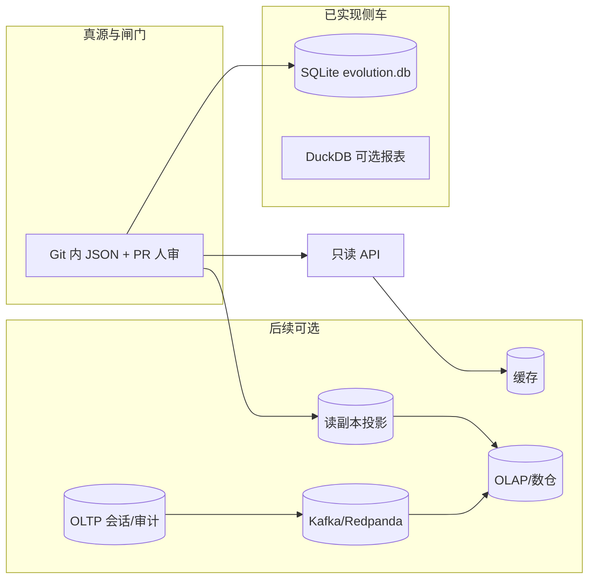

# 数据存储组件与后续架构设计（与 Git 真源 · 编排 · 事件流衔接）

**角色判型**（读者 / 贡献 / 数据 / 部署 → 第一站）：根 [README · 产品视角](../README.md#pm-four-journeys) · [README · 从这里开始](../README.md#readme-start-here) · [README · 双轨真源](../README.md#readme-dual-track-map)。**架构师梳理与持续改进**：[ARCHITECTURE_ONE_PAGER · 五步表](./ARCHITECTURE_ONE_PAGER.md#architect-stewardship) · [不变量索引](./ARCHITECTURE_ONE_PAGER.md#architect-invariants-index) · [PR 证据三联](../CONTRIBUTING.md#contributing-pr-evidence-triad)。

本文与 **[DATA_CONTRACTS.md · §5](./DATA_CONTRACTS.md#存储策略哪些适合写入数据库与架构预期对齐)**（当前哪些数据进 SQLite；**[侧车表列速查](./DATA_CONTRACTS.md#sqlite-sidecar-column-inventory)**）、**[ARCHITECTURE_UPGRADE_AND_EXTENSIONS.md](./ARCHITECTURE_UPGRADE_AND_EXTENSIONS.md)**（阶段 0—3）、**[ORCHESTRATION_AND_EVENT_STREAMING.md](./ORCHESTRATION_AND_EVENT_STREAMING.md)**（编排器与 Kafka/Redpanda）对齐，专门回答：**在已有 Git JSON + 侧车 SQLite 的前提下，何时、以何顺序引入服务器级数据库、缓存、分析库与 CDC**，以及它们与 **Kafka 生态**如何拼成一张**后续整体架构**图。

**定性设计说明**，非固定采购清单；落地前须结合团队规模、合规与运维能力。**五维总图 · 主链联动 · 仓库物理分层**（数据层升级与脚本/资产目录对读）：**[勿混粒度 · 五维/六域/七类](./PROJECT_ARCHITECTURE_OVERVIEW.md#architecture-grain)** · [PROJECT_ARCHITECTURE_OVERVIEW · §1a](./PROJECT_ARCHITECTURE_OVERVIEW.md#module-linkage-validation) · **[§1b](./PROJECT_ARCHITECTURE_OVERVIEW.md#physical-layout)**。**整体内容框架**：**[docs/README · #content-framework](./README.md#content-framework)** · **前后台模块一页表**：[**#front-back-modules**](./README.md#front-back-modules) · **组件×功能一条表**：[**#system-components-fusion**](./README.md#system-components-fusion)。**按改动判型**（**0c**）：**[docs/README · #quick-paths](./README.md#quick-paths)**。**自动化助手（Git JSON 真源 · 勿拆 validate）**：[AGENTS.md · 人审闸门](../AGENTS.md#agents-invariants) · [契约速览](../AGENTS.md#agents-contract) · [合并前](../AGENTS.md#agents-pre-merge)。**呈现双轨（`spa-sync` / `spa-build`）**：[MERGE · §1](./MERGE_AND_RELEASE_CHECKLIST.md#pre-merge) · [MERGE · partials 手顺](./MERGE_AND_RELEASE_CHECKLIST.md#pre-merge-partials-sequence) · [关系视图](../maintainer-hub.html#mh-spine-map)。**MPA 顶栏模板（`partials/`）**：**`make sync-nav`** 写回各注册页；**`404.html`** 顶栏/skip **不在** **`sync_site_nav`** 写回范围，须**手调** — **[scripts/README · `sync_site_nav`](../scripts/README.md)**。

**目录**：[1. 现状](#current-layers) · [2. 可选组件](#future-components) · [3. 阶段排期](#integration-order) · [4. Kafka/CDC](#kafka-cdc) · [5. 编排器](#orchestrator-db) · [6. 反模式](#anti-patterns) · [7. 延伸阅读](#reading)。**Kafka PoC**：[DOCKER · §4a](./DOCKER.md#kafka-dev-overlay) · **编排/事件流**：[ORCHESTRATION](./ORCHESTRATION_AND_EVENT_STREAMING.md)。

---

## 1. 现状：仓库内「数据层」已有什么

| 层级 | 载体 | 职责 | 与闸门关系 |
|------|------|------|------------|
| **契约真源** | **`assets/*.json`**、**`data/sediment.json`**、**`scripts/evolution-registry.json`** 等 | 可 diff、可 Schema 校验、人审与 CI 对账 | **`make validate`** 以 Git 内已提交文件为准 |
| **分析侧车** | **`data/evolution.db`**（SQLite，通常 **`.gitignore`**） | **`sediment_entry`** 与沉淀双写；**`analysis_snapshot_history`** 追加快照 JSON | **可丢可重建**；**不**替代 HEAD 快照与 manifest 闸门 |
| **即席分析** | **DuckDB**（**`requirements-analytics.txt`**）· **`query_evolution_duckdb.py`** | 对导出数据或库文件做 SQL/报表 | 可选工具；**不进**默认 CI |
| **对外只读** | **`readonly_api.py`** | 读**磁盘**已提交 JSON | **不写** manifest；CORS/鉴权在网关 |

**不变量**（与 **[ARCHITECTURE_UPGRADE · §1](./ARCHITECTURE_UPGRADE_AND_EXTENSIONS.md#adaptation)** 一致）：**演进契约类 JSON（注册表、manifest、候选、规则、人审决策）不以数据库为唯一真源**；自动化**不**默认覆盖已审 **`evolution-manifest.json`**。

---

## 2. 后续可选组件：各管什么

下列组件**按需引入**；多数场景**永远不需要**全集。

| 组件 | 典型职责 | 与本站主链的关系 |
|------|----------|------------------|
| **OLTP 关系库**（PostgreSQL / MySQL 等） | 会话、账户与 RBAC、**运营审计日志**、工作流状态机、**幂等游标**（ingest/同步 job） | **运营态与多用户**；**不**承接「manifest 唯一副本」 |
| **读副本 / 物化视图** | 把**已发布**快照、沉淀、趋势等 **JSON 的投影**写入库，供复杂查询或 BI | 缩短只读 API 路径延迟；**仍以 Git 提交 + Schema 为权威**，库可全量重算 |
| **缓存**（Redis / Memcached 等） | 热点 JSON 片段、**速率限制**、短期会话 | **可丢**；与真源解耦 |
| **搜索索引**（OpenSearch / Elasticsearch 等） | 全文检索叙事页、文档、Issue 链外内容 | 索引为**派生**；正文真源仍是 **`.html` / Git** |
| **OLAP / 数仓**（ClickHouse、Snowflake、BigQuery、Lakehouse 等） | 跨期报表、漏斗、与外部业务表关联 | 消费 **批量导出** 或 **CDC 事件** |
| **向量库**（pgvector、专用向量引擎等） | 检索增强（RAG）、相似候选聚类 | **可选**；与 **[scripts/draft/README.md](../scripts/draft/README.md)** 等草稿插槽同哲学——**不**自动写闸门 JSON |
| **Kafka / Redpanda** | 多服务异步、回放、与 **Connect** 对接外部系统 | 见 **[ORCHESTRATION · §3](./ORCHESTRATION_AND_EVENT_STREAMING.md#3-事件流kafka-vs-redpanda)**；**禁止**替代 Git 作唯一审计源 |

---

## 3. 与「阶段 0—3」的关系：怎么排期

**阶段编号**仍以 **[ARCHITECTURE_UPGRADE · §2](./ARCHITECTURE_UPGRADE_AND_EXTENSIONS.md#upgrade-tiers)** 为准；**数据组件升级与阶段 2（编排）、阶段 3（事件流）正交**——可**并行规划文档**，但**落地顺序**建议按**信号**而非按名词热度。

| 建议顺序（典型） | 内容 | 说明 |
|------------------|------|------|
| **0—1** | 巩固 **JSON Schema**、**`make validate`**、**只读 API**、**SQLite 侧车**、可选 **DuckDB** | 未吃透前不必上服务器库 |
| **1 延伸** | 若 **只读 API** QPS/延迟吃紧：加 **缓存** 或 **读副本投影**（从已提交 JSON 批量灌库） | 仍不写 manifest |
| **多用户 / 管理端深化** | **[ADMIN_WEB_CONSOLE_ROADMAP](./ADMIN_WEB_CONSOLE_ROADMAP.md)** 若进入登录、RBAC、审计：引入 **OLTP** 存会话与审计 | 与 **admin-console** 同节奏评估 |
| **阶段 2** | **Prefect / Dagster** 封装管道步骤；运行元数据可落库（可选） | **编排器不写 manifest**（见 ORCHESTRATION） |
| **阶段 3** | **Kafka/Redpanda** 仅在多服务实时写、多订阅、回放信号下引入 | 本地 PoC：**[DOCKER · §4a](./DOCKER.md#kafka-dev-overlay)** |
| **CDC / 数仓** | **OLTP 稳定**且要把**行变更**或**集成边界**暴露给下游时：**Kafka Connect**、**Debezium** 等 | 通常**晚于**明确 OLTP 边界，**可与阶段 3 同轮设计** |

---

## 4. 与 Kafka 生态的衔接（Connect / CDC）

- **Kafka Connect** 适合把 **数据库**、**对象存储**、**SaaS** 与 **主题**互联；其中 **CDC（Change Data Capture）** 常用于把 **OLTP 行级变更** 流式送到下游（实时数仓、搜索索引、反欺诈等）。
- **与本站分工**：**演进闸门数据**仍以 **Git** 为准；CDC 更适合 **运营系统自己的表**（用户、审计、任务状态）或 **你明确规定的「已发布投影表」**，而不是把 **manifest 源表** 当唯一真相。
- **组件速查**仍见 **[ORCHESTRATION · §3.3](./ORCHESTRATION_AND_EVENT_STREAMING.md#33-kafka-生态常见组件引入顺序建议)**。

---

## 5. 与编排器的关系

- 编排器（**Prefect / Dagster**）需要 **状态后端**（元数据 DB）时，使用其**官方推荐**的 PostgreSQL 等即可；这是**编排产品内部状态**，与业务 **OLTP** 可同机或分库，**权限隔离**建议提前做好。
- **管道业务数据**：优先继续以 **artifact + Git JSON** 表达；若要把「每次运行的指标」从 **`pipeline-metrics` 文件** 迁到 **时序库/表**，视为**可观测性增强**，单独契约，**不**与 manifest 混为一谈。

---

## 6. 反模式

- 以 **数据库** 或 **Kafka** 为 **manifest / 注册表** 的**唯一**存储，削弱 **PR diff 与人审**。
- **无 OLTP 边界、无多服务写入信号** 时同时上 **Kafka 集群 + 数仓 + 多副本**（运维成本远大于收益）。
- **CDC 全库广播** 而不做 **主题/schema 治理**，下游与 **Git 契约** 漂移无法对账。

---

## 7. 延伸阅读

- 当前字段与 **SQLite 表**：[DATA_CONTRACTS.md](./DATA_CONTRACTS.md) · [EVOLUTION_RUNBOOK · SQLite](./EVOLUTION_RUNBOOK.md#sqlite-sidecar)
- 阶段 0—3 与扩展矩阵：[ARCHITECTURE_UPGRADE_AND_EXTENSIONS.md](./ARCHITECTURE_UPGRADE_AND_EXTENSIONS.md)
- 升级简表 + backlog + **技术栈详版**：[TECH_ARCHITECTURE_AND_UPGRADE_BRIEF.md](./TECH_ARCHITECTURE_AND_UPGRADE_BRIEF.md)（**§1—§4**）· **[附录](./TECH_ARCHITECTURE_AND_UPGRADE_BRIEF.md#appendix-tech-capabilities)**（[别名](./TECH_ARCHITECTURE_CAPABILITIES.md)）
- 编排与 Kafka：[ORCHESTRATION_AND_EVENT_STREAMING.md](./ORCHESTRATION_AND_EVENT_STREAMING.md)
- 管理端与会话/审计走向：[ADMIN_WEB_CONSOLE_ROADMAP.md](./ADMIN_WEB_CONSOLE_ROADMAP.md)
- 增量引入顺序：[INCREMENTAL_BUILD_PLAYBOOK.md](./INCREMENTAL_BUILD_PLAYBOOK.md)
- 本地 Kafka PoC：[DOCKER.md · §4a](./DOCKER.md#kafka-dev-overlay)

---

*随主分支演进；若默认栈增加「正式环境 OLTP」或固定 CDC 拓扑，请同步更新本文与 **[ARCHITECTURE_UPGRADE_AND_EXTENSIONS.md](./ARCHITECTURE_UPGRADE_AND_EXTENSIONS.md)**。*
