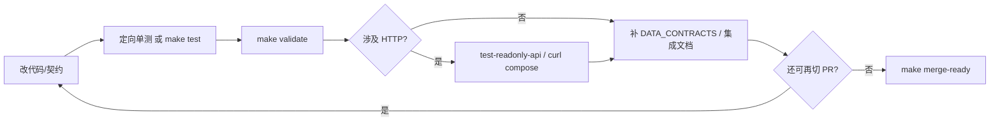

# 增量构建与调试 Playbook：提前接组件、边跑边补

**角色判型**（读者 / 贡献 / 数据 / 部署 → 第一站）：根 [README · 产品视角](../README.md#pm-four-journeys) · [README · 从这里开始](../README.md#readme-start-here) · [README · 双轨真源](../README.md#readme-dual-track-map)。**架构师梳理与持续改进**：[ARCHITECTURE_ONE_PAGER · 五步表](./ARCHITECTURE_ONE_PAGER.md#architect-stewardship) · [不变量索引](./ARCHITECTURE_ONE_PAGER.md#architect-invariants-index) · [开 PR 前速览](../CONTRIBUTING.md#contributing-five-minute) · [PR 证据三联](../CONTRIBUTING.md#contributing-pr-evidence-triad) · [动手→命令速查](../CONTRIBUTING.md#contributing-change-to-command)。

本文与 **[ARCHITECTURE_UPGRADE_ROADMAP](./ARCHITECTURE_UPGRADE_ROADMAP.md)**（全景与分域矩阵）、**[PHASED_UPGRADE_EXECUTION_GUIDE](./PHASED_UPGRADE_EXECUTION_GUIDE.md)**（阶段 0→1→2/3 与 **2.5** 执行顺序）、**[INTELLIGENCE_SIX_DOMAINS · PR 自检](./INTELLIGENCE_SIX_DOMAINS.md#pr-checklist)**（纯版式/CSS 改枢纽 **`.html`** 时另见 **[§2.2](./INTELLIGENCE_SIX_DOMAINS.md#reader-layout-contract)**）配套：专注**如何把大方案拆成可合并的小步**，并**尽早挂上可观测、可校验的「骨架」**，在 **`make validate` 始终绿色**的前提下迭代补全。**整体内容框架**：**[docs/README · #content-framework](./README.md#content-framework)** · **前后台模块一页表**：[**#front-back-modules**](./README.md#front-back-modules) · **组件×功能一条表**：[**#system-components-fusion**](./README.md#system-components-fusion)。**按改动判型**（**0c**）：**[docs/README · #quick-paths](./README.md#quick-paths)**。**改根 `.html` 且带 SPA 壳时**：**`make spa-sync`** / **`spa-build`** 与 [MERGE · §1](./MERGE_AND_RELEASE_CHECKLIST.md#pre-merge) · [MERGE · partials 手顺](./MERGE_AND_RELEASE_CHECKLIST.md#pre-merge-partials-sequence) · [关系视图](../maintainer-hub.html#mh-spine-map) 对表。**改 `partials/` 全站顶栏或 skip-bar**：**`make sync-nav`**；**`maintainer-hub.html`** 五链后三锚由 **`build_skip_bar`** 生成（勿手改 HTML）；**`404.html`** 顶栏/skip **不在** **`sync_site_nav`** 写回范围，须**手调**（**[scripts/README · #sync-site-nav-source](../scripts/README.md#sync-site-nav-source)**）。**自动化助手（拆 PR 仍须合并前闸门）**：[AGENTS.md · 合并前](../AGENTS.md#agents-pre-merge) · [框架判型](../AGENTS.md#agents-content-framework)。

**不适用**：试图绕过人审写 **manifest**、让 **analysis_engine** 写 **HTML**、或一次 PR 同时改契约 + 十页叙事 + 编排器（见 **[UPGRADE · 反模式](./ARCHITECTURE_UPGRADE_AND_EXTENSIONS.md#anti-patterns)**）。

---

<a id="principles"></a>

## 1. 四条原则（提前引入什么）

| 原则 | 做法 | 反面 |
|------|------|------|
| **契约先于实现** | 新 JSON：先 **Schema 草稿 + 最小样例** + 校验脚本入口（可先 `skip` 未落盘文件），再写生产者 | 先写脚本再补 Schema，导致漂移难收 |
| **只读与健康先于写** | 新服务：先 **`/health`**、**OpenAPI**、**只读 GET** 或 **503 明确语义**，再接业务 | 一上来做大表单写库 |
| **闸门内小步合并** | 每个 PR 结束态 **`make validate` 必过**；需要长分支时用 **feature 环境变量** 关断未完成路径 | 长期分支堆到「大爆炸」合并 |
| **调试闭环固定** | 改代码 → **`make test`** 或定向单测 → **`make validate`** →（触 Docker 时）**`compose` + `curl`** → 再扩功能 | 只手动点浏览器、不跑脚本闸门 |

---

<a id="component-order"></a>

## 2. 推荐「组件提前引入」顺序（本仓库对表）

下列顺序**越靠前越应先落地**；同一域内可并行 PR，但不要跳过「上一格的验收」。

| 序 | 组件 / 能力 | 最小可合并切片（骨架） | 调试与补全 |
|----|-------------|------------------------|------------|
| A | **数据契约** | `docs/schemas/*.schema.json` 草案 + **`validate_*.py`** 在 **`run_validate.sh`** 中占位（无文件则 skip 若已有先例） | 补字段后跑 **`make validate`**；更 **[DATA_CONTRACTS](./DATA_CONTRACTS.md)** |
| B | **注册表 / 导航** | 仅 **`evolution-registry.json`** + **Schema**；若影响 SPA：**`nav.config.json`** + **`make gen-nav-links`** | **`check_manifest_drift`**、**`check_nav_links_registry`** |
| C | **`evolution_pkg` 子模块** | 新目录 + **空/薄 API** + **`domains.SUBMODULE_DOMAIN`** 登记 + **`test_evolution_pkg`** 绿 | 再迁入业务逻辑；保持根 **`scripts/*.py`** 薄 CLI |
| D | **只读 API** | **`evolution_pkg.readonly_disk_routes`**（磁盘 **GET**）或 **`readonly_api.py`** 特判 + **ETag** 与 **`evolution_pkg.ops`** 一致 + **`test_readonly*.py`**（与 E 同 PR 亦可） | **[INTEGRATION](./INTEGRATION_AND_READONLY_API.md#extend-readonly-routes)** |
| E | **管理端同源代理** | **`READONLY_PROXY_SEGMENTS`** + 路由 + **`test_smoke`**；与 D 同步时 **`test_readonly_proxy_segment_sync`** 须绿 | **[ADMIN_WEB_CONSOLE_ROADMAP · §8](./ADMIN_WEB_CONSOLE_ROADMAP.md#scaffold-implementation)** |
| F | **管道一步** | **`evolution_pkg.pipeline`** 或脚本**单步**可单独跑 + 遥测可选 | **`make analyze`** / **`evolution-fast`** 文档对齐 **[EVOLUTION_RUNBOOK](./EVOLUTION_RUNBOOK.md)** |
| G | **分析语义** | **`analysis_engine`** 小改 + **`--check`** + 快照 **schema_version** 评估 | 沉淀/趋势消费者同步 |
| H | **前端读数** | **`site-data-bus.js`** 或页内 **fetch** 只读已提交 JSON + **SITE_DATA_UPDATE_FRAMEWORK** 登记 | 浏览器 Network + **`make validate`**；若本 PR **仅**动 **`assets/site.css`** 或根 **`.html` 版式骨架**，按 **[INTELLIGENCE · §2.2](./INTELLIGENCE_SIX_DOMAINS.md#reader-layout-contract)** 与总线步骤分列，不必假造总线登记 |
| I | **Docker / Compose** | **Dockerfile** + **healthcheck** + **profile**；默认 **`COMPOSE_BAKE`/`DOCKER_BUILDKIT`** 见 **[DOCKER](./DOCKER.md)** | **`make docker-up-stack`**、**`curl` /health** |
| J | **编排器 / 消息队列** | **仅**在 **[ROADMAP · §3.3—3.4](./ARCHITECTURE_UPGRADE_ROADMAP.md#phased-playbook)** 信号齐备后单独立项；Kafka 协议 PoC 可先起 **`docker-compose.kafka-dev.yml`**（**`make docker-up-kafka-dev`**），对照 **[ORCHESTRATION · §3.3—3.4](./ORCHESTRATION_AND_EVENT_STREAMING.md#33-kafka-生态常见组件引入顺序建议)** | **[ORCHESTRATION](./ORCHESTRATION_AND_EVENT_STREAMING.md)** · **[DOCKER · §4a](./DOCKER.md#kafka-dev-overlay)** |
| K | **服务器级数据库 / 缓存 / 读扩展** | **多用户会话、运营审计、API 投影、OLAP** 等信号齐备后再立项 schema 与迁移；**先于或并行**设计 **Kafka Connect/CDC** 时对照 **[DATA_STORES](./DATA_STORES_AND_FUTURE_DB_ARCHITECTURE.md)**；**不**以库为 manifest 唯一真源 | **[DATA_STORES](./DATA_STORES_AND_FUTURE_DB_ARCHITECTURE.md)** · **[DATA_CONTRACTS · §5](./DATA_CONTRACTS.md#存储策略哪些适合写入数据库与架构预期对齐)** · **[ORCHESTRATION · §3.3](./ORCHESTRATION_AND_EVENT_STREAMING.md#33-kafka-生态常见组件引入顺序建议)** |

---

<a id="debug-loop"></a>

## 3. 边调试边补全：固定闭环



**命令速查**：

- 全闸门：**`make validate`**  
- 合并前：**`make merge-ready`**  
- 快速：**`make test`**（不替代 validate）  
- 只读 API：**`make test-readonly-api`**  
- 管理端：**`make test-admin-console`**（单页 UI 真源 **[ADMIN_CONSOLE · §7](./ADMIN_CONSOLE_FRAMEWORK_OVERVIEW.md#admin-module-plan)**）  
- SPA 构建：**`make spa-build`**（改 registry/nav/sync 输入时）

---

<a id="repo-hooks"></a>

## 4. 本仓库「提前挂钩」锚点（复制路径用）

| 用途 | 路径或入口 |
|------|------------|
| 校验总线 | **`scripts/run_validate.sh`** |
| 六域包归属 | **`scripts/evolution_pkg/domains.py`** |
| HTTP 缓存 / 304 | **`scripts/evolution_pkg/ops/`**（**`http_cache`**） |
| 只读 API | **`scripts/readonly_api.py`** |
| 管理端脚手架 | **`admin-console/app/main.py`**、**`settings.py`** |
| 草稿插槽（不写 manifest） | **`scripts/draft/README.md`** |
| PR 描述自检 | **[`.github/pull_request_template.md`](../.github/pull_request_template.md)** |

---

<a id="pr-slice-template"></a>

## 5. PR 切片模板（粘贴到 PR 描述）

```markdown
## 域（INTELLIGENCE §6）
- [ ] 数据  [ ] 管道  [ ] 分析  [ ] 前端  [ ] 运维  [ ] 治理

## 本 PR 骨架（已完成）
- [ ] Schema / validate 入口
- [ ] 单测或 smoke
- [ ] 文档（DATA_CONTRACTS / INTEGRATION / DOCKER 择一）

## 故意延后（后续 PR）
- …

## 验证
- [ ] make validate
- [ ] （可选）make merge-ready
```

完整合并清单仍见 **[MERGE_AND_RELEASE_CHECKLIST](./MERGE_AND_RELEASE_CHECKLIST.md#pre-merge)** · **[MERGE · partials 手顺](./MERGE_AND_RELEASE_CHECKLIST.md#pre-merge-partials-sequence)**。若本轮动 **`partials/`**（顶栏 / skip-bar）：**`make sync-nav`**；**`maintainer-hub.html`** 五链后三页内锚由 **`scripts/sync_site_nav.py` · `build_skip_bar`** 生成（**勿**在 HTML 手改），约定见 **[scripts/README.md · sync-site-nav-source](../scripts/README.md#sync-site-nav-source)**（与 **MERGE §1**、**AGENTS** 双轨一致）。

---

<a id="relation-to-roadmap"></a>

## 6. 与其它文档的关系

| 文档 | 关系 |
|------|------|
| **[ARCHITECTURE_UPGRADE_ROADMAP](./ARCHITECTURE_UPGRADE_ROADMAP.md)** | **选阶段、选域**；本文是**在同一阶段内如何拆步与调试** |
| **[PROJECT_ARCHITECTURE_OVERVIEW](./PROJECT_ARCHITECTURE_OVERVIEW.md)** | 五维总索引；**[勿混粒度 · 五维/六域/七类](./PROJECT_ARCHITECTURE_OVERVIEW.md#architecture-grain)** · **[§1a 主链联动与验证](./PROJECT_ARCHITECTURE_OVERVIEW.md#module-linkage-validation)** · **[§1b 仓库物理分层](./PROJECT_ARCHITECTURE_OVERVIEW.md#physical-layout)**（跨层拆 PR 前先对表） |
| **[PLATFORM_EXTENSIBILITY](./PLATFORM_EXTENSIBILITY_AND_EVOLUTION.md)** | 插槽与**新增能力检查单**（与 §5 PR 模板合并使用） |
| **[INTELLIGENCE_SIX_DOMAINS · §2.2](./INTELLIGENCE_SIX_DOMAINS.md#reader-layout-contract)** | 枢纽 MPA **CSS/HTML 模块契约**；与 **[ARCHITECTURE · 展示 / 总线](./ARCHITECTURE.md#site-data-bus)** 对读 |

---

*随主分支演进；新增「本仓库级」脚手架目录时，请更新 §4 表。*
