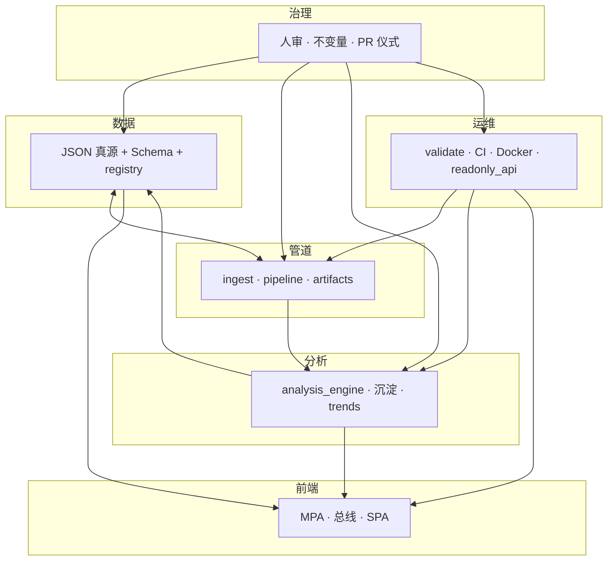

# 智能化：从单点脚本到六域协同

本文把站内**「智能化 / 可演进自动化」**从「又多了一个 `scripts/*.py`」的**单点叙事**，升级为**六域分工 + 协同接口**的目标架构，便于排期、PR 描述与扩展审计。与 **[PLATFORM_EXTENSIBILITY_AND_EVOLUTION.md](./PLATFORM_EXTENSIBILITY_AND_EVOLUTION.md#automation-and-evolution)** 的边界说明一致；**不改变**现有人审闸门、manifest 真源与 **`make validate`** 语义。

**角色判型**（读者 / 贡献 / 数据 / 部署 → 第一站）：根 [README · 产品视角](../README.md#pm-four-journeys) · [README · 从这里开始](../README.md#readme-start-here) · [README · 双轨真源](../README.md#readme-dual-track-map)。

**架构师梳理与持续改进**：[ARCHITECTURE_ONE_PAGER · 五步表](./ARCHITECTURE_ONE_PAGER.md#architect-stewardship) · [不变量索引](./ARCHITECTURE_ONE_PAGER.md#architect-invariants-index) · [开 PR 前速览](../CONTRIBUTING.md#contributing-five-minute) · [PR 证据三联](../CONTRIBUTING.md#contributing-pr-evidence-triad) · [动手→命令速查](../CONTRIBUTING.md#contributing-change-to-command)。

**文首阅读顺序（自上而下）**：① **[进化与优化](#evolution-and-optimization)**（不断进化 / 不断优化）② **[持续分析优化](#continuous-analysis-optimization)**（每轮先判型）③ **[持续的优化](#sustained-optimization)**（含 **[#ongoing-optimization](#ongoing-optimization)**，发版后仍执行清单）④ **[持续的升级](#sustained-upgrade)**（阶段 0—3 节律）⑤ 枢纽版式契约 **[§2.2](#reader-layout-contract)**。**速查·外链**：**[勿混粒度 · 五维/六域/七类](./PROJECT_ARCHITECTURE_OVERVIEW.md#architecture-grain)** · 工程七类 **[ARCHITECTURE · 七类](./ARCHITECTURE.md#seven-layers)** · 插槽 **[PLATFORM · §2](./PLATFORM_EXTENSIBILITY_AND_EVOLUTION.md#extension-slots)** · 四轨 **[§3](./PLATFORM_EXTENSIBILITY_AND_EVOLUTION.md#evolution-tracks)** · **主链与物理分层** · **[§1a 主链联动与验证](./PROJECT_ARCHITECTURE_OVERVIEW.md#module-linkage-validation)** · **[§1b 仓库物理分层](./PROJECT_ARCHITECTURE_OVERVIEW.md#physical-layout)** · 判型最短链 **[docs/README · #quick-paths](./README.md#quick-paths)** · **AI 与「自动进化」收束** **[docs/README · #ai-assisted-evolution](./README.md#ai-assisted-evolution)**。

**不断进化（在本站的含义）**：不是堆功能，而是在 **[不变量](./PLATFORM_EXTENSIBILITY_AND_EVOLUTION.md#invariants)** 内**小步、可 diff、可回滚**地变好——**契约与数据**走 Schema、闸门与 **[SITE_DATA_UPDATE_FRAMEWORK](./SITE_DATA_UPDATE_FRAMEWORK.md)** 登记；**枢纽读感与版式**走 **[§2.2](#reader-layout-contract)** 与呈现复查（如 **[SITE_REVIEW · §3.5](./SITE_REVIEW_THREE_PASSES.md#section-3-5-lead-readhint)** · **[AGENTS · 读者惯例](../AGENTS.md#agents-reader-conventions)** · **[枢纽首屏](../AGENTS.md#agents-hub-lead)**）。两条线可**并行推进**，但**不要**把纯版式改动伪装成总线或 JSON 契约变更（与 **[AGENTS · 架构边界](../AGENTS.md#agents-arch-boundary)** 分工一致）。

**不断优化（在本站的含义）**：在**域划分与真源语义基本不变**的前提下，减摩擦、提可读、收文档与闸门对齐——多用 **[PLATFORM_CAPABILITY_MAP · §6](./PLATFORM_CAPABILITY_MAP.md#enhance-checklist)**（增能检查单）· **[§7](./PLATFORM_CAPABILITY_MAP.md#reader-and-release)**（读者预期与发布复查）、**[SITE_REVIEW_THREE_PASSES](./SITE_REVIEW_THREE_PASSES.md)**（标题 · 图例 · TOC · 四角色）、**[MERGE_AND_RELEASE_CHECKLIST](./MERGE_AND_RELEASE_CHECKLIST.md#pre-merge)** · **[MERGE · partials 手顺](./MERGE_AND_RELEASE_CHECKLIST.md#pre-merge-partials-sequence)**、**[CONTRIBUTING · 阅读顺序](../CONTRIBUTING.md#maintainer-reading-order)** 与 **[INCREMENTAL_BUILD_PLAYBOOK](./INCREMENTAL_BUILD_PLAYBOOK.md)**（拆步与 **`make validate` 绿**）；**版式抛光**仍只对照 **[§2.2](#reader-layout-contract)**。**与「进化」分工**：优化优先走**清单与互链**闭环；若触及新 JSON 形态、新管道步骤或新消费方，才落入**进化**（须 Schema / 登记 / 域声明）。

**持续分析优化（日常习惯）**：每一小轮先**读表**——**[DATA_ANALYSIS_SITE_CONTENT_SYNC](./DATA_ANALYSIS_SITE_CONTENT_SYNC.md)**（模块/叙事 vs 动态块）与 **[DATA_CONTRACTS](./DATA_CONTRACTS.md)**（字段/主键/谁消费谁）；再**定性**本轮属于 **[进化与优化](#evolution-and-optimization)** 哪一侧或是否需**拆 PR**；最后以 **`make validate` 绿**与 **[§6 PR 自检](#pr-checklist)** 收束。避免「只改文案却牵动快照语义」或「动引擎却忘了登记总线」的交叉污染。**跨多目录**时再对 **[勿混粒度 · 五维/六域/七类](./PROJECT_ARCHITECTURE_OVERVIEW.md#architecture-grain)** · **[§1a 主链联动与验证](./PROJECT_ARCHITECTURE_OVERVIEW.md#module-linkage-validation)** · **[§1b 仓库物理分层](./PROJECT_ARCHITECTURE_OVERVIEW.md#physical-layout)**。若本轮触及**阶段 2/3 准入**或路线图重排，另对表 **[#sustained-upgrade](#sustained-upgrade)**。

**持续的优化**（口语常说 **「持续的进行优化」**，二者**同指**）：在上文 **不断优化** 之上**固定节律**并**反复执行**（跑清单、开 PR、补互链）——不是「发版即停」或仅「知道该优化」，而是合并或大版本后仍建议抽样 **[PLATFORM · §6](./PLATFORM_CAPABILITY_MAP.md#enhance-checklist)** · **[§7](./PLATFORM_CAPABILITY_MAP.md#reader-and-release)** 与 **[SITE_REVIEW](./SITE_REVIEW_THREE_PASSES.md)**；**[文档主线](./README.md#docs-spine)**、**[CONTRIBUTING](../CONTRIBUTING.md#contributing-env-and-cmd)**、**[开 PR 前速览](../CONTRIBUTING.md#contributing-five-minute)** 或 **[PR 模板](../.github/pull_request_template.md)** 若有结构增删，回查是否需更新 **[§2.2](#reader-layout-contract)** 互链与 **[进化与优化](#evolution-and-optimization)** 对读。与**上一节「持续分析优化」**接力：先判型与 **`make validate`**，本节侧重**发版后仍要跑完的清单与互链**。

**持续的升级**：把 **[ARCHITECTURE_UPGRADE · 阶段 0—3](./ARCHITECTURE_UPGRADE_AND_EXTENSIONS.md#upgrade-tiers)** 与 **[按阶段升级执行指南](./PHASED_UPGRADE_EXECUTION_GUIDE.md)**（**[落地执行](./PHASED_UPGRADE_EXECUTION_GUIDE.md#execution-now)**）当作**反复校准的节拍**，不是「一次立项永不过期」——定期对照 **[ARCHITECTURE_UPGRADE_ROADMAP](./ARCHITECTURE_UPGRADE_ROADMAP.md)** 与 **[模块升级矩阵](./MODULE_INVENTORY_AND_ARCHITECTURE_UPGRADE_MATRIX.md)**，按准入推迟或重启 **阶段 2/3**（编排、服务器库、CDC 等）；落地 PR 仍走 **[INCREMENTAL_BUILD_PLAYBOOK](./INCREMENTAL_BUILD_PLAYBOOK.md)**。**与「不断进化」分工**：**进化**写清六域**契约与产物语义**；**升级**写清**阶段门禁、验收与反模式**（**[UPGRADE · 反模式](./ARCHITECTURE_UPGRADE_AND_EXTENSIONS.md#anti-patterns)**），二者常在同一里程碑里并行，但**文档入口不同**。

## 1. 为何要升级表述

> 本节「**升级**」指**表述与架构语言**为何要从单点脚本改写到六域；与上文 **[#sustained-upgrade](#sustained-upgrade)** 的工程**阶段升级**（0—3 / ROADMAP）**同词不同指**。

| 单点脚本视角的问题 | 六域协同要补上的事 |
|--------------------|-------------------|
| 讨论自动化时默认落在「某个 Python 文件」 | 同一改动往往牵动**契约、闸门、前端读数、运维发布、治理规则** |
| 新人难判断「我该改哪、还要动谁」 | 每个能力先**声明域**，再落**插槽**（registry、Schema、总线、只读 API 等） |
| 文档与代码里「智能化」一词过载 | **域内**可演进；**域间**用显式产物（JSON、Schema、CI job、PR 模板）握手 |

**升级含义**：主要是**架构语言与协作契约**的整理；实现上仍优先 **[阶段 1](./ARCHITECTURE_UPGRADE_AND_EXTENSIONS.md#upgrade-tiers)**（契约、`evolution_pkg`、双轨、只读 API），与 **[ORCHESTRATION_AND_EVENT_STREAMING.md](./ORCHESTRATION_AND_EVENT_STREAMING.md)** 中「不必为先进而先进」一致。

## 2. 六域定义（职责 · 载体 · 协同接口）

| 域 | 职责（智能化在本域指什么） | 主要载体（本站现状） | 与其它域的协同接口（握手物） |
|----|------------------------------|----------------------|------------------------------|
| **数据** | 可版本化、可校验的结构化事实与注册边界 | `assets/*.json`、`data/sediment.json`、`scripts/evolution-registry.json`、`docs/schemas/*.schema.json`、**`evolution_pkg.signals_flat_validate`**（**`validate-evolution-*.py`**） | **Schema**、**`schema_version`**、**[DATA_CONTRACTS](./DATA_CONTRACTS.md)**；单一注册表 → 对账链 |
| **管道** | 可重复的抓取、编排、写 artifact、加速重算 | **`ingest_opinion_law.py`**（薄 CLI；**`evolution_pkg.ingest_opinion_pool`** 编排；**`ingest_config.json` · `json_feeds`**、**`evolution_pkg.ingest_json_http`**、**`evolution_pkg.ingest_maps`** 等）、**`evolution_pkg.pipeline`**、`run_update_pipeline.sh`、`run_pipeline_steps.py`、`make evolution-fast` | **artifact**、遥测 JSON、步骤顺序与 **`run_validate.sh`** 前半段对齐；**`maps_to_hints` + `routes`** 规则回归见 **`fixtures/ai_mapping_golden/`** · **`validate_golden_mapping.py`**；**不写 manifest**；外源抓取频率与信源分层见 **[INTEL · §2—2a](./INTEL_AND_POLICY_TRACKING_PLAYBOOK.md#intel-source-tiers)** · **[§2b](./INTEL_AND_POLICY_TRACKING_PLAYBOOK.md#intel-social-platforms)** |
| **分析** | 在 manifest/候选/规则上可复算的结论与血缘 | **`analysis_engine.py`**（薄 CLI；**`evolution_pkg.analysis_pipeline`** 编排）、**`evolution-hint-rules.json`**、**`evolution-hint-decisions.json`**、沉淀与趋势脚本、**`evolution_intelligence_digest.py`**、**`evolution_pkg.analysis_diff`**、**`evolution_pkg.analysis_lineage`**（**`lineage_utils.py`** 兼容） | **`analysis-snapshot.json`**、`run` 血缘、**`--check`**；**`make digest`** 输出可粘贴 **Markdown** 截面（与 **`diff_analysis_snapshot.py`** 两版 diff 互补）；**不写 HTML** |
| **前端** | 读者路由与读数呈现（双轨） | 根目录 MPA、**`site-data-bus.js`**、`spa/`、**`sync_spa_public`** | **已提交 JSON** + **[SITE_DATA_UPDATE_FRAMEWORK](./SITE_DATA_UPDATE_FRAMEWORK.md)** 登记；**nav.config ≡ registry.pages**；枢纽长页版式契约见 **[§2.2](#reader-layout-contract)** |
| **运维** | 构建、发布、侧车、可观测与对外只读部署 | **`make validate`** / CI、`Dockerfile*`、**`readonly_api`**、**`admin-console/`**（脚手架；单页 **[ADMIN_CONSOLE · §7](./ADMIN_CONSOLE_FRAMEWORK_OVERVIEW.md#admin-module-plan)**）、**[DOCKER.md](./DOCKER.md)**、`print_evolution_status.py` | **健康检查**、ETag/304、镜像与 compose profile **`api` / `admin`**；**不放宽治理闸门** |
| **治理** | 人审、权限语义、不变量、分端责任 | **`review_state`**、`merge_candidates_to_manifest.py`、**[AGENTS.md](../AGENTS.md#agents-invariants)** / **[CONTRIBUTING.md](../CONTRIBUTING.md#contributing-env-and-cmd)** · **[开 PR 前速览](../CONTRIBUTING.md#contributing-five-minute)**、**[USER_ADMIN_SPLIT_AND_EVOLUTION_DESIGN](./USER_ADMIN_SPLIT_AND_EVOLUTION_DESIGN.md)** | **PR 与 merge 仪式**、**`make merge-ready`**（含 **`test-admin-console`**）；禁止默认自动覆盖已审 manifest；**`admin-console`** 单页 **§7** **[ADMIN_CONSOLE](./ADMIN_CONSOLE_FRAMEWORK_OVERVIEW.md#admin-module-plan)** |

**一句话**：机器在各域做**可重复、可 diff、可回滚**的事；**跨域**靠契约与登记，**治理域**对「谁能写哪类真源」有一票否决。

### 2.1 与「前端读者 / 后端管理」的对齐

与 **[USER_ADMIN_SPLIT · 节 1a](./USER_ADMIN_SPLIT_AND_EVOLUTION_DESIGN.md#reader-frontend-admin-backend)** 同读；**总表旁注**：[PLATFORM_MASTER_MAP · 读者面/管理面 · 节 1a](./PLATFORM_MASTER_MAP_AND_INVOCATION.md#reader-admin-surfaces)。读者在浏览器里主要触达 **前端域**（呈现 + 只读 fetch）；**数据 / 管道 / 分析** 的改真源动作在 **管理端（后端侧工程）** 完成；**运维域**提供 **validate / CI / Docker / `readonly_api`** 等可部署能力；**治理域**规定 PR、人审与禁止项。勿把「管理动作」做成站内静默写库按钮。

### 2.2 读者面版式契约（枢纽长页 · HTML/CSS）

仅影响 **MPA 的 HTML 结构与 `assets/site.css` 呈现**（首屏导读区垂直节奏、pill 目录样式），**不**改变 JSON 契约、**`make validate`** 或 **`site-data-bus.js`** 的数据语义。

- **枢纽叙事与主问题**：顶栏五组分区与「**本页主问题**」一句的写作备忘见 **[HUB_MAIN_QUESTIONS](./HUB_MAIN_QUESTIONS.md#hub-main-questions)**；**`p.page-main-question`** 置于各页 **`read-hint.page-head-deck`** 的首段。总览示例为 **`index.html`** 的 **`#index-main-question`**。默认 **`page-head`** 垂直顺序见 **[AGENTS · 枢纽首屏](../AGENTS.md#agents-hub-lead)**：**`h1` → `p.lead` → （五簇读者页可选 **`p.muted.hub-cluster-thread`**）→ **`read-hint`** → …；**`index.html`** 在 **`lead`** 之后插入 **`#index-intent-pick`** 四条动线卡再进 **`read-hint`**，属有意编排。
- **五簇主题句（`hub-cluster-thread`）**：**联结与模型** / **时间与情景** / **推演与沙盘** / **制度与地缘** / **架构与分析** 五组读者枢纽（与 **[AGENTS · 枢纽首屏](../AGENTS.md#agents-hub-lead)** 页末五簇列举一致）各用**一行簇内承诺**收束扫读，类名 **`hub-cluster-thread`**，样式见 **`assets/site.css`** 中 **`.page-head > p.hub-cluster-thread`**；**仅**叙事与版式，**不**登记为 **`[data-site-data-live]`** 新消费方。
- **总览四条动线卡**：**`#index-intent-pick`**（**`index-intent-pick`** + **`index-intent-pick-lead`**）与 **[README · #pm-four-journeys](../README.md#pm-four-journeys)** 同骨架；**SPA** 壳内该 hash 的 **`document.title` / 读屏 / iframe `title`** 须与 **`spaRouteMeta.ts`**、**`LegacyFrame.tsx`** 对表（见 **[CONTRIBUTING · 常见变更自检](../CONTRIBUTING.md#contributing-common-changes-checklist)** 内「改 SPA 壳」与 **`spa/README`**）。

- **`modular-intro-stack`**：把页头下的 **横向流程条** 与 **「推演扩展 · 本轮更新」** 提要卡成组；若该页还有 **三色图例**（`nexus-legend`），一并纳入同一栈，避免与正文 **叠边距**。
- **`nav.toc.toc--pilot`**：带眉题「本节速达」的 **pill 目录栅格**（与裸 `nav.toc` 区分）。
- **命令 / 工具向卡（组合扩展）**：在 **`card--action-module`** 上叠 **`action-module-tag`**（CLI 眉标）、**`workbench-split`**（主栏 `pre` + 侧栏说明）、**`continuous-steps`**（长段落在单卡内分段），见 **`analysis-hub.html`**（§7 命令）、**`intelligent-evolution.html#automated-digest`**；新页应 **组合既有类** 而非新增一套阴影/栅格。
- **与顶栏读数分工**：版式类管 **锚点密度与扫读分区**；**`site-data-bus.js`** 管 **与仓库已提交 JSON 对表的一行动态条**，以及 **读者壳层**（顶缘阅读进度、无页内 FAB 时对 **`<main id="main">`** 的 **`#main` 回顶链**；**无**新 JSON；`<body data-no-reading-progress="1">` 可关进度条）。壳层与 **§3 消费方表**分工见 **[SITE_DATA_UPDATE_FRAMEWORK · §3a](./SITE_DATA_UPDATE_FRAMEWORK.md#reader-chrome)**。改枢纽页时优先 **复用上述类名**，避免大块内联 `style`。
- **扫读与滚动**：`site.css` 对 **`#main p`** 内链略降饱和、**`lead` / `read-hint` / `site-data-live-strip`** 保持主色强调；向下滚动时 **`body.is-scrolled-deep`** 略压暗基底色（由 **`site-data-bus.js`** 切换；**`prefers-reduced-motion: reduce`** 时仍压暗但**无**底色过渡；**`prefers-contrast: more`** 时正文链对比略抬、顶栏底边与顶栏链 / 分组 summary、skip、pill 目录、顶缘阅读进度条略强，并含关系图脚注 **`.hub-map-foot`** 与全页 **`footer`** 字色 / 链 / 上缘分隔略强；另对 **`.read-hint`**、**`.page-flow-strip`**、总览 **`.index-hub-toc`**、**`.hub-band-*`**、**`.callout`**、**`.card`**（hover 去 3D 位移）、**`th`/`td`**、**`.btn` / `.flow-note` / `.pill`**、**`.nexus-legend` / `.nexus-tag`**、**lab 沙盘向** **`.sim-*` / `.plane-card` / `.viz-bar` / `.evo-*` / `.morph-card` / `.stepper`** 与 **`.site-data-live-strip-*`** 字色或边线略抬（规则置于 **`site.css` 文件尾** 以免被后序默认覆盖）；**`spa/src/spa-shell.css`** 在同媒体查询下抬壳内边框 / 药丸 / 下拉与 **`spa-shell-nav-a`** 字色与下划线，与 MPA 顶栏对表；**不改变** JSON 读数语义）。
- **全站顶栏与失页（模板）**：**`partials/site-nav.inc.html`** / **`partials/skip-bar.inc.html`** → **`make sync-nav`** 写回注册页内嵌顶栏；**`maintainer-hub.html`** 在五链后再由 **`build_skip_bar`** 拼 **`#mh-spine-map` / `#mh-boundaries` / `#mh-reader-admin-matrix`**，勿手改 HTML；**`404.html`** **不在** **`sync_site_nav`** 写回范围，须**手调**与 partial 一致 — **[MERGE · §1](./MERGE_AND_RELEASE_CHECKLIST.md#pre-merge)** · **[MERGE · partials 手顺](./MERGE_AND_RELEASE_CHECKLIST.md#pre-merge-partials-sequence)** · **[scripts/README · `sync_site_nav` / 真源](../scripts/README.md#sync-site-nav-source)**。

真源路径：**[../assets/site.css](../assets/site.css)**；**`edu-toc`** 短导航在栈内与 **`modular-intro-stack .edu-toc`** 外边距已对齐，综合推演三子页可照抄结构。

**与总线/登记的分工**：[PLATFORM_MASTER_MAP · §1a](./PLATFORM_MASTER_MAP_AND_INVOCATION.md#reader-admin-surfaces) 粗分读者面职责；**[SITE_DATA_UPDATE_FRAMEWORK](./SITE_DATA_UPDATE_FRAMEWORK.md)** 登记 **`fetch` 读数消费方**。本节版式类 **不** 产生新 JSON 消费、**无须**写入总线登记表。

**文档互链（回指本节）**：[docs/README · 整体内容框架](./README.md#content-framework) · [docs/README · 前后台模块总览](./README.md#front-back-modules) · [docs/README · 组件与功能融合](./README.md#system-components-fusion) · [docs/README · 文档主线](./README.md#docs-spine) · [常见改动最短链 · #quick-paths](./README.md#quick-paths) · [内容驱动链 · #content-driven-chain](./README.md#content-driven-chain) · [USER_ADMIN_SPLIT · §1a](./USER_ADMIN_SPLIT_AND_EVOLUTION_DESIGN.md#reader-frontend-admin-backend) · [DATA_ANALYSIS_SITE_CONTENT_SYNC](./DATA_ANALYSIS_SITE_CONTENT_SYNC.md) · [DATA_CONTRACTS](./DATA_CONTRACTS.md) 文首 · [SITE_REVIEW · §3.5](./SITE_REVIEW_THREE_PASSES.md#section-3-5-lead-readhint)（页头导语与 CSS 模块）· [枢纽主问题备忘](./HUB_MAIN_QUESTIONS.md#hub-main-questions) · [AGENTS · 框架判型](../AGENTS.md#agents-content-framework) · [ARCHITECTURE · 展示与总线](./ARCHITECTURE.md#site-data-bus) · [ARCHITECTURE_ONE_PAGER · 内容与呈现](./ARCHITECTURE_ONE_PAGER.md#content-presentation) · [PLATFORM_CAPABILITY_MAP · §5 阅读顺序](./PLATFORM_CAPABILITY_MAP.md#reading-order) · [§7 读者预期](./PLATFORM_CAPABILITY_MAP.md#reader-and-release) · [MERGE_AND_RELEASE_CHECKLIST](./MERGE_AND_RELEASE_CHECKLIST.md#pre-merge) · [MERGE · partials 手顺](./MERGE_AND_RELEASE_CHECKLIST.md#pre-merge-partials-sequence) · **[勿混粒度 · 五维/六域/七类](./PROJECT_ARCHITECTURE_OVERVIEW.md#architecture-grain)** · **[§1a 主链联动与验证](./PROJECT_ARCHITECTURE_OVERVIEW.md#module-linkage-validation)** · **[§1b 仓库物理分层](./PROJECT_ARCHITECTURE_OVERVIEW.md#physical-layout)** · [MODULE_INVENTORY · evolution_pkg](./MODULE_INVENTORY_AND_ARCHITECTURE_UPGRADE_MATRIX.md#evolution-pkg) · [INCREMENTAL_BUILD_PLAYBOOK](./INCREMENTAL_BUILD_PLAYBOOK.md) · [AGENTS.md](../AGENTS.md#agents-contract) · [框架判型](../AGENTS.md#agents-content-framework) · [合并前](../AGENTS.md#agents-pre-merge) · [人审](../AGENTS.md#agents-invariants) · [管理端 IA](../AGENTS.md#agents-admin-console) · [双轨](../AGENTS.md#agents-dual-track) · [枢纽首屏](../AGENTS.md#agents-hub-lead) · [子集](../AGENTS.md#agents-test-subset) · [分析/HTML 边界](../AGENTS.md#agents-arch-boundary) · [读者惯例](../AGENTS.md#agents-reader-conventions) · [深读索引](../AGENTS.md#agents-deep-read) · [Cursor 规则](../AGENTS.md#agents-cursor-rules) · [CONTRIBUTING · 术语表](../CONTRIBUTING.md#contributing-terminology) · [阅读顺序](../CONTRIBUTING.md#maintainer-reading-order) · [PR 描述模板](../.github/pull_request_template.md) · [增量 PR 切片](./templates/incremental-pr-slice.md) · [spa/README](../spa/README.md)。

## 3. 协同关系（示意）

箭头表示**依赖或验收关系**，不是「谁调用谁」的唯一实现路径；细节仍以数据流图 **[ARCHITECTURE.md](./ARCHITECTURE.md)** 为准。

## 4. 与「七类模块」的对照（非一一替换）

| 七类模块（ARCHITECTURE） | 主要落在六域中的 |
|--------------------------|------------------|
| 数据存储 / 沉淀 | **数据**（+ 侧车 SQLite 与 **运维** 部署边界） |
| 分析 / 汇总 | **分析**（当日快照 vs 跨日趋势仍分离） |
| 进化 | **数据** + **治理**（候选/manifest/决策链） |
| 内容生成 | **前端**（叙事 HTML）+ **治理**（草稿插槽与 PR）；**不**并入分析域写正文 |
| 展示 | **前端** |
| （管道型脚本跨多类） | **管道** 显式承担编排； ingest/merge/analyze 分段仍属不同步骤 |

七类偏**模块/存储形状**；六类偏**平台职责与协作**。新需求可同时标「动七类哪几行表 + 动六域哪几格」，减少遗漏。

## 5. 与扩展插槽、四条进化轨的衔接

- **插槽**（契约、注册表、规则、总线、只读 API、管道步骤）在六域中主要落在 **数据**、**管道**、**分析**、**前端**、**运维**；**治理**定义哪些插槽可写、哪些只读。  
- **四条进化轨**（数据 / 规则与闭环 / 叙事与方法 / 呈现与路由）与六域：**数据轨 ↔ 数据域+治理**；**规则轨 ↔ 数据域+分析域**；**叙事轨 ↔ 前端+治理（草稿）**；**呈现轨 ↔ 前端+数据（registry）**。

## 6. PR / 能力项自检（按域打点）

合并前除 **`make validate`** 外，可在 PR 描述用一行标明域，避免「只改了脚本却忘了 Schema/总线」：

1. **数据**：是否动契约/registry？→ Schema + **`run_validate.sh`** + **DATA_CONTRACTS**  
2. **管道**：是否改步骤顺序或 artifact？→ 与 **`evolution_pkg.pipeline`** / 文档同步  
3. **分析**：是否改语义或输出字段？→ **`--check`** + 快照/沉淀/趋势消费者  
4. **前端**：新 **`[data-site-data-live]`**、新读数路径或新分页？→ **SITE_DATA_UPDATE_FRAMEWORK** +（SPA）**nav**。**仅**枢纽 **HTML/CSS**（**[§2.2](#reader-layout-contract)**）、**无**新 JSON 消费？→ 按 **[进化与优化](#evolution-and-optimization)** 与总线**分列自检**，**勿**把版式-only PR 登记进总线表  
5. **运维**：是否改 CI/Docker/API？→ **INTEGRATION** / **DOCKER** / OpenAPI  
6. **治理**：是否触及 manifest 流程或分端边界？→ **CONTRIBUTING** / **USER_ADMIN_SPLIT** / 禁止自动写 manifest  

**MPA / SPA 双轨**：合并前 **`make validate`** 始终必跑（根目录 **MPA** 为默认真源）。若本 PR 变更触及 **[PLATFORM_CAPABILITY_MAP](./PLATFORM_CAPABILITY_MAP.md)** 文首所述 **CI `spa-build`** 路径条件（`spa/`、**`evolution-registry.json`**、registry Schema/校验脚本、sync 输入等），CI 将执行 **`spa-build`** 时，合并前须再本地 **`make spa-build`**（与 **[MERGE · 第 1 节](./MERGE_AND_RELEASE_CHECKLIST.md#pre-merge)** · **[MERGE · partials 手顺](./MERGE_AND_RELEASE_CHECKLIST.md#pre-merge-partials-sequence)**、**[CONTRIBUTING](../CONTRIBUTING.md#contributing-env-and-cmd)** · **[开 PR 前速览](../CONTRIBUTING.md#contributing-five-minute)** 对读）；仅刷新壳内 iframe 源页与 **`public/docs`** 时用 **`make spa-sync`**。

**情报 / 管理控制台 / SPA 合一判读**（与 **[docs/README · #quick-paths](./README.md#quick-paths)** 表内「常一起判型」行对读）：ingest 与反哺节奏 **[INTEL · §2—2a](./INTEL_AND_POLICY_TRACKING_PLAYBOOK.md#intel-source-tiers)** · **[§2b](./INTEL_AND_POLICY_TRACKING_PLAYBOOK.md#intel-social-platforms)**；观测 UI 与 **`mod-*`** 分区 **[ADMIN_CONSOLE · §7](./ADMIN_CONSOLE_FRAMEWORK_OVERVIEW.md#admin-module-plan)** · **[admin-console/README](../admin-console/README.md)**；全站壳与导航对齐 **[spa/README](../spa/README.md)**；读者 MPA 上 **枢纽页 ↔ 注册表 ↔ 文档锚点** 见 **[维护导读](../maintainer-hub.html)** · **[关系视图](../maintainer-hub.html#mh-spine-map)** · **[系统边界](../maintainer-hub.html#mh-boundaries)** · **[衔接矩阵](../maintainer-hub.html#mh-reader-admin-matrix)** — 仍先 **0c 判型** 再下钻专篇，避免平行写第二套「平台说明」。

与 **[PLATFORM_EXTENSIBILITY · 新增能力检查单](./PLATFORM_EXTENSIBILITY_AND_EVOLUTION.md#new-capability-checklist)** 逐项合并使用即可。

## 6a. 代码侧（`evolution_pkg.domains`）

包 **`scripts/evolution_pkg/domains.py`** 提供 **`IntelligenceDomain`** 枚举、中文标签 **`DOMAIN_LABEL_ZH`**，以及 **`SUBMODULE_DOMAIN`**：将 **`evolution_pkg`** **27** 个顶层子模块映射到**主归属域**（全表见 **[MODULE_INVENTORY · §2](./MODULE_INVENTORY_AND_ARCHITECTURE_UPGRADE_MATRIX.md#evolution-pkg)**）。新增子模块时须更新该映射，**`scripts/tests/test_evolution_pkg.py`** 会校验「目录内子模块 ≡ 映射键」，避免域归属漂移。根 **`evolution_pkg.__init__`** 再导出上述符号，便于 `from evolution_pkg import IntelligenceDomain`。**运维域**已落 **`evolution_pkg.ops`**（**`http_cache`**：`etag_for_bytes`、`if_none_match_prefers_304`、**`prepare_revalidated_json`** / **`prepare_dynamic_json`** 与 **`PreparedJsonCache`**，供 **`readonly_api`** 映射为 HTTP 响应；单测 **`scripts/tests/test_http_cache.py`**）与 **`evolution_pkg.readonly_disk_routes`**（磁盘 **GET** 路径表，**`readonly_api`** 启动注册；单测 **`scripts/tests/test_readonly_disk_routes.py`**）；扩展路由说明见 **[INTEGRATION_AND_READONLY_API · 扩展只读路由](./INTEGRATION_AND_READONLY_API.md#extend-readonly-routes)**。**治理域**仍以 PR、人审与文档为主；**`evolution_pkg.candidate_merge`** 承载 **`merge_candidates_to_manifest.py`** 的 **`strip_for_manifest`**、**`merge_candidate_ids`**（深拷贝、**`ReviewStateError`**），CLI 仍负责读盘、写盘与 **exit** 语义，**不**替代人审 merge 入口。

## 7. 演进路径（建议顺序）

> 与**导言「文首阅读顺序」**互补：本节是**中长期落地**建议序；导言是**单次 PR / 发版前后**心智序。

1. **文档与 PR 习惯**（本文 + 主线表；**[进化与优化](#evolution-and-optimization)**）：先统一用语，不要求一次性大重构代码。  
2. **可执行升级全景**：按 **[ARCHITECTURE_UPGRADE_ROADMAP](./ARCHITECTURE_UPGRADE_ROADMAP.md)** 的决策图与分域矩阵拆 PR，并对表 **[§6 PR 自检](#pr-checklist)**；**边调试边补**用 **[INCREMENTAL_BUILD_PLAYBOOK](./INCREMENTAL_BUILD_PLAYBOOK.md)**。阶段门禁的**节律复盘**见 **[#sustained-upgrade](#sustained-upgrade)**。  
3. **域内包化**：继续把业务逻辑收进 **`evolution_pkg`** 子模块，脚本层保持薄入口（与平台文一致）。  
4. **域间契约硬化**：新 JSON 一律 Schema + **`schema_version`**；新消费方一律登记总线文档。  
5. **阶段 2/3**：仅在 **[ARCHITECTURE_UPGRADE](./ARCHITECTURE_UPGRADE_AND_EXTENSIONS.md#upgrade-tiers)** 与 **[ORCHESTRATION](./ORCHESTRATION_AND_EVENT_STREAMING.md)** 所述信号齐备时引入编排器/事件流，且**治理不变量**不变。

**模块级对表**（七类能力 × 脚本簇 × 各域升级矩阵）：**[MODULE_INVENTORY_AND_ARCHITECTURE_UPGRADE_MATRIX.md](./MODULE_INVENTORY_AND_ARCHITECTURE_UPGRADE_MATRIX.md)**。

## 8. 与当前通用 AI 演进的对位与优化建议

**本节与文档索引的关系**：站内所谓**「具备 AI 的自动进化」**= 在 **[不变量](./PLATFORM_EXTENSIBILITY_AND_EVOLUTION.md#invariants)** 内，把模型能力接到 **Schema、artifact、黄金集、只读 API 与 PR 人审** — **不**等价于自动写 manifest 或改站点真源。能力链与主线表 **3b / 3d / 3e / 9** 的收束叙述见 **[docs/README · #ai-assisted-evolution](./README.md#ai-assisted-evolution)**；边界总述见 **[PLATFORM · §1.1](./PLATFORM_EXTENSIBILITY_AND_EVOLUTION.md#automation-and-evolution)**。

通用大模型与周边生态仍在快速迭代（更强的**工具调用**、**长上下文**、**多模态**、**小模型端侧**、**评测与红队**商品化）。本站是**定性脚手架 + 人审真源**，不必追逐「最新模型名」，而应把外部能力**映射到六域**并守住不变量。下表给出**对位**与**优先优化方向**（可拆进 **[ARCHITECTURE_UPGRADE_ROADMAP](./ARCHITECTURE_UPGRADE_ROADMAP.md)** 的阶段卡）。

| 外部趋势 | 在本站六域中的含义 | 建议优化（按性价比排序） |
|----------|-------------------|---------------------------|
| **Agent / 多步工具链** | 易越权写 manifest 或改站 | **治理域**：工具白名单只读（已有 **`readonly_api`** 方向）；智能侧仅产出 **`ai-analysis-overlay`** / 候选 JSON；**禁止** agent 直连写 **`evolution-manifest.json`**。编排若上阶段 2，事件须带 **correlation_id + 人审状态**。 |
| **结构化输出（JSON Schema）** | 降低解析失败与幻觉格式 | **数据域**：**`validate_ai_analysis_overlay_schema.py`** 与 **`write_ai_analysis_overlay.py`**（stub / 可选外呼）作**契约夹具**；**管道域**：LLM 步骤输出经 **`_parse_llm_body`** 收纳后仍须过 Schema；失败可 **`AI_OVERLAY_ON_FAILURE`** 软回退。 |
| **RAG / 引用 grounding** | 摘要须可追溯到段落 | **数据域**：落实 **`chunk_id → 路径#锚点`** 登记（见 **[PLATFORM_EXTENSIBILITY](./PLATFORM_EXTENSIBILITY_AND_EVOLUTION.md)** 与 WBS）；**分析域**：overlay 中强制 **`citations[]`** 与 **`run_id`** 对齐 **`analysis-snapshot.json`** 血缘。 |
| **评测与红队** | 否则「更聪明」不可验收 | **治理域**：维护**固定信号集**（标题/摘要对）+ 期望 **`maps_to.pages` / `lab_factors`** 的**黄金集**（**`fixtures/ai_mapping_golden/`** 下按 **ingest routes**、**host_suffixes**、**keyword_routes** 分文件示例；结构契约 **`docs/schemas/ai-mapping-golden.schema.json`**；**`validate_golden_mapping.py --dir`** 已并入 **`run_validate.sh`**，且 **expect** 与 **`evolution-registry.json`** 对账）；CI 继续用 **`analysis_engine.py --check`**（与 **`--dry-run`** 等价）跑规则基线，**可选** nightly 跑「规则+stub LLM」对比漂移；记录 **provider / model / prompt_rev** 于 overlay。 |
| **长上下文** | 可一次塞多页 HTML | **前端/运维**：仍优先 **切块检索** + 引用，避免整站塞进 prompt（成本与遗忘曲线）；长上下文适合**离线批处理**而非读者请求路径。 |
| **多模态（图/PDF）** | 政策扫描、截图舆情 | **管道域**：非刚需可后置；若做，**OCR → 文本 → 现有 ingest 路由**，版权与 robots 单独策略。 |
| **小模型 / 端侧** | 降本、隐私 | **运维域**：敏感原文 **脱敏后再出域**；分类/去重可用小模型在 **CI 或侧车**，与 **`make validate`** 分离。 |
| **合成数据 / 仿真读者** | 压测 SPA 与总线 | **前端域**：可为 **`site-data-bus.js`** / SPA 做**契约级**合成负载（非内容真源）；与 **E2E** 区分，避免污染 manifest。 |

**一句话策略**：把「模型变强」转化为 **Schema + 血缘 + 只读 API + 黄金评测 + 人审 PR** 五件套；**不**把变强等同于「自动改站内核」。

---

## 延伸阅读

- **[ARCHITECTURE_UPGRADE_ROADMAP.md](./ARCHITECTURE_UPGRADE_ROADMAP.md)**（可落地升级：决策全景 · 分域矩阵 · 阶段卡）  
- **[PHASED_UPGRADE_EXECUTION_GUIDE.md](./PHASED_UPGRADE_EXECUTION_GUIDE.md)**（按阶段 0→1→2/3 与 2.5 执行与验收）  
- **[MODULE_INVENTORY_AND_ARCHITECTURE_UPGRADE_MATRIX.md](./MODULE_INVENTORY_AND_ARCHITECTURE_UPGRADE_MATRIX.md)**（模块全量梳理与升级矩阵）  
- **[PROJECT_ARCHITECTURE_OVERVIEW.md](./PROJECT_ARCHITECTURE_OVERVIEW.md)**（**[勿混粒度 · 五维/六域/七类](./PROJECT_ARCHITECTURE_OVERVIEW.md#architecture-grain)**；**[§1a 主链联动与验证](./PROJECT_ARCHITECTURE_OVERVIEW.md#module-linkage-validation)** · **[§1b 仓库物理分层](./PROJECT_ARCHITECTURE_OVERVIEW.md#physical-layout)**）  
- **[INCREMENTAL_BUILD_PLAYBOOK.md](./INCREMENTAL_BUILD_PLAYBOOK.md)**（增量构建 · 组件引入序 · **[PR 模板](./templates/incremental-pr-slice.md)**）  
- **[ADMIN_WEB_CONSOLE_ROADMAP.md](./ADMIN_WEB_CONSOLE_ROADMAP.md)**（管理端 Web：认证、RBAC、审核流、Git 审计；与治理域对表）  
- **[ARCHITECTURE.md](./ARCHITECTURE.md)** · **[ARCHITECTURE_ONE_PAGER.md](./ARCHITECTURE_ONE_PAGER.md#three-architectures)**  
- **[DATA_ANALYSIS_SITE_CONTENT_SYNC.md](./DATA_ANALYSIS_SITE_CONTENT_SYNC.md)**（分页模块与叙事 vs 动态块；与 **分析域** 产出对表）  
- **[PLATFORM_EXTENSIBILITY_AND_EVOLUTION.md](./PLATFORM_EXTENSIBILITY_AND_EVOLUTION.md)**  
- **[TECH_ARCHITECTURE_AND_UPGRADE_BRIEF.md](./TECH_ARCHITECTURE_AND_UPGRADE_BRIEF.md)**（简版 **§1—§4**）· **[详版附录](./TECH_ARCHITECTURE_AND_UPGRADE_BRIEF.md#appendix-tech-capabilities)**（[别名](./TECH_ARCHITECTURE_CAPABILITIES.md)）  
- **[docs/README · 文档主线](./README.md#docs-spine)**  
- **[docs/README · AI 与自动进化](./README.md#ai-assisted-evolution)**  
- **[INTEL_AND_POLICY_TRACKING_PLAYBOOK.md](./INTEL_AND_POLICY_TRACKING_PLAYBOOK.md)**（舆情 / 制度 / 国情：信源分层、ingest 反哺与周历；**[§2—2a](./INTEL_AND_POLICY_TRACKING_PLAYBOOK.md#intel-source-tiers)** 拉取约束 · **[§2b](./INTEL_AND_POLICY_TRACKING_PLAYBOOK.md#intel-social-platforms)** 微博/站内流；与**数据域**、**管道域**、治理边界衔接）

*随主分支演进；**不断进化 / 不断优化 / 持续分析优化 / 持续的优化（持续的进行优化）/ 持续的升级**须按文首顺序合读，并保持「契约/数据/总线」与「§2.2 版式」分列 PR 自检（**[#evolution-and-optimization](#evolution-and-optimization)** · **[#continuous-analysis-optimization](#continuous-analysis-optimization)** · **[#sustained-optimization](#sustained-optimization)** · **[#ongoing-optimization](#ongoing-optimization)** · **[#sustained-upgrade](#sustained-upgrade)**）；**优化**不替代**进化**所需的 Schema、登记与域声明；**工程阶段升级**须对表 UPGRADE / PHASED / ROADMAP 准入（与 §1「升级表述」**同词不同指**）。若新增全局「第七域」级概念（如独立身份服务），应同步更新本节与 PLATFORM 专篇，避免第二套平台语言。*
