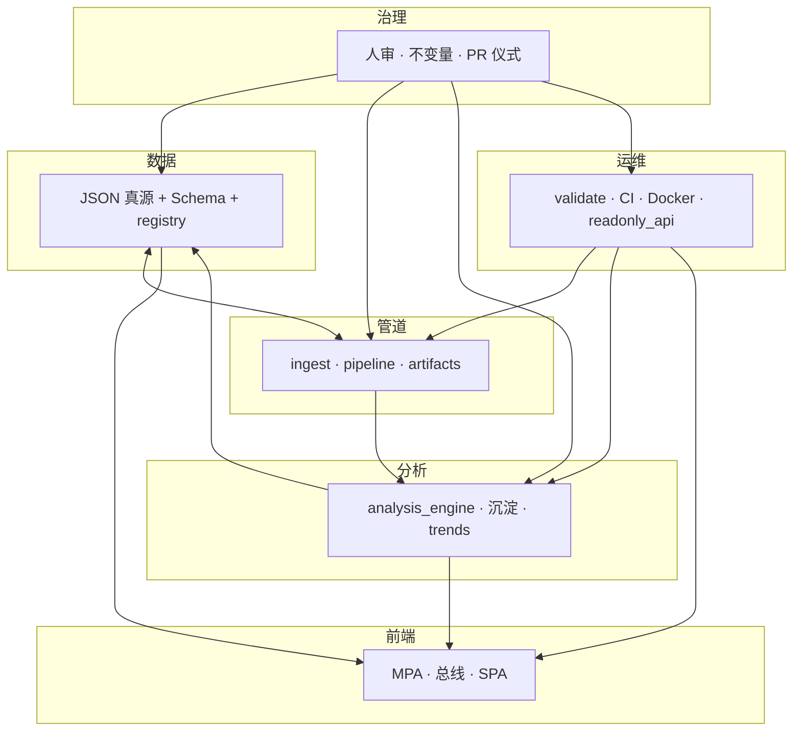

# 智能化：从单点脚本到六域协同

本文把站内**「智能化 / 可演进自动化」**从「又多了一个 `scripts/*.py`」的**单点叙事**，升级为**六域分工 + 协同接口**的目标架构，便于排期、PR 描述与扩展审计。与 **[PLATFORM_EXTENSIBILITY_AND_EVOLUTION.md](./PLATFORM_EXTENSIBILITY_AND_EVOLUTION.md#automation-and-evolution)** 的边界说明一致；**不改变**现有人审闸门、manifest 真源与 **`make validate`** 语义。

**速查对照**：工程模块七类见 **[ARCHITECTURE.md · 七类能力](./ARCHITECTURE.md#seven-layers)**；平台插槽见 **[PLATFORM_EXTENSIBILITY · §2](./PLATFORM_EXTENSIBILITY_AND_EVOLUTION.md#extension-slots)**；四条进化轨见 **[同文档 §3](./PLATFORM_EXTENSIBILITY_AND_EVOLUTION.md#evolution-tracks)**。

## 1. 为何要升级表述

| 单点脚本视角的问题 | 六域协同要补上的事 |
|--------------------|-------------------|
| 讨论自动化时默认落在「某个 Python 文件」 | 同一改动往往牵动**契约、闸门、前端读数、运维发布、治理规则** |
| 新人难判断「我该改哪、还要动谁」 | 每个能力先**声明域**，再落**插槽**（registry、Schema、总线、只读 API 等） |
| 文档与代码里「智能化」一词过载 | **域内**可演进；**域间**用显式产物（JSON、Schema、CI job、PR 模板）握手 |

**升级含义**：主要是**架构语言与协作契约**的整理；实现上仍优先 **[阶段 1](./ARCHITECTURE_UPGRADE_AND_EXTENSIONS.md#upgrade-tiers)**（契约、`evolution_pkg`、双轨、只读 API），与 **[ORCHESTRATION_AND_EVENT_STREAMING.md](./ORCHESTRATION_AND_EVENT_STREAMING.md)** 中「不必为先进而先进」一致。

## 2. 六域定义（职责 · 载体 · 协同接口）

| 域 | 职责（智能化在本域指什么） | 主要载体（本站现状） | 与其它域的协同接口（握手物） |
|----|------------------------------|----------------------|------------------------------|
| **数据** | 可版本化、可校验的结构化事实与注册边界 | `assets/*.json`、`data/sediment.json`、`scripts/evolution-registry.json`、`docs/schemas/*.schema.json` | **Schema**、**`schema_version`**、**[DATA_CONTRACTS](./DATA_CONTRACTS.md)**；单一注册表 → 对账链 |
| **管道** | 可重复的抓取、编排、写 artifact、加速重算 | `ingest_opinion_law.py`（含 **`ingest_config.json` · `json_feeds`** 与 **`evolution_pkg.ingest_json_http`**）、**`evolution_pkg.pipeline`**、`run_update_pipeline.sh`、`run_pipeline_steps.py`、`make evolution-fast` | **artifact**、遥测 JSON、步骤顺序与 **`run_validate.sh`** 前半段对齐；**不写 manifest** |
| **分析** | 在 manifest/候选/规则上可复算的结论与血缘 | `analysis_engine.py`、`evolution-hint-rules.json`、`evolution-hint-decisions.json`、沉淀与趋势脚本 | **`analysis-snapshot.json`**、`run` 血缘、**`--check`**；**不写 HTML** |
| **前端** | 读者路由与读数呈现（双轨） | 根目录 MPA、**`site-data-bus.js`**、`spa/`、**`sync_spa_public`** | **已提交 JSON** + **[SITE_DATA_UPDATE_FRAMEWORK](./SITE_DATA_UPDATE_FRAMEWORK.md)** 登记；**nav.config ≡ registry.pages** |
| **运维** | 构建、发布、侧车、可观测与对外只读部署 | **`make validate`** / CI、`Dockerfile*`、**`readonly_api`**、**`admin-console/`**（脚手架）、**[DOCKER.md](./DOCKER.md)**、`print_evolution_status.py` | **健康检查**、ETag/304、镜像与 compose profile **`api` / `admin`**；**不放宽治理闸门** |
| **治理** | 人审、权限语义、不变量、分端责任 | **`review_state`**、`merge_candidates_to_manifest.py`、**[AGENTS.md](../AGENTS.md)** / **[CONTRIBUTING.md](../CONTRIBUTING.md)**、**[USER_ADMIN_SPLIT_AND_EVOLUTION_DESIGN](./USER_ADMIN_SPLIT_AND_EVOLUTION_DESIGN.md)** | **PR 与 merge 仪式**、**`make merge-ready`**（含 **`test-admin-console`**）；禁止默认自动覆盖已审 manifest |

**一句话**：机器在各域做**可重复、可 diff、可回滚**的事；**跨域**靠契约与登记，**治理域**对「谁能写哪类真源」有一票否决。

### 2.1 与「前端读者 / 后端管理」的对齐

与 **[USER_ADMIN_SPLIT · 节 1a](./USER_ADMIN_SPLIT_AND_EVOLUTION_DESIGN.md#reader-frontend-admin-backend)** 同读；**总表旁注**：[PLATFORM_MASTER_MAP · 读者面/管理面 · 节 1a](./PLATFORM_MASTER_MAP_AND_INVOCATION.md#reader-admin-surfaces)。读者在浏览器里主要触达 **前端域**（呈现 + 只读 fetch）；**数据 / 管道 / 分析** 的改真源动作在 **管理端（后端侧工程）** 完成；**运维域**提供 **validate / CI / Docker / `readonly_api`** 等可部署能力；**治理域**规定 PR、人审与禁止项。勿把「管理动作」做成站内静默写库按钮。

## 3. 协同关系（示意）

箭头表示**依赖或验收关系**，不是「谁调用谁」的唯一实现路径；细节仍以数据流图 **[ARCHITECTURE.md](./ARCHITECTURE.md)** 为准。

## 4. 与「七类模块」的对照（非一一替换）

| 七类模块（ARCHITECTURE） | 主要落在六域中的 |
|--------------------------|------------------|
| 数据存储 / 沉淀 | **数据**（+ 侧车 SQLite 与 **运维** 部署边界） |
| 分析 / 汇总 | **分析**（当日快照 vs 跨日趋势仍分离） |
| 进化 | **数据** + **治理**（候选/manifest/决策链） |
| 内容生成 | **前端**（叙事 HTML）+ **治理**（草稿插槽与 PR）；**不**并入分析域写正文 |
| 展示 | **前端** |
| （管道型脚本跨多类） | **管道** 显式承担编排； ingest/merge/analyze 分段仍属不同步骤 |

七类偏**模块/存储形状**；六类偏**平台职责与协作**。新需求可同时标「动七类哪几行表 + 动六域哪几格」，减少遗漏。

## 5. 与扩展插槽、四条进化轨的衔接

- **插槽**（契约、注册表、规则、总线、只读 API、管道步骤）在六域中主要落在 **数据**、**管道**、**分析**、**前端**、**运维**；**治理**定义哪些插槽可写、哪些只读。  
- **四条进化轨**（数据 / 规则与闭环 / 叙事与方法 / 呈现与路由）与六域：**数据轨 ↔ 数据域+治理**；**规则轨 ↔ 数据域+分析域**；**叙事轨 ↔ 前端+治理（草稿）**；**呈现轨 ↔ 前端+数据（registry）**。

## 6. PR / 能力项自检（按域打点）

合并前除 **`make validate`** 外，可在 PR 描述用一行标明域，避免「只改了脚本却忘了 Schema/总线」：

1. **数据**：是否动契约/registry？→ Schema + **`run_validate.sh`** + **DATA_CONTRACTS**  
2. **管道**：是否改步骤顺序或 artifact？→ 与 **`evolution_pkg.pipeline`** / 文档同步  
3. **分析**：是否改语义或输出字段？→ **`--check`** + 快照/沉淀/趋势消费者  
4. **前端**：是否新读数或新页？→ **SITE_DATA_UPDATE_FRAMEWORK** +（SPA）**nav**  
5. **运维**：是否改 CI/Docker/API？→ **INTEGRATION** / **DOCKER** / OpenAPI  
6. **治理**：是否触及 manifest 流程或分端边界？→ **CONTRIBUTING** / **USER_ADMIN_SPLIT** / 禁止自动写 manifest  

与 **[PLATFORM_EXTENSIBILITY · 新增能力检查单](./PLATFORM_EXTENSIBILITY_AND_EVOLUTION.md#new-capability-checklist)** 逐项合并使用即可。

## 6a. 代码侧（`evolution_pkg.domains`）

包 **`scripts/evolution_pkg/domains.py`** 提供 **`IntelligenceDomain`** 枚举、中文标签 **`DOMAIN_LABEL_ZH`**，以及 **`SUBMODULE_DOMAIN`**：将 **`evolution_pkg`** 各顶层子模块映射到**主归属域**。新增子模块时须更新该映射，**`scripts/tests/test_evolution_pkg.py`** 会校验「目录内子模块 ≡ 映射键」，避免域归属漂移。根 **`evolution_pkg.__init__`** 再导出上述符号，便于 `from evolution_pkg import IntelligenceDomain`。**运维域**已落 **`evolution_pkg.ops`**（**`http_cache`**：`etag_for_bytes`、`if_none_match_prefers_304`、**`prepare_revalidated_json`** / **`prepare_dynamic_json`** 与 **`PreparedJsonCache`**，供 **`readonly_api`** 映射为 HTTP 响应；单测 **`scripts/tests/test_http_cache.py`**）与 **`evolution_pkg.readonly_disk_routes`**（磁盘 **GET** 路径表，**`readonly_api`** 启动注册；单测 **`scripts/tests/test_readonly_disk_routes.py`**）；扩展路由说明见 **[INTEGRATION_AND_READONLY_API · 扩展只读路由](./INTEGRATION_AND_READONLY_API.md#extend-readonly-routes)**。**治理域**仍以 PR、人审与文档为主，当前不要求在包内单独落子模块。

## 7. 演进路径（建议顺序）

1. **文档与 PR 习惯**（本文 + 主线表）：先统一用语，不要求一次性大重构代码。  
2. **可执行升级全景**：按 **[ARCHITECTURE_UPGRADE_ROADMAP](./ARCHITECTURE_UPGRADE_ROADMAP.md)** 的决策图与分域矩阵拆 PR，并对表 **[§6 PR 自检](#pr-checklist)**；**边调试边补**用 **[INCREMENTAL_BUILD_PLAYBOOK](./INCREMENTAL_BUILD_PLAYBOOK.md)**。  
3. **域内包化**：继续把业务逻辑收进 **`evolution_pkg`** 子模块，脚本层保持薄入口（与平台文一致）。  
4. **域间契约硬化**：新 JSON 一律 Schema + **`schema_version`**；新消费方一律登记总线文档。  
5. **阶段 2/3**：仅在 **[ARCHITECTURE_UPGRADE](./ARCHITECTURE_UPGRADE_AND_EXTENSIONS.md#upgrade-tiers)** 与 **[ORCHESTRATION](./ORCHESTRATION_AND_EVENT_STREAMING.md)** 所述信号齐备时引入编排器/事件流，且**治理不变量**不变。

**模块级对表**（七类能力 × 脚本簇 × 各域升级矩阵）：**[MODULE_INVENTORY_AND_ARCHITECTURE_UPGRADE_MATRIX.md](./MODULE_INVENTORY_AND_ARCHITECTURE_UPGRADE_MATRIX.md)**。

---

## 延伸阅读

- **[ARCHITECTURE_UPGRADE_ROADMAP.md](./ARCHITECTURE_UPGRADE_ROADMAP.md)**（可落地升级：决策全景 · 分域矩阵 · 阶段卡）  
- **[PHASED_UPGRADE_EXECUTION_GUIDE.md](./PHASED_UPGRADE_EXECUTION_GUIDE.md)**（按阶段 0→1→2/3 与 2.5 执行与验收）  
- **[MODULE_INVENTORY_AND_ARCHITECTURE_UPGRADE_MATRIX.md](./MODULE_INVENTORY_AND_ARCHITECTURE_UPGRADE_MATRIX.md)**（模块全量梳理与升级矩阵）  
- **[INCREMENTAL_BUILD_PLAYBOOK.md](./INCREMENTAL_BUILD_PLAYBOOK.md)**（增量构建 · 组件引入序 · **[PR 模板](./templates/incremental-pr-slice.md)**）  
- **[ADMIN_WEB_CONSOLE_ROADMAP.md](./ADMIN_WEB_CONSOLE_ROADMAP.md)**（管理端 Web：认证、RBAC、审核流、Git 审计；与治理域对表）  
- **[ARCHITECTURE.md](./ARCHITECTURE.md)** · **[ARCHITECTURE_ONE_PAGER.md](./ARCHITECTURE_ONE_PAGER.md#three-architectures)**  
- **[PLATFORM_EXTENSIBILITY_AND_EVOLUTION.md](./PLATFORM_EXTENSIBILITY_AND_EVOLUTION.md)**  
- **[TECH_ARCHITECTURE_AND_UPGRADE_BRIEF.md](./TECH_ARCHITECTURE_AND_UPGRADE_BRIEF.md)**  
- **[docs/README · 文档主线](./README.md#docs-spine)**

*随主分支演进；若新增全局「第七域」级概念（如独立身份服务），应同步更新本节与 PLATFORM 专篇，避免第二套平台语言。*
