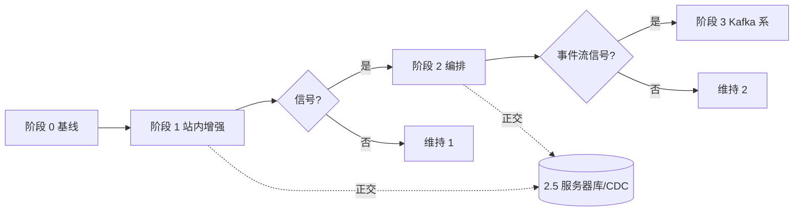

# 按阶段升级：执行指南

**角色判型**（读者 / 贡献 / 数据 / 部署 → 第一站）：根 [README · 产品视角](../README.md#pm-four-journeys) · [README · 从这里开始](../README.md#readme-start-here) · [README · 双轨真源](../README.md#readme-dual-track-map)。**架构师梳理与持续改进**：[ARCHITECTURE_ONE_PAGER · 五步表](./ARCHITECTURE_ONE_PAGER.md#architect-stewardship) · [不变量索引](./ARCHITECTURE_ONE_PAGER.md#architect-invariants-index) · [PR 证据三联](../CONTRIBUTING.md#contributing-pr-evidence-triad)。

本文把 **[ARCHITECTURE_UPGRADE_AND_EXTENSIONS.md · §2](./ARCHITECTURE_UPGRADE_AND_EXTENSIONS.md#upgrade-tiers)** 与 **[ARCHITECTURE_UPGRADE_ROADMAP.md · §3](./ARCHITECTURE_UPGRADE_ROADMAP.md#phased-playbook)** 收成**可逐项打勾的升级动线**：每个阶段**目标、准入、落地动作、验收**；**不跳级**除非文内「正交」说明允许并行规划。

**决策图（先判阶段）**：[ROADMAP · §1](./ARCHITECTURE_UPGRADE_ROADMAP.md#upgrade-panorama)。**模块落在哪**：[MODULE_INVENTORY_AND_ARCHITECTURE_UPGRADE_MATRIX.md](./MODULE_INVENTORY_AND_ARCHITECTURE_UPGRADE_MATRIX.md)。**拆 PR**：[INCREMENTAL_BUILD_PLAYBOOK.md](./INCREMENTAL_BUILD_PLAYBOOK.md)。**合并闸门实现**（勿另立第二套）：**[`scripts/run_validate.sh`](../scripts/run_validate.sh)**（**`make validate`**、pre-commit、CI **validate** 同源）。**五维总图 · 主链联动 · 仓库物理分层**：**[勿混粒度 · 五维/六域/七类](./PROJECT_ARCHITECTURE_OVERVIEW.md#architecture-grain)** · [PROJECT_ARCHITECTURE_OVERVIEW · §1a](./PROJECT_ARCHITECTURE_OVERVIEW.md#module-linkage-validation) · **[§1b](./PROJECT_ARCHITECTURE_OVERVIEW.md#physical-layout)**。**整体内容框架**：**[docs/README · #content-framework](./README.md#content-framework)** · **前后台模块一页表**：[**#front-back-modules**](./README.md#front-back-modules) · **组件×功能一条表**：[**#system-components-fusion**](./README.md#system-components-fusion)。**按改动判型**（主线 **0c**）：**[docs/README · #quick-paths](./README.md#quick-paths)**。**自动化助手（勿拆 validate 真源 · 合并前）**：[AGENTS.md · 契约速览](../AGENTS.md#agents-contract) · [合并前](../AGENTS.md#agents-pre-merge) · [人审闸门](../AGENTS.md#agents-invariants)。**呈现双轨（`spa-sync` / `spa-build`）**：[MERGE · §1](./MERGE_AND_RELEASE_CHECKLIST.md#pre-merge) · [MERGE · partials 手顺](./MERGE_AND_RELEASE_CHECKLIST.md#pre-merge-partials-sequence) · [关系视图](../maintainer-hub.html#mh-spine-map)。**MPA 顶栏与失页**：**`partials/`** → **`make sync-nav`**；**`404.html`** 手调（`sync_site_nav` 不写回）— **[scripts/README · `sync_site_nav`](../scripts/README.md)**。

**目录**（可复制命令以 [落地执行](#execution-now) 表为主；以下各节为阶段定义与验收）：  
[落地执行](#execution-now) · [阶段关系](#ladder) · [阶段 0](#phase-0) · [阶段 1](#phase-1) · [阶段 2](#phase-2) · [阶段 3](#phase-3) · [阶段 2.5](#phase-2-5) · [单迭代模板](#iteration-template) · [延伸阅读](#reading)

## 落地执行（今日可复制）

在仓库**根目录**执行（路径含中文时 Docker 见 **[DOCKER.md](./DOCKER.md#troubleshoot-bake-grpc)**）。

| 场景 | 命令（顺序） |
|------|----------------|
| **首次克隆** | `python3 -m pip install -r requirements.txt` → **`make validate`** |
| **日常合并前** | **`make validate`**；推荐 **`make merge-ready`**（含只读 API + 管理端烟测，需 **`requirements-api.txt`** 与 **`admin-console/requirements.txt`**） |
| **迭代中快速回归** | **`make test`**（子集；**不替代**合并前 **`make validate`**） |
| **只验证分析逻辑（不写 `analysis-snapshot.json`）** | **`make check-analysis`**（与 CI 内 **`analysis_engine --check`** 同款） |
| **扫一眼站点版号与快照计数** | **`make status`** |
| **改顶栏 / skip-bar 模板** | **`make sync-nav`** → **`make validate`**（**`404.html`** 顶栏/skip **手调**，`sync_site_nav` 不写回 — [MERGE · §1](./MERGE_AND_RELEASE_CHECKLIST.md#pre-merge) · [MERGE · partials 手顺](./MERGE_AND_RELEASE_CHECKLIST.md#pre-merge-partials-sequence)） |
| **仅查顶栏是否与 partial 一致**（不写回） | **`make check-site-nav`**（已含于 **`make validate`**） |
| **PR 里贴快照差异** | `python3 scripts/diff_analysis_snapshot.py`（旧/新路径或 **`--json`**；见 **[scripts/README](../scripts/README.md)**） |
| **增删注册页 + SPA** | 改 **`scripts/evolution-registry.json`**、**`spa/nav.config.json`** → **`make gen-nav-links`** → **`make validate`**；若 CI 会跑 **`spa-build`**：**`make spa-build`** |
| **刷新快照 / 沉淀 / 趋势**（无抓取） | 须先 **`make validate`** → **`make analyze`** 或 **`make evolution-fast`** |
| **仅重算跨日趋势**（已有沉淀） | **`make trends`**（不写快照；见 **[scripts/README](../scripts/README.md)**） |
| **抓取候选进池**（需外网） | **`make ingest`** 或 **`make ingest-full`**；**不**自动 merge manifest，仍走人审 |
| **本地站点 + 只读 API + 管理端** | **`make docker-up-stack`**（见 **[DOCKER.md](./DOCKER.md)**） |
| **生成 `sitemap.xml`（发布前）** | **`SITE_BASE=https://你的站点根（无尾斜杠） make sitemap`**（见根目录 **[README](../README.md)** 示例）；须已对齐 **`gen-sitemap`** 与 registry |
| **Kafka 协议 PoC 仅** | **`make docker-up-kafka-dev`** → 见 **[DOCKER · §4a](./DOCKER.md#kafka-dev-overlay)**；**不**进默认 CI |
| **编排器 / 生产库 / 阶段 2.5** | 先 **[ROADMAP §1](./ARCHITECTURE_UPGRADE_ROADMAP.md#upgrade-panorama)** 判阶段，再按 **[MODULE 矩阵 §5](./MODULE_INVENTORY_AND_ARCHITECTURE_UPGRADE_MATRIX.md#upgrade-matrix)** 拆 PR；验收仍以 **`make validate`** 为准 |

**一页合并动线**：[MERGE_AND_RELEASE_CHECKLIST.md](./MERGE_AND_RELEASE_CHECKLIST.md#pre-merge) · [MERGE · partials 手顺](./MERGE_AND_RELEASE_CHECKLIST.md#pre-merge-partials-sequence)。**命令表**：[scripts/README.md](../scripts/README.md)。**安装 Git 钩子**（提交前等同 **`make validate`**）：**`make hooks`** 或 `bash scripts/install-git-hooks.sh`。

---

## 阶段关系（总览）

| 编号 | 名称 | 与前后关系 |
|------|------|------------|
| **0** | 默认栈 / 长期基线 | 一切升级的**地板**；合并与 CI 仍以此为准 |
| **1** | 站内增强 | **优先耗尽**再评估 2/3；不引新基础设施（编排/broker/生产级服务器库） |
| **2** | 编排器 | **信号齐备**后；封装**已有**步骤；**不写 manifest** |
| **3** | 事件流（Kafka/Redpanda） | **信号齐备**且与 **Git 审计**分工书面化 |
| **2.5*** | 数据库与查询层（正交） | 与 **2/3 可并行规划文档**，落地顺序见 **[DATA_STORES](./DATA_STORES_AND_FUTURE_DB_ARCHITECTURE.md)**；**不替代** Git 契约真源 |

\* **2.5** 在 **[UPGRADE · §2.5](./ARCHITECTURE_UPGRADE_AND_EXTENSIONS.md)** 中单列，**不是**「必须在阶段 2 和 3 之间插入」的强制台阶。

---

## 阶段 0 — 维持默认栈

**目标**：不扩大运维面；**Git + PR + `make validate`** 仍是事实与闸门。

| 项 | 执行要点 |
|----|----------|
| **合并前** | **`make validate`**（必）；推荐 **`make merge-ready`** |
| **调度** | GitHub Actions；**`validate`** 必跑；**`spa-build`** 按路径 |
| **artifact** | **人工**合并进主分支；不自动 push manifest |
| **验收** | 全绿 **validate**；无新增编排/broker **生产**依赖 |

**何时算「仍在阶段 0」**：团队只做内容与小改脚本、不立项编排/Kafka/生产 OLTP。

---

## 阶段 1 — 站内增强（优先做满）

**目标**：在**不引编排器、不引 broker、不把 manifest 真源迁库**前提下，硬化契约、分包、双轨、只读面。

**一键验收（与 `make validate` 同源）**：**`make phase-1`**。单测 **`scripts/tests/test_run_validate_script_refs.py`** 保证 **`run_validate.sh`**、**`run_update_pipeline.sh`**、**`run_analyze_write.sh`**、**`run_ingest_only.sh`** 中**行首级**调用的每个 **`scripts/*.py`** 在仓库内存在；**`scripts/tests/test_pipeline_runner_script_refs.py`** 保证 **`evolution_pkg.pipeline.runner`** 的 **analyze / fast** 步骤表中引用的 **`scripts/*.py`** 存在，降低改名/漏迁导致「入口或管道指向幽灵脚本」的风险。

**准入**：默认从阶段 0 进入；或长期停留在本阶段。

| 序号 | 落地动作 | 验收 / 参考 |
|------|----------|-------------|
| 1 | 新或大改 JSON → **Schema** + **`validate_*.py`** + **`run_validate.sh`** 串联 | **`make validate`** |
| 2 | 新逻辑 → **`evolution_pkg.*`** + **`domains.py`** 登记；根脚本薄 CLI | **`make test`** + **`test_evolution_pkg`** |
| 3 | 动 **registry** → **SPA** **`nav.config.json`** + **`make gen-nav-links`** | **`check_nav_links_registry`**（在 validate 内） |
| 4 | 动顶栏模板 → **`make sync-nav`** | **`sync_site_nav --check`**；若动 **`skip-bar.inc.html`**，**`404.html`** 须手调 |
| 5 | 扩 **只读 API** | **`make test-readonly-api`**（**`test_readonly*.py`**）；[INTEGRATION](./INTEGRATION_AND_READONLY_API.md) |
| 6 | 动 **admin-console** | **`make test-admin-console`**；[ADMIN_WEB_CONSOLE_ROADMAP](./ADMIN_WEB_CONSOLE_ROADMAP.md) · **[ADMIN_CONSOLE · §7](./ADMIN_CONSOLE_FRAMEWORK_OVERVIEW.md#admin-module-plan)**（**`mod-*`** · **`#mod-api`→`#mod-analysis`**） |
| 7 | 可观测 | **`make status`**、**`pipeline-metrics`**；按需告警文档化 |

**阶段出口（「可以开始评估 2/3」的最低条件）**：阶段 1 清单对当前迭代**已落实**；团队对 **[ORCHESTRATION §2](./ORCHESTRATION_AND_EVENT_STREAMING.md)**、**§3** 所述**多条信号**有书面共识（见下阶段准入）。

---

## 阶段 2 — 编排器试点

**目标**：用 **Prefect / Dagster** 等**封装已有** Python/shell 步骤，获得运行历史、重试、回填等能力。

**准入（建议同时满足多条）**：

- 多条 **DAG** 或依赖经常变；或  
- 需要 **按分区 / 按日回填**；或  
- **多环境**参数矩阵复杂；或  
- 需要 **运行历史 UI** 且 Actions 已不够表达。

**落地动作**：

1. 选定产品（对照 **[ORCHESTRATION · §2](./ORCHESTRATION_AND_EVENT_STREAMING.md)**）。  
2. **只封装**现有步骤（如 `run_pipeline_steps`、ingest、analyze 子集）；**不**把「写 manifest」放进编排默认图。  
3. **CI**：保留 **`make validate`** 为契约真源；编排部署与 CI **分工写进 README/Runbook**。  

**验收**：**`make validate`** 仍全绿；编排失败**不**静默改 **Git 内 JSON 契约**；[UPGRADE · §4 反模式](./ARCHITECTURE_UPGRADE_AND_EXTENSIONS.md#anti-patterns) 未违反。

---

## 阶段 3 — 事件流（Kafka / Redpanda）

**目标**：多服务异步、回放、与 **Connect** 等集成。

**准入**：

- **多服务实时写**、**多订阅**、**回放** 需求真实存在；且  
- 与 **Git 主事实源** 的**分工已书面约定**（broker **不**当唯一审计源）。

**落地动作**：

1. 读 **[ORCHESTRATION · §3—§5](./ORCHESTRATION_AND_EVENT_STREAMING.md)**。  
2. 本地 PoC：**[DOCKER · §4a](./DOCKER.md#kafka-dev-overlay)** · **`make docker-up-kafka-dev`**。  
3. 生产拓扑与 Schema 治理**单独设计评审**。  

**验收**：默认 CI **仍不依赖** broker；**`make validate`** 路径不变。

---

## 阶段 2.5 — 数据库与查询层（与 2/3 正交）

**目标**：在需要 **会话、审计、读副本、OLAP、CDC** 时引入 **PostgreSQL** 等；**不**以库表替代 **manifest/registry** 的 Git 闸门。

**准入**：见 **[DATA_STORES_AND_FUTURE_DB_ARCHITECTURE.md](./DATA_STORES_AND_FUTURE_DB_ARCHITECTURE.md)** §2—§3。

**落地顺序**：通常 **阶段 1 扎实** 后，再与 **2 或 3** 并行**规划**；**Kafka Connect/CDC** 多在 **OLTP 边界清晰** 后落地。

**验收**：契约 JSON **仍以 Git + validate** 为准；库为**运营态或派生投影**。

---

## 单迭代模板（每一轮升级都走一遍）

1. 在 **[ROADMAP §1 图](./ARCHITECTURE_UPGRADE_ROADMAP.md#upgrade-panorama)** 上标当前阶段。  
2. 本迭代只动 **一个阶段**的主线任务（大改拆 **[Playbook](./INCREMENTAL_BUILD_PLAYBOOK.md)**）。  
3. 结束：**`make validate`**；若触 API/admin：**`make merge-ready`**。  
4. 更新 Runbook / **scripts/README** 若新增命令或契约。

---

## 延伸阅读

- 不变量全文：[ARCHITECTURE_UPGRADE_AND_EXTENSIONS.md](./ARCHITECTURE_UPGRADE_AND_EXTENSIONS.md)  
- 分域矩阵与执行卡原文：[ARCHITECTURE_UPGRADE_ROADMAP.md](./ARCHITECTURE_UPGRADE_ROADMAP.md)  
- 模块全量梳理（七类 × `scripts/` × `evolution_pkg` × 阶段）：[MODULE_INVENTORY_AND_ARCHITECTURE_UPGRADE_MATRIX.md](./MODULE_INVENTORY_AND_ARCHITECTURE_UPGRADE_MATRIX.md)  
- 合并前动线：[MERGE_AND_RELEASE_CHECKLIST.md](./MERGE_AND_RELEASE_CHECKLIST.md#pre-merge) · [MERGE · partials 手顺](./MERGE_AND_RELEASE_CHECKLIST.md#pre-merge-partials-sequence)  
- PR 自检（基础设施小节）：[`.github/pull_request_template.md`](../.github/pull_request_template.md)  
- 拆 PR 与组件顺序：[INCREMENTAL_BUILD_PLAYBOOK.md](./INCREMENTAL_BUILD_PLAYBOOK.md)  
- 技术栈简版 + 阶段表 + backlog：**[TECH_ARCHITECTURE_AND_UPGRADE_BRIEF.md](./TECH_ARCHITECTURE_AND_UPGRADE_BRIEF.md)**（**§1—§4**）· **[详版附录](./TECH_ARCHITECTURE_AND_UPGRADE_BRIEF.md#appendix-tech-capabilities)**（[别名](./TECH_ARCHITECTURE_CAPABILITIES.md)）  
- 合理调用顺序：[PLATFORM_MASTER_MAP_AND_INVOCATION.md](./PLATFORM_MASTER_MAP_AND_INVOCATION.md)  
- 全量校验脚本（文首含维护者注释）：[`scripts/run_validate.sh`](../scripts/run_validate.sh)

---

*阶段定义变更时，请同步 **ARCHITECTURE_UPGRADE_AND_EXTENSIONS**、**ROADMAP §3** 与本指南，避免三套门槛。*
