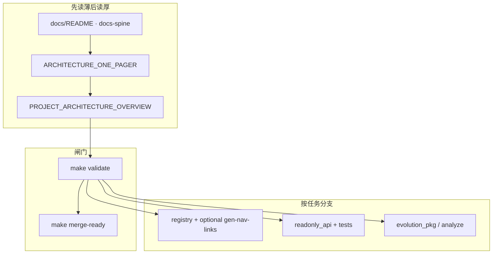

# 平台总览：内容 · 架构 · 组件与合理调用

**本文定位**：用**一张总表 + 三条黄金路径**回答——整站**内容**落在哪、**架构**分层怎么读、**组件**各自干什么、怎样**调用**（读文档的顺序、跑的命令、触发的 CI）才能**少绕路、闸门不松、扩展不漂移**。

**不替代**专篇契约：[DATA_CONTRACTS.md](./DATA_CONTRACTS.md)、[ARCHITECTURE.md](./ARCHITECTURE.md)。**五维总图**仍以 **[PROJECT_ARCHITECTURE_OVERVIEW.md](./PROJECT_ARCHITECTURE_OVERVIEW.md)** 为准；**文档主线序号**以 **[docs/README · #docs-spine](./README.md#docs-spine)** 为准。

**目录**：[1. 三维总表](#three-layers-map) · [1a. 读者面与管理面](#reader-admin-surfaces) · [2. 三条黄金路径](#golden-paths) · [3. 架构文档入口](#architecture-entry) · [4. 调用关系示意](#invocation-flow) · [5. 低收益调用](#anti) · [6. 延伸阅读](#reading)。**可复制命令表**另见 **[按阶段升级 · 落地执行](./PHASED_UPGRADE_EXECUTION_GUIDE.md#execution-now)**。

---

## 1. 三维总表：内容 × 架构 × 组件

| **内容**（读者/维护者看到什么） | **架构落点**（三架构 / 五维里算哪块） | **主要组件** | **最该用的「调用」** |
|--------------------------------|--------------------------------------|--------------|----------------------|
| 分页叙事、导读、时间窗 | **内容架构** · 五维之「内容」 | 根目录 **`*.html`**、`partials/` | 改叙事只动 HTML；**不**指望 `analysis_engine` 写正文 |
| 顶栏、skip-bar、404 导读 | **呈现** · 运行态 | **`partials/site-nav.inc.html`**、**`skip-bar.inc.html`**、`sync_site_nav.py` | 改模板后 **`make sync-nav`**；合并前 **`make validate`** |
| 注册页、沙盘因子、lab | **技术** · 数据契约 | **`scripts/evolution-registry.json`** + Schema | 改后 **`make validate`**（含 registry / nav 对账）；动 SPA 则 **`make gen-nav-links`** 或 **`make spa-build`** |
| 信号、候选、manifest、决策 | **演进** · 数据真源 | **`assets/evolution-*.json`**、`merge` 流程 | **人审**合并；**勿**自动写 manifest |
| 当日分析、沉淀、趋势 | **演进** · 分析 | **`analysis_engine.py`**、`data/sediment.json`、`assets/sediment-trends.json` | **`make analyze`** / **`make evolution-fast`**；结构改 **`schema_version` + Schema** |
| 页内动态数、顶栏版本 | **前端读数** | **`site-data-bus.js`**、`[data-*]` 占位 | 新消费方登记 **[SITE_DATA_UPDATE_FRAMEWORK.md](./SITE_DATA_UPDATE_FRAMEWORK.md)** |
| 对外 JSON HTTP | **运行态** · 集成 | **`readonly_api.py`** | 扩路由仍**只读**；合并 **`make merge-ready`** 或 **`make test-readonly-api`** |
| 管理端 Web 控制台 | **运行态** · 治理/分端 | **`admin-console/`**；框架总览 [ADMIN_CONSOLE_FRAMEWORK_OVERVIEW](./ADMIN_CONSOLE_FRAMEWORK_OVERVIEW.md) | **`make test-admin-console`**；**`GET /api/bootstrap`** + 只读代理；不写 manifest |
| 本地/容器站 + API | **运维** | **`docker-compose.yml`**、profile **`api`/`admin`** | **`make docker-up-stack`** 等，见 **[DOCKER.md](./DOCKER.md)** |
| 可选 Kafka PoC | **升级/事件流** | **`docker-compose.kafka-dev.yml`** | **`make docker-up-kafka-dev`**；见 **[ORCHESTRATION](./ORCHESTRATION_AND_EVENT_STREAMING.md)** |
| 可选服务器库/CDC | **升级/数据层** | 未来 OLTP 等 | 见 **[DATA_STORES_AND_FUTURE_DB_ARCHITECTURE.md](./DATA_STORES_AND_FUTURE_DB_ARCHITECTURE.md)** |
| 方法论、判据、全站重推演 | **推演架构** | **DEDUCTION_STRATEGY**、**synthesis**、**SITE_WIDE_RERUN** | 叙事与工程对表，不替代 **`make validate`** |

## 1a. 读者面与管理面速查

**站内链入**：根目录 **`*.html`** 首屏 read-hint 与 **`maintainer-hub.html`** 常指本锚；与 MPA 并行的 **`spa/` 单页壳**在顶栏说明中亦外链至此（实现见 **`spa/src/SpaLayout.tsx`** 中 `platformMasterReaderAdminHref`）。壳内打开 Markdown 依赖构建前 **`make spa-sync`**（或 **`npm run sync`**）写入的 **`spa/public/docs/`**，与 **`metaUrl()`** 同源前缀。

**用语**：与 **[USER_ADMIN_SPLIT · 1a](./USER_ADMIN_SPLIT_AND_EVOLUTION_DESIGN.md#reader-frontend-admin-backend)** 一致——**读者面**不是「只有 MPA」；**管理面**不是「只有服务器」；二者是**职责分拆**，结构化真源仍以 **Git** 为准（单一事实源见该文 **§1**）。

| 面 | 典型入口 | 做什么 | 不做什么 |
|----|-----------|--------|----------|
| **读者面** | 根目录 **`*.html`**、**`analysis-hub`**、**`site-data-bus`**、可选 **SPA**（[**PLATFORM_CAPABILITY_MAP · 双轨**](./PLATFORM_CAPABILITY_MAP.md#dual-surface)） | 阅读叙事、看盘与沙盘、拉取已部署 **只读 JSON** | 不写 **manifest**、不静默 **ingest**、不把 **`make validate`** 等价逻辑搬进浏览器 |
| **管理面** | **`make validate` / `merge-ready`**、**`scripts/`**、**`evolution_pkg.*`**（模块与命令 **[scripts/README](../scripts/README.md)**）、**`readonly_api`**、**`admin-console/`**、[**maintainer-hub**](../maintainer-hub.html)（文档链） | 改契约与模板、跑管道与 CI、只读 HTTP、管理端烟测路径 | **勿**默认自动覆盖已审 **manifest**；候选 / ingest 配置等敏感只读段须受控（[**INTEGRATION**](./INTEGRATION_AND_READONLY_API.md)） |

**与 §1 总表**：§1 按「内容 × 架构 × 组件」列能力；本节按「谁在用」粗分前后台。分端演进与反模式见 **[USER_ADMIN_SPLIT](./USER_ADMIN_SPLIT_AND_EVOLUTION_DESIGN.md)**；管理 Web 规划见 **[ADMIN_WEB_CONSOLE_ROADMAP](./ADMIN_WEB_CONSOLE_ROADMAP.md)**。

---

## 2. 三条黄金路径（发挥最大作用）

### 2.1 维护者：合并前（每日/每 PR）

**目标**：与 **CI `validate`**、**pre-commit** 一致，避免「本地绿、远端红」。

1. **`make validate`**（必跑，全闸门）。  
2. 若动到只读 API 或相关脚本：**`make test-readonly-api`**。  
3. 若动到 **`admin-console/`**：**`make test-admin-console`**。  
4. 省事一条命令：**`make merge-ready`** = validate + 上述 API + 管理端烟测（见 **[MERGE_AND_RELEASE_CHECKLIST.md](./MERGE_AND_RELEASE_CHECKLIST.md)**）。

**原则**：**不要用 `make test` 代替 `make validate`** 作为合并依据（子集不含 manifest 对账、顶栏等）。

### 2.2 维护者：增能 / 新组件（少步可合并）

**目标**：契约先于实现，每步末尾可绿合并。顺序与 **[INCREMENTAL_BUILD_PLAYBOOK.md](./INCREMENTAL_BUILD_PLAYBOOK.md)** 表格 **A→K** 对齐，典型压缩为：

| 顺序 | 调用 |
|------|------|
| 1 | 新 JSON：**Schema 草案** + 校验入口 → **`make validate`** |
| 2 | 新页：**`evolution-registry.json`** →（若 SPA）**`spa/nav.config.json`** + **`make gen-nav-links`** → **`make validate`** |
| 3 | 新只读能力：**`readonly_api`** 路由 + 单测 → **`make merge-ready`** 子集 |
| 4 | 管道一步：**`evolution_pkg.pipeline`** 单步可跑 + 遥测可选 → **`make analyze`** 文档对齐 **[EVOLUTION_RUNBOOK.md](./EVOLUTION_RUNBOOK.md)** |
| 5 | 编排/Kafka/服务器库 | **仅**在 **[ARCHITECTURE_UPGRADE_ROADMAP](./ARCHITECTURE_UPGRADE_ROADMAP.md)** 与 **[ORCHESTRATION](./ORCHESTRATION_AND_EVENT_STREAMING.md)** / **[DATA_STORES](./DATA_STORES_AND_FUTURE_DB_ARCHITECTURE.md)** 信号齐备后单独立项（**Playbook J/K**） |

### 2.3 读者：读站（发挥内容侧最大价值）

**目标**：先建立**枢纽路径**，再按需深链，避免在单页里迷路。

1. **[index.html · 读站指路](../index.html#read-guide)** → **nexus** 或 **modules-map**。  
2. **[synthesis · 判据与继续推演](../synthesis.html#criteria)** → **continuation 矩阵**。  
3. 时间窗与五代横轴等：**[PLATFORM_CAPABILITY_MAP · §5 读者路径](./PLATFORM_CAPABILITY_MAP.md#reading-order)**。  
4. 发布质量抽样：**[SITE_REVIEW_THREE_PASSES.md](./SITE_REVIEW_THREE_PASSES.md)**。

---

## 3. 架构文档「怎么选入口」

| 你的问题 | 优先打开的文档 |
|----------|----------------|
| 一页看清技术/内容/推演三条线 | **[ARCHITECTURE_ONE_PAGER.md](./ARCHITECTURE_ONE_PAGER.md#three-architectures)** |
| 五维总图 + mermaid + 命令脊 | **[PROJECT_ARCHITECTURE_OVERVIEW.md](./PROJECT_ARCHITECTURE_OVERVIEW.md)** |
| 阶段 0—3、不变量、反模式 | **[ARCHITECTURE_UPGRADE_AND_EXTENSIONS.md](./ARCHITECTURE_UPGRADE_AND_EXTENSIONS.md)** |
| 分层 + backlog 简版 | **[TECH_ARCHITECTURE_AND_UPGRADE_BRIEF.md](./TECH_ARCHITECTURE_AND_UPGRADE_BRIEF.md)** |
| 可落地改造全景（矩阵/阶段卡） | **[ARCHITECTURE_UPGRADE_ROADMAP.md](./ARCHITECTURE_UPGRADE_ROADMAP.md)** |
| 排期/PR 六域打点 | **[INTELLIGENCE_SIX_DOMAINS.md](./INTELLIGENCE_SIX_DOMAINS.md#pr-checklist)** |
| 智能化边界与插槽 | **[PLATFORM_EXTENSIBILITY_AND_EVOLUTION.md](./PLATFORM_EXTENSIBILITY_AND_EVOLUTION.md)** |

---

## 4. 调用关系示意（维护者主链）

---

## 5. 低收益调用（避免）

- **跳过 `make validate`** 直接合并或宣称「CI 会救」。  
- **一上来** Playbook **J/K**（编排/Kafka/服务器库）而 **A—D**（契约、registry、只读 API）未稳。  
- **`make test` 当合并底线**（子集故意小于 validate）。  
- **让自动化写 `evolution-manifest.json`** 或把 **Git 真源** 换成库表/队列唯一副本（见 **[AGENTS.md](../AGENTS.md)**）。

---

## 6. 延伸阅读

- 文档主线表：[docs/README.md · #docs-spine](./README.md#docs-spine)  
- 平台四条支柱 + 阅读顺序：[PLATFORM_CAPABILITY_MAP.md](./PLATFORM_CAPABILITY_MAP.md)  
- **模块全量梳理与升级矩阵**：[MODULE_INVENTORY_AND_ARCHITECTURE_UPGRADE_MATRIX.md](./MODULE_INVENTORY_AND_ARCHITECTURE_UPGRADE_MATRIX.md)  
- **按阶段升级（执行）**：[PHASED_UPGRADE_EXECUTION_GUIDE.md](./PHASED_UPGRADE_EXECUTION_GUIDE.md)  
- 命令表：[scripts/README.md](../scripts/README.md)  
- 脚本能否换成 API/组件（边界与升级顺序）：[SCRIPTS_APIS_AND_COMPONENTS_UPGRADE.md](./SCRIPTS_APIS_AND_COMPONENTS_UPGRADE.md)  
- Agent 速查：[AGENTS.md](../AGENTS.md)  
- 舆情类 GitHub 项目作**参考引用**时的边界（侧车 / overlay）：[REFERENCE_DESIGN_OPINION_MONITORING.md](./REFERENCE_DESIGN_OPINION_MONITORING.md)

---

*与主分支同步；新增一级能力（新服务、新真源类型）时请更新 §1 总表并检查 spine 互链。*
