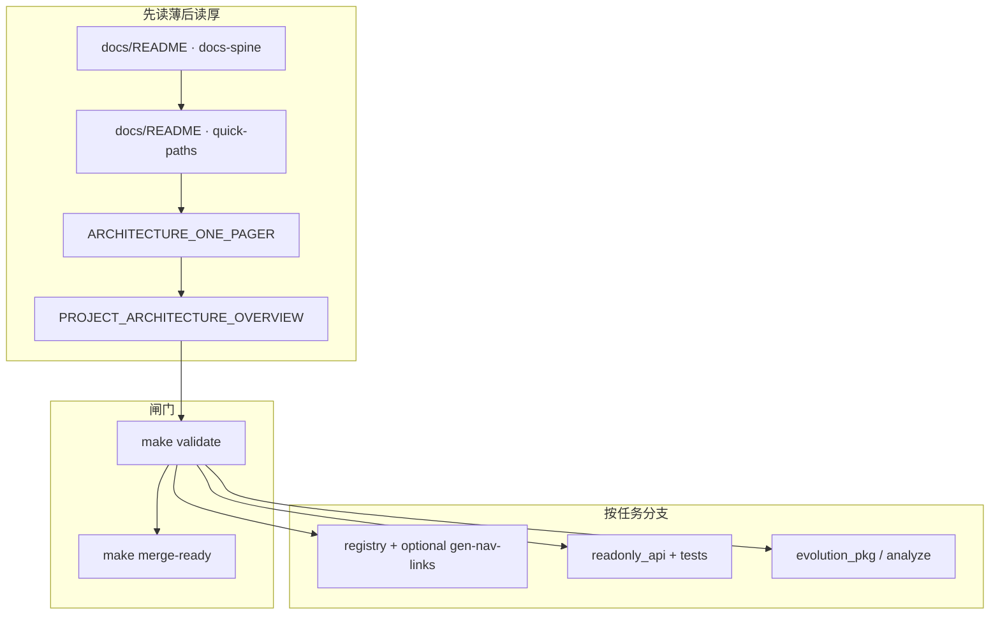

# 平台总览：内容 · 架构 · 组件与合理调用

**角色判型**（读者 / 贡献 / 数据 / 部署 → 第一站）：根 [README · 产品视角](../README.md#pm-four-journeys) · [总览 MPA · 四条动线卡](../index.html#index-intent-pick) · [README · 从这里开始](../README.md#readme-start-here) · [README · 双轨真源](../README.md#readme-dual-track-map)。**读站顺序（含步骤 0）**：[PLATFORM_CAPABILITY_MAP · §5](./PLATFORM_CAPABILITY_MAP.md#reading-order)。**本文侧重**：三维总表、读者面/管理面、**`make` / `merge-ready` / CI** 黄金路径；字段契约与数据流总览仍落 **[DATA_CONTRACTS](./DATA_CONTRACTS.md)** · **[ARCHITECTURE](./ARCHITECTURE.md)**；跨 PR 收束节奏见 **[ONE_PAGER · 架构师五步](./ARCHITECTURE_ONE_PAGER.md#architect-stewardship)** · **[不变量索引](./ARCHITECTURE_ONE_PAGER.md#architect-invariants-index)** · **[开 PR 前速览](../CONTRIBUTING.md#contributing-five-minute)** · **[PR 证据三联](../CONTRIBUTING.md#contributing-pr-evidence-triad)** · **[动手→命令速查](../CONTRIBUTING.md#contributing-change-to-command)**。

**本文定位**：用**一张总表 + 三条黄金路径**回答——整站**内容**落在哪、**架构**分层怎么读、**组件**各自干什么、怎样**调用**（读文档的顺序、跑的命令、触发的 CI）才能**少绕路、闸门不松、扩展不漂移**。

**不替代**专篇契约：[DATA_CONTRACTS.md](./DATA_CONTRACTS.md)、[ARCHITECTURE.md](./ARCHITECTURE.md)。**技术栈**简版与详版、多篇防散读法：**[TECH_ARCHITECTURE_AND_UPGRADE_BRIEF.md](./TECH_ARCHITECTURE_AND_UPGRADE_BRIEF.md)**（**§1—§4**）· **[附录 · 分层详表与能力地图](./TECH_ARCHITECTURE_AND_UPGRADE_BRIEF.md#appendix-tech-capabilities)**（[旧文件名别名](./TECH_ARCHITECTURE_CAPABILITIES.md)）· **[docs/README · #tech-stack-read-merge](./README.md#tech-stack-read-merge)**。**五维总图**仍以 **[PROJECT_ARCHITECTURE_OVERVIEW.md](./PROJECT_ARCHITECTURE_OVERVIEW.md)** 为准（**[勿混粒度 · 五维/六域/七类](./PROJECT_ARCHITECTURE_OVERVIEW.md#architecture-grain)**；**[§1a 主链联动与验证](./PROJECT_ARCHITECTURE_OVERVIEW.md#module-linkage-validation)** · **[§1b 仓库物理分层](./PROJECT_ARCHITECTURE_OVERVIEW.md#physical-layout)**）；**整体内容框架**见 **[docs/README · #content-framework](./README.md#content-framework)**；**读者面 × 管理面按模块一页表**见 **[#front-back-modules](./README.md#front-back-modules)**；**可执行单元 × 主链融合表**见 **[#system-components-fusion](./README.md#system-components-fusion)**；**文档主线序号**以 **[docs/README · #docs-spine](./README.md#docs-spine)** 为准；**按改动判型**见 **[#quick-paths](./README.md#quick-paths)**（主线 **0c**）。

**目录**：[1. 三维总表](#three-layers-map) · [1a. 读者面与管理面](#reader-admin-surfaces) · [衔接矩阵](#reader-admin-contract-matrix) · [场景×面](#reader-admin-scenarios) · [2. 三条黄金路径](#golden-paths) · [3. 架构文档入口](#architecture-entry) · [4. 调用关系示意](#invocation-flow) · [5. 低收益调用](#anti) · [6. 延伸阅读](#reading)。**可复制命令表**另见 **[按阶段升级 · 落地执行](./PHASED_UPGRADE_EXECUTION_GUIDE.md#execution-now)**。

---

## 1. 三维总表：内容 × 架构 × 组件

| **内容**（读者/维护者看到什么） | **架构落点**（三架构 / 五维里算哪块） | **主要组件** | **最该用的「调用」** |
|--------------------------------|--------------------------------------|--------------|----------------------|
| 分页叙事、导读、时间窗 | **内容架构** · 五维之「内容」 | 根目录 **`*.html`**、`partials/` | 改叙事只动 HTML；**不**指望分析管道（**`analysis_engine`** / **`analysis_pipeline`**）写正文 |
| 顶栏、skip-bar、404 导读 | **呈现** · 运行态 | **`partials/site-nav.inc.html`**、**`skip-bar.inc.html`**、`sync_site_nav.py` | 改模板后 **`make sync-nav`**；**`maintainer-hub.html`** 在五链后再由 **`build_skip_bar`** 拼三页内锚（**`#mh-spine-map` 等**，勿手改 HTML），见 **[MERGE · §1](./MERGE_AND_RELEASE_CHECKLIST.md#pre-merge)** · **[MERGE · partials 手顺](./MERGE_AND_RELEASE_CHECKLIST.md#pre-merge-partials-sequence)**；**`404.html`** 顶栏/skip **不在** `sync_site_nav` 写回范围，须**手调**；合并前 **`make validate`**（**`check_skip_bar_404.py`**） |
| 注册页、沙盘因子、lab | **技术** · 数据契约 | **`scripts/evolution-registry.json`** + Schema | 改后 **`make validate`**（含 registry / nav 对账）；动 SPA 则 **`make gen-nav-links`** 或 **`make spa-build`** |
| 信号、候选、manifest、决策 | **演进** · 数据真源 | **`assets/evolution-*.json`**、`merge` 流程 | **人审**合并；**勿**自动写 manifest |
| 当日分析、沉淀、趋势 | **演进** · 分析 | **`analysis_engine.py`**（薄 CLI → **`evolution_pkg.analysis_pipeline`**）、`data/sediment.json`、`assets/sediment-trends.json` | **`make analyze`** / **`make evolution-fast`**；结构改 **`schema_version` + Schema** |
| 页内动态数、顶栏版本 | **前端读数** | **`site-data-bus.js`**、`[data-*]` 占位 | 新消费方登记 **[SITE_DATA_UPDATE_FRAMEWORK.md](./SITE_DATA_UPDATE_FRAMEWORK.md)** |
| 对外 JSON HTTP | **运行态** · 集成 | **`readonly_api.py`** | 扩路由仍**只读**；合并 **`make merge-ready`** 或 **`make test-readonly-api`** |
| 管理端 Web 控制台 | **运行态** · 治理/分端 | **`admin-console/`**；框架总览 [ADMIN_CONSOLE_FRAMEWORK_OVERVIEW](./ADMIN_CONSOLE_FRAMEWORK_OVERVIEW.md) · **[§7 单页模块](./ADMIN_CONSOLE_FRAMEWORK_OVERVIEW.md#admin-module-plan)**（**`mod-*`** 与顶栏一致 · **`#mod-api`→`#mod-analysis`**） | **`make test-admin-console`**；**`GET /api/bootstrap`** + 只读代理；不写 manifest |
| 本地/容器站 + API | **运维** | **`docker-compose.yml`**、profile **`api`/`admin`** | **`make docker-up-stack`** 等，见 **[DOCKER.md](./DOCKER.md)** |
| 可选 Kafka PoC | **升级/事件流** | **`docker-compose.kafka-dev.yml`** | **`make docker-up-kafka-dev`**；见 **[ORCHESTRATION](./ORCHESTRATION_AND_EVENT_STREAMING.md)** |
| 可选服务器库/CDC | **升级/数据层** | 未来 OLTP 等 | 见 **[DATA_STORES_AND_FUTURE_DB_ARCHITECTURE.md](./DATA_STORES_AND_FUTURE_DB_ARCHITECTURE.md)** |
| 方法论、判据、全站重推演 | **推演架构** | **DEDUCTION_STRATEGY**、**synthesis**、**SITE_WIDE_RERUN** | 叙事与工程对表，不替代 **`make validate`** |

## 1a. 读者面与管理面速查

**站内链入**：根目录 **`*.html`** 首屏 read-hint 与 **`maintainer-hub.html`**（[关系视图](../maintainer-hub.html#mh-spine-map) · [系统边界](../maintainer-hub.html#mh-boundaries) · [衔接矩阵](../maintainer-hub.html#mh-reader-admin-matrix)）常指本锚；与 MPA 并行的 **`spa/` 单页壳**在顶栏说明中亦外链至此（实现见 **`spa/src/SpaLayout.tsx`** 中 `platformMasterReaderAdminHref`）。壳内打开 Markdown 依赖构建前 **`make spa-sync`**（或 **`npm run sync`**）写入的 **`spa/public/docs/`**，与 **`metaUrl()`** 同源前缀。

**用语**：与 **[USER_ADMIN_SPLIT · 1a](./USER_ADMIN_SPLIT_AND_EVOLUTION_DESIGN.md#reader-frontend-admin-backend)** 一致——**读者面**不是「只有 MPA」；**管理面**不是「只有服务器」；二者是**职责分拆**，结构化真源仍以 **Git** 为准（单一事实源见该文 **§1**）。

| 面 | 典型入口 | 做什么 | 不做什么 |
|----|-----------|--------|----------|
| **读者面** | 根目录 **`*.html`**、**`analysis-hub`**、**`site-data-bus`**、可选 **SPA**（[**PLATFORM_CAPABILITY_MAP · 双轨**](./PLATFORM_CAPABILITY_MAP.md#dual-surface)） | 阅读叙事、看盘与沙盘、拉取已部署 **只读 JSON** | 不写 **manifest**、不静默 **ingest**、不把 **`make validate`** 等价逻辑搬进浏览器 |
| **管理面** | **`make validate` / `merge-ready`**、**`scripts/`**、**`evolution_pkg.*`**（模块与命令 **[scripts/README](../scripts/README.md)**）、**`readonly_api`**、**`admin-console/`**、[**maintainer-hub**](../maintainer-hub.html)（文档链；**[关系视图](../maintainer-hub.html#mh-spine-map)**（枢纽页 ↔ 注册表 ↔ 文档锚点）· **[系统边界](../maintainer-hub.html#mh-boundaries)** · **[衔接矩阵](../maintainer-hub.html#mh-reader-admin-matrix)**） | 改契约与模板、跑管道与 CI、只读 HTTP、管理端烟测路径 | **勿**默认自动覆盖已审 **manifest**；候选 / ingest 配置等敏感只读段须受控（[**INTEGRATION**](./INTEGRATION_AND_READONLY_API.md)） |

**与 §1 总表**：§1 按「内容 × 架构 × 组件」列能力；本节按「谁在用」粗分前后台。**按模块域对读的前后台一页表**（与七类互补）：**[docs/README · #front-back-modules](./README.md#front-back-modules)**；**按进程/服务串主链**（MPA·总线·`readonly_api`·`admin-console`·`evolution_pkg`·CI）：**[docs/README · #system-components-fusion](./README.md#system-components-fusion)**。分端演进与反模式见 **[USER_ADMIN_SPLIT](./USER_ADMIN_SPLIT_AND_EVOLUTION_DESIGN.md)**；管理 Web 规划见 **[ADMIN_WEB_CONSOLE_ROADMAP](./ADMIN_WEB_CONSOLE_ROADMAP.md)**。**`admin-console/static/index.html`**：顶栏 **七模块** 与 **`#admin-main`** 内 **`mod-*`** 顺序一致；旧深链 **`#mod-api`** 在页内兼容至 **`#mod-analysis`**（**[ADMIN_CONSOLE · §7](./ADMIN_CONSOLE_FRAMEWORK_OVERVIEW.md#admin-module-plan)**）。

**枢纽页静态版式（非总线、不登记消费方）**：与顶栏 **`site-data-bus.js`** 并行——**[INTELLIGENCE_SIX_DOMAINS · §2.2 读者面版式契约](./INTELLIGENCE_SIX_DOMAINS.md#reader-layout-contract)** 约定 **`assets/site.css`** 中 **`modular-intro-stack`**、**`toc--pilot`**、**`card--action-module` / `workbench-split`** 等复用类；改 MPA 首屏扫读分区时优先照该节组合，**不**把版式当作 JSON 契约变更。

### 衔接矩阵：读者可见块 ↔ 契约产物 ↔ 管理端模块 ↔ 闸门

维护目的：改任一行时用它回答「谁会依赖谁」；**不**在浏览器内复制 **`make validate`** 语义（与上表「不做什么」一致）。字段与路径细则仍以 **[DATA_CONTRACTS](./DATA_CONTRACTS.md)** 为准；新读数占位登记 **[SITE_DATA_UPDATE_FRAMEWORK](./SITE_DATA_UPDATE_FRAMEWORK.md)**。

| 读者面典型可见 / 交互 | 契约产物（静态或只读 HTTP 可及） | Schema / 校验（摘要） | **`admin-console` 到站模块** | 闸门 / 命令脊（摘要） |
|----------------------|----------------------------------|----------------------|------------------------------|------------------------|
| 注册页、顶栏、**SPA** 路由与 **`lab.html`** 因子 | **`scripts/evolution-registry.json`**、`partials/*.inc.html`、**`spa/nav.config.json`** | **`docs/schemas/evolution-registry.schema.json`** · **`validate_evolution_registry_schema.py`** · **`check_nav_links_registry.py`** | **文档与真源** · **管道与闸门**（registry / CI 叙事） | **`make validate`** · **`make gen-nav-links`** ·（触路径时）**`make spa-build`** |
| **`site-data-bus`** 一行读数、页内 **`[data-*]`** 动态块 | **`assets/*.json`** 等（以 **[SITE_DATA_UPDATE_FRAMEWORK](./SITE_DATA_UPDATE_FRAMEWORK.md)** 登记为准） | 各产物 Schema + **`run_validate.sh`** 内对应步骤 | **观测**（快照/健康摘要）· **只读 API 探索器** | **`make validate`**；扩路由 **`make test-readonly-api`** |
| **`analysis-hub`** 与相关页仪表盘 | **`analysis-snapshot.json`**、**`data/sediment.json`**、**`assets/sediment-trends.json`** 等 | 快照 / 沉淀 / 趋势 Schema · **`analysis_engine.py --check`** | **观测** · **管道与闸门** | **`make analyze`** / **`make evolution-fast`** 后仍须 **`make validate`** |
| 演进信号、候选、**manifest** 叙事引用 | **`assets/evolution-*.json`**、**`assets/evolution-hint-decisions.json`** | **`DATA_CONTRACTS`** 与 manifest / candidates 校验 | **管道与闸门** · **数据源参考**（目录与 ingest 草案） | **人审合并** · **`merge_candidates_to_manifest.py`** · **`make validate`** |
| 只读 JSON / OpenAPI 代理 | **`readonly_api`** 暴露路径 | **`INTEGRATION_AND_READONLY_API`** · **`test_readonly*.py`** | **观测** · **只读 API 探索器** | **`make merge-ready`** 子集 |
| 管理端首屏配置与健康 | **`GET /api/bootstrap`** 等 | **`admin-console`** 烟测 **`test_smoke.py`** | **概览** · **文档与真源** | **`make test-admin-console`** |

### 场景 × 面：同一动线，不同深度

| 场景 | 读者面（先看结论） | 管理面（再看如何落地） |
|------|-------------------|------------------------|
| 刚跑完一轮 **`make analyze`**，想对照页上数字 | **`analysis-hub`** 与相关页；留意快照 **`run_id` / `repo_revision`**（与 **[ARCHITECTURE · 血缘](./ARCHITECTURE.md#lineage)** 一致） | **观测**模块摘要 → **管道与闸门** → **[EVOLUTION_RUNBOOK](./EVOLUTION_RUNBOOK.md)**；合并前 **[MERGE · §1](./MERGE_AND_RELEASE_CHECKLIST.md#pre-merge)** · **[MERGE · partials 手顺](./MERGE_AND_RELEASE_CHECKLIST.md#pre-merge-partials-sequence)** |
| 想确认「站里读数与仓库 JSON 是否同源」 | 浏览器 **Network** 看只读 URL；读者站勿用 **`file://`**（**[README](../README.md)** · **[DOCKER](./DOCKER.md#quickstart)**） | **只读 API 探索器** 拉同一路径；异常时 **[INTEGRATION](./INTEGRATION_AND_READONLY_API.md)** 与 **`make test-readonly-api`** |
| 增删站点页或 **SPA** 项 | 根目录 **`.html`** 叙事与 **`maintainer-hub`** 导读 | **registry + nav** 对账、**`make sync-nav`** / **`make spa-sync`**；判型 **[docs/README · #quick-paths](./README.md#quick-paths)** |
| 发布前心里没底 | **[PLATFORM_CAPABILITY_MAP · 读者路径](./PLATFORM_CAPABILITY_MAP.md#reading-order)** · **[SITE_REVIEW_THREE_PASSES](./SITE_REVIEW_THREE_PASSES.md)** | **`make validate`**（= CI **`validate`**）· 可选 **`make merge-ready`**；触 **SPA** 路径时本地 **`make spa-build`** |

**延伸阅读（管理壳拓扑）**：[ADMIN_CONSOLE_FRAMEWORK_OVERVIEW · 拓扑](./ADMIN_CONSOLE_FRAMEWORK_OVERVIEW.md#admin-console-topology)。

---

## 2. 三条黄金路径（发挥最大作用）

### 2.1 维护者：合并前（每日/每 PR）

**目标**：与 **CI `validate`**、**pre-commit** 一致，避免「本地绿、远端红」。

**红线与 PR 描述速查**：[ONE_PAGER · 不变量索引](./ARCHITECTURE_ONE_PAGER.md#architect-invariants-index) · [CONTRIBUTING · PR 证据三联](../CONTRIBUTING.md#contributing-pr-evidence-triad) · [CONTRIBUTING · 动手→命令速查](../CONTRIBUTING.md#contributing-change-to-command) · [EVOLUTION_RUNBOOK · 证据三联](./EVOLUTION_RUNBOOK.md#pr-evidence-triad)。

1. **`make validate`**（必跑，全闸门）。  
2. 若动到只读 API 或相关脚本：**`make test-readonly-api`**。  
3. 若动到 **`admin-console/`**：**`make test-admin-console`**。  
4. 省事一条命令：**`make merge-ready`** = validate + 上述 API + 管理端烟测（见 **[MERGE_AND_RELEASE_CHECKLIST.md](./MERGE_AND_RELEASE_CHECKLIST.md#pre-merge)** · **[MERGE · partials 手顺](./MERGE_AND_RELEASE_CHECKLIST.md#pre-merge-partials-sequence)**）。  
5. **`merge-ready` 不含 `spa-build`**：若本次改动会触发 CI 的 **`spa-build`**（**`spa/`**、**`nav.config.json`**、registry、**`sync_spa_public`** 输入等，见 **[docs/README 文首](./README.md)** 双轨说明），合并前请再跑 **`make spa-build`**（与 **[MERGE 清单](./MERGE_AND_RELEASE_CHECKLIST.md#pre-merge)** · **[partials 手顺](./MERGE_AND_RELEASE_CHECKLIST.md#pre-merge-partials-sequence)** 表格「触达 spa-build 时」一行对读）。
6. **本地加速（不替代步骤 1）**：反复改 manifest/候选/分析时可 **`make validate-fast`**（**CI / pre-commit 不跑**）；若全量 **`make validate`** 对 **`artifacts/pipeline-metrics-*.json`** 提示跳过旧格式遥测，**`make clean-pipeline-metrics-dry-run`** 后 **`make clean-pipeline-metrics`**，再重跑 **`make analyze`** / **`make evolution-fast`**（见 **[EVOLUTION_RUNBOOK · 加速](./EVOLUTION_RUNBOOK.md#accelerate)** · **[DATA_CONTRACTS · §7](./DATA_CONTRACTS.md#pipeline-telemetry)**）。

**原则**：**不要用 `make test` 代替 `make validate`** 作为合并依据（子集不含 manifest 对账、顶栏等）。**`make validate-fast`** 亦**不能**替代步骤 1。

### 2.2 维护者：增能 / 新组件（少步可合并）

**目标**：契约先于实现，每步末尾可绿合并。顺序与 **[INCREMENTAL_BUILD_PLAYBOOK.md](./INCREMENTAL_BUILD_PLAYBOOK.md)** 表格 **A→K** 对齐，典型压缩为：

| 顺序 | 调用 |
|------|------|
| 1 | 新 JSON：**Schema 草案** + 校验入口 → **`make validate`** |
| 2 | 新页：**`evolution-registry.json`** →（若 SPA）**`spa/nav.config.json`** + **`make gen-nav-links`** → **`make validate`** |
| 3 | 新只读能力：**`readonly_api`** 路由 + 单测 → **`make merge-ready`** 子集 |
| 4 | 管道一步：**`evolution_pkg.pipeline`** 单步可跑 + 遥测可选 → **`make analyze`** 文档对齐 **[EVOLUTION_RUNBOOK.md](./EVOLUTION_RUNBOOK.md)** |
| 5 | 编排/Kafka/服务器库 | **仅**在 **[ARCHITECTURE_UPGRADE_ROADMAP](./ARCHITECTURE_UPGRADE_ROADMAP.md)** 与 **[ORCHESTRATION](./ORCHESTRATION_AND_EVENT_STREAMING.md)** / **[DATA_STORES](./DATA_STORES_AND_FUTURE_DB_ARCHITECTURE.md)** 信号齐备后单独立项（**Playbook J/K**） |

### 2.3 读者：读站（发挥内容侧最大价值）

**目标**：先建立**枢纽路径**，再按需深链，避免在单页里迷路。

0. **[index.html · 四条动线](../index.html#index-intent-pick)**（与根 [README · #pm-four-journeys](../README.md#pm-four-journeys) 对表；与 **[PLATFORM · §5 新读者](./PLATFORM_CAPABILITY_MAP.md#reading-order)** 步骤 **0** 一致）→ 再按需 1—5。  
1. **[index.html · 读站指路](../index.html#read-guide)** → **nexus** 或 **modules-map**。  
2. **[synthesis · 判据与继续推演](../synthesis.html#criteria)** → **continuation 矩阵**。  
3. 时间窗与五代横轴等：**[PLATFORM_CAPABILITY_MAP · §5 读者路径](./PLATFORM_CAPABILITY_MAP.md#reading-order)**。  
4. 发布质量抽样：**[SITE_REVIEW_THREE_PASSES.md](./SITE_REVIEW_THREE_PASSES.md)**。  
5. **本机预览读者 MPA**（须 **http**，勿 **`file://`**）：根 **`make serve-reader`**（默认 **127.0.0.1:8000**，**`READER_PORT`** 可改）或 **Docker / compose**（**8765**）— **[README.md](../README.md)** · **[DOCKER.md](./DOCKER.md#quickstart)**。

---

## 3. 架构文档「怎么选入口」

| 你的问题 | 优先打开的文档 |
|----------|----------------|
| 按「我改什么」秒选入口（最短链） | **[docs/README · 常见改动](./README.md#quick-paths)** |
| 一页看清技术/内容/推演三条线 | **[ARCHITECTURE_ONE_PAGER.md](./ARCHITECTURE_ONE_PAGER.md#three-architectures)** |
| 五维总图 + mermaid + 命令脊 | **[PROJECT_ARCHITECTURE_OVERVIEW.md](./PROJECT_ARCHITECTURE_OVERVIEW.md)**（**[勿混粒度 · 五维/六域/七类](./PROJECT_ARCHITECTURE_OVERVIEW.md#architecture-grain)**；**[§1a 主链联动与验证](./PROJECT_ARCHITECTURE_OVERVIEW.md#module-linkage-validation)** · **[§1b 仓库物理分层](./PROJECT_ARCHITECTURE_OVERVIEW.md#physical-layout)**） |
| 阶段 0—3、不变量、反模式 | **[ARCHITECTURE_UPGRADE_AND_EXTENSIONS.md](./ARCHITECTURE_UPGRADE_AND_EXTENSIONS.md)** |
| 分层 + backlog 简版；**详版分层表 / Mermaid / 能力地图** | **[TECH_BRIEF 简版](./TECH_ARCHITECTURE_AND_UPGRADE_BRIEF.md)**（§1—§4）· **[附录](./TECH_ARCHITECTURE_AND_UPGRADE_BRIEF.md#appendix-tech-capabilities)**（[别名](./TECH_ARCHITECTURE_CAPABILITIES.md)） |
| 可落地改造全景（矩阵/阶段卡） | **[ARCHITECTURE_UPGRADE_ROADMAP.md](./ARCHITECTURE_UPGRADE_ROADMAP.md)** |
| 排期/PR 六域打点 | **[INTELLIGENCE_SIX_DOMAINS.md](./INTELLIGENCE_SIX_DOMAINS.md#pr-checklist)** |
| ingest 路由 + `maps_to_hints` 是否与 registry 对齐 | **[DATA_CONTRACTS · §2 表末行](./DATA_CONTRACTS.md#signals-candidates)** · **`validate_golden_mapping.py`**（**`run_validate.sh`**） |
| 智能化边界与插槽 | **[PLATFORM_EXTENSIBILITY_AND_EVOLUTION.md](./PLATFORM_EXTENSIBILITY_AND_EVOLUTION.md)** |

---

## 4. 调用关系示意（维护者主链）

---

## 5. 低收益调用（避免）

- **跳过 `make validate`** 直接合并或宣称「CI 会救」。  
- **一上来** Playbook **J/K**（编排/Kafka/服务器库）而 **A—D**（契约、registry、只读 API）未稳。  
- **`make test` 当合并底线**（子集故意小于 validate）。  
- **让自动化写 `evolution-manifest.json`** 或把 **Git 真源** 换成库表/队列唯一副本（见 **[AGENTS.md](../AGENTS.md#agents-invariants)**）。

---

## 6. 延伸阅读

- 文档主线表：[docs/README.md · #docs-spine](./README.md#docs-spine)  
- 常见改动最短链（**0c**）：[docs/README · #quick-paths](./README.md#quick-paths) · [MODULE · §1a](./MODULE_INVENTORY_AND_ARCHITECTURE_UPGRADE_MATRIX.md#seven-class-pkg-quick)  
- 平台四条支柱 + 阅读顺序：[PLATFORM_CAPABILITY_MAP.md](./PLATFORM_CAPABILITY_MAP.md)  
- **技术栈详版（分层表 · 能力地图 · 进化含义）**：[TECH_BRIEF · 附录](./TECH_ARCHITECTURE_AND_UPGRADE_BRIEF.md#appendix-tech-capabilities)（[别名](./TECH_ARCHITECTURE_CAPABILITIES.md)）· [docs/README · #tech-stack-read-merge](./README.md#tech-stack-read-merge)  
- **模块全量梳理与升级矩阵**：[MODULE_INVENTORY_AND_ARCHITECTURE_UPGRADE_MATRIX.md](./MODULE_INVENTORY_AND_ARCHITECTURE_UPGRADE_MATRIX.md)  
- **按阶段升级（执行）**：[PHASED_UPGRADE_EXECUTION_GUIDE.md](./PHASED_UPGRADE_EXECUTION_GUIDE.md)  
- 命令表：[scripts/README.md](../scripts/README.md)  
- 脚本能否换成 API/组件（边界与升级顺序）：[SCRIPTS_APIS_AND_COMPONENTS_UPGRADE.md](./SCRIPTS_APIS_AND_COMPONENTS_UPGRADE.md)  
- Agent 速查：[AGENTS.md](../AGENTS.md#agents-contract) · [框架判型](../AGENTS.md#agents-content-framework) · [合并前 / merge-ready](../AGENTS.md#agents-pre-merge) · [make test 子集](../AGENTS.md#agents-test-subset) · [深读索引](../AGENTS.md#agents-deep-read)  
- 舆情类 GitHub 项目作**参考引用**时的边界（侧车 / overlay）：[REFERENCE_DESIGN_OPINION_MONITORING.md](./REFERENCE_DESIGN_OPINION_MONITORING.md)

---

*与主分支同步；新增一级能力（新服务、新真源类型）时请更新 §1 总表并检查 spine 互链。*
