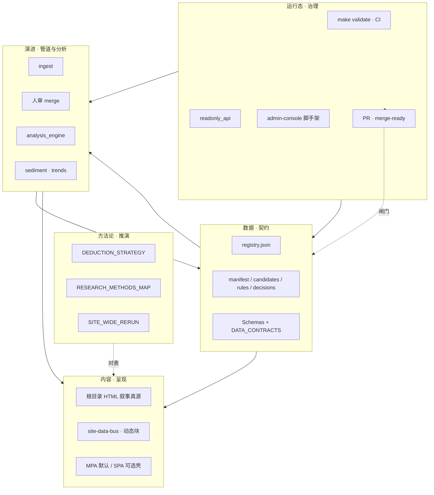

# 项目整体架构图谱（数据 · 内容 · 演进 · 方法论 · 运行态）

**定位**：用**一张总图 + 五维索引**把仓库里已分散在多篇文档中的架构叙事收束到同一入口；**不替代**各专篇契约与步骤。**维护**：增删「主链」能力或改名核心 JSON 时，请同步更新本文图示与表格，并在 **[docs/README · 文档主线](./README.md#docs-spine)** 保持互链。

**先想「怎么调用」时**：见 **[PLATFORM_MASTER_MAP_AND_INVOCATION.md](./PLATFORM_MASTER_MAP_AND_INVOCATION.md)**（内容·架构·组件总表与 **`make validate` / `merge-ready` / Playbook** 黄金路径）。

**并列速览**：**技术 / 内容 / 推演** 三架构对照见 **[ARCHITECTURE_ONE_PAGER · 三架构](./ARCHITECTURE_ONE_PAGER.md#three-architectures)**；工程数据流细图见 **[ARCHITECTURE.md](./ARCHITECTURE.md)**；**六域协同（智能化）**见 **[INTELLIGENCE_SIX_DOMAINS.md](./INTELLIGENCE_SIX_DOMAINS.md)**。

---

## 1. 五维一体（读站时按维下钻）

| 维度 | 回答什么问题 | 真源与契约 | 工程主载体 | 升级与边界 |
|------|----------------|------------|------------|------------|
| **数据** | 哪些 JSON/SQLite 是事实？谁校验？ | **[DATA_CONTRACTS.md](./DATA_CONTRACTS.md)** · **[schemas/README.md](./schemas/README.md)** | `assets/*.json`、`data/`、`scripts/evolution-registry.json` | **[ARCHITECTURE_UPGRADE · §2.1—2.2](./ARCHITECTURE_UPGRADE_AND_EXTENSIONS.md#upgrade-tiers)**（契约、`schema_version`）· **[DATA_STORES_AND_FUTURE_DB_ARCHITECTURE.md](./DATA_STORES_AND_FUTURE_DB_ARCHITECTURE.md)**（可选服务器库/CDC） |
| **内容** | 叙事与版式真源在哪？动态块从哪读数？ | **[DATA_ANALYSIS_SITE_CONTENT_SYNC.md](./DATA_ANALYSIS_SITE_CONTENT_SYNC.md)** · **[SITE_DATA_UPDATE_FRAMEWORK.md](./SITE_DATA_UPDATE_FRAMEWORK.md)** | 根目录 **`.html`**、`partials/`、总线 **`site-data-bus.js`** | 引擎**不写 HTML**；见 **[PLATFORM_EXTENSIBILITY · 智能化边界](./PLATFORM_EXTENSIBILITY_AND_EVOLUTION.md#automation-and-evolution)** |
| **演进（工程）** | 候选 → 人审 → manifest → 分析 → 沉淀 → 趋势怎么走？ | **[ARCHITECTURE.md](./ARCHITECTURE.md)**（mermaid 主链）· **[EVOLUTION_RUNBOOK.md](./EVOLUTION_RUNBOOK.md)** | `ingest_*`、`merge_candidates_to_manifest`、`analysis_engine`、`sediment_trends` | **不自动写已审 manifest**；**[AGENTS.md](../AGENTS.md)** |
| **方法论（推演）** | 认识论、研究方法与站内页、沙盘如何对表？ | **[DEDUCTION_STRATEGY.md](./DEDUCTION_STRATEGY.md)** · **[RESEARCH_METHODS_MAP.md](./RESEARCH_METHODS_MAP.md)** · **[SITE_WIDE_RERUN_DEDUCTION_PLAYBOOK.md](./SITE_WIDE_RERUN_DEDUCTION_PLAYBOOK.md)** | 综合推演、synthesis、lab 等分页叙事 + 规则 JSON | 与 **[TECH_ARCHITECTURE_CAPABILITIES · §3](./TECH_ARCHITECTURE_CAPABILITIES.md#evolution)** 工程「进化能力」对读 |
| **运行态** | 如何校验、CI、Docker、只读 API、管理端脚手架？ | **[INTEGRATION_AND_READONLY_API.md](./INTEGRATION_AND_READONLY_API.md)** · **[DOCKER.md](./DOCKER.md)** · **[MERGE_AND_RELEASE_CHECKLIST.md](./MERGE_AND_RELEASE_CHECKLIST.md)** | **`make validate`**、`run_validate.sh`、`readonly_api`、`admin-console/`、Compose profile **`api` / `admin`** | 合并前 **`make merge-ready`**；管理端见 **[ADMIN_WEB_CONSOLE_ROADMAP.md](./ADMIN_WEB_CONSOLE_ROADMAP.md)** |

---

## 2. 总图（五维 + 三架构叠合）

下列 **mermaid** 强调**责任边界**与**读数方向**，细粒度步骤以 **[ARCHITECTURE.md](./ARCHITECTURE.md)** 为准。

---

## 3. 与「六域协同」的快速对表

| 六域（INTELLIGENCE） | 在上图中最接近的块 |
|----------------------|-------------------|
| **数据** | `data` |
| **管道** | `evo` 左段（ingest、artifact） |
| **分析** | `evo` 右段（快照、沉淀、趋势） |
| **前端** | `content` |
| **运维** | `run`（含 Docker、只读 API、**admin-console**） |
| **治理** | `run` 中 PR / **merge-ready** / 人审不变量 |

`evolution_pkg` 子模块域归属见 **`scripts/evolution_pkg/domains.py`**（单测 **`test_evolution_pkg`** 约束登记）。

---

## 4. 架构升级落点（不在本文展开论证）

| 诉求 | 先读 |
|------|------|
| **按阶段升级（执行指南）** | **[PHASED_UPGRADE_EXECUTION_GUIDE.md](./PHASED_UPGRADE_EXECUTION_GUIDE.md)** |
| **模块全量梳理与升级矩阵**（七类 · 脚本簇 · evolution_pkg · 阶段对表） | **[MODULE_INVENTORY_AND_ARCHITECTURE_UPGRADE_MATRIX.md](./MODULE_INVENTORY_AND_ARCHITECTURE_UPGRADE_MATRIX.md)** |
| **可执行改造全景**（决策图 · 分域矩阵 · 阶段执行卡 · 验收表） | **[ARCHITECTURE_UPGRADE_ROADMAP.md](./ARCHITECTURE_UPGRADE_ROADMAP.md)** |
| **增量构建与调试**（提前接组件 · PR 切片） | **[INCREMENTAL_BUILD_PLAYBOOK.md](./INCREMENTAL_BUILD_PLAYBOOK.md)** |
| 不变量与阶段 0—3 | **[ARCHITECTURE_UPGRADE_AND_EXTENSIONS.md](./ARCHITECTURE_UPGRADE_AND_EXTENSIONS.md)** |
| 分层 + backlog 简版 | **[TECH_ARCHITECTURE_AND_UPGRADE_BRIEF.md](./TECH_ARCHITECTURE_AND_UPGRADE_BRIEF.md)** |
| 编排器 / Kafka 何时引入 | **[ORCHESTRATION_AND_EVENT_STREAMING.md](./ORCHESTRATION_AND_EVENT_STREAMING.md)** |
| 插槽、四轨、新增能力检查单 | **[PLATFORM_EXTENSIBILITY_AND_EVOLUTION.md](./PLATFORM_EXTENSIBILITY_AND_EVOLUTION.md)** |
| 读者预期与发布前人工清单 | **[PLATFORM_CAPABILITY_MAP · §7](./PLATFORM_CAPABILITY_MAP.md#reader-and-release)** |

---

## 5. 命令脊（验收用）

| 目的 | 命令 |
|------|------|
| 全闸门（与 pre-commit / CI **validate** 一致） | **`make validate`** |
| 合并前推荐（含只读 API + 管理端烟测） | **`make merge-ready`** |
| 快速子集（无 manifest 对账等） | **`make test`** |
| SPA 生产构建（CI 按路径触发） | **`make spa-build`** |
| 脚本与目标表 | **[scripts/README.md](../scripts/README.md)** |

---

## 延伸阅读

- **平台总览与合理调用**：[PLATFORM_MASTER_MAP_AND_INVOCATION.md](./PLATFORM_MASTER_MAP_AND_INVOCATION.md)  
- **按阶段升级执行指南**：[PHASED_UPGRADE_EXECUTION_GUIDE.md](./PHASED_UPGRADE_EXECUTION_GUIDE.md)  
- **模块全量梳理与架构升级矩阵**：[MODULE_INVENTORY_AND_ARCHITECTURE_UPGRADE_MATRIX.md](./MODULE_INVENTORY_AND_ARCHITECTURE_UPGRADE_MATRIX.md)  
- **可落地升级路线图**：[ARCHITECTURE_UPGRADE_ROADMAP.md](./ARCHITECTURE_UPGRADE_ROADMAP.md)  
- **增量构建 playbook**：[INCREMENTAL_BUILD_PLAYBOOK.md](./INCREMENTAL_BUILD_PLAYBOOK.md)  
- **文档主线表**：[docs/README.md · #docs-spine](./README.md#docs-spine)  
- **三架构一页纸**：[ARCHITECTURE_ONE_PAGER.md](./ARCHITECTURE_ONE_PAGER.md)  
- **平台四条支柱**：[PLATFORM_CAPABILITY_MAP.md](./PLATFORM_CAPABILITY_MAP.md)  
- **分端设计**：[USER_ADMIN_SPLIT_AND_EVOLUTION_DESIGN.md](./USER_ADMIN_SPLIT_AND_EVOLUTION_DESIGN.md)  
- **内容草稿插槽**：[scripts/draft/README.md](../scripts/draft/README.md)

---

*与主分支同步；重大架构叙事变更时请更新 §1—§3 并检查各入口互链。*
