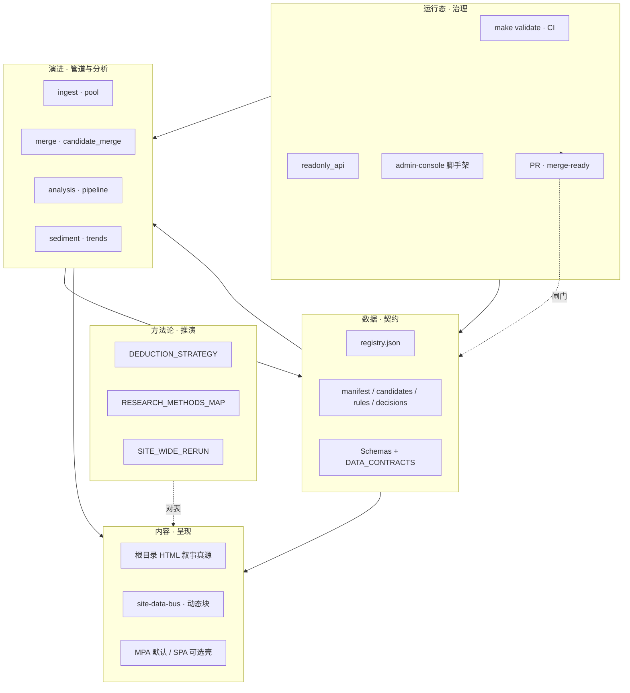

# 项目整体架构图谱（数据 · 内容 · 演进 · 方法论 · 运行态）

**定位**：用**一张总图 + 五维索引**把仓库里已分散在多篇文档中的架构叙事收束到同一入口；**不替代**各专篇契约与步骤。**维护**：增删「主链」能力或改名核心 JSON 时，请同步更新本文图示与表格，并在 **[docs/README · 文档主线](./README.md#docs-spine)** · **[常见改动最短链 · #quick-paths](./README.md#quick-paths)** 保持互链。

**角色判型**（读者 / 贡献 / 数据 / 部署 → 第一站）：根 [README · 产品视角](../README.md#pm-four-journeys) · [总览 MPA · 四条动线卡](../index.html#index-intent-pick) · [README · 从这里开始](../README.md#readme-start-here) · [README · 双轨真源](../README.md#readme-dual-track-map)。**读站顺序（含步骤 0）**：[PLATFORM_CAPABILITY_MAP · §5](./PLATFORM_CAPABILITY_MAP.md#reading-order)。

**架构师梳理与持续改进**：[ARCHITECTURE_ONE_PAGER · 五步表](./ARCHITECTURE_ONE_PAGER.md#architect-stewardship) · [不变量索引](./ARCHITECTURE_ONE_PAGER.md#architect-invariants-index) · [开 PR 前速览](../CONTRIBUTING.md#contributing-five-minute) · [PR 证据三联](../CONTRIBUTING.md#contributing-pr-evidence-triad) · [动手→命令速查](../CONTRIBUTING.md#contributing-change-to-command)。**五条架构红线（约五分钟）**：[ARCHITECTURE_ONE_PAGER · 不变量索引](./ARCHITECTURE_ONE_PAGER.md#architect-invariants-index)。

**自动化助手收束**：[AGENTS.md · 框架判型](../AGENTS.md#agents-content-framework) · [合并前](../AGENTS.md#agents-pre-merge) · [人审闸门](../AGENTS.md#agents-invariants)。

**先想「怎么调用」时**：见 **[PLATFORM_MASTER_MAP_AND_INVOCATION.md](./PLATFORM_MASTER_MAP_AND_INVOCATION.md)**（内容·架构·组件总表与 **`make validate` / `merge-ready` / Playbook** 黄金路径）。

**并列速览**：**技术 / 内容 / 推演** 三架构对照见 **[ARCHITECTURE_ONE_PAGER · 三架构](./ARCHITECTURE_ONE_PAGER.md#three-architectures)**；工程数据流细图见 **[ARCHITECTURE.md](./ARCHITECTURE.md)**；**技术栈详版（分层表 · 能力地图 · 进化含义）**见 **[TECH_BRIEF · 附录](./TECH_ARCHITECTURE_AND_UPGRADE_BRIEF.md#appendix-tech-capabilities)**（[旧文件名别名](./TECH_ARCHITECTURE_CAPABILITIES.md)）；**多篇防散读法**见 **[docs/README · #tech-stack-read-merge](./README.md#tech-stack-read-merge)**。**六域协同（智能化）**见 **[INTELLIGENCE_SIX_DOMAINS.md](./INTELLIGENCE_SIX_DOMAINS.md)**（**[§2.2 读者面版式](./INTELLIGENCE_SIX_DOMAINS.md#reader-layout-contract)**）。**主链联动与验收入口**见 **[§1a](#module-linkage-validation)**；**物理分层与按需优化**见 **[§1b](#physical-layout)**；**读者面 × 管理面按模块一页表**见 **[docs/README · #front-back-modules](./README.md#front-back-modules)**；**可执行单元 × 主链**见 **[docs/README · #system-components-fusion](./README.md#system-components-fusion)**。

**五维 · 六域 · 七类（勿混粒度）**：**五维** = 本章 **[§1 五维一体](#five-lenses)**（读站/改版时按「数据·内容·演进·方法论·运行态」下钻）；**六域** = **[INTELLIGENCE · §2](./INTELLIGENCE_SIX_DOMAINS.md#six-domains)** 的排期与 PR 自检分工，与 **[§3 对表](#six-domains-map)** 叠在总图上；**七类** = **[ARCHITECTURE · 七类模块](./ARCHITECTURE.md#seven-layers)** 的工程分层。三者互补，**不是**同一套可互换标签。

---

## 1. 五维一体（读站时按维下钻）

| 维度 | 回答什么问题 | 真源与契约 | 工程主载体 | 升级与边界 |
|------|----------------|------------|------------|------------|
| **数据** | 哪些 JSON/SQLite 是事实？谁校验？ | **[DATA_CONTRACTS.md](./DATA_CONTRACTS.md)** · **[schemas/README.md](./schemas/README.md)** | `assets/*.json`、`data/`、`scripts/evolution-registry.json`；ingest 规则夹具 **`fixtures/ai_mapping_golden/`**（**[§2](./DATA_CONTRACTS.md#signals-candidates)**） | **[ARCHITECTURE_UPGRADE · §2.1—2.2](./ARCHITECTURE_UPGRADE_AND_EXTENSIONS.md#upgrade-tiers)**（契约、`schema_version`）· **[DATA_STORES_AND_FUTURE_DB_ARCHITECTURE.md](./DATA_STORES_AND_FUTURE_DB_ARCHITECTURE.md)**（可选服务器库/CDC） |
| **内容** | 叙事与版式真源在哪？动态块从哪读数？ | **[DATA_ANALYSIS_SITE_CONTENT_SYNC.md](./DATA_ANALYSIS_SITE_CONTENT_SYNC.md)** · **[SITE_DATA_UPDATE_FRAMEWORK.md](./SITE_DATA_UPDATE_FRAMEWORK.md)** · **[INTELLIGENCE · §2.2](./INTELLIGENCE_SIX_DOMAINS.md#reader-layout-contract)**（枢纽 MPA **纯 CSS** 模块，非总线登记） | 根目录 **`.html`**、`partials/`、总线 **`site-data-bus.js`** | 引擎**不写 HTML**；见 **[PLATFORM_EXTENSIBILITY · 智能化边界](./PLATFORM_EXTENSIBILITY_AND_EVOLUTION.md#automation-and-evolution)** |
| **演进（工程）** | 候选 → 人审 → manifest → 分析 → 沉淀 → 趋势怎么走？ | **[ARCHITECTURE.md](./ARCHITECTURE.md)**（mermaid 主链）· **[EVOLUTION_RUNBOOK.md](./EVOLUTION_RUNBOOK.md)** | **`ingest_opinion_law.py`**（薄 CLI → **`ingest_opinion_pool`**）、**`merge_candidates_to_manifest.py`**（薄 → **`candidate_merge`**）、**`analysis_engine.py`**（薄 → **`analysis_pipeline`**）、**`sediment_trends`**；等价 **`-m evolution_pkg.*`** 见 **[scripts/README · 收束队列](../scripts/README.md#pkg-migrate-queue)** | **不自动写已审 manifest**；**[AGENTS.md](../AGENTS.md#agents-invariants)** |
| **方法论（推演）** | 认识论、研究方法与站内页、沙盘如何对表？ | **[DEDUCTION_STRATEGY.md](./DEDUCTION_STRATEGY.md)** · **[RESEARCH_METHODS_MAP.md](./RESEARCH_METHODS_MAP.md)** · **[SITE_WIDE_RERUN_DEDUCTION_PLAYBOOK.md](./SITE_WIDE_RERUN_DEDUCTION_PLAYBOOK.md)** | 综合推演、synthesis、lab 等分页叙事 + 规则 JSON | 与 **[TECH_BRIEF · 附录 3](./TECH_ARCHITECTURE_AND_UPGRADE_BRIEF.md#appendix-evolution)** 工程「进化能力」对读 |
| **运行态** | 如何校验、CI、Docker、只读 API、管理端脚手架？ | **[INTEGRATION_AND_READONLY_API.md](./INTEGRATION_AND_READONLY_API.md)** · **[DOCKER.md](./DOCKER.md)** · **[MERGE_AND_RELEASE_CHECKLIST.md](./MERGE_AND_RELEASE_CHECKLIST.md#pre-merge)** · **[MERGE · partials 手顺](./MERGE_AND_RELEASE_CHECKLIST.md#pre-merge-partials-sequence)** | **`make validate`**、`run_validate.sh`、`readonly_api`、`admin-console/`、Compose profile **`api` / `admin`** | 合并前 **`make merge-ready`**；管理端见 **[ADMIN_WEB_CONSOLE_ROADMAP.md](./ADMIN_WEB_CONSOLE_ROADMAP.md)** · **`admin-console`** 单页 **[ADMIN_CONSOLE · §7](./ADMIN_CONSOLE_FRAMEWORK_OVERVIEW.md#admin-module-plan)** |

### 1a 主链模块联动与验收入口

跨模块改动（注册表、顶栏、SPA、总线、分析、`evolution_pkg`）时按**联动面**打点；日常「先判型再动手」见 **[INTELLIGENCE · 持续分析优化](./INTELLIGENCE_SIX_DOMAINS.md#continuous-analysis-optimization)**。**按改动类型的最短链**（与文档主线 **0c** 同锚）：**[docs/README · #quick-paths](./README.md#quick-paths)** · **[MODULE · §1a 七类→包/脚本](./MODULE_INVENTORY_AND_ARCHITECTURE_UPGRADE_MATRIX.md#seven-class-pkg-quick)**。

| 联动面 | 关键产物 / 路径 | 推荐验证 |
|--------|-----------------|----------|
| **注册表 · 导航 · SPA** | `scripts/evolution-registry.json`、`partials/site-nav.inc.html`、`spa/nav.config.json`、`spa/src/navLinks.ts` | **`make test`**（含 **`check_nav_links_registry`**）；改顶栏后 **`make sync-nav`**（**`maintainer-hub.html`** 五链后三锚由 **`build_skip_bar`** 生成，勿手改 HTML）；**`404.html`** 改 **`partials/`** 后须**手调**；全壳 **`make spa-build`**（与 CI **`spa-build`** 条件一致；其前含 **`spa-sync`**）；改根 **`.html`** 且验壳内 **`spa/public/`** 时另 **`make spa-sync`**（[MERGE · §1](./MERGE_AND_RELEASE_CHECKLIST.md#pre-merge) · [MERGE · partials 手顺](./MERGE_AND_RELEASE_CHECKLIST.md#pre-merge-partials-sequence) · [关系视图](../maintainer-hub.html#mh-spine-map) · [系统边界](../maintainer-hub.html#mh-boundaries) · [衔接矩阵](../maintainer-hub.html#mh-reader-admin-matrix)） |
| **总线读数** | `assets/site-data-bus.js`、根 **`*.html`** 中 **`[data-site-data-live]`** | **[SITE_DATA_UPDATE_FRAMEWORK](./SITE_DATA_UPDATE_FRAMEWORK.md)**；**`make validate`**；纯版式见 **[INTELLIGENCE · §2.2](./INTELLIGENCE_SIX_DOMAINS.md#reader-layout-contract)** |
| **分析管道** | **`analysis_engine.py`**（薄 CLI；**`evolution_pkg.analysis_pipeline`**）· **`assets/analysis-snapshot.json`**、沉淀/趋势 | **`make validate`**（含 **`analysis_engine --check`**，与 **``-m evolution_pkg.analysis_pipeline --check``** 等价） |
| **`evolution_pkg` 域映射** | `scripts/evolution_pkg/**`、`domains.py` | **`make test`** → **`test_evolution_pkg`** |
| **ingest 规则黄金集** | `fixtures/ai_mapping_golden/`、`validate_golden_mapping.py` | **`make validate`** |
| **PR 习惯与分列** | 六域、版式 vs 总线、阶段升级 | **[INTELLIGENCE · 进化与优化](./INTELLIGENCE_SIX_DOMAINS.md#evolution-and-optimization)** · **[PLATFORM · §6](./PLATFORM_CAPABILITY_MAP.md#enhance-checklist)** |

### 1b 仓库物理分层（分布 → 按需优化）

**横向总表（真源分层与预期）**与下表对读：**[docs/README · #content-framework](./README.md#content-framework)** · **[#front-back-modules](./README.md#front-back-modules)**（读者面 / 管理面分列，防混读）· **[#system-components-fusion](./README.md#system-components-fusion)**（进程/服务串主链）。

| 分层 | 典型路径 | 动刀前先读 |
|------|----------|------------|
| **读者 MPA** | 根 **`*.html`**、`partials/` | **[SITE_REVIEW](./SITE_REVIEW_THREE_PASSES.md)** · **[INTELLIGENCE · §2.2](./INTELLIGENCE_SIX_DOMAINS.md#reader-layout-contract)** · [关系视图](../maintainer-hub.html#mh-spine-map) · [系统边界](../maintainer-hub.html#mh-boundaries) · [衔接矩阵](../maintainer-hub.html#mh-reader-admin-matrix) |
| **静态资源** | **`assets/*.js`**、**`assets/site.css`**、**`assets/*.json`**（真源） | **[SITE_DATA_UPDATE_FRAMEWORK](./SITE_DATA_UPDATE_FRAMEWORK.md)** · **[DATA_CONTRACTS](./DATA_CONTRACTS.md)** |
| **闸门与平铺 CLI** | **`scripts/run_validate.sh`**、`scripts/*.py`（校验/薄壳入口；**编排真源**多在 **`evolution_pkg`**） | **[MODULE_INVENTORY · §3](./MODULE_INVENTORY_AND_ARCHITECTURE_UPGRADE_MATRIX.md#scripts-cluster)** · **[scripts/README](../scripts/README.md#pkg-migrate-queue)** |
| **包化逻辑（六域登记）** | **`scripts/evolution_pkg/`**、`domains.py` | **[MODULE_INVENTORY · §2](./MODULE_INVENTORY_AND_ARCHITECTURE_UPGRADE_MATRIX.md#evolution-pkg)** · **[INTELLIGENCE · §6a](./INTELLIGENCE_SIX_DOMAINS.md#code-mapping)** |
| **双轨 SPA** | **`spa/`** | **[spa/README](../spa/README.md)** · **`make spa-build`** |
| **管理端脚手架** | **`admin-console/`** | **[ADMIN_WEB_CONSOLE_ROADMAP](./ADMIN_WEB_CONSOLE_ROADMAP.md)** · **[ADMIN_CONSOLE · §7](./ADMIN_CONSOLE_FRAMEWORK_OVERVIEW.md#admin-module-plan)**（**`mod-*`** · **`#mod-api`→`#mod-analysis`**） |
| **契约与文档** | **`docs/`**、`docs/schemas/` | **[DATA_CONTRACTS](./DATA_CONTRACTS.md)** · **[文档主线](./README.md#docs-spine)** |
| **规则黄金集** | **`fixtures/ai_mapping_golden/`** | **[DATA_CONTRACTS · §2](./DATA_CONTRACTS.md#signals-candidates)** |

拆 PR 时**纵向**尽量只触一层；跨层时按 **[INTELLIGENCE · 持续分析优化](./INTELLIGENCE_SIX_DOMAINS.md#continuous-analysis-optimization)** 先判型。

---

## 2. 总图（五维 + 三架构叠合）

下列 **mermaid** 强调**责任边界**与**读数方向**，细粒度步骤以 **[ARCHITECTURE.md](./ARCHITECTURE.md)** 为准。

---

## 3. 与「六域协同」的快速对表

| 六域（INTELLIGENCE） | 在上图中最接近的块 |
|----------------------|-------------------|
| **数据** | `data` |
| **管道** | `evo` 左段（ingest、artifact） |
| **分析** | `evo` 右段（快照、沉淀、趋势） |
| **前端** | `content` |
| **运维** | `run`（含 Docker、只读 API、**admin-console**） |
| **治理** | `run` 中 PR / **merge-ready** / 人审不变量 |

**前端域（静态版式）**：上图 **`content`** 侧重「叙事 HTML + 总线读数」；首屏 **`modular-intro-stack` / `toc--pilot`** 等 **CSS 契约**见 **[INTELLIGENCE_SIX_DOMAINS · §2.2](./INTELLIGENCE_SIX_DOMAINS.md#reader-layout-contract)**。

`evolution_pkg` 当前 **26** 个顶层子模块域归属见 **`scripts/evolution_pkg/domains.py`**（单测 **`test_evolution_pkg`** 约束「目录 ≡ **`SUBMODULE_DOMAIN`** 键」；全表 **[MODULE_INVENTORY · §2](./MODULE_INVENTORY_AND_ARCHITECTURE_UPGRADE_MATRIX.md#evolution-pkg)**）。

---

## 4. 架构升级落点（不在本文展开论证）

| 诉求 | 先读 |
|------|------|
| **按阶段升级（执行指南）** | **[PHASED_UPGRADE_EXECUTION_GUIDE.md](./PHASED_UPGRADE_EXECUTION_GUIDE.md)** |
| **模块全量梳理与升级矩阵**（七类 · 脚本簇 · evolution_pkg · 阶段对表） | **[MODULE_INVENTORY_AND_ARCHITECTURE_UPGRADE_MATRIX.md](./MODULE_INVENTORY_AND_ARCHITECTURE_UPGRADE_MATRIX.md)** |
| **可执行改造全景**（决策图 · 分域矩阵 · 阶段执行卡 · 验收表） | **[ARCHITECTURE_UPGRADE_ROADMAP.md](./ARCHITECTURE_UPGRADE_ROADMAP.md)** |
| **增量构建与调试**（提前接组件 · PR 切片） | **[INCREMENTAL_BUILD_PLAYBOOK.md](./INCREMENTAL_BUILD_PLAYBOOK.md)** |
| 不变量与阶段 0—3 | **[ARCHITECTURE_UPGRADE_AND_EXTENSIONS.md](./ARCHITECTURE_UPGRADE_AND_EXTENSIONS.md)** |
| 分层 + backlog 简版；**详版分层表 / Mermaid / 能力地图** | **[TECH_BRIEF 简版](./TECH_ARCHITECTURE_AND_UPGRADE_BRIEF.md)**（§1—§4）· **[附录](./TECH_ARCHITECTURE_AND_UPGRADE_BRIEF.md#appendix-tech-capabilities)**（[别名](./TECH_ARCHITECTURE_CAPABILITIES.md)） |
| 编排器 / Kafka 何时引入 | **[ORCHESTRATION_AND_EVENT_STREAMING.md](./ORCHESTRATION_AND_EVENT_STREAMING.md)** |
| 插槽、四轨、新增能力检查单 | **[PLATFORM_EXTENSIBILITY_AND_EVOLUTION.md](./PLATFORM_EXTENSIBILITY_AND_EVOLUTION.md)** |
| 读者预期与发布前人工清单 | **[PLATFORM_CAPABILITY_MAP · §7](./PLATFORM_CAPABILITY_MAP.md#reader-and-release)** |

---

## 5. 命令脊（验收用）

| 目的 | 命令 |
|------|------|
| 全闸门（与 pre-commit / CI **validate** 一致） | **`make validate`** |
| 本地迭代（子集；**不**替代合并前全闸门；**CI / pre-commit 不跑**） | **`make validate-fast`** |
| 清理旧 **`pipeline-metrics`** 遥测（消除 validate 对旧格式的跳过提示） | **`make clean-pipeline-metrics-dry-run`** · **`make clean-pipeline-metrics`** |
| 合并前推荐（含只读 API + 管理端烟测） | **`make merge-ready`** |
| 快速子集（无 manifest 对账等） | **`make test`** |
| SPA 生产构建（CI 按路径触发） | **`make spa-build`** |
| 脚本与目标表 | **[scripts/README.md](../scripts/README.md)** |

---

## 延伸阅读

- **平台总览与合理调用**：[PLATFORM_MASTER_MAP_AND_INVOCATION.md](./PLATFORM_MASTER_MAP_AND_INVOCATION.md)  
- **技术栈详版（与 ARCHITECTURE 七类互补）**：[TECH_BRIEF · 附录](./TECH_ARCHITECTURE_AND_UPGRADE_BRIEF.md#appendix-tech-capabilities)（[别名](./TECH_ARCHITECTURE_CAPABILITIES.md)）· [docs/README · #tech-stack-read-merge](./README.md#tech-stack-read-merge)  
- **按阶段升级执行指南**：[PHASED_UPGRADE_EXECUTION_GUIDE.md](./PHASED_UPGRADE_EXECUTION_GUIDE.md)  
- **模块全量梳理与架构升级矩阵**：[MODULE_INVENTORY_AND_ARCHITECTURE_UPGRADE_MATRIX.md](./MODULE_INVENTORY_AND_ARCHITECTURE_UPGRADE_MATRIX.md)  
- **可落地升级路线图**：[ARCHITECTURE_UPGRADE_ROADMAP.md](./ARCHITECTURE_UPGRADE_ROADMAP.md)  
- **增量构建 playbook**：[INCREMENTAL_BUILD_PLAYBOOK.md](./INCREMENTAL_BUILD_PLAYBOOK.md)  
- **文档主线表**：[docs/README.md · #docs-spine](./README.md#docs-spine)  
- **三架构一页纸**：[ARCHITECTURE_ONE_PAGER.md](./ARCHITECTURE_ONE_PAGER.md)  
- **平台四条支柱**：[PLATFORM_CAPABILITY_MAP.md](./PLATFORM_CAPABILITY_MAP.md)  
- **分端设计**：[USER_ADMIN_SPLIT_AND_EVOLUTION_DESIGN.md](./USER_ADMIN_SPLIT_AND_EVOLUTION_DESIGN.md)  
- **内容草稿插槽**：[scripts/draft/README.md](../scripts/draft/README.md)

---

*与主分支同步；重大架构叙事变更时请更新 §1—§3 并检查各入口互链。*
