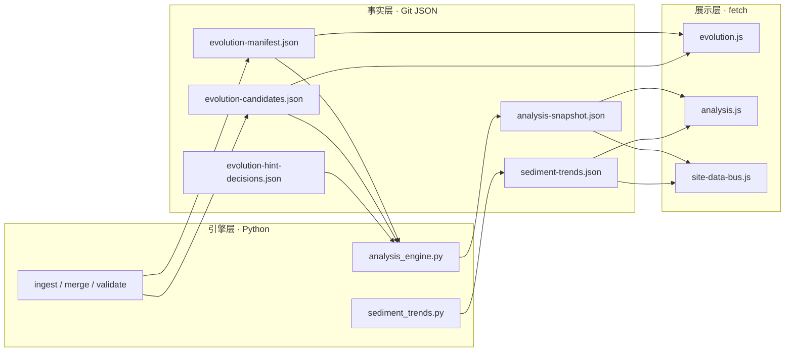

# 全站推演内容 · 数据与分析引擎驱动的更新框架

本文说明：在**静态站点**前提下，如何让「推演相关读数」随 **JSON 数据** 与 **分析引擎** 产出**自动对齐**，并与**人工叙事**划清边界。

**全站分页模块、叙事正文 vs 动态块**如何被数据与分析更新，见 **[DATA_ANALYSIS_SITE_CONTENT_SYNC.md](./DATA_ANALYSIS_SITE_CONTENT_SYNC.md)**。**全站梳理后按纪律重新推演并决定更新落点**见 **[SITE_WIDE_RERUN_DEDUCTION_PLAYBOOK.md](./SITE_WIDE_RERUN_DEDUCTION_PLAYBOOK.md)**。

在 **[三架构对照](./ARCHITECTURE_ONE_PAGER.md#three-architectures)** 中，本文主要衔接**技术架构**（读数总线、`fetch` 契约）与**内容架构**（叙事 vs 自动块边界）。

## 1. 「自动更新」在本站指什么

| 含义 | 是 | 否 |
|------|----|----|
| 运行 `make analyze`（及 ingest / merge 等）后，**提交**更新的 `assets/*.json` | ✓ | |
| 读者**刷新页面**时，浏览器 `fetch` 到**最新已提交 JSON**，展示层随之变化 | ✓ | |
| 不提交、不部署，远端 Pages **自行**变数字 | | ✓（须 CI artifact 合并进 `main` 或本地 push） |
| 分析引擎**直接改写**各页 HTML 正文 | | ✓（违反 [ARCHITECTURE.md · 内容生成边界](ARCHITECTURE.md#seven-layers)） |
| 用模型批量生成「终局预言」 | | ✓（本站定性脚手架，非预测） |

**结论**：真相在 **Git 内的 JSON**；**自动更新** = **管道写 JSON + 前端读 JSON**。叙事长文仍由人编辑 `.html`，数据块由脚本挂载。

## 2. 三层结构（与 ARCHITECTURE 对齐）

## 3. 消费方登记（扩展页时查此表）

| 数据文件 | 主要字段（读者可见摘要） | 前端消费者 | 典型页面 |
|----------|--------------------------|------------|----------|
| `evolution-manifest.json` + `evolution-candidates.json` | 信号卡片、`maps_to`、`lab_factors` | `evolution.js` | `lab.html`、`evolution-loop.html`、`national-strategy-opinion.html` |
| `evolution-hint-decisions.json` | 闭环落实统计 | `closure-summary.js`（与 manifest 规则对表） | `evolution-loop.html` |
| `analysis-snapshot.json` | 热力、共现、`evolution_hints`、`hint_closure_gaps`、`run` | `analysis.js`（全量仪表盘） | `analysis-hub.html` |
| `sediment-trends.json` | 跨日持久度、`longterm_hints` | `analysis.js` | `analysis-hub.html` |
| `analysis-snapshot.json`（+ 可选 trends） | 当日样本数、`run_id`、因子 Top 等**一行摘要** | **`site-data-bus.js`** | 已挂载（根目录 HTML，字母序）：`analysis-hub.html`（`snapshot-only` + `data-site-data-hub="#dashboard"`，与同页 `analysis.js` 共用 `loadSnapshot` 缓存）、`architecture.html`、`decade-scenes.html`、`decade-us.html`、`decade.html`、`edu-nexus.html`、`evolvable-architecture.html`、`evolution-loop.html`、`evolution-triad.html`、`index.html`、`intelligent-evolution.html`、`lab.html`、`legacy-all-in-one.html`（单页归档、内联条带样式，不引 `site.css`）、`model.html`、`modules-map.html`、`national-strategy-opinion.html`、`net-biz-capital.html`、`nexus.html`、`past-future.html`、`risk-geo.html`、`smart-overhaul.html`、`social-responsibility-evolution.html`、`synthesis-extensions.html`、`synthesis-methods.html`、`synthesis.html`、`timeline.html`、`work-infra-energy.html`。任意页可加 `data-site-data-live` 占位；**仅快照、不请求趋势**时用 `data-site-data-live="snapshot-only"`；**仪表盘链接改成本页锚点**时用 `data-site-data-hub="#…"` |

**新增一页「数据驱动区块」的步骤**：

1. 在 HTML 放入占位：`<aside class="card site-data-live-strip-host" data-site-data-live aria-live="polite" hidden></aside>`（脚本会短暂展示「正在加载」再填入读数）。若**不要**请求 `sediment-trends.json`，使用 `data-site-data-live="snapshot-only"`。若「分析引擎仪表盘」链需指向本页某节，在占位上增加 `data-site-data-hub="#锚点"`（默认 `analysis-hub.html`）。
2. 在 `</body>` 前增加：``（**在**依赖 `SiteDataBus` 的脚本之前）。
3. 需要全量图表时，复制 `analysis-hub.html` 对 `analysis.js` 的用法，而非重复实现统计逻辑。
4. 大改快照结构时：递增 `schema_version`，更新 `docs/schemas/analysis-snapshot.schema.json` 与 `validate_analysis_snapshot_schema.py`。

## 4. 推荐流水线（与 README 一致）

1. `make ingest` / 人审 / `merge_candidates_to_manifest.py`（按需）
2. `make analyze` → 更新 `analysis-snapshot.json`、`data/sediment.json`（若含 `--sediment`）、`sediment-trends.json`（同一会话内已 `make validate` 且需多轮重算时可用 **`make evolution-fast`**，见 [EVOLUTION_RUNBOOK.md · 加速](./EVOLUTION_RUNBOOK.md#accelerate)）
3. `make validate` → 通过后提交（若用过 `evolution-fast`，此处**不可省**）
4. GitHub Pages / 静态托管：推送后读者下次打开即读新 JSON

定时 workflow 默认只产 **artifact**；要让线上数字变，须将 artifact **合并进仓库**再 push（见根目录 [README.md](../README.md) · 定时流水线）。

## 5. 边界与纪律

- **分析引擎**：只产出**结构化快照**与沉淀索引，**不**生成各页论述段落。
- **聚合解读**（`analysis.js` 卡片、`site-data-bus` 摘要）：**定性扫读**，须标注非预测，与 [DEDUCTION_STRATEGY.md](./DEDUCTION_STRATEGY.md)、[RESEARCH_METHODS_MAP.md](./RESEARCH_METHODS_MAP.md) 对表。
- **程序化 API**：`window.SiteDataBus` 供同域其他脚本复用；跨页共享缓存，必要时可 `SiteDataBus.clearCache()`（一般不需要）。

## 6. `SiteDataBus` 编程接口（简要）

| 方法 | 作用 |
|------|------|
| `loadSnapshot()` | `Promise<对象>`，读 `assets/analysis-snapshot.json`（带内存缓存） |
| `loadTrends()` | `Promise<对象 \| null>`，读 `assets/sediment-trends.json`，失败返回 `null` |
| `loadSiteMeta()` | `Promise<对象>`，读 `assets/site-meta.json`（站点发布版本 `site_version` 等，带内存缓存） |
| `mountLiveStrip(el, options)` | 向 DOM 节点写入摘要 HTML（内部 `loadSnapshot`） |
| `mountAllLiveStrips()` | 挂载所有 `[data-site-data-live]`（DOMContentLoaded 时自动执行） |
| `clearCache()` | 清空缓存（测试或热替换 JSON 时用；含 site-meta） |

DOMContentLoaded 时还会执行 **`mountSiteMetaVersion()`**：为所有 **`[data-site-meta-version]`** 写入 `v{site_version}`（顶栏模板见 `partials/site-nav.inc.html`）。

自定义事件：`sitedatabus:ready`，`detail.snapshot` 为快照对象，`detail.trends` 为趋势对象或 `null`（未加载、无文件或 `snapshot-only` 时为 `null`）。**`sitedatabus:meta`**：`detail.meta` 为 `site-meta.json` 对象。

---

**相关链接**：[ARCHITECTURE.md](./ARCHITECTURE.md) · [analysis-hub.html](../analysis-hub.html#panorama) · [EVOLUTION_RUNBOOK.md](./EVOLUTION_RUNBOOK.md)
