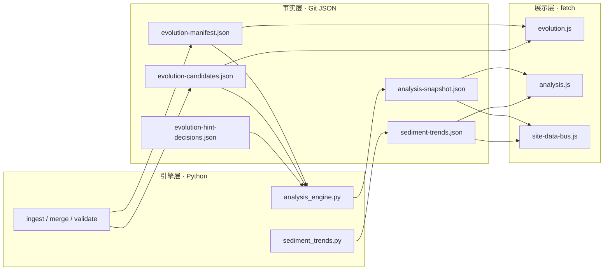

# 全站推演内容 · 数据与分析引擎驱动的更新框架

**角色判型**（读者 / 贡献 / 数据 / 部署 → 第一站）：根 [README · 产品视角](../README.md#pm-four-journeys) · [README · 从这里开始](../README.md#readme-start-here) · [README · 双轨真源](../README.md#readme-dual-track-map)。**架构师梳理与持续改进**：[ARCHITECTURE_ONE_PAGER · 五步表](./ARCHITECTURE_ONE_PAGER.md#architect-stewardship) · [不变量索引](./ARCHITECTURE_ONE_PAGER.md#architect-invariants-index) · [开 PR 前速览](../CONTRIBUTING.md#contributing-five-minute) · [PR 证据三联](../CONTRIBUTING.md#contributing-pr-evidence-triad) · [动手→命令速查](../CONTRIBUTING.md#contributing-change-to-command)。

本文说明：在**静态站点**前提下，如何让「推演相关读数」随 **JSON 数据** 与 **分析引擎** 产出**自动对齐**，并与**人工叙事**划清边界。

**全站分页模块、叙事正文 vs 动态块**如何被数据与分析更新，见 **[DATA_ANALYSIS_SITE_CONTENT_SYNC.md](./DATA_ANALYSIS_SITE_CONTENT_SYNC.md)**。**全站梳理后按纪律重新推演并决定更新落点**见 **[SITE_WIDE_RERUN_DEDUCTION_PLAYBOOK.md](./SITE_WIDE_RERUN_DEDUCTION_PLAYBOOK.md)**。

在 **[三架构对照](./ARCHITECTURE_ONE_PAGER.md#three-architectures)** 中，本文主要衔接**技术架构**（读数总线、`fetch` 契约）与**内容架构**（叙事 vs 自动块边界）。**主链联动与验收入口 · 仓库物理分层**（`assets` / `scripts` / MPA 等）：**[勿混粒度 · 五维/六域/七类](./PROJECT_ARCHITECTURE_OVERVIEW.md#architecture-grain)** · [PROJECT_ARCHITECTURE_OVERVIEW · §1a](./PROJECT_ARCHITECTURE_OVERVIEW.md#module-linkage-validation) · **[§1b](./PROJECT_ARCHITECTURE_OVERVIEW.md#physical-layout)**。**整体内容框架**：**[docs/README · #content-framework](./README.md#content-framework)** · **前后台模块一页表**：[**#front-back-modules**](./README.md#front-back-modules) · **组件×功能一条表**：[**#system-components-fusion**](./README.md#system-components-fusion)。**按改动判型**（**0c**）：**[docs/README · #quick-paths](./README.md#quick-paths)**。**总线与版式分工的索引收束**：[docs/README · 内容驱动链](./README.md#content-driven-chain)。**自动化助手（总线读数 vs 枢纽版式）**：[AGENTS.md · 架构边界](../AGENTS.md#agents-arch-boundary) · [读者惯例](../AGENTS.md#agents-reader-conventions)。**MPA 与 SPA `public/` 同源**：改根 **`.html`** 后 **`make spa-sync`**（或 **`make spa-build`**）— [MERGE · §1](./MERGE_AND_RELEASE_CHECKLIST.md#pre-merge) · [MERGE · partials 手顺](./MERGE_AND_RELEASE_CHECKLIST.md#pre-merge-partials-sequence) · [维护导读 · 关系视图](../maintainer-hub.html#mh-spine-map)。

## 1. 「自动更新」在本站指什么

| 含义 | 是 | 否 |
|------|----|----|
| 运行 `make analyze`（及 ingest / merge 等）后，**提交**更新的 `assets/*.json` | ✓ | |
| 读者**刷新页面**时，浏览器 `fetch` 到**最新已提交 JSON**，展示层随之变化 | ✓ | |
| 不提交、不部署，远端 Pages **自行**变数字 | | ✓（须 CI artifact 合并进 `main` 或本地 push） |
| 分析引擎**直接改写**各页 HTML 正文 | | ✓（违反 [ARCHITECTURE.md · 内容生成边界](ARCHITECTURE.md#seven-layers)） |
| 用模型批量生成「终局预言」 | | ✓（本站定性脚手架，非预测） |

**结论**：真相在 **Git 内的 JSON**；**自动更新** = **管道写 JSON + 前端读 JSON**。叙事长文仍由人编辑 `.html`，数据块由脚本挂载。

**纯 CSS 版式（非本文登记范围）**：枢纽长页首屏 **`modular-intro-stack` / `toc--pilot`** 等与 **`site-data-bus`** 分工见 **[INTELLIGENCE_SIX_DOMAINS · §2.2](./INTELLIGENCE_SIX_DOMAINS.md#reader-layout-contract)**——不新增 `fetch` 消费方，**无须**在本框架表登记。

## 2. 三层结构（与 ARCHITECTURE 对齐）

## 3. 消费方登记（扩展页时查此表）

| 数据文件 | 主要字段（读者可见摘要） | 前端消费者 | 典型页面 |
|----------|--------------------------|------------|----------|
| `evolution-manifest.json` + `evolution-candidates.json` | 信号卡片、`maps_to`、`lab_factors` | `evolution.js` | `lab.html`、`evolution-loop.html`、`national-strategy-opinion.html` |
| `evolution-hint-decisions.json` | 闭环落实统计 | `closure-summary.js`（与 manifest 规则对表） | `evolution-loop.html` |
| `analysis-snapshot.json` | 热力、共现、`evolution_hints`、`hint_closure_gaps`、`run` | `analysis.js`（全量仪表盘） | `analysis-hub.html` |
| `sediment-trends.json` | 跨日持久度、`longterm_hints` | `analysis.js` | `analysis-hub.html` |
| `analysis-snapshot.json`（+ 可选 trends） | 当日样本数、`run_id`、因子 Top 等**一行摘要** | **`site-data-bus.js`** | registry 内根分页均已挂载读数条（含 **`legacy-all-in-one.html`** 单页归档）。**默认**：除 **`evolution-loop.html`**、**`lab.html`** 使用 **`data-site-data-live`**（条带会 **`fetch`** **`sediment-trends.json`**）外，**其余分页均为 `snapshot-only`**（只拉快照，不拉 trends）。**`analysis-hub.html`**：`snapshot-only` + **`data-site-data-hub="#dashboard"`**，与同页 **`analysis.js`** 共用 **`SiteDataBus`** 快照缓存；跨日图表仍由 **`analysis.js`** 加载 trends。新页占位：默认 **`snapshot-only`**；若属闭环/沙盘向且需在条带露出跨日一行，再用裸 **`data-site-data-live`**；仪表盘指本页锚用 **`data-site-data-hub="#…"`** |
| `site-meta.json` | `site_version`、`codename`、`summary`、`updated` | **`site-data-bus.js`** · `mountSiteMetaVersion` | 顶栏 **`[data-site-meta-version]`**（`partials/site-nav.inc.html`）；与 **`analysis-snapshot.json` 的 `run` 块**（分析血缘）语义不同，勿混 |
| `site-search-index.json` | 各注册页 `path`、`title`（轻量搜索索引） | **`site-data-bus.js`**：`[data-site-quick-search]`（**`partials/site-nav.inc.html`** 已挂；经 **`make sync-nav`** 写入各页）；失败或缺文件时该格隐藏 | 增删 **`evolution-registry.json` · `pages`** 或改页 `<title>` 后按需 **`make site-search-index`**；**非**契约 JSON，**不入** `make validate`。**顶栏 / skip-bar 模板**变更时 **`404.html`** 须**手调**（`sync_site_nav` 不写回）— **[MERGE · §1](./MERGE_AND_RELEASE_CHECKLIST.md#pre-merge)** · **[MERGE · partials 手顺](./MERGE_AND_RELEASE_CHECKLIST.md#pre-merge-partials-sequence)** |

### 3a. 读者壳层（`site-data-bus.js` · 不占上表「新 JSON」行）

与 **`[data-site-data-live]`** 并行：`DOMContentLoaded` 时挂载 **顶缘 `.reading-progress`**（整页滚动进度，**不** `fetch` 额外文件）；若页内**尚无** `.back-to-top-fab` 且存在**主内容锚**（通常为 **`<main id="main">`**，须与 skip-bar **`#main`** 一致），则插入同款**回顶**链；顶栏 **`[data-site-quick-search]`** 则 **`fetch`** **`site-search-index.json`** 并渲染轻量过滤（索引缺失时该宿主 **`hidden`**）。关闭顶缘进度条：在 `<body>` 上加 **`data-no-reading-progress="1"`**。样式：**`assets/site.css`**（`.reading-progress`、`.site-quick-search-*`）。**不**因此新增 §3 表行；若改动涉及**新 JSON** 或**新占位属性**，仍须按 §3 步骤与 **[DATA_ANALYSIS_SITE_CONTENT_SYNC](./DATA_ANALYSIS_SITE_CONTENT_SYNC.md)** 判型。

**新增一页「数据驱动区块」的步骤**：

1. 在 HTML 放入占位：默认 **`<aside class="card site-data-live-strip-host" data-site-data-live="snapshot-only" aria-live="polite" hidden></aside>`**（不请求 `sediment-trends.json`）。闭环 / 沙盘等需在条带展示跨日摘要时，改用 **`data-site-data-live`**（无值）。若「分析引擎仪表盘」链需指向本页某节，在占位上增加 `data-site-data-hub="#锚点"`（默认 `analysis-hub.html`）。
2. 在 `</body>` 前增加：``（**在**依赖 `SiteDataBus` 的脚本之前）。
3. 需要全量图表时，复制 `analysis-hub.html` 对 `analysis.js` 的用法，而非重复实现统计逻辑。
4. 大改快照结构时：递增 `schema_version`，更新 `docs/schemas/analysis-snapshot.schema.json` 与 `validate_analysis_snapshot_schema.py`。

## 4. 推荐流水线（与 README 一致）

1. `make ingest` / 人审 / `merge_candidates_to_manifest.py`（按需）
2. `make analyze` → 更新 `analysis-snapshot.json`、`data/sediment.json`（若含 `--sediment`）、`sediment-trends.json`（同一会话内已 `make validate` 且需多轮重算时可用 **`make evolution-fast`**，见 [EVOLUTION_RUNBOOK.md · 加速](./EVOLUTION_RUNBOOK.md#accelerate)）
3. `make validate` → 通过后提交（若用过 `evolution-fast`，此处**不可省**）
4. GitHub Pages / 静态托管：推送后读者下次打开即读新 JSON

定时 workflow 默认只产 **artifact**；要让线上数字变，须将 artifact **合并进仓库**再 push（见根目录 [README.md](../README.md) · 定时流水线）。

## 5. 边界与纪律

- **分析引擎**：只产出**结构化快照**与沉淀索引，**不**生成各页论述段落。
- **聚合解读**（`analysis.js` 卡片、`site-data-bus` 摘要）：**定性扫读**，须标注非预测，与 [DEDUCTION_STRATEGY.md](./DEDUCTION_STRATEGY.md)、[RESEARCH_METHODS_MAP.md](./RESEARCH_METHODS_MAP.md) 对表。
- **读者壳层**（顶缘进度、条件回顶）：见 **[§3a](#reader-chrome)**；与叙事/CSS 改版分开判型，避免把壳层改动登记成新 `fetch` 消费方。
- **程序化 API**：`window.SiteDataBus` 供同域其他脚本复用；跨页共享缓存，必要时可 `SiteDataBus.clearCache()`（一般不需要）。

## 6. `SiteDataBus` 编程接口（简要）

| 方法 | 作用 |
|------|------|
| `loadSnapshot()` | `Promise<对象>`，读 `assets/analysis-snapshot.json`（带内存缓存） |
| `loadTrends()` | `Promise<对象 \| null>`，读 `assets/sediment-trends.json`，失败返回 `null` |
| `loadSiteMeta()` | `Promise<对象>`，读 `assets/site-meta.json`（站点发布版本 `site_version` 等，带内存缓存） |
| `loadSiteSearchIndex()` | `Promise<对象 \| null>`，读 `assets/site-search-index.json`；无文件或非数组 **`entries`** 时返回 **`null`**（带内存缓存） |
| `getCachedSiteSearchIndex()` | 返回已缓存的搜索索引对象或 **`null`** |
| `mountLiveStrip(el, options)` | 向 DOM 节点写入摘要 HTML（内部 `loadSnapshot`） |
| `mountAllLiveStrips()` | 挂载所有 `[data-site-data-live]`（DOMContentLoaded 时自动执行） |
| `clearCache()` | 清空缓存（测试或热替换 JSON 时用；含 site-meta 与 site-search） |

DOMContentLoaded 时还会执行 **`mountSiteMetaVersion()`**、**`mountAllQuickSearch()`**（**`[data-site-quick-search]`**）：为顶栏版本号写入 `v{site_version}`，并在有索引时渲染轻量搜索（顶栏模板见 `partials/site-nav.inc.html`）。

自定义事件：`sitedatabus:ready`，`detail.snapshot` 为快照对象，`detail.trends` 为趋势对象或 `null`（未加载、无文件或 `snapshot-only` 时为 `null`）。**`sitedatabus:meta`**：`detail.meta` 为 `site-meta.json` 对象。

---

**相关链接**：[ARCHITECTURE.md](./ARCHITECTURE.md) · [analysis-hub.html](../analysis-hub.html#panorama) · [EVOLUTION_RUNBOOK.md](./EVOLUTION_RUNBOOK.md)
