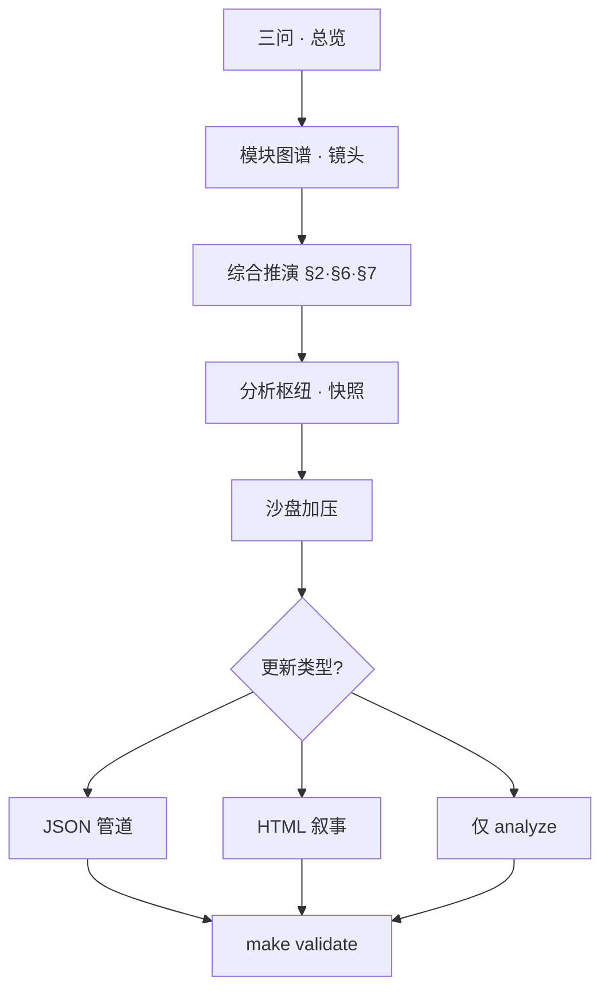

# 全站梳理 · 内容对表 · 重新推演与更新（操作手册）

**角色判型**（读者 / 贡献 / 数据 / 部署 → 第一站）：根 [README · 产品视角](../README.md#pm-four-journeys) · [README · 从这里开始](../README.md#readme-start-here) · [README · 双轨真源](../README.md#readme-dual-track-map)。**架构师梳理与持续改进**：[ARCHITECTURE_ONE_PAGER · 五步表](./ARCHITECTURE_ONE_PAGER.md#architect-stewardship) · [不变量索引](./ARCHITECTURE_ONE_PAGER.md#architect-invariants-index) · [开 PR 前速览](../CONTRIBUTING.md#contributing-five-minute) · [PR 证据三联](../CONTRIBUTING.md#contributing-pr-evidence-triad) · [动手→命令速查](../CONTRIBUTING.md#contributing-change-to-command)。

本文给出**可重复的一轮流程**：在**不假设单点终局**的前提下，把**全站模块与叙事**与**当前数据/分析读数**对表，并决定**下一步更新落在哪里**（JSON 管道、HTML 正文、或仅刷新快照）。与 [EVOLUTION_RUNBOOK](./EVOLUTION_RUNBOOK.md)（偏双周 JSON 节奏）、[DATA_ANALYSIS_SITE_CONTENT_SYNC](./DATA_ANALYSIS_SITE_CONTENT_SYNC.md)（偏数据→界面映射）互补；认识论与单轮七步仍以 [DEDUCTION_STRATEGY](./DEDUCTION_STRATEGY.md) 为准。

在 **[三架构对照](./ARCHITECTURE_ONE_PAGER.md#three-architectures)** 中，本文为**推演架构**下的「全站一轮」操作手册，与双周节奏、数据→界面映射文档并用。**主链联动 · 仓库物理分层**（本轮若动 JSON / 脚本 / 呈现多目录）：**[勿混粒度 · 五维/六域/七类](./PROJECT_ARCHITECTURE_OVERVIEW.md#architecture-grain)** · [PROJECT_ARCHITECTURE_OVERVIEW · §1a](./PROJECT_ARCHITECTURE_OVERVIEW.md#module-linkage-validation) · **[§1b](./PROJECT_ARCHITECTURE_OVERVIEW.md#physical-layout)**。**整体内容框架**：**[docs/README · #content-framework](./README.md#content-framework)** · **前后台模块一页表**：[**#front-back-modules**](./README.md#front-back-modules) · **组件×功能一条表**：[**#system-components-fusion**](./README.md#system-components-fusion)。**按改动判型**（**0c**）：**[docs/README · #quick-paths](./README.md#quick-paths)**。**自动化助手（全站对表后仍须过闸门）**：[AGENTS.md · 合并前](../AGENTS.md#agents-pre-merge) · [框架判型](../AGENTS.md#agents-content-framework) · [架构边界](../AGENTS.md#agents-arch-boundary)。**呈现双轨（`spa-sync` / `spa-build`）**：[MERGE · §1](./MERGE_AND_RELEASE_CHECKLIST.md#pre-merge) · [MERGE · partials 手顺](./MERGE_AND_RELEASE_CHECKLIST.md#pre-merge-partials-sequence) · [关系视图](../maintainer-hub.html#mh-spine-map)。**MPA 顶栏与失页**：**`partials/`** → **`make sync-nav`**；**`404.html`** 手调（`sync_site_nav` 不写回）— **[scripts/README · `sync_site_nav`](../scripts/README.md)**。

<a id="when"></a>

## 1. 何时做「全站式」一轮

| 触发 | 说明 |
|------|------|
| **季度或里程碑** | 模块增多、读者动线变长，需要防止「只堆页不对表」。 |
| **叙事大改前** | 准备动 §6/§7/十年相关页面前，先对热力与三问扫一遍。 |
| **manifest/候选暴涨** | 感觉热力与直觉脱节 → 先看清快照再决定降噪或拆映射。 |
| **规则闭环堆积** | `hint_closure_gaps` 长期非零 → 集中处理决策 JSON 或调整规则。 |

**不是**：为更新而更新；无新观测也可只做**结构自检**（轻量版可跳过 ingest）。

<a id="relation"></a>

## 2. 与双周进化管道的关系

| 维度 | 双周 [EVOLUTION_RUNBOOK](./EVOLUTION_RUNBOOK.md) | 本文「全站一轮」 |
|------|---------------------------------------------------|------------------|
| 重心 | ingest → 审阅 → merge → **analyze** → hint 决策 | **三问 + 模块图谱 + 综合推演 + 读数**对表 → 再决定改什么 |
| 产出 | 主要是 **JSON + 可选小改文** | **本轮结论** + 明确 **PR/提交范围**（数据 / 正文 / 二者） |
| 耗时 | 约 30–45 分钟 + 深度改文另计 | 建议预留 **90–150 分钟**（可分两天） |

两轮可合并：在同一次 sit-down 里先跑完 Runbook 的 analyze，再执行下文 **步骤 3–5**。

<a id="steps"></a>

## 3. 推荐步骤（顺序可做轻量裁剪）

| 步 | 动作 | 落点 / 产出 |
|----|------|-------------|
| **0** | 环境：`pip install -r requirements.txt`；仓库 `make validate` 已绿或可接受基线。 | 避免在坏 JSON 上推演 |
| **1 鸟瞰** | 读 [总览 · 三问](../index.html#three-questions)：我们在哪 / 要做什么 / 将在哪。 | 本轮默认**不回答单点预言** |
| **2 模块** | 打开 [模块图谱](../modules-map.html)：五系七层 + 星丛/路径任扫一条；标出**本轮主镜头**（如教育 / 算力 / 政务）。 | 1 个主镜头 + 2 个邻居模块 |
| **3 判据与配方** | 在 [综合推演 §2](../synthesis.html#criteria) 过一遍与镜头相关的判据；在 [§6/§7](../synthesis-extensions.html#stack-domains)（[扩展子页](../synthesis-extensions.html)）找**是否已有配方/表行**可承接。 | 若无，记入 [§11](../synthesis-methods.html#perpetual)「待增行」而非硬写长文 |
| **4 数据读数** | HTTP 打开 [分析引擎](../analysis-hub.html)：看聚合解读、模块/因子热力、闭环缺口；扫 [进化闭环](../evolution-loop.html) 信号栏。 | 截图或笔记：`run_id`、最刺眼的 1 条共现或缺口 |
| **5 沙盘** | [沙盘工坊](../lab.html)：按热力勾选与镜头相关的因子，跑一轮合成。 | **三条可见征候 + 一条未决前提**（与 §11 一致） |
| **6 决策：更新落点** | 用下表选择动作；可多选。 | 明确 PR 描述要写什么 |
| **7 闸门** | `make validate` → `git commit` / PR。 | 引用 `rule_id` / 决策 `id` / 信号 `id`（若相关） |

### 6.1 更新落点决策表

| 若本轮结论主要是… | 优先动作 |
|--------------------|----------|
| 观测应进库但尚未入库 | 候选 `review_state` → merge manifest（Runbook 步骤 2–3） |
| 热力与映射需要调 | 改 `maps_to` / 降噪候选 → `make analyze` 或 `make evolution-fast` |
| 规则提示需落实或否决 | `evolution-hint-decisions.json` |
| 叙事/配方/表行需改 | 编辑对应 `.html`（综合推演、十年、场景等），PR 说明对哪条判据 |
| 仅刷新读数、结构未变 | `make evolution-fast`（先 validate）即可 |

详见 [DATA_ANALYSIS_SITE_CONTENT_SYNC](./DATA_ANALYSIS_SITE_CONTENT_SYNC.md)。

<a id="diagram"></a>

## 4. 流程简图



<a id="output"></a>

## 5. 建议本轮纪要模板（可复制）

```text
【全站重推 · 日期】
- 主镜头模块：
- 邻居模块：
- 分析读数要点（run_id / 热力或缺口一句）：
- 三条可见征候：
- 一条未决前提：
- 本轮更新：□ 仅快照  □ manifest/候选  □ hint 决策  □ HTML（页名）：
- PR / commit 引用：rule_id / 决策 id / 信号 id（如有）：
```

<a id="read-more"></a>

## 6. 延伸阅读

| 文档 / 页面 |
|-------------|
| [DEDUCTION_STRATEGY.md](./DEDUCTION_STRATEGY.md)（单轮七步、偏误、工程对表） |
| [综合推演 §11](../synthesis-methods.html#perpetual)（持续迭代插槽） |
| [RESEARCH_METHODS_MAP.md](./RESEARCH_METHODS_MAP.md)（方法 ↔ 工具） |
| [SITE_DATA_UPDATE_FRAMEWORK.md](./SITE_DATA_UPDATE_FRAMEWORK.md) |
| [TECH_ARCHITECTURE_AND_UPGRADE_BRIEF.md · 附录](./TECH_ARCHITECTURE_AND_UPGRADE_BRIEF.md#appendix-tech-capabilities)（[别名](./TECH_ARCHITECTURE_CAPABILITIES.md)） |
