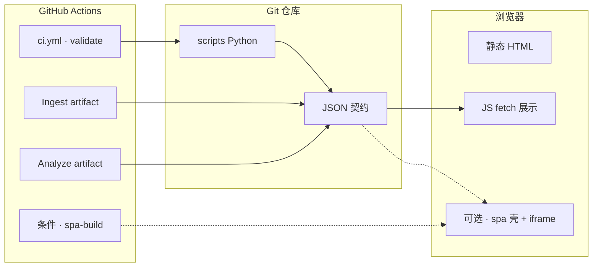

# 技术架构整理与升级路径（简版）

**一页收束**：当前**技术栈如何分层**、**主数据链**、**闸门**是什么；**按阶段可怎么升级**、**何时不必跳级**。**角色判型**（读者 / 贡献 / 数据 / 部署 → 第一站）：根 [README · 产品视角](../README.md#pm-four-journeys) · [README · 从这里开始](../README.md#readme-start-here) · [README · 双轨真源](../README.md#readme-dual-track-map)。**架构师梳理与持续改进**：[ARCHITECTURE_ONE_PAGER · 五步表](./ARCHITECTURE_ONE_PAGER.md#architect-stewardship) · [不变量索引](./ARCHITECTURE_ONE_PAGER.md#architect-invariants-index) · [开 PR 前速览](../CONTRIBUTING.md#contributing-five-minute) · [PR 证据三联](../CONTRIBUTING.md#contributing-pr-evidence-triad) · [动手→命令速查](../CONTRIBUTING.md#contributing-change-to-command)。多篇都谈「技术栈」时先对 **[docs/README · 技术栈文档怎么读](./README.md#tech-stack-read-merge)**（合并阅读入口，防散）。若优先需要**内容×组件×命令**总表与**合并/增能/读站**三条路径，先读 **[PLATFORM_MASTER_MAP_AND_INVOCATION.md](./PLATFORM_MASTER_MAP_AND_INVOCATION.md)**。**可落地改造全景**（决策图、分域矩阵、阶段卡、验收）：**[ARCHITECTURE_UPGRADE_ROADMAP.md](./ARCHITECTURE_UPGRADE_ROADMAP.md)**。**增量构建与调试**（组件引入序、闭环、PR 切片）：**[INCREMENTAL_BUILD_PLAYBOOK.md](./INCREMENTAL_BUILD_PLAYBOOK.md)**。**五维整体索引**（数据 · 内容 · 演进 · 方法论 · 运行态）：**[PROJECT_ARCHITECTURE_OVERVIEW.md](./PROJECT_ARCHITECTURE_OVERVIEW.md)**（**[勿混粒度 · 五维/六域/七类](./PROJECT_ARCHITECTURE_OVERVIEW.md#architecture-grain)**；**[§1a 主链联动与验证](./PROJECT_ARCHITECTURE_OVERVIEW.md#module-linkage-validation)** · **[§1b 仓库物理分层](./PROJECT_ARCHITECTURE_OVERVIEW.md#physical-layout)**）。**详版技术栈**（分层详表 · Mermaid · 已实现能力地图 · 进化三层 · 可扩展方向 · 索引）见**下文 [附录](#appendix-tech-capabilities)**；**不变量 · 阶段 0—3** 仍以 **[ARCHITECTURE_UPGRADE_AND_EXTENSIONS.md](./ARCHITECTURE_UPGRADE_AND_EXTENSIONS.md)** 为准；**数据流 · 七类模块** 以 **[ARCHITECTURE.md](./ARCHITECTURE.md)** 为准。三架构并列速览：**[ARCHITECTURE_ONE_PAGER · 三架构对照](./ARCHITECTURE_ONE_PAGER.md#three-architectures)**。**智能化目标架构（六域协同）**见 **[INTELLIGENCE_SIX_DOMAINS.md](./INTELLIGENCE_SIX_DOMAINS.md)**。**整体内容框架**：**[docs/README · #content-framework](./README.md#content-framework)** · **前后台模块一页表**：[**#front-back-modules**](./README.md#front-back-modules) · **组件×功能一条表**：[**#system-components-fusion**](./README.md#system-components-fusion)。**按改动判型**（主线 **0c**）：**[docs/README · #quick-paths](./README.md#quick-paths)**。**自动化助手**：[合并前](../AGENTS.md#agents-pre-merge) · [框架判型](../AGENTS.md#agents-content-framework) · [人审闸门](../AGENTS.md#agents-invariants)。

## 1. 技术架构整理（分层一览）

| 层 | 要点 |
|----|------|
| **呈现** | **MPA**：根目录 `.html` + `partials/`（`sync_site_nav`；**`maintainer-hub.html`** 五链后三锚由 **`build_skip_bar`** 生成，勿手改；**`404.html`** 顶栏/skip **手维护**）；**CI / `make validate` 默认真源**。**SPA**：`spa/` + `sync_spa_public` 剥壳 iframe；**`nav.config` ≡ registry.pages**；**`make spa-build`** 前 **`spa-sync`**；改根 **`.html`** 验壳见 **`make spa-sync`**（[MERGE · §1](./MERGE_AND_RELEASE_CHECKLIST.md#pre-merge) · [MERGE · partials 手顺](./MERGE_AND_RELEASE_CHECKLIST.md#pre-merge-partials-sequence) · [关系视图](../maintainer-hub.html#mh-spine-map) · [系统边界](../maintainer-hub.html#mh-boundaries) · [衔接矩阵](../maintainer-hub.html#mh-reader-admin-matrix)）。 |
| **客户端** | 原生 JS：`fetch` 已提交 JSON；总线 **`site-data-bus.js`**；分析/闭环/沙盘脚本分工见 [SITE_DATA_UPDATE_FRAMEWORK](./SITE_DATA_UPDATE_FRAMEWORK.md)。 |
| **数据契约** | **Git 内 JSON** 可 diff、可 Schema 校验；**单一注册表** **`scripts/evolution-registry.json`** 约束页面与 `lab_factors`。 |
| **侧车** | **`data/evolution.db`**（可选本地）：沉淀加速、快照历史；**不**替代 Git 内 HEAD 闸门。 |
| **管道** | **Python**：`scripts/*.py` + **`evolution_pkg`**（`io`、`pipeline`、`spa_nav`、`sediment_validate` 等）；抓取 → 人审 merge → 分析 → 沉淀 → 趋势。 |
| **校验与 CI** | **`run_validate.sh`** / **`make validate`**；**`make validate-fast`**（**`run_validate_fast.sh`**）仅本地子集，**不**入 **CI** / **pre-commit**（与全量关系见 **[ARCHITECTURE · `run_validate.sh` 与 fast 子集](./ARCHITECTURE.md#run-validate-gate)**）。**`make merge-ready`** 另含 **`test-readonly-api`** 与 **`test-admin-console`**（见 [MERGE_AND_RELEASE_CHECKLIST](./MERGE_AND_RELEASE_CHECKLIST.md#pre-merge) · [MERGE · partials 手顺](./MERGE_AND_RELEASE_CHECKLIST.md#pre-merge-partials-sequence)）。**`ci.yml`**：**validate** 必跑；**admin-console-tests** / **spa-build** 按路径过滤。**`admin-console`** 单页 UI 与锚点 **[ADMIN_CONSOLE · §7](./ADMIN_CONSOLE_FRAMEWORK_OVERVIEW.md#admin-module-plan)**。 |

**主链（技术视角）**：`ingest` → **候选** → **人审** → **manifest** → **`analysis_engine`** → **快照** →（可选）**沉淀** → **趋势** → 前端 **fetch**。**分析引擎不写 HTML**；**manifest 不默认自动 merge**。

**关系示意**（与 [附录 · Mermaid](#appendix-stack) 一致）：浏览器 ← JSON ← 仓库；Actions 跑校验与 artifact，**默认不**替代人工合并主分支。

## 2. 可升级建议（分阶段决策）

按 **收益 / 风险 / 运维负担** 排序；**不必跳级**。完整论证与反模式见 [ARCHITECTURE_UPGRADE](./ARCHITECTURE_UPGRADE_AND_EXTENSIONS.md#upgrade-tiers)。**按阶段落地打勾**见 **[PHASED_UPGRADE_EXECUTION_GUIDE](./PHASED_UPGRADE_EXECUTION_GUIDE.md)**。

| 阶段 | 定位 | 建议动作（摘要） | 何时维持不动 |
|------|------|------------------|----------------|
| **0** | **长期基线** | GitHub Actions + **`make validate`** + artifact **人工合并**；`evolution_pkg.pipeline` 遥测可选 | 单仓库节奏、无专职数据平台、低并发 |
| **1** | **站内增强（优先）** | **契约**：`schema_version` + `docs/schemas/` + `run_validate.sh`；**分包**：平铺脚本迁入 **`evolution_pkg`**；**双轨**：registry ↔ SPA ↔ 单测；**只读 API** 扩端点（仍不写 manifest）；**可观测**：`pipeline-metrics`、`make status` | 在引入任何编排器 **之前** 尽量先做完本阶段 |
| **2** | **编排器** | 仅当多条 **DAG**、**分区回填**、**多环境参数矩阵**、**运行历史 UI** 等**多条信号**齐备时，用 **Prefect / Dagster** **封装已有** Python 步骤；**编排器不写 manifest** | 仍是一条 Actions 管道、团队能靠 PR + artifact 协作 → **不必上** |
| **3** | **事件流** | 仅 **多服务实时写**、**多订阅**、**回放** 且与 **Git 审计链分工明确** 时考虑 **Kafka / Redpanda**；**禁止** broker **替代 Git** 作唯一事实源 | 单体会 + 静态 JSON 足够 → **不上** |

**数据层（与上表正交）**：当前 **Git JSON + SQLite 侧车 + 可选 DuckDB** 见 [DATA_CONTRACTS · §5](./DATA_CONTRACTS.md#存储策略哪些适合写入数据库与架构预期对齐)。**服务器级 OLTP、缓存、读副本、数仓及与 Connect/CDC 的衔接**见 **[DATA_STORES_AND_FUTURE_DB_ARCHITECTURE.md](./DATA_STORES_AND_FUTURE_DB_ARCHITECTURE.md)**——可与阶段 **2/3** 并行规划，**落地顺序**按该文「推荐落地顺序」与 **[INCREMENTAL_BUILD_PLAYBOOK](./INCREMENTAL_BUILD_PLAYBOOK.md)** 分解。

## 3. 升级优先级 backlog（与「可扩展方向」对表）

摘自 [附录 · 可扩展方向](#appendix-extend)，按**默认推荐顺序**重排（非采购清单）：

1. **阶段 1 内**：**脚本分包**（余下 `scripts/*.py` → `evolution_pkg`）；**契约与 Schema** 随功能递增 **`schema_version`**。  
2. **低成本增强**：**实时告警**（ingest 失败 Webhook）；**只读 API** / **DuckDB** 报表（可选依赖，见 [DATA_CONTRACTS](./DATA_CONTRACTS.md)）。  
3. **产品与合规向**：**多环境 `ingest_config`**（文档与矩阵同步）；**草稿插槽**（**[scripts/draft/README.md](../scripts/draft/README.md)**），**不**自动写 manifest。  
4. **默认避免**：**全自动 artifact push main**（削弱人审）；**无信号上编排器 + 消息队列**（反模式见 [ARCHITECTURE_UPGRADE · §4](./ARCHITECTURE_UPGRADE_AND_EXTENSIONS.md#anti-patterns)）。  
5. **阶段 2/3**：严格按 §2 表「信号齐备」再评估；细节 **[ORCHESTRATION_AND_EVENT_STREAMING.md](./ORCHESTRATION_AND_EVENT_STREAMING.md)**。

**扩展性落地**（插槽、四轨、检查单）：**[PLATFORM_EXTENSIBILITY_AND_EVOLUTION.md](./PLATFORM_EXTENSIBILITY_AND_EVOLUTION.md)**。**六域协同打点**（PR/排期）：**[INTELLIGENCE_SIX_DOMAINS.md](./INTELLIGENCE_SIX_DOMAINS.md#pr-checklist)**。

## 4. 升级后如何验收（不变）

| 动作 | 命令或文档 |
|------|------------|
| 全闸门 | **`make validate`** |
| 合并前本地推荐 | **`make merge-ready`**（见 [MERGE_AND_RELEASE_CHECKLIST](./MERGE_AND_RELEASE_CHECKLIST.md#pre-merge) · [MERGE · partials 手顺](./MERGE_AND_RELEASE_CHECKLIST.md#pre-merge-partials-sequence)） |
| 触 SPA / registry / sync | **`make spa-build`**（若 CI 会跑该 job） |
| 增能回归 | [PLATFORM_CAPABILITY_MAP §6](./PLATFORM_CAPABILITY_MAP.md#enhance-checklist) · [PLATFORM_EXTENSIBILITY 检查单](./PLATFORM_EXTENSIBILITY_AND_EVOLUTION.md#new-capability-checklist) |

---

## 附录：技术架构总览 · 可实现功能 · 进化能力

本节为原独立篇 **`TECH_ARCHITECTURE_CAPABILITIES.md`** 的正文合并；与上文 **[§1 分层一览](#layers-summary)**（简表）**同一文件、上下对读**：简表抓要点，附录给**详表、Mermaid、能力地图与索引**。与 [ARCHITECTURE.md](./ARCHITECTURE.md) **互补**（后者侧重**数据流、七类模块**）。**三架构**速览：[ARCHITECTURE_ONE_PAGER · 三架构对照](./ARCHITECTURE_ONE_PAGER.md#three-architectures)。**判型**：[docs/README · #quick-paths](./README.md#quick-paths)。**技术栈多篇防散**：[docs/README · #tech-stack-read-merge](./README.md#tech-stack-read-merge)。**自动化助手**：[合并前](../AGENTS.md#agents-pre-merge) · [框架判型](../AGENTS.md#agents-content-framework) · [深读索引](../AGENTS.md#agents-deep-read)。

### 附录 1. 技术架构（分层详表）

| 层 | 技术选型 | 职责 |
|----|-----------|------|
| **呈现与路由** | **主轨**：根目录静态 `.html`、`partials/` 经 `sync_site_nav.py`（**`maintainer-hub.html`** 五链后三锚由 **`build_skip_bar`** 生成；**`404.html`** 顶栏/skip **手维护**）；**副轨**：`spa/`（React + Vite 6 + React Router，iframe 加载 `sync_spa_public.py` 产物） | MPA 为 **validate 默认真源**；SPA 供「单入口」部署；详见 [PLATFORM_CAPABILITY_MAP.md](./PLATFORM_CAPABILITY_MAP.md)。**`make spa-build`** 会先 **`spa-sync`**；改根 **`.html`** 且验壳内 **`spa/public/`** 时 **`make spa-sync`**（[MERGE · §1](./MERGE_AND_RELEASE_CHECKLIST.md#pre-merge) · [MERGE · partials 手顺](./MERGE_AND_RELEASE_CHECKLIST.md#pre-merge-partials-sequence) · [关系视图](../maintainer-hub.html#mh-spine-map) · [系统边界](../maintainer-hub.html#mh-boundaries) · [衔接矩阵](../maintainer-hub.html#mh-reader-admin-matrix)） |
| **客户端逻辑** | 原生 JS（`evolution.js`、`analysis.js`、`site-data-bus.js`、`closure-summary.js`、`lab.js`、`motion.js` 等） | `fetch` 读 JSON，DOM 渲染；复杂交互集中在沙盘、分析枢纽、闭环页 |
| **样式** | `assets/site.css` 及少量页级 CSS | 全站视觉与组件类名（如 `nexus-tag`、`evolution-*`） |
| **数据契约（Git 真源）** | `assets/*.json`、`scripts/*.json`（规则/配置）、`data/sediment.json`（可选提交） | 可 diff、可校验的结构化事实；**单一注册表** `evolution-registry.json` 约束页面与沙盘因子 |
| **本地侧车** | `data/evolution.db`（SQLite，通常 gitignore） | 沉淀查询加速，与 JSON 双写；趋势脚本可读库 |
| **管道（Python 3）** | `scripts/*.py` + 包 **`evolution_pkg`**（`io`、`pipeline`）；`evolution_io.py` 为兼容入口 | 抓取、合并、分析、沉淀、趋势、对账、站点辅助（sitemap） |
| **契约校验** | `jsonschema`（`requirements.txt`）、`run_validate.sh` | 快照 Schema、manifest/候选/决策结构、compileall、单测 |
| **持续集成** | GitHub Actions：`ci.yml`（**validate** 必跑；**spa-build** 按路径过滤）、`ingest-pipeline.yml`、`update-pipeline.yml`、`pr-candidates.yml` | 主闸门与根目录 MPA 一致；SPA 构建见 [docs/README 文首](./README.md) · [PLATFORM_CAPABILITY_MAP §4](./PLATFORM_CAPABILITY_MAP.md#ops-tooling) |

**部署形态**：静态托管（如 GitHub Pages）即可；读者需 **HTTP(S)** 打开站点以便浏览器加载 JSON（`file://` 常受限）。**本机**：根 **`make serve-reader`**（**8000**）或 **Docker** **8765**（见根 **[README.md](../README.md)** · **[DOCKER.md](./DOCKER.md#quickstart)**）。

### 附录 2. 已实现的可计算功能（能力地图）

下列均为**已实现**或可经由已有脚本组合完成的能力；**不**包含「自动写死 HTML 正文」或「无人审 merge manifest」。

| 域 | 能力 | 主要入口 |
|----|------|----------|
| **观测** | RSS / 法规索引页抓取、去重、关键词与 host 提示合并进候选 | `ingest_opinion_law.py`、`run_ingest_only.sh`、`make ingest` |
| **人审闸门** | 候选 `review_state`、仅 `queued_for_manifest` 可合并 | `merge_candidates_to_manifest.py` |
| **编码** | 信号映射到页面、沙盘因子、（可选）配方等 `maps_to` 扩展键 | manifest 条目 + `evolution.js` 展示与高亮 |
| **当日分析** | 模块/因子热力、共现、类型分布、规则提示、与上期快照 diff 提示、闭环缺口列表 | `analysis_engine.py` → `analysis-snapshot.json` |
| **沉淀** | 按日摘要、闭环 backlog 计数、与 SQLite 双写 | `analysis_engine.py --sediment` |
| **跨日趋势** | 因子/页面在 Top 中的持久度、`longterm_hints`、`closure_backlog` | `sediment_trends.py` → `sediment-trends.json` |
| **决策追溯** | 对规则提示 done / rejected / deferred，可挂 `rule_id` | `evolution-hint-decisions.json` |
| **全站读数** | 多页一行摘要 + 可选跨日一行；事件 `sitedatabus:ready`；`analysis.js` / `evolution.js` / `closure-summary.js` 带加载文案与 `aria-busy`；`analysis.js` 与 `closure-summary.js` 在存在总线时复用快照请求 | `site-data-bus.js`、`analysis.js`、`evolution.js`、`closure-summary.js`、`SITE_DATA_UPDATE_FRAMEWORK.md` |
| **分析仪表盘** | 聚合解读、热力条、趋势表、决策列表等 | `analysis-hub.html` + `analysis.js` |
| **闭环页摘要** | 快照驱动的闭环提示 | `evolution-loop.html` + `closure-summary.js` |
| **沙盘** | 多因子合成、与 manifest 因子高亮联动 | `lab.html` + `lab.js` + `evolution.js` |
| **工程闸门** | **registry** / **nav.config** / 快照 / **沉淀·趋势** 等 JSON Schema + 对账、顶栏、单测 | **`make validate`** = **`run_validate.sh`**；**`make test`** 为子集（registry Schema + navLinks + 沉淀/趋势 Schema + 单测，无对账/顶栏/`--check`）；**`make validate-fast`** 介于两者之间，**仍非**全量，**不**入 CI/pre-commit（**[ARCHITECTURE#run-validate-gate](./ARCHITECTURE.md#run-validate-gate)**） |
| **本地提速** | 已校验后仅重算快照/沉淀/趋势 | `make evolution-fast`（见 [EVOLUTION_RUNBOOK.md](./EVOLUTION_RUNBOOK.md#accelerate)） |
| **CI 节奏** | 定时 ingest / analyze artifact；手动刷新候选 PR | 根目录 README「持续集成」 |
| **站点发布线** | `site_version` / `codename` 人为维护；与 `run_id` 分离 | `assets/site-meta.json` · 顶栏 `data-site-meta-version` |
| **全站 SPA** | 客户端路由 + iframe 承载剥壳分页；`navLinks` ≡ registry | `spa/` · `make spa-build` · [spa/README.md](../spa/README.md) |
| **只读 API 扩展** | HTTP 读 `snapshot` / `trends` / `manifest` / **`site-meta`** | `readonly_api.py` + `requirements-api.txt` |

### 附录 3. 「进化能力」在本站的三层含义

避免把「进化」混同为**自动预言**；本站约定如下三层，可并行推进。

#### 附录 3.1 数据进化（观测 → 正式库 → 读数刷新）

- **路径**：候选入池 → 人审 → merge 至 `evolution-manifest.json` → `make analyze`（或 `evolution-fast`）→ 提交 JSON → 全站 `fetch` 读数更新。  
- **自动化边界**：可定时抓取、可 bot 开 PR 更新候选；**不可**跳过人审直接改 manifest。  
- **详见**：[evolution-loop.html](../evolution-loop.html)、[EVOLUTION_RUNBOOK.md](./EVOLUTION_RUNBOOK.md)、[SITE_DATA_UPDATE_FRAMEWORK.md](./SITE_DATA_UPDATE_FRAMEWORK.md)。

#### 附录 3.2 规则与闭环进化（提示 → 决策 → 缺口消失）

- **路径**：`evolution-hint-rules.json` 触发 `evolution_hints` / `hint_closure_gaps` → 人在 `evolution-hint-decisions.json` 记录落实或否决 → 快照与闭环页反映统计与缺口变化。  
- **能力**：把「该做什么」从口头变成**可检索、可对账**的记录，并与 `rule_id` 对齐。  
- **详见**：[ARCHITECTURE.md · 决策追溯](./ARCHITECTURE.md#decision-traceability)、[analysis-hub.html](../analysis-hub.html)。

#### 附录 3.3 叙事与方法进化（§11 / 配方 / 页面正文）

- **路径**：综合推演 §11 迭代、§6/§7 增配方或表行、各 HTML 改叙事——**主要由人编辑**，可引用决策 id / 信号 id / `rule_id` 保持审计链。  
- **扩展插槽**（与 §11 对照）：外部信号、热力反哺、模型/RAG、工程化改造等见 [evolvable-architecture.html](../evolvable-architecture.html)、[intelligent-evolution.html](../intelligent-evolution.html)。  
- **边界**：若引入 LLM 草稿生成，须走**独立插槽与闸门**，**不**接入 `analysis_engine` 写 manifest；见 [ARCHITECTURE.md · 七类模块 · 内容生成](./ARCHITECTURE.md#seven-layers)。

### 附录 4. 可扩展方向（尚未实现或仅部分实现）

评估新能力时建议先按 **[INTELLIGENCE_SIX_DOMAINS.md](./INTELLIGENCE_SIX_DOMAINS.md)** 标明影响域（数据 / 管道 / 分析 / 前端 / 运维 / 治理），再对下表「方向 × 成本」排序。

| 方向 | 说明 | 风险/成本 |
|------|------|-----------|
| **脚本分包** | 其余 `scripts/*.py` 按 ingest / analysis / validate 迁入子包 | 高：`evolution_pkg` 已落地，余下需一次迁完 |
| **草稿生成** | **`scripts/draft/`** 产出供 PR 审阅的 Markdown/HTML 片段（见 **[scripts/draft/README.md](../scripts/draft/README.md)**） | 中：须严格禁止自动写 manifest；**不**接入 `analysis_engine` 写 HTML |
| **全自动 artifact 入 main** | Actions 直接 push 快照/候选 | 高：削弱人审与 review 节奏；默认不启用 |
| **实时告警** | 站外 Webhook / 监控 ingest 失败 | 低到中：已有 Issue 通知可扩展 |
| **多环境配置** | 分离「个人站」与「机构站」的 `ingest_config` | 中：配置矩阵与文档同步 |
| **流水线遥测** | `artifacts/pipeline-metrics-*.json`（`run_pipeline_steps.py`） | 低：已落地；见 [DATA_CONTRACTS.md](./DATA_CONTRACTS.md) |
| **快照 PR 差分** | `diff_analysis_snapshot.py` | 低：已落地 |
| **可选 DuckDB / 只读 API** | `query_evolution_duckdb.py`、`readonly_api.py` + 可选 requirements 文件 | 低到中：本地工具，不进默认 CI |
| **任务编排器（Dagster / Prefect）** | 多 DAG、分区回填、跨环境调度时再评估；与 Actions 可并存 | 高：需专职运维或托管产品；见 [ORCHESTRATION_AND_EVENT_STREAMING.md](./ORCHESTRATION_AND_EVENT_STREAMING.md) |
| **事件流（Kafka / Redpanda）** | 多服务实时生产/多消费者回放时再评估；本站默认以 **Git+JSON** 为日志 | 高：集群与 schema 治理；同上篇 |

**在不变量内最大化扩展**：插槽表、四条进化轨、阶段跑道、合并前检查单见 **[PLATFORM_EXTENSIBILITY_AND_EVOLUTION.md](./PLATFORM_EXTENSIBILITY_AND_EVOLUTION.md)**；**Schema 索引**见 **[docs/schemas/README.md](./schemas/README.md)**。

### 附录 5. 文档与页面对照（索引）

| 需求 | 去向 |
|------|------|
| 新贡献者 · 合并前自检 | [CONTRIBUTING.md](../CONTRIBUTING.md#contributing-env-and-cmd) · [开 PR 前速览](../CONTRIBUTING.md#contributing-five-minute) |
| 全文档整理主线（维护者） | [docs/README · 文档主线](./README.md#docs-spine) |
| 自动化助手 · 闸门与边界 | [AGENTS.md](../AGENTS.md#agents-invariants) · [架构边界](../AGENTS.md#agents-arch-boundary) · Cursor [repo-gates](../.cursor/rules/repo-gates.mdc)（文首「子规则对读」）· [spa-nav-config](../.cursor/rules/spa-nav-config.mdc) · [spa-nav-registry](../.cursor/rules/spa-nav-registry.mdc) · [evolution-registry](../.cursor/rules/evolution-registry.mdc) |
| 数据流与关键文件清单 | [ARCHITECTURE.md](./ARCHITECTURE.md) |
| 全站 JSON 如何驱动页面刷新 | [SITE_DATA_UPDATE_FRAMEWORK.md](./SITE_DATA_UPDATE_FRAMEWORK.md) |
| 数据与分析对模块/叙事/动态块的更新矩阵 | [DATA_ANALYSIS_SITE_CONTENT_SYNC.md](./DATA_ANALYSIS_SITE_CONTENT_SYNC.md) |
| 双周节奏与命令 | [EVOLUTION_RUNBOOK.md](./EVOLUTION_RUNBOOK.md) |
| 全站一轮梳理 → 推演 → 更新落点 | [SITE_WIDE_RERUN_DEDUCTION_PLAYBOOK.md](./SITE_WIDE_RERUN_DEDUCTION_PLAYBOOK.md) |
| 推演认识论与质量控制 | [DEDUCTION_STRATEGY.md](./DEDUCTION_STRATEGY.md) |
| 研究方法与站内资产映射 | [RESEARCH_METHODS_MAP.md](./RESEARCH_METHODS_MAP.md) |
| 脚本命令表 | [scripts/README.md](../scripts/README.md) |
| CI 双轨（validate 必跑 · spa-build 按路径） | [docs/README 文首](./README.md) · [`.github/workflows/ci.yml`](../.github/workflows/ci.yml) · [PLATFORM_CAPABILITY_MAP §4](./PLATFORM_CAPABILITY_MAP.md#ops-tooling) |
| 编排器与消息队列（何时引入） | [ORCHESTRATION_AND_EVENT_STREAMING.md](./ORCHESTRATION_AND_EVENT_STREAMING.md) |
| 技术架构整理 + 升级路径（简版） | [本文 §1—§4](#layers-summary) |
| 整体适配、分阶段升级、扩展面 | [ARCHITECTURE_UPGRADE_AND_EXTENSIONS.md](./ARCHITECTURE_UPGRADE_AND_EXTENSIONS.md) |
| 扩展插槽 · 进化四轨 · 新增能力检查单 | [PLATFORM_EXTENSIBILITY_AND_EVOLUTION.md](./PLATFORM_EXTENSIBILITY_AND_EVOLUTION.md) |
| 合并前动线（`merge-ready`）· 发布轻量清单 | [MERGE_AND_RELEASE_CHECKLIST.md](./MERGE_AND_RELEASE_CHECKLIST.md#pre-merge) · [MERGE · partials 手顺](./MERGE_AND_RELEASE_CHECKLIST.md#pre-merge-partials-sequence) |
| 只读 API · OpenAPI · 网关侧 CORS/鉴权 | [INTEGRATION_AND_READONLY_API.md](./INTEGRATION_AND_READONLY_API.md) |
| 平台能力总览（双轨 / 阅读顺序） | [PLATFORM_CAPABILITY_MAP.md](./PLATFORM_CAPABILITY_MAP.md) |
| 分端设计（用户/管理 · 数据源 · 审核） | [USER_ADMIN_SPLIT_AND_EVOLUTION_DESIGN.md](./USER_ADMIN_SPLIT_AND_EVOLUTION_DESIGN.md) |
| 方法与字段总线（站内） | [analysis-hub.html#panorama](../analysis-hub.html#panorama) |

*附录与主分支同步；大改管道时请同步更新附录「已实现功能」表。*

---

## 延伸阅读

- **文档主线表**：[docs/README · #docs-spine](./README.md#docs-spine)  
- **平台四条支柱与运维工具**：[PLATFORM_CAPABILITY_MAP §1—§4](./PLATFORM_CAPABILITY_MAP.md#pillars)  
- **编排与 Kafka 对照**：[ORCHESTRATION_AND_EVENT_STREAMING.md](./ORCHESTRATION_AND_EVENT_STREAMING.md)
- **数据库与后续数据架构**：[DATA_STORES_AND_FUTURE_DB_ARCHITECTURE.md](./DATA_STORES_AND_FUTURE_DB_ARCHITECTURE.md)
- **模块全量梳理与升级矩阵**：[MODULE_INVENTORY_AND_ARCHITECTURE_UPGRADE_MATRIX.md](./MODULE_INVENTORY_AND_ARCHITECTURE_UPGRADE_MATRIX.md)
- **按阶段升级执行指南**：[PHASED_UPGRADE_EXECUTION_GUIDE.md](./PHASED_UPGRADE_EXECUTION_GUIDE.md)

*与主分支同步；默认栈或阶段定义变更时，请同步更新本文与 [ARCHITECTURE_UPGRADE](./ARCHITECTURE_UPGRADE_AND_EXTENSIONS.md)。*
