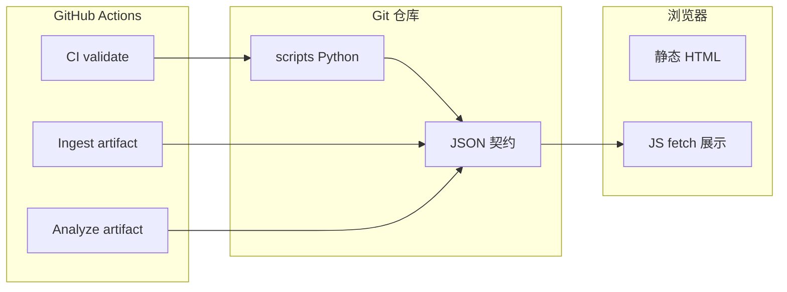

# 技术架构总览 · 可实现功能 · 进化能力

本文与 [ARCHITECTURE.md](./ARCHITECTURE.md) **互补**：后者侧重**数据流、关键文件、适应度函数与七类模块映射**；本文用**技术栈分层**收束全站，并列出**已实现 / 可扩展的功能**与**「进化」在本站的三层含义**。定性脚手架、非预测——与 [DEDUCTION_STRATEGY.md](./DEDUCTION_STRATEGY.md) 一致。

## 1. 技术架构（分层）

| 层 | 技术选型 | 职责 |
|----|-----------|------|
| **呈现与路由** | 根目录静态 `.html`、`partials/` 模板经 `sync_site_nav.py` 同步顶栏 | 叙事主体、章节结构、无障碍与图例；**不**内嵌业务数据库 |
| **客户端逻辑** | 原生 JS（`evolution.js`、`analysis.js`、`site-data-bus.js`、`closure-summary.js`、`lab.js`、`motion.js` 等） | `fetch` 读 JSON，DOM 渲染；复杂交互集中在沙盘、分析枢纽、闭环页 |
| **样式** | `assets/site.css` 及少量页级 CSS | 全站视觉与组件类名（如 `nexus-tag`、`evolution-*`） |
| **数据契约（Git 真源）** | `assets/*.json`、`scripts/*.json`（规则/配置）、`data/sediment.json`（可选提交） | 可 diff、可校验的结构化事实；**单一注册表** `evolution-registry.json` 约束页面与沙盘因子 |
| **本地侧车** | `data/evolution.db`（SQLite，通常 gitignore） | 沉淀查询加速，与 JSON 双写；趋势脚本可读库 |
| **管道（Python 3）** | `scripts/*.py` + 包 **`evolution_pkg`**（`io`、`pipeline`）；`evolution_io.py` 为兼容入口 | 抓取、合并、分析、沉淀、趋势、对账、站点辅助（sitemap） |
| **契约校验** | `jsonschema`（`requirements.txt`）、`run_validate.sh` | 快照 Schema、manifest/候选/决策结构、compileall、单测 |
| **持续集成** | GitHub Actions：`ci.yml`、`ingest-pipeline.yml`、`update-pipeline.yml`、`pr-candidates.yml` | PR/推送闸门；定时或手动产出 artifact；可选 bot 开 PR 更新候选 |

**部署形态**：静态托管（如 GitHub Pages）即可；读者需 **HTTP(S)** 打开站点以便浏览器加载 JSON（`file://` 常受限）。

## 2. 已实现的可计算功能（能力地图）

下列均为**已实现**或可经由已有脚本组合完成的能力；**不**包含「自动写死 HTML 正文」或「无人审 merge manifest」。

| 域 | 能力 | 主要入口 |
|----|------|----------|
| **观测** | RSS / 法规索引页抓取、去重、关键词与 host 提示合并进候选 | `ingest_opinion_law.py`、`run_ingest_only.sh`、`make ingest` |
| **人审闸门** | 候选 `review_state`、仅 `queued_for_manifest` 可合并 | `merge_candidates_to_manifest.py` |
| **编码** | 信号映射到页面、沙盘因子、（可选）配方等 `maps_to` 扩展键 | manifest 条目 + `evolution.js` 展示与高亮 |
| **当日分析** | 模块/因子热力、共现、类型分布、规则提示、与上期快照 diff 提示、闭环缺口列表 | `analysis_engine.py` → `analysis-snapshot.json` |
| **沉淀** | 按日摘要、闭环 backlog 计数、与 SQLite 双写 | `analysis_engine.py --sediment` |
| **跨日趋势** | 因子/页面在 Top 中的持久度、`longterm_hints`、`closure_backlog` | `sediment_trends.py` → `sediment-trends.json` |
| **决策追溯** | 对规则提示 done / rejected / deferred，可挂 `rule_id` | `evolution-hint-decisions.json` |
| **全站读数** | 多页一行摘要 + 可选跨日一行；事件 `sitedatabus:ready`；`analysis.js` / `evolution.js` / `closure-summary.js` 带加载文案与 `aria-busy`；`analysis.js` 与 `closure-summary.js` 在存在总线时复用快照请求 | `site-data-bus.js`、`analysis.js`、`evolution.js`、`closure-summary.js`、`SITE_DATA_UPDATE_FRAMEWORK.md` |
| **分析仪表盘** | 聚合解读、热力条、趋势表、决策列表等 | `analysis-hub.html` + `analysis.js` |
| **闭环页摘要** | 快照驱动的闭环提示 | `evolution-loop.html` + `closure-summary.js` |
| **沙盘** | 多因子合成、与 manifest 因子高亮联动 | `lab.html` + `lab.js` + `evolution.js` |
| **工程闸门** | 注册表对账、顶栏一致、单测、快照 Schema | `make validate` = `run_validate.sh` |
| **本地提速** | 已校验后仅重算快照/沉淀/趋势 | `make evolution-fast`（见 [EVOLUTION_RUNBOOK.md](./EVOLUTION_RUNBOOK.md#accelerate)） |
| **CI 节奏** | 定时 ingest / analyze artifact；手动刷新候选 PR | 根目录 README「持续集成」 |

## 3. 「进化能力」在本站的三层含义

避免把「进化」混同为**自动预言**；本站约定如下三层，可并行推进。

### 3.1 数据进化（观测 → 正式库 → 读数刷新）

- **路径**：候选入池 → 人审 → merge 至 `evolution-manifest.json` → `make analyze`（或 `evolution-fast`）→ 提交 JSON → 全站 `fetch` 读数更新。  
- **自动化边界**：可定时抓取、可 bot 开 PR 更新候选；**不可**跳过人审直接改 manifest。  
- **详见**：[evolution-loop.html](../evolution-loop.html)、[EVOLUTION_RUNBOOK.md](./EVOLUTION_RUNBOOK.md)、[SITE_DATA_UPDATE_FRAMEWORK.md](./SITE_DATA_UPDATE_FRAMEWORK.md)。

### 3.2 规则与闭环进化（提示 → 决策 → 缺口消失）

- **路径**：`evolution-hint-rules.json` 触发 `evolution_hints` / `hint_closure_gaps` → 人在 `evolution-hint-decisions.json` 记录落实或否决 → 快照与闭环页反映统计与缺口变化。  
- **能力**：把「该做什么」从口头变成**可检索、可对账**的记录，并与 `rule_id` 对齐。  
- **详见**：[ARCHITECTURE.md · 决策追溯](./ARCHITECTURE.md#decision-traceability)、[analysis-hub.html](../analysis-hub.html)。

### 3.3 叙事与方法进化（§11 / 配方 / 页面正文）

- **路径**：综合推演 §11 迭代、§6/§7 增配方或表行、各 HTML 改叙事——**主要由人编辑**，可引用决策 id / 信号 id / `rule_id` 保持审计链。  
- **扩展插槽**（与 §11 对照）：外部信号、热力反哺、模型/RAG、工程化改造等见 [evolvable-architecture.html](../evolvable-architecture.html)、[intelligent-evolution.html](../intelligent-evolution.html)。  
- **边界**：若引入 LLM 草稿生成，须走**独立插槽与闸门**，**不**接入 `analysis_engine` 写 manifest；见 [ARCHITECTURE.md · 七类模块 · 内容生成](./ARCHITECTURE.md#seven-layers)。

## 4. 可扩展方向（尚未实现或仅部分实现）

| 方向 | 说明 | 风险/成本 |
|------|------|-----------|
| **脚本分包** | `scripts/` 下按 ingest / analysis / validate 分子包 | 高：import 路径与 CI 全链路需一次迁完 |
| **草稿生成** | `scripts/draft/` 等产出供 PR 审阅的 Markdown/HTML 片段 | 中：须严格禁止自动写 manifest |
| **全自动 artifact 入 main** | Actions 直接 push 快照/候选 | 高：削弱人审与 review 节奏；默认不启用 |
| **实时告警** | 站外 Webhook / 监控 ingest 失败 | 低到中：已有 Issue 通知可扩展 |
| **多环境配置** | 分离「个人站」与「机构站」的 `ingest_config` | 中：配置矩阵与文档同步 |
| **流水线遥测** | `artifacts/pipeline-metrics-*.json`（`run_pipeline_steps.py`） | 低：已落地；见 [DATA_CONTRACTS.md](./DATA_CONTRACTS.md) |
| **快照 PR 差分** | `diff_analysis_snapshot.py` | 低：已落地 |
| **可选 DuckDB / 只读 API** | `query_evolution_duckdb.py`、`readonly_api.py` + 可选 requirements 文件 | 低到中：本地工具，不进默认 CI |
| **任务编排器（Dagster / Prefect）** | 多 DAG、分区回填、跨环境调度时再评估；与 Actions 可并存 | 高：需专职运维或托管产品；见 [ORCHESTRATION_AND_EVENT_STREAMING.md](./ORCHESTRATION_AND_EVENT_STREAMING.md) |
| **事件流（Kafka / Redpanda）** | 多服务实时生产/多消费者回放时再评估；本站默认以 **Git+JSON** 为日志 | 高：集群与 schema 治理；同上篇 |

## 5. 文档与页面对照（索引）

| 需求 | 去向 |
|------|------|
| 数据流与关键文件清单 | [ARCHITECTURE.md](./ARCHITECTURE.md) |
| 全站 JSON 如何驱动页面刷新 | [SITE_DATA_UPDATE_FRAMEWORK.md](./SITE_DATA_UPDATE_FRAMEWORK.md) |
| 数据与分析对模块/叙事/动态块的更新矩阵 | [DATA_ANALYSIS_SITE_CONTENT_SYNC.md](./DATA_ANALYSIS_SITE_CONTENT_SYNC.md) |
| 双周节奏与命令 | [EVOLUTION_RUNBOOK.md](./EVOLUTION_RUNBOOK.md) |
| 全站一轮梳理 → 推演 → 更新落点 | [SITE_WIDE_RERUN_DEDUCTION_PLAYBOOK.md](./SITE_WIDE_RERUN_DEDUCTION_PLAYBOOK.md) |
| 推演认识论与质量控制 | [DEDUCTION_STRATEGY.md](./DEDUCTION_STRATEGY.md) |
| 研究方法与站内资产映射 | [RESEARCH_METHODS_MAP.md](./RESEARCH_METHODS_MAP.md) |
| 脚本命令表 | [scripts/README.md](../scripts/README.md) |
| 编排器与消息队列（何时引入） | [ORCHESTRATION_AND_EVENT_STREAMING.md](./ORCHESTRATION_AND_EVENT_STREAMING.md) |
| 方法与字段总线（站内） | [analysis-hub.html#panorama](../analysis-hub.html#panorama) |

---

*文档版本：与仓库主分支一致；大改管道时请同步更新本节「已实现功能」表。*
