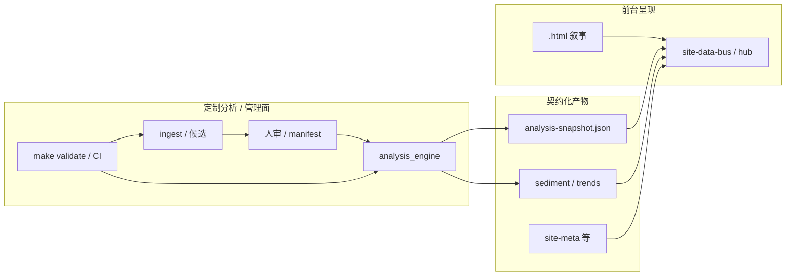

# 分端设计：用户端与管理端 · 数据源 · 进化与分析 · 审核

**角色判型**（读者 / 贡献 / 数据 / 部署 → 第一站）：根 [README · 产品视角](../README.md#pm-four-journeys) · [README · 从这里开始](../README.md#readme-start-here) · [README · 双轨真源](../README.md#readme-dual-track-map)。**架构师梳理与持续改进**：[ARCHITECTURE_ONE_PAGER · 五步表](./ARCHITECTURE_ONE_PAGER.md#architect-stewardship) · [不变量索引](./ARCHITECTURE_ONE_PAGER.md#architect-invariants-index) · [PR 证据三联](../CONTRIBUTING.md#contributing-pr-evidence-triad)。

本文是**产品/能力面**的拓展设计，与工程真源 **[PLATFORM_EXTENSIBILITY_AND_EVOLUTION.md](./PLATFORM_EXTENSIBILITY_AND_EVOLUTION.md)**（插槽、不变量）、**[ARCHITECTURE.md](./ARCHITECTURE.md)**（数据流）、**[DATA_CONTRACTS.md](./DATA_CONTRACTS.md)**（字段）对齐。**分端**指**职责与动线**的划分，不要求立刻实现两套独立应用；当前仓库以 **Git + 静态站 + Python 管道** 为主，可逐步演化为「读者面更轻、管理面更集中」的体验（含未来可选的独立管理壳或网关）。**五维总图 · 主链联动 · 仓库物理分层**：**[勿混粒度 · 五维/六域/七类](./PROJECT_ARCHITECTURE_OVERVIEW.md#architecture-grain)** · [PROJECT_ARCHITECTURE_OVERVIEW · §1a](./PROJECT_ARCHITECTURE_OVERVIEW.md#module-linkage-validation) · **[§1b](./PROJECT_ARCHITECTURE_OVERVIEW.md#physical-layout)**。**整体内容框架**：**[docs/README · #content-framework](./README.md#content-framework)** · **前后台模块一页表**：[**#front-back-modules**](./README.md#front-back-modules) · **组件×功能一条表**：[**#system-components-fusion**](./README.md#system-components-fusion)。**按改动判型**（**0c**）：**[docs/README · #quick-paths](./README.md#quick-paths)**。

## 1. 设计目标与边界

| 目标 | 说明 |
|------|------|
| **用户端（面向读者）** | 低摩擦阅读、推演、沙盘与**只读数据**；不暴露写 manifest、不写候选、不绕过人审。 |
| **管理端（面向维护/数据/审核）** | 数据源配置、进化动作（抓取/合并/分析）、规则与契约维护、**审核与对账**；操作须可审计（PR、脚本、`review_state`）。 |
| **单一事实源** | 结构化事实仍在 **Git 内 JSON**；第二真源须显式命名（与 [不变量](./PLATFORM_EXTENSIBILITY_AND_EVOLUTION.md#invariants) 一致）。 |
| **人审闸门** | **`evolution-manifest.json`** 不因「管理端 UI」或自动化而默认被覆盖。 |

## 1a. 分拆总览：前端给读者 · 后端作管理

**按模块域对读的前后台一页表**（与下表互补）：**[docs/README · #front-back-modules](./README.md#front-back-modules)** · **[docs/README · #system-components-fusion](./README.md#system-components-fusion)** · **[PLATFORM_MASTER_MAP · §1a](./PLATFORM_MASTER_MAP_AND_INVOCATION.md#reader-admin-surfaces)**。

这里的**前端**指**读者在浏览器里看到、交互的那一层**（静态页 + 客户端 JS + 可选 SPA 壳）；**后端**指**不代替读者「读站」的那一层**：仓库里的脚本与 JSON 真源、本地/CI 命令、容器内 **`readonly_api`** 等——即**管理端**的工程承载。二者**不是**「两个独立产品必须先立项」的关系，而是**职责分拆**：同一套数据，**一部分只在前端暴露为可读呈现**，**一部分只在后端由维护者经 Git/闸门操作**。

| 面 | 谁 | 读者侧「前端」典型有什么 | 管理侧「后端」典型有什么 |
|----|----|--------------------------|--------------------------|
| **读者面** | 访客、研究者、业务读者 | 根目录 **`.html`** 叙事、**`site-data-bus`** 一行读数、**`analysis-hub`** 仪表盘、**`lab.html`** 沙盘、**SPA** 壳内 iframe 呈现；仅 **GET** 已部署的 JSON/CSS/JS | **不**承担写 manifest、不跑 ingest、不绕过 **`make validate`** |
| **管理面** | 维护者、编辑、数据管家 | 站内 **[maintainer-hub.html](../maintainer-hub.html)**（[关系视图](../maintainer-hub.html#mh-spine-map) · [系统边界](../maintainer-hub.html#mh-boundaries) · [衔接矩阵](../maintainer-hub.html#mh-reader-admin-matrix)）等**仅文档链与导读**（可选书签）；**不**声称在浏览器内完成合并 | **Git + PR**、**`scripts/*.py`**、**`evolution_pkg.*`**、**`make validate` / `merge-ready`**、**GitHub Actions** artifact、**`readonly_api`**（只读 HTTP）、**Docker** 编排；**写**真源一律经提交与闸门 |

**对齐用词**：与 [六域协同 · 前端 / 运维 / 治理](./INTELLIGENCE_SIX_DOMAINS.md#six-domains) 一并读时——**前端域**主要服务**读者面**；**数据 / 管道 / 分析** 的真源变更在**管理面**完成；**运维**横跨（CI/Docker/API 服务读者或运维人员）；**治理**（人审、PR 仪式）**只**在管理面落地。**一页速查**（总表旁）：[PLATFORM_MASTER_MAP · 读者面/管理面 · 节 1a](./PLATFORM_MASTER_MAP_AND_INVOCATION.md#reader-admin-surfaces)；枢纽 MPA **纯 CSS 版式**（`modular-intro-stack`、`toc--pilot` 等，**非** JSON 总线）：[INTELLIGENCE_SIX_DOMAINS · §2.2](./INTELLIGENCE_SIX_DOMAINS.md#reader-layout-contract)。

**硬边界（复述不变量）**：分析引擎**不写 HTML**；**manifest** 不经自动化默认覆盖；读者面再丰富，也只消费**已提交** JSON。

**若演进为「带登录的管理 Web」**（认证、用户与角色、审核工作流、与 Git 写路径关系）：依次展开的扩展梳理见 **[ADMIN_WEB_CONSOLE_ROADMAP.md](./ADMIN_WEB_CONSOLE_ROADMAP.md)**（登录 → RBAC → 审核分层 → 真源与审计 → 运维安全 → 分阶段与反模式）。**数据源、ingest/analyze 编排迁到 Web 控制面**的矩阵与阶段见 **[ADMIN_PIPELINE_UI_AND_DATA_SOURCE_MIGRATION.md](./ADMIN_PIPELINE_UI_AND_DATA_SOURCE_MIGRATION.md)**。

## 1b. 分析与呈现的衔接：后端定制分析 · 前台内容呈现

这里的**后端**指**定制分析能力**的承载层（Python 管道、**`analysis_engine`**、规则 JSON、闸门脚本），不是泛指「任意业务 API」；**前台**指**读者在浏览器里看到的内容与交互**（根目录 **`.html` 叙事**、**`site-data-bus`**、**`analysis-hub`**、可选 **SPA** 壳）。二者通过**已契约化的 JSON 产物 + 同一套 `make validate` 语义**衔接，而不是在浏览器里复制一套分析逻辑。

### 1b.1 职责切分（谁做什么）

| 层 | 做什么 | 不做什么 |
|----|--------|----------|
| **定制分析（后端/管道）** | 读 manifest、候选、规则与决策等真源；产出 **`analysis-snapshot.json`**、沉淀 **`sediment*.json`**、侧车 SQLite 历史；带 **`run_id` / `repo_revision`** 血缘 | **不写** 根目录 **`.html` 叙事正文**；**不**在进程内替代 **`make validate`** 闸门定义 |
| **内容呈现（前台）** | 人类撰写的页面结构、文案、图例；用 **JS** 拉取已部署 JSON，做表格/热力/总线一行数等**展示与筛选** | **不写** manifest、候选、规则真源；**不**把「合并闸门」搬进浏览器静默执行 |
| **管理观测（管理端壳）** | **`admin-console`**（**[ADMIN_CONSOLE · §7](./ADMIN_CONSOLE_FRAMEWORK_OVERVIEW.md#admin-module-plan)**：**`mod-*`** 与顶栏一致 · **`#mod-api`→`#mod-analysis`**）、**`readonly_api`**、[**maintainer-hub**](../maintainer-hub.html)（[关系视图](../maintainer-hub.html#mh-spine-map) · [系统边界](../maintainer-hub.html#mh-boundaries) · [衔接矩阵](../maintainer-hub.html#mh-reader-admin-matrix)）：链文档、拉只读 JSON、辅助对账 | **不**默认自动写 **`evolution-manifest.json`**；见 **[AGENTS.md](../AGENTS.md#agents-invariants)** |

### 1b.2 衔接面：契约与数据流

前后台的**唯一稳定接口**是**文件级契约**（路径 + **JSON Schema** + 校验脚本），见 **[DATA_CONTRACTS.md](./DATA_CONTRACTS.md)** 与 **[ARCHITECTURE.md](./ARCHITECTURE.md)** 数据流图。读者页只依赖「部署后可 **GET** 到的 JSON」；分析侧升级时，优先**扩字段/升 `schema_version`** 并保持校验与 **`--check`** 通过，再改前台消费代码。

**一页衔接矩阵与场景对表**（谁消费何 JSON、到 **`admin-console`** 哪一模块查、哪条闸门兜底）：**[PLATFORM_MASTER_MAP · 衔接矩阵](./PLATFORM_MASTER_MAP_AND_INVOCATION.md#reader-admin-contract-matrix)** · **[场景×面](./PLATFORM_MASTER_MAP_AND_INVOCATION.md#reader-admin-scenarios)**。

### 1b.3 做得更好的几条原则

1. **先契约、后 UI**：新增分析维度时，先更新 **Schema + `analysis_engine` 输出 + `make validate`**，再在 **`analysis-hub`** 或相关页增加展示。  
2. **前台薄、后台厚**：复杂聚合、闭环缺口、跨日趋势留在 **Python**；浏览器只做渲染与轻量交互。  
3. **血缘可问**：展示层宜露出或链接 **`run_id`**（与 **[ARCHITECTURE · run](./ARCHITECTURE.md#lineage)** 一致），便于对照历史与 **SQLite** 快照表。  
4. **双轨不混**：**MPA** 为默认真源时，**SPA** 增页仍须 **registry + nav** 对账（见 **[AGENTS.md](../AGENTS.md#agents-dual-track)**），避免「分析已更新、导航仍旧」的读者体验断裂。

**管理端控制台**在整体中的位置（bootstrap、只读代理、与本文关系）：**[ADMIN_CONSOLE_FRAMEWORK_OVERVIEW.md](./ADMIN_CONSOLE_FRAMEWORK_OVERVIEW.md)**；单页 **[§7](./ADMIN_CONSOLE_FRAMEWORK_OVERVIEW.md#admin-module-plan)**（**`mod-*`** / **`#mod-api`→`#mod-analysis`**）· **[§7b](./ADMIN_CONSOLE_FRAMEWORK_OVERVIEW.md#admin-ui-ia)**（界面归类）。

## 1c. 双目标表述：前台三源呈现 · 管理 Web 四可

以下两条可作为**产品/架构对齐用语**，与节 1a—节 1b、**[ARCHITECTURE](./ARCHITECTURE.md)**、**[DATA_CONTRACTS](./DATA_CONTRACTS.md)** 一致；**不**改变不变量（manifest 人审、分析不写 HTML、闸门以 **`make validate`** 为语义真源）。

### 1c.1 前台：内容呈现由「配置 + 数据 + 分析演进」驱动

读者看到的**动态块、总线读数、枢纽图、沙盘映射**等，应以**三类只读输入**为主；若启用 **AI 解读叠加层**，可再增加**第四类**可选 JSON（与方法论结论**并列展示**，不混为同一权威等级）。**叙事正文**仍以 **`.html` 人类撰写**为主，与 **[ARCHITECTURE · 七类模块](./ARCHITECTURE.md#seven-layers)** 一致。

| 类别 | 含义 | 典型真源（部署后可 GET） | 前台如何用它 |
|------|------|--------------------------|--------------|
| **配置** | 站点结构、路由与发布元数据 | **`evolution-registry.json`**、**`spa/nav.config.json`**（及生成 **`navLinks.ts`**）、**`site-meta.json`**、**`ingest_config`** 中与读者无关部分不直接展示，但其结果体现在 **manifest / 候选** | 顶栏、允许页面集、SPA 路由；版本/`run_id` 等展示 |
| **数据** | 人审后的信号与待审池、决策记录 | **`evolution-manifest.json`**、**`evolution-candidates.json`**、**`evolution-hint-decisions.json`** | 沙盘 **`evolution.js`**、信号列表、闭环决策展示 |
| **分析演进** | 引擎对当日与跨日结构的计算结果（方法论层） | **`analysis-snapshot.json`**、**`data/sediment.json`**、**`assets/sediment-trends.json`** | **`analysis-hub`**、**`site-data-bus`**、相关页热力与趋势 |
| **（可选）AI 解读** | 对快照/趋势的概率性综合，**可配置**外部模型服务生成 | **`assets/ai-analysis-overlay.json`**（规划名；配置示例见 **[examples/ai_analysis_overlay.example.json](./examples/ai_analysis_overlay.example.json)**） | 独立区块、标注模型与免责声明；设计见 **[AI_ASSISTED_ANALYSIS_LAYER.md](./AI_ASSISTED_ANALYSIS_LAYER.md)** |

**原则**：前台**不**另起炉灶算一套**方法论**分析；新增呈现维度须先落在**契约化 JSON**（§1b），再改前端消费。AI 层**不**替代 **`evolution_hints`** / manifest 闸门语义。

### 1c.2 后台：可管理、可配置、可观测、可演进的 Web 界面

此处的**后台 Web**指**管理向**浏览器体验（含 **`admin-console`** 及未来带 **IdP** 的扩展），与 **CLI + PR + Actions** 并列，**不**替代 Git 真源与闸门。

| 能力 | 目标含义 | 当前仓库落点 | 阶段 2+（见 [ADMIN_WEB_CONSOLE_ROADMAP](./ADMIN_WEB_CONSOLE_ROADMAP.md)） |
|------|----------|--------------|--------------------------------------------------------------------------|
| **可管理** | 维护者能按**动线**完成：抓取 → 审候选 → 合并 → 分析 → 发布自检，且有文档/清单可依 | **EVOLUTION_RUNBOOK**、**MERGE_AND_RELEASE_CHECKLIST**、[**maintainer-hub**](../maintainer-hub.html)（[关系视图](../maintainer-hub.html#mh-spine-map) · [系统边界](../maintainer-hub.html#mh-boundaries) · [衔接矩阵](../maintainer-hub.html#mh-reader-admin-matrix)）、**`admin-console`** 管道区与路线图 | 登录后**队列视图**、链 PR 状态；触发作业仍须审计 |
| **可配置** | **意图**落到可版本化的 JSON（ingest、maps、规则、注册表），而非口头约定 | **Git** 内 **`ingest_config.json`**、**`maps_to_hints.json`**、**`evolution-hint-rules.json`** 等；**`admin-console`** 数据源目录 + **RSS 草案剪贴板**（去重见 **[ADMIN_PIPELINE](./ADMIN_PIPELINE_UI_AND_DATA_SOURCE_MIGRATION.md)**） | **表单 → diff / 开 PR**；禁止无 PR 直写生产 manifest |
| **可观测** | 看得见快照、历史、只读 JSON、服务健康 | **`readonly_api`**、**`admin-console`** 探索器与 **`/health`**、**`run_id`** 血缘 | 保留只读语义；调度/运行结果投影另立契约 |
| **可演进** | 能力分阶段上线，契约与路线图可更新，避免双实现 | **`control_plane_roadmap.json`**、**`pipeline_links`**、Schema 版本、**[ADMIN_PIPELINE](./ADMIN_PIPELINE_UI_AND_DATA_SOURCE_MIGRATION.md)** 迁移矩阵 | **IdP、RBAC、编排 UI** 与 [ORCHESTRATION](./ORCHESTRATION_AND_EVENT_STREAMING.md) 对表后再立项 |

**`admin-console`** 与上述四可的对表短文：**[ADMIN_CONSOLE_FRAMEWORK_OVERVIEW · §1b](./ADMIN_CONSOLE_FRAMEWORK_OVERVIEW.md#dual-goals-reader-admin)**；与 **`static/index.html`** 顶栏 / 主区 DOM 对表见 **[§7](./ADMIN_CONSOLE_FRAMEWORK_OVERVIEW.md#admin-module-plan)** · **[§7b](./ADMIN_CONSOLE_FRAMEWORK_OVERVIEW.md#admin-ui-ia)**。

## 2. 分端模型（当前映射与未来形态）

### 2.1 当前仓库中的「端」

| 端 | 典型使用者 | 主要载体（现状） | 读写特征 |
|----|------------|------------------|----------|
| **用户端** | 读者、访客 | 根目录 **MPA** `.html`、可选 **SPA** 壳、**`site-data-bus`** 拉取的 JSON | **只读** `assets/*.json` 等；交互为沙盘/筛选，不写库内真源。 |
| **管理端** | 维护者、编辑、数据管家 | **本地/CI**：脚本、`ingest_config`、`merge_candidates_to_manifest`、PR、**`make validate`**；文档：**EVOLUTION_RUNBOOK**、**CONTRIBUTING**；站内**导读入口**（仅链，无写操作）：**[maintainer-hub.html](../maintainer-hub.html)** · [关系视图](../maintainer-hub.html#mh-spine-map) · [系统边界](../maintainer-hub.html#mh-boundaries) · [衔接矩阵](../maintainer-hub.html#mh-reader-admin-matrix) | **写** 通过 Git 提交；审核状态在 **`review_state`**、**`evolution-hint-decisions.json`** 等结构化字段中体现。 |

**说明**：管理端**不必**等于「单独的后台网站」；在阶段 0—1，**CLI + PR + Actions artifact** 就是管理端。阶段 1+ 可增：**只读 API** 供外部看板、[INTEGRATION_AND_READONLY_API](./INTEGRATION_AND_READONLY_API.md)；阶段 2+ 再议编排器 UI，仍**不写 manifest**。

### 2.2 未来可选形态（不破坏不变量）

- **用户端**：SPA 默认路由、移动端优先布局、可选「订阅 `site_version` / `run_id` 变更」的**只读**通知（经 Pages + API，非写 Git）。  
- **管理端**：内网 **Dashboard** 调 **`readonly_api` +** 人工在 Git 侧执行 merge；或 **GitHub-centric**（Issue/PR 模板 + checklist，已是管理端的一部分）。  
- **鉴权**：若在公网暴露管理操作，须在**网关/IdP** 完成；**不在**静态 JSON 管道内嵌密钥。

## 3. 数据源拓展思考（分类与落点）

按「谁产生、谁消费、经哪道闸门」分类，便于新源接入时填 [插槽表](./PLATFORM_EXTENSIBILITY_AND_EVOLUTION.md#extension-slots)。

| 类型 | 含义 | 已有示例 | 扩展时落点（插槽） |
|------|------|----------|-------------------|
| **外部观测源** | 站外可抓取线索 | RSS、法规索引页 → **候选** | **管道步骤** + **`ingest_config.json`** / **`maps_to_hints.json`**；产出进 **`evolution-candidates.json`**；**契约**校验候选。频率与 UA 见 **[INTEL · §2—2a](./INTEL_AND_POLICY_TRACKING_PLAYBOOK.md#intel-source-tiers)** · **[§2b](./INTEL_AND_POLICY_TRACKING_PLAYBOOK.md#intel-social-platforms)**。 |
| **人审正式库** | 已采纳信号 | **`evolution-manifest.json`** | **人审闸门**；仅 **`queued_for_manifest`** 合并；**对账** `registry` / `lab.js`。 |
| **规则与决策** | 提示与闭环 | **`evolution-hint-rules.json`**、**`evolution-hint-decisions.json`** | **分析规则**插槽；**`rule_id`** 可审计。 |
| **分析派生** | 由引擎计算 | **`analysis-snapshot.json`**、沉淀、**`sediment-trends.json`** | **契约层** Schema + **`analysis_engine --check`**；**用户端**经总线只读展示。 |
| **配置与注册** | 站点结构真源 | **`evolution-registry.json`**、**`spa/nav.config.json`**、**`site-meta.json`** | **注册表**插槽 + **SPA** 对账。 |
| **叙事与概念** | 人类写作 | 根目录 **`.html`**、`docs/*.md` | **叙事进化**轨；**内容生成**边界见 [ARCHITECTURE · 七类模块](./ARCHITECTURE.md#seven-layers)；草稿走 **`scripts/draft/`**。 |
| **未来：合作方/批导 JSON** | 第三方结构化投喂 | （未默认启用） | 必须先 **Schema + 校验 + 人审**（进候选或专用 staging JSON），**禁止**直写 manifest。 |
| **未来：实时流** | 多服务事件 | 见阶段 3 | [ORCHESTRATION](./ORCHESTRATION_AND_EVENT_STREAMING.md)；**不能**替代 Git 作唯一审计源。 |

## 4. 进化方法拓展思考（机制，非口号）

「进化」在本站拆成**可操作的机制**，与 [四条轨道](./PLATFORM_EXTENSIBILITY_AND_EVOLUTION.md#evolution-tracks) 一致，下表从**管理端**可执行动作描述：

| 方法 | 管理端动作 | 用户端可见结果 | 闸门/记录 |
|------|------------|----------------|-----------|
| **观测进化** | `ingest`、调 **`ingest_config`**、PR 更新候选 | （通常无直接页）候选经审后影响 manifest 与后续分析 | **`review_state`**、候选校验；拉取节奏 **[INTEL · §2—2a](./INTEL_AND_POLICY_TRACKING_PLAYBOOK.md#intel-source-tiers)** · **[§2b](./INTEL_AND_POLICY_TRACKING_PLAYBOOK.md#intel-social-platforms)** |
| **入库进化** | **`merge_candidates_to_manifest`** | 沙盘/页上信号与 `maps_to` 更新 | **manifest** 校验、**drift** |
| **分析进化** | **`make analyze`** / **`evolution-fast`**、调规则 JSON | 分析枢纽、闭环页、总线读数更新 | **`run_id`**、快照 Schema、**`--check`** |
| **规则/闭环进化** | 改 **`evolution-hint-rules`**、写 **hint-decisions** | 提示条、缺口列表、决策列表变化 | **`rule_id`**、**`track_closure`** |
| **叙事进化** | 编辑 `.html` / 方法篇；草稿经 PR | 新叙事、新深链、新配方表 | **registry**（新页）、**validate** |
| **呈现进化** | **`sync_site_nav`**、**`spa-sync`**、总线新占位符 | 导航、SPA 路由、读数块 | **navLinks** 对账、**SITE_DATA_UPDATE_FRAMEWORK** 登记；改 **`partials/skip-bar`** 时 **404** 手调（[MERGE · §1](./MERGE_AND_RELEASE_CHECKLIST.md#pre-merge) · [MERGE · partials 手顺](./MERGE_AND_RELEASE_CHECKLIST.md#pre-merge-partials-sequence)） |

## 5. 分析方法拓展思考（用户端呈现 vs 管理端配置）

| 维度 | 用户端（呈现什么） | 管理端（配置/扩展什么） |
|------|--------------------|-------------------------|
| **当日结构** | 模块/因子热力、共现、类型分布 | **`analysis_engine`** 内统计逻辑、快照 **`schema_version`** |
| **跨期对比** | 与上期快照的 diff 提示（若页面启用） | 快照历史策略、**SQLite** **`analysis_snapshot_history`**（本地/只读 API） |
| **规则驱动提示** | **`evolution_hints`**、闭环缺口文案 | **`evolution-hint-rules.json`** 条件与 **`target_pages`** |
| **趋势与沉淀** | 趋势表、`closure_backlog` 等 | **`sediment_trends.py`**、沉淀 Schema |
| **方法总线（定性）** | [analysis-hub · 总线](../analysis-hub.html#panorama) 对齐读法 | [RESEARCH_METHODS_MAP](./RESEARCH_METHODS_MAP.md) 与引擎字段对表 |
| **未来：多分析配置** | 同一用户端切换「视图 profile」（只改前端聚合，不改真源） | 多份快照**不**建议并行真源；若需要，须新契约 + 明确哪份为默认 HEAD |

**原则**：用户端**只消费**已提交 JSON；管理端**改语义**时先改 **Schema + 校验 + DATA_CONTRACTS**，再改引擎与页面占位符。

## 6. 进化审核体系（分层）

将「审核」从单一动作拆成**分层责任**，便于产品与合规对齐：

| 层级 | 对象 | 典型动作 | 审计线索 |
|------|------|----------|----------|
| **L0 格式与契约** | 所有入库 JSON | **`make validate`**、Schema | CI、pre-commit |
| **L1 候选质量** | **`evolution-candidates.json`** | 编辑 **`review_state`**（pending / noise / queued_for_manifest 等） | 候选文件 + PR 说明 |
| **L2 正式库** | **manifest** | **`merge_candidates_to_manifest`**（仅允许状态） | **manifest** diff、**`maps_to`** 与 registry 对账 |
| **L3 规则闭环** | 提示落实 | **`evolution-hint-decisions.json`**（done / rejected / deferred + **`rule_id`**） | 决策与规则 id 对齐 |
| **L4 发布叙事** | `.html` / 大改版 | 内容 PR + [SITE_REVIEW](./SITE_REVIEW_THREE_PASSES.md) 四角色清单 | Git、**`site_version`**（发布线） |
| **L5 分析血缘** | 快照/沉淀 | 每次运行 **`run_id`**、**`repo_revision`** | 与 **artifact**、Actions 日志对表 |

**非目标**：用「管理端超级按钮」跳过 L1—L2 直接改 manifest；与 [反模式](./PLATFORM_EXTENSIBILITY_AND_EVOLUTION.md#anti-patterns) 一致。

## 7. 分端 × 数据源 × 插槽（规划矩阵）

新增能力时，建议填表（可复制到 Issue/PR）：

| 新能力简述 | 主要数据源 | 主要触达端 | 插槽（契约/注册表/规则/总线/管道/API） | 审核层级（L0—L5） |
|------------|------------|------------|----------------------------------------|-------------------|
| （例）新 RSS 主题域 | 外部 RSS | 管理端 ingest → 用户端间接 | 管道 + 候选契约 | L1→L2 |
| （例）新闭环规则 | rules JSON | 用户端提示 | 分析规则 | L0 + L3 |

## 8. 与分阶段升级的对应关系

| 阶段 | 用户端重点 | 管理端重点 |
|------|------------|------------|
| **0** | 稳定读站动线、总线版本可见 | PR + validate + artifact 人工合并 |
| **1** | 新读数块须登记总线；可选 SPA 体验 | 契约/分包/只读 API；**多环境 ingest 配置**文档化 |
| **2** | 一般不增读者复杂度 | 编排器封装**已有**步骤；仍不写 manifest |
| **3** | 只读订阅/推送可对接 API | 流与 Git 分工合同化 |

详见 **[TECH_ARCHITECTURE_AND_UPGRADE_BRIEF](./TECH_ARCHITECTURE_AND_UPGRADE_BRIEF.md)**（简版 **§1—§4**）· **[详版附录](./TECH_ARCHITECTURE_AND_UPGRADE_BRIEF.md#appendix-tech-capabilities)**（[别名](./TECH_ARCHITECTURE_CAPABILITIES.md)）与 [ARCHITECTURE_UPGRADE](./ARCHITECTURE_UPGRADE_AND_EXTENSIONS.md)。

---

## 延伸阅读

- [PLATFORM_CAPABILITY_MAP](./PLATFORM_CAPABILITY_MAP.md)（四条支柱、读者路径）  
- [DATA_ANALYSIS_SITE_CONTENT_SYNC](./DATA_ANALYSIS_SITE_CONTENT_SYNC.md)（数据与叙事对齐）  
- [docs/README · 文档主线](./README.md#docs-spine)

*设计随主分支迭代；若实现独立管理 UI 或新数据源类型，请同步更新本节矩阵与 [DATA_CONTRACTS](./DATA_CONTRACTS.md)。*
